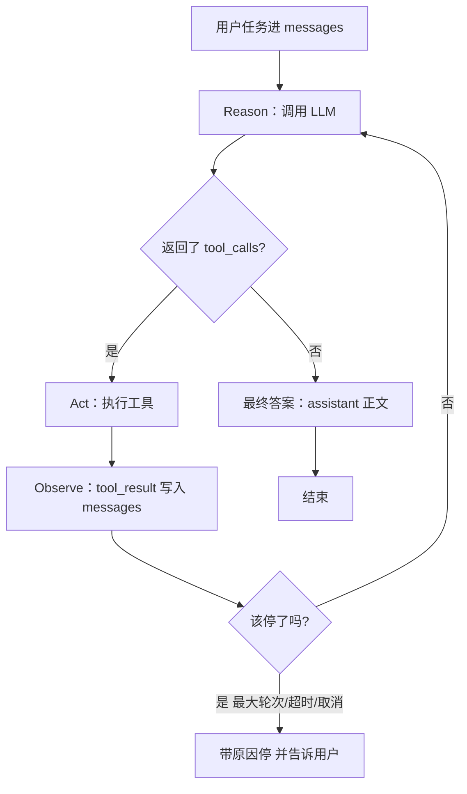

# **Agent Loop / ReAct**：Reason → Act → Observe，以及停止条件

> 对应模块：[模块 07 · 手写 Agent ⭐⭐⭐⭐⭐ · 🔥 最关键模块](./README.md) · 小节进度第 1 条
> 本条由 Coach 按 2026-09-09 本对话 `coach start` 详解首次沉淀；学习者只减不加。进度表仍 ⬜，勾 ✅ 只走 `coach complete`。

- **来源**：本对话 §6.2 详解（对照模块 05 Function Calling 协议；未打开外部论文页）
- **状态**：已沉淀
- **Demo**：可运行（未落）。合上文件后必须还能看清循环在转、停在哪条边；伪代码画不出「真模型又要了一次工具」。落点预告：`apps/07-手写Agent/01-Agent-Loop-ReAct-step-1/` · `yarn app:07-01-agent-loop-react-step-1`。禁止任何 Agent 框架，手写 `while`。

> 各节写什么、达标要求：见仓库根 [AGENTS.md §7.2](../../../AGENTS.md#72-沉淀--小节进度对齐)。

## Demo 子节进度

尚未建 step。表行只在实际创建 step-N 后 append；禁止预判未来步骤。

| 状态 | 子节 | 入口 | 端口 | 本子节教学点 |
|------|------|------|------|--------------|

## 是什么

**Agent Loop（Agent 循环）** 是你自己写的一段控制流：反复「问模型 → 若它要工具就执行并把结果塞回 `messages` → 再问模型」，直到**该停了**。

**ReAct**（Yao 等人 2022：*Reason + Act*）给这圈循环起了认知上的三个阶段名字：

| 阶段 | 英文 | 人话 | 在代码里通常是 |
| -- | -- | -- | -- |
| 想 | **Reason** | 根据目前看到的材料，决定下一步干什么 | 一次 LLM 调用。有的实现会吐出 `Thought:` 文本；现代 Function Calling 里思考常藏在模型内部，你只看到 `tool_calls` 或最终正文 |
| 做 | **Act** | 对外做一件有副作用或有信息的事 | 解析 `tool_calls`，走 Registry / Gateway，真正 `execute` |
| 看 | **Observe** | 把世界的反馈变成模型下次能读的东西 | 把 `tool_result`（成功或失败）追加进 `messages`，**不**把异常直接扔出循环 |

三个阶段不是三种产品，是**同一圈里的三个阶段**。一圈走完若任务没完，再开下一圈——这才叫 Agent。只调一次工具就 `return`，那是「带工具的一次问答」，模块验收里说的那种假循环：代码写死只许调一次工具。

模块 05 的物理骨架没变：

```text
model → tool_call → execute → tool_result → model
```

变的是**谁在转圈、转几圈、何时刹车**：05 讲协议字段；07 讲你必须亲手写的 `while`，以及停止条件是一等公民，不是事后 `if (i > 8) break` 补丁。模块 05 step-5 已见过 `while` + `MAX_ROUNDS`；本条要把 Loop 当成主结构独立画出来。

前端对照：这很像 saga / 轮询协调器，不是一次 `onClick` 里 `await fetch` 就结束（[使用协议 §0.8](../../01-使用协议.md#08-前端--agent-对照表)）。

```text
用户点「帮我处理」
  → 你的 loop.ts while (没停)
       → Reason：调 LLM（带 tools + 目前全部 messages）
       → 若有 tool_calls：Act → Observe → 继续 while
       → 若没有 tool_calls：把 assistant 正文当最终答案 → break
```



**数据怎么走（happy path）**：用户「把逾期的购物待办标完成」→ `messages = [system, user]` → Reason 第 1 圈要 `list_todos` → Act 查库 → Observe 两条逾期 → Reason 第 2 圈要 `complete_todo` → Act / Observe → Reason 第 3 圈不再要工具，正文回复 → **停：最终答案**。

State 在圈外攒：`round`、已调用工具、累计 Token、trajectory（每步想了什么 / 调了什么 / 看到什么）。本条要能**画出 Loop**；State 字段的工程清单留给模块验收，这里先记住：**循环若没有轨迹，你自己都讲不清它停在哪一阶段**。

本模块写死规定：**禁止** LangChain / LangGraph / Vercel AI SDK / OpenAI Agents SDK / Mastra 实现循环。

### 核心对象与变体

#### ① Reason（想）

一次「带着当前 `messages` + tools 定义」的模型调用。对循环有意义的输出只有两类：`tool_calls`（还要做）或纯文本（认为做完了 / 要问人 / 要认输）。

- **变体 A · 显式 Thought**：prompt 要求先写 `Thought: …` 再行动。轨迹好看，偏论文。生活：修车师傅先说「我怀疑是电瓶」，再去测电压。
- **变体 B · 隐式 Reason（现代 FC 默认）**：API 只回 `tool_calls`，没有 Thought 字段。Reason 仍发生了，只是不在 JSON 里。前端：用户点提交，你看不到 action 里的 if/else，只看到发出的 API。**没有 `Thought:` 仍可以是 ReAct 循环。**
- **变体 C · 零工具直接答**：「2+2」不该进工具。Reason 的合法结果就是最终答案。这是停止条件「最终答案」的一种，不是 Loop 坏了。

#### ② Act（做）

把 `tool_calls` 变成真实世界变化或查询。仍走 05：校验 → Gateway → execute。Loop **不**等于跳过 Gateway。

- **变体 D · 一圈一个 Act（串行依赖）**：`search_user` 的 id 才能 `create_order`。业务：客服「先查工单再改状态」。
- **变体 E · 一圈多个 Act（并行）**：一次 Reason 返回多个独立 `tool_calls`，`Promise.all` 再统一 Observe。这是 05 的编排，嵌在 Loop 的 Act 这一阶段里。业务：仪表盘同时拉天气、库存、未读数。

#### ③ Observe（看）

执行结果变成模型下一圈能读的观察。成功 JSON、空列表、业务拒绝、Zod 失败、HTTP 500，**都应该是观察**，而不是把 `while` 摔死。

- **变体 F · 成功观察**：`{ "todos": [...] }` 回去，模型基于事实继续。
- **变体 G · 失败观察后继续**：天气 API 对「北进」404。Observe 写「未知城市」，下一圈 Reason 改成「北京」。生活：快递柜密码错了，屏幕提示错误，你改密码再试——循环没崩。
- **反模式**：`execute` throw → 整个 HTTP 500，模型再也看不到世界。那是把 Observe 这一阶段删了。

#### ④ Loop 本身（再转一圈）

`while` 的条件 = 「还没碰上停止条件」。每一圈：Reason 必有；Act/Observe 仅当有 `tool_calls`。

- **变体 H · 多圈直到完成（真 Agent）**：查 → 改 → 确认。结构允许 N 跳。
- **变体 I · 一圈就停（合法短任务）**：只问天气。仍是 Loop，立刻走「最终答案」出口。假循环是代码**不允许**第二圈，不是「任务刚好一圈」。

#### ⑤ 停止条件（何时停）——本条要能讲清的第二句

每个出口都要能指着流程图的一条边。下一节「死循环防护」会把阈值怎么配讲深；**本条先能画边、能明确说要四种停。**

- **变体 J · 最终答案**：本圈**没有** `tool_calls`，正文当回复。主出口。模型可能「嘴上说做完了」但没调工具（幻觉完成）——Loop 仍会停；要不要校验「该调的工具调了没」是评测/产品问题。
- **变体 K · 最大轮次 `MAX_ROUNDS`**：`round >= max` → 停，把轨迹和「未完成」交给用户。前端：轮询最多 20 次。
- **变体 L · 超时**：墙钟时间到了也停。K 限「想的次数」，L 限「用户等了多久」。一次 Act 卡在下游 API，只靠 K 可能仍等到死。前端：`AbortSignal` + `Promise.race`。
- **变体 M · 用户取消**：打断下一圈 Reason 和能取消的 Act；不能取消的要记「已发出去」。State 记 `cancelled`。对照 `AbortController`，不是 `kill` 进程。

未扫进本条、留给后面：先规划再执行（02）；死循环阈值、模型口头说停的细规（03）。

## 为什么（Agent 开发要懂）

1. **没有 Loop 就没有 Agent。** Function Calling 只证明模型会「开口要工具」。任务是「先查库存再下单再发通知」时，必须让 Observe 之后**再 Reason**。少写 `while`，产品能力直接少一截。
2. **停止条件是安全阀，不是礼貌。** 模型可以永远再要一个工具。没有「何时停」，账单、线程、用户等待都会炸。
3. **轨迹是调试语言。** 前端红字「失败了」不够。你要能指着第 3 圈：Reason 要了错参数 → Observe 是 Zod 错误 → 下一圈模型改参。和 05「错误当 `tool_result` 塞回 messages」同一物理，只是现在发生在**多圈**里。
4. **和框架的分界。** 框架会把 Loop 藏进图运行时。本模块手写，是为了合上文件后还能自己讲出来能画图，而不是只会 `createAgent()`。

## 易混点

| 别混成 | 差在哪 | 判错会怎样 |
| -- | -- | -- |
| ReAct vs Function Calling | FC 是 Act 这一阶段的**协议**；ReAct 是多阶段的**循环模式** | 以为接了 tools 就是 Agent，产品只能单跳 |
| ReAct vs 纯 CoT | CoT 只 Reason 不 Act；ReAct 必须能碰世界 | 模型「想得很好」但查不到真库存 |
| 显式 Thought vs ReAct | 没有 `Thought:` 字段仍可以是 ReAct 循环 | 为了像论文强行再调一次「只输出思考」的模型，又贵又慢 |
| 真 Loop vs 假循环 | 假循环 = 代码结构写死只许一跳；真 Loop = 结构允许 N 跳，由停止条件收 | 复杂任务做到一半静默结束 |
| 最终答案 vs 死循环防护 | 「模型不调工具了」是正常停；MAX / 超时 / 取消是防护 | 只做一种停，另一种场景炸掉 |
| 本条 vs 02「先规划再执行」 | 本条是一步步 Reason-Act-Observe | 现在就上 Plan-and-Execute，本条图画不出来 |
| Loop vs 模块 06 Context | Loop 每圈 `messages` **变长**；Context 预算决定塞不下时裁谁 | 只写 while 不裁剪，长任务 Token 爆 |

变体 A/B（显式/隐式 Thought）、C（零工具）、H/I（真多圈 vs 合法一圈）、J–M（四种停）都落在上表对应行：判错的后果就是把该变体从产品里删掉。

## 例子

**例子 1 · 点外卖（多圈 H + 串行 D）**  
想：先搜店 → 做：`search_shop` → 看：店 id → 想：看菜单 → 做：`get_menu` → 看：有番茄炒蛋 → 想：下单 → 做：`place_order` → 看：订单号 → 想：直接回复「下好了」。三圈 Act，最后无 `tool_calls`。

**例子 2 · 仪表盘刷新（并行 E）**  
一圈 Reason 同时要 `get_weather`、`get_stock`、`get_unread`。三个 Promise 回来再 Observe，下一圈才写总结。Loop 没变，Act 这一阶段内部并行。

**例子 3 · 输错城市（失败观察 G）**  
用户写「北进」。第 1 圈 Act 失败。Observe 是错误字符串。第 2 圈 Reason 改参数「北京」。若你 throw，用户只看到 500，模型没机会改。成功路径则是变体 F。

**例子 4 · 闲聊算术（零工具 C + 停 J）**  
「3 加 5」。Reason 直接正文。Loop 跑了「半圈」（只有 Reason）。合法。显式 Thought（A）在教学里可把「不需要工具」写进轨迹；生产 FC 多为隐式（B）。

**例子 5 · 客服点停止（取消 M）**  
Agent 正在第 4 圈调知识库。用户点取消。abort LLM 请求；知识库已发出则在轨迹写「用户取消」，不要再开第 5 圈。

**例子 6 · 无限搜索（最大轮次 K）**  
模型每次 Observe 都说「再搜一页」。第 8 圈打到 `MAX_ROUNDS`，回复：「试了 8 步仍未找到唯一工单。」停的是防护，不是最终答案。

**例子 7 · 下游卡住（超时 L）**  
工具 sleep 超过墙钟。未到 MAX 也停。错误通道要和「工具业务失败」（例子 3）分开看。

## 需求清单

验收准绳，不是一次搭完整待办 App 的施工单。step 仍按知识动态加。每条 ≈ 一个变体（或变体组）。

1. **业务场景**：待办助手，用户说「把逾期购物相关待办标完成」。**目标**：页面能看见至少两圈 ReAct（先 list 再 complete），然后最终中文回复。**知识点**：H 多圈、D 串行依赖、J 最终答案。**验收**：轨迹区按圈展示 Reason（请求 / `tool_calls` 或正文）→ Act 名称与参数 → Observe 原文 → 最后一圈无 `tool_calls`。
2. **业务场景**：同一助手问「北京天气和我的未读待办各多少」。**目标**：一圈内并行两个独立工具。**知识点**：E 并行 Act。**验收**：同一 round 两条 `tool_call`，执行可重叠，再进入下一圈总结。
3. **业务场景**：用户把城市打成错别字。**目标**：失败进 Observe，下一圈改参成功或最终解释失败。**知识点**：G（对照 F 成功观察）。**验收**：轨迹里有一条失败 `tool_result`，循环未 500 中断。
4. **业务场景**：用户问「1+1」。**目标**：不调工具直接答。**知识点**：C + J；页上注解 A/B（没 Thought 字段仍是 ReAct）。**验收**：0 次 execute，有最终正文。
5. **业务场景**：故意给一个会让模型一直「再查一次」的任务，或把 `MAX_ROUNDS` 调到很小。**目标**：打到上限后停并说明未完成。**知识点**：K。**验收**：页上 round 停在上限，状态不是「成功完成任务」而是「达到最大轮次」。
6. **业务场景**：请求发出后点取消。**目标**：不再开下一圈。**知识点**：M。**验收**：`#status-pill` 能区分取消 vs 普通失败；轨迹最后一步标取消。
7. **业务场景**：下游工具 sleep 超过墙钟超时。**目标**：超时停。**知识点**：L。**验收**：未到 MAX 也可停，错误通道与需求 3 能分开看。

纯知识、不另开需求：显式 vs 隐式 Thought（A/B）——页面用教学注解即可，不必再调一个「只输出 Thought」的模型。

### 变体 ↔ 需求 ↔ 可观察

| # | 变体 | 例子 | 需求 | 可观察 Demo |
| - | -- | -- | -- | -- |
| A/B | 显式 / 隐式 Reason | 例子 4 注解 | 需求 4 注解 | 未落 |
| C | 零工具直接答 | 例子 4 | 需求 4 | 未落 |
| D | 串行依赖多圈 | 例子 1 | 需求 1 | 未落 |
| E | 一圈并行 Act | 例子 2 | 需求 2 | 未落 |
| F/G | 成功 / 失败 Observe | 例子 3 | 需求 3 | 未落 |
| H/I | 真多圈 vs 合法一圈 | 例子 1 / 4 | 需求 1+4 | 未落 |
| J–M | 四种停止 | 例子 4–7 | 需求 1,5,6,7 | 未落 |

## 取舍

- **手写 `while` vs 上框架**：本模块选手写。框架省样板、藏停止条件；现在上框架会画不出 Loop。
- **显式 Thought vs 只靠 `tool_calls`**：教学轨迹用显式更易指「Reason 这一阶段」；生产默认隐式，少一次专用思考调用。
- **MAX_ROUNDS vs 超时谁先**：次数防「搜搜搜」；墙钟防「一次工具卡死」。都要有边，阈值放到 03。
- **失败 throw vs 塞回 messages Observe**：Loop 里选塞回 messages，否则自纠变体不存在。

## 踩坑

- 写成假循环：结构只许一跳，复杂任务静默结束。
- Observe 用 throw 代替 `tool_result`：模型无法改参，用户只看到 500。
- 只有最终答案出口、没有 MAX/超时/取消：模型可以转到账单炸。
- 以为没有 `Thought:` 就不是 ReAct：会去叠无用的思考调用。
- 只写 Loop、不管 06 的 Context 预算：多圈 `messages` 膨胀后窗口爆。
- 用 Agent 框架代劳本条：合上文件后还能自己讲出来画不出自己的图。

## 过关自检

- 能画：Reason →（有 tool 则 Act → Observe → 再 Reason）→ 无 tool 则最终答案。
- 能说：FC 是协议，Loop 是控制流；假循环是结构只许一跳。
- 能明确说要至少四种停：最终答案 / 最大轮次 / 超时 / 用户取消。
- 能说：错误应进 Observe；隐式 Reason 仍算 ReAct。

对照「本条要能讲清」：能画 Loop = mermaid + 数据怎么走；能说出何时停 = 变体 J–M。

## 还没搞懂的

- 先规划再执行 vs 一步步走 → 本模块第 2 条。
- 死循环防护的阈值怎么配、模型口头说停的细规 → 本模块第 3 条。
- Agent State 对象该有哪些生产字段、中途取消如何跟 SSE 对齐 → 模块验收 + 落 Demo 时再钉。

## §5.4 目标 ↔ 代码整合过关检查

跑过关检查日期：2026-09-09（首次沉淀预扫 · Demo 未落）

「本条要能讲清」：能画 Loop，能说出何时停

### §5.4.A 目标 → 代码覆盖

| 目标点 | 状态 | 证据 |
|---|---|---|
| A1 页面能画出 Reason→Act→Observe 再转回 Reason 的多圈轨迹 | 未实现 | 无 `apps/07-手写Agent/` |
| A2 能观察到至少一种「最终答案」停（无 `tool_calls` 出正文） | 未实现 | 同上 |
| A3 能在 UI/响应里区分至少一种防护停（最大轮次；超时/取消可后步） | 未实现 | 同上 |

**A 段小结**：不过。未实现 3 条：明确说要写 step-1 时先做 A1+A2（+ 小 MAX 可见的 A3 雏形）。

### §5.4.B 文档 → 代码对齐

| MD 讲点 | 代码里有没有 | 状态 |
|---|---|---|
| 需求 1 多圈 list→complete + 最终答案 | 无 Demo | 未实现 |
| 需求 2 一圈并行两个工具 | 无 Demo | 未实现 |
| 需求 3 失败 Observe 不 500 | 无 Demo | 未实现 |
| 需求 4 零工具直接答 + A/B 注解 | 无 Demo | 未实现 |
| 需求 5 打到 MAX_ROUNDS 停 | 无 Demo | 未实现 |
| 需求 6 用户取消 | 无 Demo | 未实现 |
| 需求 7 墙钟超时 | 无 Demo | 未实现 |
| 易混：假循环 vs 真 Loop | 无 Demo | 未实现 |

**B 段小结**：不过。`coach complete` 过关检查 3 由独立 subagent 按当时 MD+代码重抽，不以本表当过关证据。
