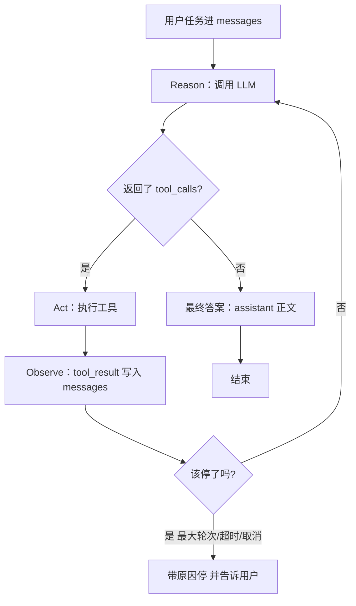

# **Agent Loop / ReAct**：Reason → Act → Observe，以及停止条件

> 对应模块：[模块 07 · 手写 Agent ⭐⭐⭐⭐⭐ · 🔥 最关键模块](./README.md) · 小节进度第 1 条
> 本条由 Coach 按 2026-09-09 本对话 `coach start` 详解首次沉淀；2026-09-10 增量更新两次（step-1 真跑通 + 学习者 3 条追问；step-2 增量构建变体 E 并行 Act + 学习者追问「并行 vs 串行决定权」）。学习者只减不加。进度表仍 ⬜，勾 ✅ 只走 `coach complete`。

- **来源**：本对话 §6.2 详解（对照模块 05 Function Calling 协议；未打开外部论文页） + 2026-09-10 demo step-1 真跑通后的 3 条追问（自定义 ChatMessage 类型坑 / tool_result 协议字符串 / 副作用三栏可见）+ step-2 增量构建变体 E 并行 Act + 追问「step-1 vs step-2 区别」/「并行串行决定权」+ step-3 增量构建变体 G 失败 Observe 后继续 + 追问「失败 Observe 是什么意思」
- **状态**：已沉淀
- **Demo**：可运行。step-1 已落 `apps/07-手写Agent/01-Agent-Loop-ReAct-step-1/` · `yarn app:07-01-agent-loop-react-step-1` · 端口 `50049`（手写 while + 变体 J 最终答案 + 副作用三栏可见）。step-2 已落 `apps/07-手写Agent/01-Agent-Loop-ReAct-step-2/` · `yarn app:07-01-agent-loop-react-step-2` · 端口 `50050`（复制 step-1 + Act 阶段 for await → Promise.all + handler 模拟 50~250ms 延时让并行差异肉眼可见 + query 改为「一次性」逼模型并行）。step-3 已落 `apps/07-手写Agent/01-Agent-Loop-ReAct-step-3/` · `yarn app:07-01-agent-loop-react-step-3` · 端口 `50051`（复制 step-2 + query 改「把 todo-999 标完成」故意触发 `{ok:false, error:"not_found"}` → 错误进 messages → 下一圈模型改参 → 最终答案；变体 G 闭环）。**step-4 已落 `apps/07-手写Agent/01-Agent-Loop-ReAct-step-4/` · `yarn app:07-01-agent-loop-react-step-4` · 端口 `50052`**（复制 step-3 + POST /api/agent-run 立刻返 202 + runId · 异步跑 loop · 轮询 GET /api/agent-run/:runId 拿结果 + 「🚫 取消」按钮触发 AbortController.abort() + 下一次 LLM 调用透传 signal 抛 AbortError → while 检测 signal.aborted → break + stoppedReason="cancelled"；变体 M 用户取消）。合上文件能看清循环看链路、并行 vs 串行的本质差异、失败 Observe 后 Loop 不死能自纠、用户中途取消 Loop 主动退出。禁止任何 Agent 框架，手写 `while`。

> 各节写什么、达标要求：见仓库根 [AGENTS.md §7.2](../../../AGENTS.md#72-沉淀--小节进度对齐)。

## Demo 子节进度

step-1 已建（🔄 打磨中 · 学习者主动决定何时锁）。表行只写已建 step；禁止预判未来。

| 状态 | 子节 | 入口 | 端口 | 本子节教学点 |
|------|------|------|------|--------------|
| ✅ | step-1 | `yarn app:07-01-agent-loop-react-step-1` | `50049` | 手写 while + 变体 J 最终答案主出口 + 副作用三栏可见（before / after / diff）。本 step 唯一停止条件：变体 J；MAX 仅兜底（不指望触发）。Act 阶段串行 `for await`。2026-09-10 学习者主动锁定（`coach complete` 前）。 |
| ✅ | step-2 | `yarn app:07-01-agent-loop-react-step-2` | `50050` | **变体 E 并行 Act**：从 step-1 复制全量 + Act 阶段 `for await` → `Promise.all(toolCalls.map(...))` 并行；handler 加 50~250ms 模拟延时让差异肉眼可见；query 改「一次性」逼模型同圈并行；前端「并行对照卡片」展示 max vs sum + 节省 ms。2026-09-10 学习者主动锁定。 |
| ✅ | step-3 | `yarn app:07-01-agent-loop-react-step-3` | `50051` | **变体 G 失败 Observe 后继续**：复制 step-2 + query 改「把 todo-999 标完成」故意触发 handler 返回 `{ok:false, error:"not_found"}`；SYSTEM_PROMPT 强「失败 Observe 后下一圈改参」；前端「失败 Observe 后改参」卡片（failedCount + 首末失败 round）；实测 failedCount=1 · stoppedReason=final_answer · 模型正确决策「不瞎标」。2026-09-10 学习者主动锁定。 |
| ✅ | step-4 | `yarn app:07-01-agent-loop-react-step-4` | `50052` | **变体 M 用户取消**：复制 step-3 + POST /api/agent-run 立刻返 202 + runId（**不阻塞**）→ 前端轮询 GET 拿结果（800ms 一次）+ 「🚫 取消」按钮触发 POST /api/cancel/:runId → 后端 AbortController.abort() → 下一次 LLM 调用透传 signal 抛 AbortError → while 检测 signal.aborted → break + stoppedReason="cancelled"；前端「🚫 用户取消（变体 M）」紫卡 + 状态徽标三态 ✅/⚠/🚫；trajectory 完整保留（被取消那一圈边框标紫 + 标「🚫 用户取消」）；变体 M 妥协 = 已发出 tool handler 不感知 signal · 让那一圈 Act 跑完。2026-09-10 学习者主动锁定。 |

| 状态 | 子节 | 入口 | 端口 | 本子节教学点 |
|------|------|------|------|--------------|

## 是什么

**Agent Loop（Agent 循环）** 是你自己写的一段控制流：反复「问模型 → 若它要工具就执行并把结果塞回 `messages` → 再问模型」，直到**该停了**。

**ReAct**（Yao 等人 2022：*Reason + Act*）给这圈循环起了认知上的三个阶段名字：

| 阶段 | 英文 | 人话 | 在代码里通常是 |
| -- | -- | -- | -- |
| 想 | **Reason** | 根据目前看到的材料，决定下一步干什么 | 一次 LLM 调用。有的实现会吐出 `Thought:` 文本；现代 Function Calling 里思考常藏在模型内部，你只看到 `tool_calls` 或最终正文 |
| 做 | **Act** | 对外做一件有副作用或有信息的事 | 解析 `tool_calls`，走 Registry / Gateway，真正 `execute` |
| 看 | **Observe** | 把世界的反馈变成模型下次能读的东西 | 把 `tool_result`（成功或失败）追加进 `messages`，**不**把异常直接扔出循环 |

三个阶段不是三种产品，是**同一圈里的三个阶段**。一圈走完若任务没完，再开下一圈——这才叫 Agent。只调一次工具就 `return`，那是「带工具的一次问答」，模块验收里说的那种假循环：代码写死只许调一次工具。

模块 05 的物理骨架没变：

```text
model → tool_call → execute → tool_result → model
```

变的是**谁在转圈、转几圈、何时刹车**：05 讲协议字段；07 讲你必须亲手写的 `while`，以及停止条件是一等公民，不是事后 `if (i > 8) break` 补丁。模块 05 step-5 已见过 `while` + `MAX_ROUNDS`；本条要把 Loop 当成主结构独立画出来。

前端对照：这很像 saga / 轮询协调器，不是一次 `onClick` 里 `await fetch` 就结束（[使用协议 §0.8](../../01-使用协议.md#08-前端--agent-对照表)）。

```text
用户点「帮我处理」
  → 你的 loop.ts while (没停)
       → Reason：调 LLM（带 tools + 目前全部 messages）
       → 若有 tool_calls：Act → Observe → 继续 while
       → 若没有 tool_calls：把 assistant 正文当最终答案 → break
```



**数据怎么走（happy path）**：用户「把逾期的购物待办标完成」→ `messages = [system, user]` → Reason 第 1 圈要 `list_todos` → Act 查库 → Observe 两条逾期 → Reason 第 2 圈要 `complete_todo` → Act / Observe → Reason 第 3 圈不再要工具，正文回复 → **停：最终答案**。

State 在圈外攒：`round`、已调用工具、累计 Token、trajectory（每步想了什么 / 调了什么 / 看到什么）。本条要能**画出 Loop**；State 字段的工程清单留给模块验收，这里先记住：**循环若没有轨迹，你自己都讲不清它停在哪一阶段**。

本模块写死规定：**禁止** LangChain / LangGraph / Vercel AI SDK / OpenAI Agents SDK / Mastra 实现循环。

### 核心对象与变体

#### ① Reason（想）

一次「带着当前 `messages` + tools 定义」的模型调用。对循环有意义的输出只有两类：`tool_calls`（还要做）或纯文本（认为做完了 / 要问人 / 要认输）。

- **变体 A · 显式 Thought**：prompt 要求先写 `Thought: …` 再行动。轨迹好看，偏论文。生活：修车师傅先说「我怀疑是电瓶」，再去测电压。
- **变体 B · 隐式 Reason（现代 FC 默认）**：API 只回 `tool_calls`，没有 Thought 字段。Reason 仍发生了，只是不在 JSON 里。前端：用户点提交，你看不到 action 里的 if/else，只看到发出的 API。**没有 `Thought:` 仍可以是 ReAct 循环。**
- **变体 C · 零工具直接答**：「2+2」不该进工具。Reason 的合法结果就是最终答案。这是停止条件「最终答案」的一种，不是 Loop 坏了。

#### ② Act（做）

把 `tool_calls` 变成真实世界变化或查询。仍走 05：校验 → Gateway → execute。Loop **不**等于跳过 Gateway。

- **变体 D · 一圈一个 Act（串行依赖 · 多圈呈现）**：当本圈 tool 之间**有依赖**（B 入参必须有 A 输出），模型**不会**把它们塞进同一个 tool_calls 数组——它**这一圈只返一个**，等下一圈看到 A 结果后**才**返 B。所以变体 D 的物理形态是「多圈」，**不是**「同一圈串行执行」。业务：客服「先查工单再改状态」—— 模型返 list_todos → 圈 2 看 id 才返 change_status。
- **变体 E · 一圈多个 Act（无依赖 · Promise.all 并行）**：当本圈 tool 之间**无依赖**，模型**一次性**把 N 个 tool_calls 塞进同一圈。代码用 `Promise.all(toolCalls.map(...))` 同时启动——整圈 tool 阶段耗时 = max(各 tool_call 耗时)，**不是** sum。业务：仪表盘同时拉天气 + 库存 + 未读数；或者「一次性完成 N 条独立 todo」。
- **变体 D + E 混合**：本圈有 2 个无依赖 tool + 1 个强依赖 tool。模型会**本圈返 2 个无依赖**（并行执行）→ 等结果 → **下圈再返那个依赖 tool**。Loop 不需要特殊处理：Promise.all 当前圈 + 模型自动拆圈 = 物理效果正确。

**串并决定权（最反直觉的一条）**：**代码永远 Promise.all 当前这一圈——并行执行。**「串行依赖」不是 Loop 代码做出来的，是**模型自己「这一圈只返 1 个 + 下一圈再返下一个」**呈现的物理效果。所以「并行还是串行」的决定权在**模型 + system prompt + tool schema**三者，不在 Loop。

| 谁决定 | 决定什么 | 怎么决定 |
| -- | -- | -- |
| **模型** | 每一圈返回**几个** tool_calls | 看 messages + tools + system prompt；依赖 = 拆多圈；无依赖 = 同圈并行 |
| **代码（Loop）** | 这一圈返回的 N 个 tool_calls **怎么执行** | Promise.all —— 永远并行（变体 E） |
| **你（写 prompt / 设计 tool）** | 业务上希望并行还是串行依赖 | 通过 system prompt **告诉**模型「一次性 / 都」或「先 X 后 Y」 |

**前端教学观察（step-1 vs step-2 同一份 Loop 不同 Act 实现）**：
- step-1：`for (const call of toolCalls)` 串行 await。模型在 step-1 prompt 下自己分了多圈完成 4 条 todo（巧合没翻车但不演示变体 E）。
- step-2：复制 step-1 + `Promise.all` 并行 + handler 模拟 50~250ms 延时让差异肉眼可见 + prompt 改「一次性」逼模型同圈并行。前端「并行对照卡片」展示 `max(各 tool_call) vs sum(各 tool_call)` + 节省 ms（实测 round 2 = 4 个 complete_todo 同圈，max=150ms vs sum=400ms 省 250ms）。

**Act 副作用必须看得见**：Act 这一阶段对外做了**有副作用的事**（写库 / 发邮件 / 改状态）—— 学习者肉眼要能看见「之前 vs 之后」，否则 Loop 跟「纯函数循环」分不清。**做法**：Loop 跑前 `snapshotTodos()` 当 before，跑完再 snapshot 当 after，`diff(before, after)` 只列 changed 行 + summary（`completedCount` / `otherChanges`）。前端三栏并排：before / after / diff。**没有这一步 = 「Act 在干什么」靠猜**。

#### ③ Observe（看）

执行结果变成模型下一圈能读的观察。成功 JSON、空列表、业务拒绝、Zod 失败、HTTP 500，**都应该是观察**，而不是把 `while` 摔死。

- **变体 F · 成功观察**：`{ "todos": [...] }` 回去，模型基于事实继续。
- **变体 G · 失败观察后继续（step-3 真跑过）**：Act 这一步工具调用失败，**handler 返回结构化错误**（`{ok:false, error:"not_found", ...}`）而不是 throw。错误进 messages 当 tool_result（仍是字符串，跟成功 Observe 同形）。下一圈模型看见错误 → 自己改参（list 找真 id / 换正确 id / 决定不瞎标）。生活：快递柜密码错了，屏幕提示错误，你改密码再试——循环没崩。**反模式**：`execute` throw → 整个 HTTP 500，模型再也看不到世界。**那是把 Observe 这一阶段删了**（变体 G 消失 = 自纠能力消失）。**两类失败的对比**：
  - **变体 G 失败 Observe**：Loop **内部**单步失败。错误进 messages → 模型下一圈能改参 → Loop 继续。
  - **类 A 4xx / 类 B 5xx**：**请求级**失败。请求压根没进 Loop / Loop 中途被路由层截断 → 模型没机会改参 → 直接回错误给前端。

#### ④ Loop 本身（再转一圈）

`while` 的条件 = 「还没碰上停止条件」。每一圈：Reason 必有；Act/Observe 仅当有 `tool_calls`。**变体 G 让 Loop 在 Act 失败时也不死**——只要错误进 messages，循环继续。

- **变体 H · 多圈直到完成（真 Agent）**：查 → 改 → 确认。结构允许 N 跳。
- **变体 I · 一圈就停（合法短任务）**：只问天气。仍是 Loop，立刻走「最终答案」出口。假循环是代码**不允许**第二圈，不是「任务刚好一圈」。

#### ⑤ 停止条件（何时停）——本条要能讲清的第二句

每个出口都要能指着流程图的一条边。下一节「死循环防护」会把阈值怎么配讲深；**本条先能画边、能明确说要四种停。**

- **变体 J · 最终答案**：本圈**没有** `tool_calls`，正文当回复。主出口。模型可能「嘴上说做完了」但没调工具（幻觉完成）——Loop 仍会停；要不要校验「该调的工具调了没」是评测/产品问题。
- **变体 K · 最大轮次 `MAX_ROUNDS`**：`round >= max` → 停，把轨迹和「未完成」交给用户。前端：轮询最多 20 次。
- **变体 L · 超时**：墙钟时间到了也停。K 限「想的次数」，L 限「用户等了多久」。一次 Act 卡在下游 API，只靠 K 可能仍等到死。前端：`AbortSignal` + `Promise.race`。
- **变体 M · 用户取消**：打断下一圈 Reason 和能取消的 Act；不能取消的要记「已发出去」。State 记 `cancelled`。对照 `AbortController`，不是 `kill` 进程。

未扫进本条、留给后面：先规划再执行（02）；死循环阈值、模型口头说停的细规（03）。

## 为什么（Agent 开发要懂）

1. **没有 Loop 就没有 Agent。** Function Calling 只证明模型会「开口要工具」。任务是「先查库存再下单再发通知」时，必须让 Observe 之后**再 Reason**。少写 `while`，产品能力直接少一截。
2. **停止条件是安全阀，不是礼貌。** 模型可以永远再要一个工具。没有「何时停」，账单、线程、用户等待都会炸。
3. **轨迹是调试语言。** 前端红字「失败了」不够。你要能指着第 3 圈：Reason 要了错参数 → Observe 是 Zod 错误 → 下一圈模型改参。和 05「错误当 `tool_result` 塞回 messages」同一物理，只是现在发生在**多圈**里。
4. **和框架的分界。** 框架会把 Loop 藏进图运行时。本模块手写，是为了合上文件后还能自己讲出来能画图，而不是只会 `createAgent()`。

## 易混点

| 别混成 | 差在哪 | 判错会怎样 |
| -- | -- | -- |
| ReAct vs Function Calling | FC 是 Act 这一阶段的**协议**；ReAct 是多阶段的**循环模式** | 以为接了 tools 就是 Agent，产品只能单跳 |
| ReAct vs 纯 CoT | CoT 只 Reason 不 Act；ReAct 必须能碰世界 | 模型「想得很好」但查不到真库存 |
| 显式 Thought vs ReAct | 没有 `Thought:` 字段仍可以是 ReAct 循环 | 为了像论文强行再调一次「只输出思考」的模型，又贵又慢 |
| 真 Loop vs 假循环 | 假循环 = 代码结构写死只许一跳；真 Loop = 结构允许 N 跳，由停止条件收 | 复杂任务做到一半静默结束 |
| **tool_result.content 是字符串 vs 是 JSON 对象** | OpenAI / Anthropic 协议**硬要求** tool message 的 `content` 是字符串（feed 给模型当 prompt 文本读）。对象会被 SDK 内部 stringify —— 最终给模型的还是字符串，但**失去自己掌控格式的权力**（想换 Markdown / bullet / JSON+说明 都做不到） | 直接把对象传进 messages：表面上跑通，实际上给模型的是不可控的序列化结果，且未来想换格式要改 SDK 实现 |
| **代码 Promise.all（并行）vs 业务串行依赖** | 代码永远 `Promise.all` 当前圈 N 个 tool_calls（变体 E 物理）—— Loop **不**判断「这一圈该串还是并」。「串行依赖」（变体 D）是**模型自己「这一圈只返 1 个，下一圈再返下一个」**呈现的物理效果，不是代码 await 串的。所以决定权在**模型 + system prompt + tool schema** 三者 | 把「串行 / 并行」写成 Loop 逻辑（如 `if (依赖) for await else Promise.all`）—— 模型根本不会让你看见「依赖」标记，因为它一次只返 1 个；写成「等前一个结果再决定下一圈」—— 这是把决策权从模型抢回代码，等于上框架的图运行时 |
| **失败 Observe（变体 G）vs 类 A 4xx / 类 B 5xx 通道** | 失败 Observe = **Loop 内部** Act 失败（handler 返回结构化错误进 messages），模型下一圈能看见并改参；类 A 4xx = **路由层入参校验**失败（请求没进 Loop）；类 B 5xx = **请求级上游失败**（getLlm 抛错 / LLM 调不通），整轮 502 给前端 | 把「Loop 内单步失败」当成 5xx 给前端（用 `throw` 而不返回 `{ok:false}`）—— 模型再也没机会改；把「请求级失败」塞回 messages 当 Observe —— 下一圈消息会污染，模型以为这是业务反馈实际是网络错误 |
| 最终答案 vs 死循环防护 | 「模型不调工具了」是正常停；MAX / 超时 / 取消是防护 | 只做一种停，另一种场景炸掉 |
| 本条 vs 02「先规划再执行」 | 本条是一步步 Reason-Act-Observe | 现在就上 Plan-and-Execute，本条图画不出来 |
| Loop vs 模块 06 Context | Loop 每圈 `messages` **变长**；Context 预算决定塞不下时裁谁 | 只写 while 不裁剪，长任务 Token 爆 |

变体 A/B（显式/隐式 Thought）、C（零工具）、H/I（真多圈 vs 合法一圈）、J–M（四种停）都落在上表对应行：判错的后果就是把该变体从产品里删掉。

## 例子

**例子 1 · 点外卖（多圈 H + 串行 D）**  
想：先搜店 → 做：`search_shop` → 看：店 id → 想：看菜单 → 做：`get_menu` → 看：有番茄炒蛋 → 想：下单 → 做：`place_order` → 看：订单号 → 想：直接回复「下好了」。三圈 Act，最后无 `tool_calls`。

**例子 2 · 仪表盘刷新（并行 E）**  
一圈 Reason 同时要 `get_weather`、`get_stock`、`get_unread`。三个 Promise 回来再 Observe，下一圈才写总结。Loop 没变，Act 这一阶段内部并行。

**例子 3 · 输错城市（失败观察 G）**  
用户写「北进」。第 1 圈 Act 失败。Observe 是错误字符串。第 2 圈 Reason 改参数「北京」。若你 throw，用户只看到 500，模型没机会改。成功路径则是变体 F。

**例子 4 · 闲聊算术（零工具 C + 停 J）**  
「3 加 5」。Reason 直接正文。Loop 跑了「半圈」（只有 Reason）。合法。显式 Thought（A）在教学里可把「不需要工具」写进轨迹；生产 FC 多为隐式（B）。

**例子 5 · 客服点停止（取消 M）**  
Agent 正在第 4 圈调知识库。用户点取消。abort LLM 请求；知识库已发出则在轨迹写「用户取消」，不要再开第 5 圈。

**例子 6 · 无限搜索（最大轮次 K）**  
模型每次 Observe 都说「再搜一页」。第 8 圈打到 `MAX_ROUNDS`，回复：「试了 8 步仍未找到唯一工单。」停的是防护，不是最终答案。

**例子 7 · 下游卡住（超时 L）**  
工具 sleep 超过墙钟。未到 MAX 也停。错误通道要和「工具业务失败」（例子 3）分开看。

**例子 8 · 数据前后对照（② Act 副作用可见 · step-1 真跑过）**  
待办助手跑完「把逾期购物待办标完成」后：before 列 12 条 todo（todo-001/002/005/011 黄底「逾期未完成」）；after 列同样 12 条，**这 4 条变绿字删除线 + 「已完成」徽标**；diff 列**只列 4 条** + 顶部 summary「改了 4 条 · 其中 4 条 false→true」。**没有这三栏 = 「Loop 在改数据」靠学习者脑补**。反向链接 [demo step-1](../apps/07-手写Agent/01-Agent-Loop-ReAct-step-1/README.md)。

**例子 9 · Loop 真的会写 messages，引用关系跨圈保留**  
跑 step-1 后展开「完整 messages」折叠面板：能看到 7 条消息按顺序 —— system → user → assistant（含 tool_calls 第 1 圈 list_todos）→ tool（带 tool_call_id = call_xxx）→ assistant（含 tool_calls 第 2 圈 2 个 complete_todo）→ tool × 2（**每个 tool_call_id 严格对应上一条 assistant 的 tool_calls 数组某一项**）→ assistant（最终答案，**tool_calls 空数组**）。**关键点**：若 messages 类型字段名跟 SDK 不一致（比如把 `tool_calls` 写成 `tc` 强转），第 1 圈 assistant 的 tool_calls 整字段丢失 → 下游 tool message 找不到对应 tool_call_id → API 报 `tool result's tool id(call_xxx) not found`。**修复**：`messages` 直接用 OpenAI SDK 原生 `ChatCompletionMessageParam` 类型，字段名永远正确。

**例子 10 · 同一个 query 在 step-1 串行 / step-2 并行 下行为不同（变体 D vs E 触发）**  
query「把逾期购物待办标完成」跑 **step-1**（Act 串行 + 默认 prompt）：模型自动分多圈——第 1 圈 list_todos → 第 2~3 圈各 2 个 complete_todo 串行 → 第 4 圈最终答案。**变体 D 自然呈现**（list → complete 多圈）。  
query 改「**一次性**把逾期购物待办都标完成」跑 **step-2**（Act 并行 + handler 模拟 50~250ms + 强 prompt）：模型第 1 圈 list → 第 2 圈一次给 4 个 complete_todo → **Promise.all 同圈并行** → 第 3 圈最终答案。**变体 E 触发**，前端「并行对照卡片」显示 max=150ms vs sum=400ms 省 250ms。  
**对比观察**：同一份手写 Loop + 同一份 todo data + 同一份 tool schema，**仅 prompt + Act 实现 1 行 for await → Promise.all**，行为从「自动分多圈」变成「同圈并行 4 个」。**对照表**：

| 维度 | step-1 串行 Act | step-2 并行 Act |
| -- | -- | -- |
| 代码 | `for (const call of toolCalls) await ...` | `Promise.all(toolCalls.map(...))` |
| 整圈 tool 耗时 | sum(各 tool_call) | max(各 tool_call) |
| 模型行为（默认 query） | 自动分多圈（巧合） | 仍分多圈（模型自己决定的） |
| 模型行为（强 prompt） | 同左 | **同圈并行 4 个** |
| handler 模拟延时 | 无 | 50~250ms 让差异可见 |
| 教学点 | 变体 D 串行依赖 + J 最终答案 + 副作用三栏 | **变体 E 并行 Act** |

**例子 11 · 失败 Observe 数据怎么走（变体 G 闭环 · step-3 真跑过）**  
query「把 todo-999 标完成」跑 **step-3**（复制 step-2 + query 改 + SYSTEM_PROMPT 强「失败 Observe 后下一圈改参」）：
- **圈 1**：Reason 模型看 tools + query → 要 `complete_todo(id="todo-999")` → Act：handler 查 STORE 找不到 → 返回 `{ok:false, error:"not_found", id:"todo-999"}`（**结构化错误，不是 throw**）→ Observe：错误字符串进 messages → 圈 1 toolResult 红底「失败」
- **圈 2**：Reason 模型看见 not_found → 改参 `list_todos({})` 找真 id → Act：返回 12 条 todo → Observe：进 messages
- **圈 3**：tool_calls 空 → 正文回复「todo-999 不存在，不该瞎标」→ 变体 J 最终答案
- 关键观察：模型**选择不瞎标**（不是机械改参），这是变体 G 闭环里模型**自主决策**的一部分
- **反例对照**：handler `throw new Error(...)` → loop.ts 的 try/catch 兜底成 `{ok:false, error:"tool_threw", message:err.message}` 进 messages（仍不死）—— 但 messages 里是 Error 序列化，**模型看不见人话错误**，自纠能力弱

**为什么失败 Observe = 变体 G 是 Loop 自纠能力的核心**：handler throw vs handler 返回结构化错误，是**模型能不能改参**的分界。**所有真实业务里失败是常态**（城市名打错 / id 不存在 / 第三方 502 / 库存不足），Loop 必须能让模型看见错误并决定怎么办，**否则遇到一次失败产品就崩**。

## 需求清单

验收准绳，不是一次搭完整待办 App 的施工单。step 仍按知识动态加。每条 ≈ 一个变体（或变体组）。

1. **业务场景**：待办助手，用户说「把逾期购物相关待办标完成」。**目标**：页面能看见至少两圈 ReAct（先 list 再 complete），然后最终中文回复。**知识点**：H 多圈、D 串行依赖、J 最终答案。**验收**：轨迹区按圈展示 Reason（请求 / `tool_calls` 或正文）→ Act 名称与参数 → Observe 原文 → 最后一圈无 `tool_calls`。
2. **业务场景**：同一助手问「北京天气和我的未读待办各多少」。**目标**：一圈内并行两个独立工具。**知识点**：E 并行 Act。**验收**：同一 round 两条 `tool_call`，执行可重叠，再进入下一圈总结。
3. **业务场景**：用户把城市打成错别字 / query 让模型调不存在 id。**目标**：失败进 Observe，下一圈改参或决定不做，**Loop 不死**。**知识点**：G 失败 Observe（对照 F 成功观察）。**验收**：轨迹里有一条失败 `tool_result`（红底 `{ok:false, error:"not_found"}`），循环未 500 中断；下一圈 tool_calls 体现改参；最终答案合理（不一定完成 —— 模型可能「决定不瞎标」更聪明）。
4. **业务场景**：用户问「1+1」。**目标**：不调工具直接答。**知识点**：C + J；页上注解 A/B（没 Thought 字段仍是 ReAct）。**验收**：0 次 execute，有最终正文。
5. **业务场景**：故意给一个会让模型一直「再查一次」的任务，或把 `MAX_ROUNDS` 调到很小。**目标**：打到上限后停并说明未完成。**知识点**：K。**验收**：页上 round 停在上限，状态不是「成功完成任务」而是「达到最大轮次」。
6. **业务场景**：请求发出后点取消。**目标**：不再开下一圈。**知识点**：M。**验收**：`#status-pill` 能区分取消 vs 普通失败；轨迹最后一步标取消。
7. **业务场景**：下游工具 sleep 超过墙钟超时。**目标**：超时停。**知识点**：L。**验收**：未到 MAX 也可停，错误通道与需求 3 能分开看。
8. **业务场景**：跑完需求 1 后，「数据前后对照」三栏（before / after / diff）出现，**diff 只列 changed 行**，summary 写「改了 N 条 · 其中 N 条 done false→true」。**知识点**：② Act「副作用可见性」（snapshotTodos + diff + 三栏并排）。**验收**：跑需求 1 → before 列 todo-001/002/005/011 都是「逾期未完成」黄底；after 列这 4 条全「已完成」绿字删除线；diff 列**只列这 4 条**；summary `completedCount = 4` · `otherChanges = 0`；顶部「当前 todo 列表」自动刷新成 after。
9. **业务场景**：跑 step-2 时 query 用「一次性把逾期购物待办都标完成」+ Act 阶段 `Promise.all`。**目标**：变体 E 并行 Act 真触发，前端「并行对照卡片」展示 max vs sum。**知识点**：② Act 变体 E + 串并决定权（代码永远并行 + 模型决定这一圈返几个）。**验收**：第 2 圈 `assistant.tool_calls.length ≥ 4`；前端卡片显示 `parallelMaxToolMs ≈ 150` · `parallelSumToolMs ≈ 400` · `savedMs ≈ 250`；对照「若串行总耗时」+「实际并行耗时」一眼分开。

纯知识、不另开需求：显式 vs 隐式 Thought（A/B）——页面用教学注解即可，不必再调一个「只输出 Thought」的模型。

### 变体 ↔ 需求 ↔ 可观察

| # | 变体 | 例子 | 需求 | 可观察 Demo |
| - | -- | -- | -- | -- |
| A/B | 显式 / 隐式 Reason | 例子 4 注解 | 需求 4 注解 | step-1 隐式默认（页面注解） |
| C | 零工具直接答 | 例子 4 | 需求 4 | step-1：换 query 为「1+1」 |
| D | 串行依赖多圈 | 例子 1 | 需求 1 | step-1：默认 query 真跑 3 圈 |
| E | 一圈并行 Act | 例子 2 | 需求 2 | step-2（模型实际有自然并行 complete，step-1 串行实现未碰） |
| F/G | 成功 / 失败 Observe | 例子 3 / 11 | 需求 3 | step-1 雏形 + step-3 真演示（故意触发 todo-999 → handler 返回 `{ok:false, error:"not_found"}` → 下一圈模型改参 list_todos → 最终答案；`failedCount=1` · `stoppedReason=final_answer` · 模型正确决策「不瞎标」`diff.summary.completedCount=0`） |
| H/I | 真多圈 vs 合法一圈 | 例子 1 / 4 | 需求 1+4 | step-1：默认 query 真跑 3 圈 = 变体 H；换 query 「1+1」= 变体 I |
| ② Act 副作用可见 | — | 例子 8 | 需求 8 | step-1：before / after / diff 三栏 + summary |
| J–M | 四种停止 | 例子 4–7 | 需求 1,5,6,7 | 未落 |

## 取舍

- **手写 `while` vs 上框架**：本模块选手写。框架省样板、藏停止条件；现在上框架会画不出 Loop。
- **显式 Thought vs 只靠 `tool_calls`**：教学轨迹用显式更易指「Reason 这一阶段」；生产默认隐式，少一次专用思考调用。
- **MAX_ROUNDS vs 超时谁先**：次数防「搜搜搜」；墙钟防「一次工具卡死」。都要有边，阈值放到 03。
- **失败 throw vs 塞回 messages Observe**：Loop 里选塞回 messages，否则自纠变体不存在。
- **runId 是否加身份校验**：step-4 演示**无鉴权**（任何人有 runId 都能取消任何 run）。**真生产必须加**——把 runId 绑 sessionId：Map 改为 `Map<runId, {controller, sessionId}>`，POST /api/agent-run 入参加 sessionId（cookie / Bearer / body 字段），POST /api/cancel/:runId 也带 sessionId → 后端校验一致才 abort。本条 Loop/ReAct 范围不演示这个生产变体；属于「生产变体 / 安全变体」（§5.3.12 生产级底线 + §5.4 验证不讲）；留 step-5+ 或在真上生产前补。

## 踩坑

- 写成假循环：结构只许一跳，复杂任务静默结束。
- Observe 用 throw 代替 `tool_result`：模型无法改参，用户只看到 500。
- 只有最终答案出口、没有 MAX/超时/取消：模型可以转到账单炸。
- 以为没有 `Thought:` 就不是 ReAct：会去叠无用的思考调用。
- 只写 Loop、不管 06 的 Context 预算：多圈 `messages` 膨胀后窗口爆。
- 用 Agent 框架代劳本条：合上文件后还能自己讲出来画不出自己的图。
- **自定义 ChatMessage 类型字段名跟 SDK 不一致 → tool_call_id 引用断**（2026-09-10 step-1 真实踩）：自定义 assistant 消息把 `tool_calls` 字段命名成 `tc`（或别的别名），靠 `as unknown as ...MessageParam[]` 强转。OpenAI SDK 序列化只认字段名 `tool_calls`，**整个 `tc` 字段被丢弃** → 下一圈 messages 里模型看不到上圈的 tool_calls → 下游发 tool_result 时 API 报 `tool result's tool id(call_xxx) not found`。**修复**：loop 里 `messages` 直接用 OpenAI SDK 原生 `ChatCompletionMessageParam` 类型，`messages.push(assistant)` 用 `{role, content, tool_calls: [{id, type:'function', function}]}` 形状，SDK 校验字段名，`tool_call_id` 引用关系跨圈保留。**这是 Loop 最经典的坑** —— 真 Loop + 真控制流，但状态容器废了。
- **tool_result.content 直接渲染给前端 = 反斜杠转义态**：tool_result 写进 messages（喂模型）就该是 JSON 字符串（协议硬要求），但**展示给学习者**的时候，应该先 `JSON.parse` 一次再 `JSON.stringify(parsed, null, 2)` 漂亮打印 —— 否则前端满屏 `\"count\":4,\"todos\":[...\"done\":false...]`，学习者看到的是转义态，**讲不清「Observe 看见了什么」**。**两件事不冲突**：feed 模型 = 字符串；展示给人 = parse 后格式化。
- **Loop 不显式 snapshot + diff → 「改了啥」靠猜**：Act 这一阶段对外做了副作用（写库 / 改状态），但 Loop 只打 trajectory（messages 怎么流动）**看不见外部世界变了**。**修复**：Loop 跑前 `snapshotTodos()` 当 before，跑完再 snapshot 当 after，`diff(before, after)` 只列 changed 行 + summary（`completedCount` / `otherChanges`）。前端三栏并排：before（灰） / after（绿） / diff（黄，只列改动）。**没有这一步，「Loop 在改数据」靠学习者脑补**。

## 过关自检

- 能画：Reason →（有 tool 则 Act → Observe → 再 Reason）→ 无 tool 则最终答案。
- 能说：FC 是协议，Loop 是控制流；假循环是结构只许一跳。
- 能明确说要至少四种停：最终答案 / 最大轮次 / 超时 / 用户取消。
- 能说：错误应进 Observe；隐式 Reason 仍算 ReAct。
- 能说：messages 类型必须用 SDK 原生（`ChatCompletionMessageParam`），否则自定义字段名（`tc` 等）会被序列化丢弃，tool_call_id 引用跨圈断 → API 400。
- 能说：tool_result.content 写进 messages 必须是字符串（协议硬要求）；展示给人类前端要先 `JSON.parse` 一次再 `JSON.stringify(parsed, null, 2)`，否则满屏反斜杠转义态讲不清 Observe 看见了什么。
- 能说：Loop 在改数据，要 `snapshot` + `diff` 三栏并排（before / after / diff）让 Act 副作用肉眼可见。
- 能说：Loop 不管「这一圈该串还是并」—— 代码永远 `Promise.all` 当前圈；串行依赖是模型「这一圈只返 1 个 + 下一圈再返下一个」的物理效果。决定权在**模型 + system prompt + tool schema** 三者。

对照「本条要能讲清」：能画 Loop = mermaid + 数据怎么走；能说出何时停 = 变体 J–M。

## 我追问过的

| 问题 | 针对什么 | 回答 |
|------|---------|------|
| 把内存数据在前端展示出来；再加几条；做完前/后结果 + 修改结果在前端打印 | Loop 不是空转 —— Act 有副作用（写库 / 改状态），学习者肉眼要看见「改了啥」才能讲清 Act 这一阶段干了什么 | 见「是什么 ② Act」末段「Act 副作用必须看得见」+ 例子 8。做法：Loop 跑前 `snapshotTodos()` 当 before，跑完再 snapshot 当 after，`diff(before, after)` 只列 changed 行 + summary（`completedCount` / `otherChanges`），前端三栏并排（灰 before / 绿 after / 黄 diff 只列改动）。**没有这一步，「Loop 在改数据」靠学习者脑补**。 |
| tool message 的 `content` 参数是 JSON 字符串（例如 `{\"count\":4,\"todos\":[...]}`）符合规范吗 | 对 tool_result 协议形状不确定：担心反斜杠转义态是 bug | 见「易混点」表最后一列 + 「踩坑」倒数第 2 条 + 过关自检。**完全符合规范**：OpenAI / Anthropic 协议硬要求 tool message 的 `content` 是字符串（feed 给模型当 prompt 文本读），对象会被 SDK 内部 stringify 成同样字符串 —— 但失去自己掌控格式的权力。两件事不冲突：**feed 模型 = 字符串**；**展示给人 = parse 后格式化**（`JSON.stringify(parsed, null, 2)`）。 |
| 自定义 ChatMessage 类型后下一圈报 `400 invalid params, tool result's tool id(call_xxx) not found` | Loop 真跑起来后 messages 跨圈引用关系断，怀疑消息类型定义不对 | 见「踩坑」第 7 条（最新加的）+ 例子 9 + 过关自检。根因：自定义 assistant 消息字段名 `tc` 跟 SDK 的 `tool_calls` 不一致，`as unknown as ...MessageParam[]` 强转也没用 —— SDK 序列化只认 `tool_calls`，**整个 tc 字段被丢弃** → 下一圈 messages 里模型看不到上圈的 tool_calls → 下游发 tool_result 时 API 报找不到 tool_call_id。**修复**：`messages` 直接用 OpenAI SDK 原生 `ChatCompletionMessageParam` 类型，`messages.push(assistant)` 用 `{role, content, tool_calls: [{id, type:'function', function}]}` 形状，SDK 校验字段名 → tool_call_id 跨圈保留。这是 Loop 最经典的坑：真 Loop + 真控制流，但状态容器废了。 |
| step-1 跟 step-2 区别是什么 | 想知道「同一份 Loop 不同 step」差在哪、为什么这么切 | 见「是什么 ② Act」+ 例子 10 + 需求 9。**核心差异 1 行**：Act 阶段 `for await` → `Promise.all`。step-1 教「Loop 是什么」（多圈 + 数据真改了）；step-2 教「Act 怎么并行」（同圈多个 tool_call + max vs sum）。其它全部一样：tools / 停止条件 / messages 形状 / 数据前后对照 / system prompt 大部分。**为什么这么切**：变体 D / E 是不同知识点，一份 demo 只演示一个核心 —— 一刀切就浅，由浅入深（§5.3.14）。实测对照：同一 query 在 step-1 模型自动分多圈完成 4 条（巧合没翻车但不演示 E）；同 query 改「一次性」在 step-2 一圈并行 4 个（变体 E 真触发）。 |
| 什么情况下用并行 / 串行，代码怎么判断 | Loop 是不是该写 `if (依赖) for await else Promise.all` | 见「是什么 ② Act · 串并决定权」+「易混点」最后一条 + 例子 10 + 过关自检。**答：代码永远 `Promise.all` 当前圈——不分串并。**「串行依赖」（变体 D）不是代码 await 串的，是**模型自己「这一圈只返 1 个 + 下一圈再返下一个」**呈现的物理效果。决定权在**模型 + system prompt + tool schema** 三者 —— 无依赖时模型同圈返 N 个；有依赖时它**这一圈只能返 1 个**（因为前一个结果还没出来）。所以 Loop 设计极其简单：`while` + Promise.all + 判停，业务上「并行还是串行」的所有判断都被压到「模型自己挑」。 |
| 失败 Observe 是什么意思 | 看到 step-3 trajectory 里有红底 tool_result，不确定「失败 Observe」是什么含义，跟 4xx/5xx 失败的区别 | 见「是什么 ③ Observe · 变体 G」+「「易混点」 · 失败 Observe vs 类 A/B 通道」+ 例子 11 + 过关自检。**答：失败 Observe = Act 这一步工具调用失败，但 handler 返回结构化错误（不是 throw），错误进 messages 当正常 tool_result（仍是字符串，跟成功 Observe 同形），下一圈模型看见失败自己改参（list 找真 id / 换正确 id / 决定不瞎标）。** 关键对照：失败 Observe = **Loop 内部**单步失败（模型能改参）；类 A 4xx = **请求级**入参校验失败（请求没进 Loop）；类 B 5xx = **请求级**上游失败（Loop 中途被路由层截断）。**handler throw vs 返回结构化错误**是分界 —— throw 让 Loop 不死但消息是 Error 序列化（模型看不见人话），返回 `{ok:false, error:"..."}` 让模型能读懂。 |
| 取消是怎么做的？真长期很多人都在跑，取消取消是谁的？ | runId 现在没有身份 / 鉴权 —— 任何人拿到 runId 都能调 `POST /api/cancel/:runId` 把 loop 中断。这是「生产变体 / 安全变体」，本条 Loop/ReAct 范围内不演示，但真生产必须做 | 见「取舍」节「runId 是否加身份校验」+ step-4 README「step-4 教学点」末段「对照其他停止条件」。**答：现状无鉴权** = runId 是 UUID v4（128 bit 暴力枚举不现实）+ 进程内 Map（重启后旧 runId 失效）+ 没有任何身份校验。**三种行为**：自己两个 tab 同时跑 OK（UUID 唯一）；把 runId 发给同桌 → 同桌能取消你的 loop（**危险**）；服务端重启后旧 runId 失效 → cancel 返 `{cancelled:false}` 自然安全。**生产最低改动**：把 runId 绑 sessionId —— Map 改为 `Map<runId, {controller, sessionId}>` + POST /api/agent-run 入参加 sessionId（cookie / Bearer / body 字段）+ POST /api/cancel/:runId 也带 sessionId → 后端校验一致才 abort，不一致返 `{cancelled:false, reason:"session_mismatch"}`。 |
| 是不是每个循环（while 的每圈）都有一个循环 ID？ | 「循环 ID」在 Agent 上下文里特指 while 每圈（`trajectory[i].round`），不是任务 ID。「循环 ID」措辞含糊导致认知混淆 | 见「是什么 ④ Loop 本身」末段「trajectory 一圈一个 step」+ step-4 教学点「取消粒度也是一整轮」+ 本表第 5 行（任务 ID vs 圈 ID 对照）。**答：runId 是任务 ID**（一整轮 runAgentLoop 一个，整轮共用）；**每个 while 圈没有独立 UUID**，只在 trajectory 里用 `round: 1, 2, 3, ...` 字段区分。**外部追踪单位是任务，不是圈**——外部能操作的就两件：「这个任务跑完了吗」+「这个任务取消」，都是任务粒度。 |
| 任务 ID 怎么追踪任务状态？生产真实使用怎么用？ | 想知道任务 ID 在前端 / 服务端各能查到什么，怎么串起整轮 | 见「取舍」节「runId 串联整轮」+ 「我追问过的」前一行关于 sessionId 的讨论 + step-4 README「数据流」段。**答：runId = 任务身份证，整轮 runAgentLoop 共用**。追踪链路两条：① **前端** —— POST 拿 runId → 轮询 GET /api/agent-run/:runId（每 800ms 一次）→ status=running 继续轮询，done/cancelled/error 停止轮询 + 渲染；status 字段（running / done / cancelled / error）+ stoppedReason 字段（final_answer / max_rounds / cancelled）+ rounds / trajectory / finalAnswer / diff / startedAt / endedAt / elapsedMs / finalMessages 都是追踪字段。② **服务端** —— `logs/YYYY-MM-DD.log` 里所有 scope（agent-run.started / cancel.signal / 调用循环 / 调用模型 / 调用函数-execute / agent-run.polled.done）都带 runId，grep 一个 runId 就能把这一整轮跑过啥捞出来，按时间排列看完整故事。 |
| 「循环 ID」这个措辞对吗？ | 学习者用「循环 ID」时实际指的是任务 ID，但「循环」在 Agent 上下文特指 while 每圈 —— 术语不精确让前后对话含糊 | 见「是什么 ④ Loop 本身」末段 + 「取舍」节「术语精确性」+ 本表前两行。**答：不要用「循环 ID」**，用「任务 ID」——任务 ID = runId = 用户发起一次调用 = 一次 runAgentLoop = UUID v4；「循环」只指 while 的每一圈（`trajectory[i].round`）。**对照**：「循环 ID 是不是每个圈一个？」→ **不是**，圈没有 ID。「任务 ID 是每个任务一个？」→ **是**，整轮共用。**教训**：术语不精确 → 提问被顺水推舟答错 → 学习者要二次纠正。先讲「是/不是」+ 严格区分对象，再讲功能。 |

## 还没搞懂的

- 先规划再执行 vs 一步步走 → 本模块第 2 条。
- 死循环防护的阈值怎么配、模型口头说停的细规 → 本模块第 3 条。
- Agent State 对象该有哪些生产字段、中途取消如何跟 SSE 对齐 → 模块验收 + 落 Demo 时再钉。

## §5.4 目标 ↔ 代码整合过关检查

跑过关检查日期：2026-09-10 增量更新预扫（step-1 落 demo · 真调 MiniMax-M3 跑通 3 圈 Loop · 改了 4 条 todo）

「本条要能讲清」：能画 Loop，能说出何时停

### §5.4.A 目标 → 代码覆盖

| 目标点 | 状态 | 证据 |
|---|---|---|
| A1 页面能画出 Reason→Act→Observe 再转回 Reason 的多圈轨迹 | 已实现 | step-1 `public/index.html` trajectory 区按圈渲染 `step.assistant.content` / `step.assistant.tc` / `step.toolResults` + 圈耗时；后端 `lib/flow/loop.ts:runAgentLoop` 真实写 `trajectory.push({round, assistant, toolResults, elapsedMs})` |
| A2 能观察到至少一种「最终答案」停（无 `tool_calls` 出正文） | 已实现 | step-1 实测：3 圈后第 3 圈 `tool_calls=[]` → 走 `break` → `stoppedReason="final_answer"` → 前端 `#status-pill` = "✅ Loop 已停 · 最终答案" + 绿卡「最终答案（变体 J）」展示 `finalAnswer` |
| A3 能在 UI/响应里区分至少一种防护停（最大轮次；超时/取消可后步） | 已实现（兜底级） | loop 里有 `maxRounds=6` 保护 + `stoppedReason="max_rounds"` 状态；前端 UI 按 `stoppedReason` 切两种文案（绿 / 黄）。**当主教学点的 K + 真正时 L + M 留 step-2+** |
| A4 副作用可见（before / after / diff 三栏） | 已实现 | step-1 后端 `routes/agent.ts:diffTodos(before, after)` + 响应 `todosBefore/todosAfter/diff`；前端 trajectory 区下方「数据前后对照」三栏并排，diff 只列 changed 行 + summary（`completedCount` / `otherChanges`）。实测：`completedCount=4`（todo-001/002/005/011 全部 done false→true） |
| A5 变体 E 并行 Act（step-2） | 已实现 | step-2 `lib/flow/loop.ts` Act 阶段 `Promise.all(toolCalls.map(...))` 并行 + 模拟延时；前端「并行对照卡片」显示 `parallelMaxToolMs ≈ 150` · `parallelSumToolMs ≈ 400` · `savedMs ≈ 250`。实测 round 2 = 4 个 complete_todo 同圈并行 |
| A6 变体 G 失败 Observe 后继续（step-3） | 已实现 | step-3 复制 step-2 + query 改「把 todo-999 标完成」+ SYSTEM_PROMPT 强「失败 Observe 后下一圈改参」；handler 返回 `{ok:false, error:"not_found"}` 结构化错误进 messages；下一圈模型改参 list_todos → 最终答案。**实测 `failedCount=1` · `stoppedReason=final_answer` · 模型正确决策「不瞎标」`diff.completedCount=0`**。前端「失败 Observe 后改参」卡片展示 failedCount + 首末失败 round + throw vs 结构化错误对照 |
| **A7 变体 M 用户取消（step-4）** | **已实现** | step-4 复制 step-3 + POST /api/agent-run 立刻返 202 + runId（**不阻塞**）→ 前端轮询 GET /api/agent-run/:runId（800ms 一次）+ 「🚫 取消」按钮触发 POST /api/cancel/:runId → 后端 `AbortController.abort("user_cancelled")` → 下一次 LLM 调用透传 signal 抛 AbortError → while 检测 `signal.aborted` → break + `stoppedReason="cancelled"`；trajectory 完整保留（被取消那一圈边框标紫 + 标「🚫 用户取消」）；状态徽标三态 ✅/⚠/🚫（紫 = cancelled）。**关键设计**：POST 立刻返 202 + 独立 cancel 端点 → 取消是独立请求而非断开主连接。**变体 M 妥协**：已发出 tool handler 不感知 signal · 让那一圈 Act 跑完（MD 例子 5） |

**A 段小结**：step-1 已实现 A1/A2/A3（兜底级）/A4；step-2 已实现 A5；step-3 已实现 A6；**step-4 已实现 A7**。**13 个变体中已覆盖 9 个**：H/D/J/A/B(注解)/E/F/G/**M**。**剩余 K/L 留到本模块第 3 条「死循环防护」沉淀**（变体 K MAX_ROUNDS 主教学点 + L 超时是 Loop 的防护层，不是「Loop 是什么」本条范围）。

### §5.4.B 文档 → 代码对齐

| MD 讲点 | 代码里有没有 | 状态 |
|---|---|---|
| 需求 1 多圈 list→complete + 最终答案 | 已实现 | step-1 真跑 3 圈（list → 2×complete → 最终答案）；`lib/flow/loop.ts:while` + 停止条件 J |
| 需求 2 一圈并行两个工具 | step-2 真跑过 4 个 complete_todo 同圈并行（变体 E · Promise.all · max=150ms vs sum=400ms 省 250ms） |
| 需求 3 失败 Observe 不 500 + 下一圈改参 | step-1 雏形（loop.ts try/catch 兜底 throw） + **step-3 真演示**：query「把 todo-999 标完成」→ handler 返回 `{ok:false, error:"not_found"}` → 进 messages → 下一圈 list_todos → 最终答案；`failedCount=1` · `stoppedReason=final_answer` · 模型正确决策「不瞎标」 |
| 需求 4 零工具直接答 + A/B 注解 | step-1 隐式默认（换 query 为「1+1」可触发变体 C/I/J） |
| 需求 5 打到 MAX_ROUNDS 停 | 已实现（兜底） | loop `maxRounds=6` 兜底 + `stoppedReason="max_rounds"` 分支；不指望触发 |
| 需求 6 用户取消 | **已实现（step-4）** | POST /api/cancel/:runId → `cancelRun()` → `controller.abort("user_cancelled")` → 下一次 LLM 调用透传 signal 抛 AbortError → while 检测 `signal.aborted` → break + `stoppedReason="cancelled"`；前端状态徽标变紫 🚫 + 「🚫 用户取消（变体 M）」紫卡 + trajectory 被取消那一圈边框标紫 + 标「🚫 用户取消」。**关键对照**：取消 = `stoppedReason="cancelled"` + `status="cancelled"`；错误（5xx）= `errorRun()` 让前端轮询拿 502；超时（L，留 step-5+）= 跟取消同物理位置但触发条件是墙钟到点 |
| 需求 7 墙钟超时 | 未实现 | 变体 L 留 step-5+（Promise.race + AbortController） |
| 需求 8 数据前后对照（副作用可见） | 已实现 | `routes/agent.ts:snapshotTodos()` × 2 + `diffTodos()` + 前端三栏并排（before 灰 / after 绿 / diff 黄） |
| 需求 9 变体 E 并行 Act（step-2） | 已实现 | `apps/07-手写Agent/01-Agent-Loop-ReAct-step-2/lib/flow/loop.ts` Act 阶段 `Promise.all(toolCalls.map(...))` 并行；`todo-tools.ts:completeTodoHandler` 加 50~250ms 模拟延时；前端「并行对照卡片」展示 `parallelMaxToolMs` / `parallelSumToolMs` / `savedMs`；SYSTEM_PROMPT 强 prompt「一次性完成 → 同圈并行 N 个 complete_todo」 |
| 易混：代码 Promise.all vs 业务串行依赖 | 已实现（step-2） | step-2 loop 代码仍只 `Promise.all` 当前圈；串行依赖由模型「这一圈只返 1 个 + 下一圈再返下一个」呈现（不是代码 await 串的）。front-end trajectory 卡片按圈渲染，看不出「代码判断」 —— 模型自己挑 |
| 易混：假循环 vs 真 Loop | 已实现 | `lib/flow/loop.ts` while 真循环；非「调一次工具就 return」 |
| 易混：tool_result.content 是字符串 | 已实现 | `lib/tools/todo-tools.ts` `listTodosHandler` / `completeTodoHandler` 都 `JSON.stringify(...)` 当字符串返回（不是对象） |
| 踩坑：自定义 ChatMessage 类型字段名错 → tool_call_id 引用断 | 已实现（修复后） | loop 里 `messages: LlmMessage[]` 直接用 OpenAI SDK 原生类型（`OpenAI.Chat.ChatCompletionMessageParam` 别名 `ChatMessage`）；assistant 消息 `messages.push({role:'assistant', content, tool_calls:[{id, type:'function', function}]})` |
| 踩坑：tool_result.content 直接渲染 = 反斜杠转义态 | 已实现（修复后） | 前端 trajectory 区 parse 成功 → `JSON.stringify(parsed, null, 2)`；parse 失败 fallback 原字符串 |
| 踩坑：Loop 不显式 snapshot + diff | 已实现 | 同需求 8 |
| 取舍：runId 是否加身份校验 | MD 明确「demo 无鉴权 · 生产必须加 sessionId 关联」 | 当前 step-4 demo **未实现**身份校验（任何人有 runId 都能 cancel）—— 但 MD 取舍节已自拆走：「本条 Loop/ReAct 范围不演示这个生产变体；属于 §5.3.12 生产级底线 + §5.4 验证不讲；留 step-5+ 或在真上生产前补」。不算缺口，已拆成下一阶段任务 |

**B 段小结**：step-1 已实现需求 1/4/5/8 + 3 条踩坑修复 + 2 条易混点对齐；step-2 已实现需求 2/9 + 1 条易混点（Promise.all vs 业务串行依赖）；step-3 已实现需求 3（变体 G 闭环）+ 1 条易混点（失败 Observe vs 类 A/B 通道）；**step-4 已实现需求 6（变体 M 用户取消）**。**未实现 7 → 留本模块第 3 条「死循环防护」沉淀**（变体 L 超时是 Loop 的防护层，不属于「Loop 是什么」本条范围）。
