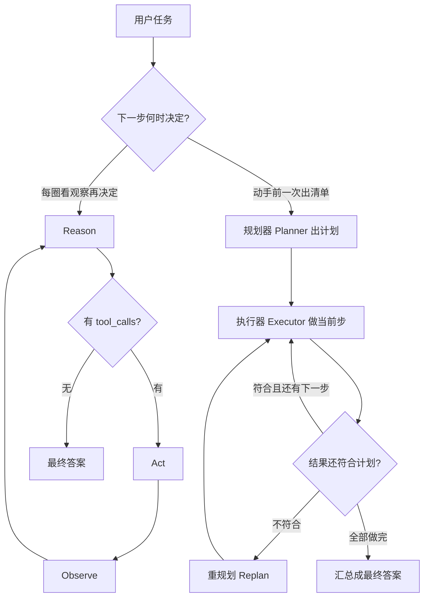

# **先规划再执行 vs 一步步走**：两种策略的代价

> 对应模块：[模块 07 · 手写 Agent ⭐⭐⭐⭐⭐ · 🔥 最关键模块](./README.md) · 小节进度第 2 条
> 本条由 Coach 按 2026-09-10 本对话 `coach start` 详解首次沉淀。2026-09-10 维护：对照拆成两侧各自请求，笔记证据路径从已删的 `routes/compare.ts` 改到 `lib/flow/` + 分路由。学习者只减不加。进度表仍 ⬜，勾 ✅ 只走 `coach complete`。

- **来源**：本对话 §6.2 详解（对照上一节 Agent Loop / ReAct；LangGraph plan-and-execute 只读概念，未打开外部文档页）
- **状态**：已沉淀
- **Demo**：可运行。对应 Demo 已实现 `apps/07-手写Agent/02-先规划再执行-vs-一步步走-step-{1-6}/`。学完之后必须看见「计划作为对象出现在第一次调工具之前」以及至少一种代价数字，才能讲清「什么时候值得先出计划」。禁止任何 Agent 框架，手写控制流。

> 各节写什么、达标要求：见仓库根 [AGENTS.md §7.2](../../../AGENTS.md#72-沉淀--小节进度对齐)。

## 是什么

上一节回答：**圈怎么转、何时停**（想（Reason）→ 做（Act）→ 看（Observe）→ 再想）。这一节问另一件事：**下一步由谁、在什么时候决定？**

| 策略 | 人话 | 动手前有没有「计划」这份对象 |
| -- | -- | -- |
| **一步步走** | 每一圈看完观察，再决定下一步。计划是走一步看一步长出来的 | 没有事先写完的清单 |
| **先规划再执行（Plan-and-Execute）** | 先让模型一次吐出完整步骤清单，再按清单做 | 有。计划在第一次真正调工具之前就存在 |

两种策略都还是你自己写的控制流。本模块写死：**禁止**用 LangChain / LangGraph / Vercel AI SDK / OpenAI Agents SDK / Mastra 代劳循环。LangGraph 文档里的 plan-and-execute 只当概念对照：无非是「规划节点 → 执行节点 →（可选）重规划节点」，骨架可以手写。

物理骨架没变（仍是模块 05 / 上一节那条）：

```text
model → tool_call → execute → tool_result → model
```

变的是 **想（Reason）的粒度**：一步步走每次只决定「此刻调哪个工具」；先规划先产出一份 **计划（Plan）**，执行器再按步骤干活。

```text
用户任务
        ┌─────────────────────────────┐
        │ 一步步走（观察驱动下一步）     │
        │ Reason → Act → Observe      │
        │ → 再 Reason（看最新观察）    │
        └─────────────────────────────┘
        ┌─────────────────────────────┐
        │ 先规划再执行                 │
        │ 规划器一次出清单             │
        │ → 按步骤执行                 │
        │ →（可选）结果不对就重规划     │
        └─────────────────────────────┘
```



| | 一步步走 | 先规划再执行 |
| -- | -- | -- |
| 模型先产出什么 | 「此刻要调哪个工具」或最终正文 | 一份计划：有序步骤，有时带简单依赖 |
| 第一次真正调工具之前 | 一次 Reason 结束就能做 | 必须等完整计划写完 |
| 中途世界变了 | 下一圈自然按新观察改 | 旧计划可能作废；不重规划就会做错 |
| 和上一节循环的关系 | 就是上一节那条 `while` | **不是取消循环**。执行阶段仍可能一圈圈跑；多出来的是「动手前那一次规划」 |

前端对照（[使用协议 §0.8](../../01-使用协议.md#08-前端--agent-对照表)）：一步步走像 saga / 每个 `await` 回来再决定下一个请求；先规划像先写好 CI 流水线步骤，再按 YAML 往下跑。

生活对照：去超市。一步步走是「走到冷柜看有没有牛奶，没有再决定买豆奶」。先规划是「出门前写好清单：牛奶、鸡蛋、米，进门按清单拿」。

学完之后要能讲清的只有一句：**什么时候值得先出计划。** 不是「规划比较高级所以默认用规划」。

### 核心对象与变体

#### ① 一步步走（观察驱动下一步）

就是上一节的 **ReAct**：每一圈 Reason 只决定**此刻**干什么。下一步不预先写死。

- **变体 A · 一步步走**  
  数据怎么走：用户「这个客户为什么连续下了 3 次失败订单」→ 第 1 圈只能先查日志 → 看见是支付超时 → 第 2 圈才决定查支付渠道，而不是一上来就退款。  
  生活：修车师傅拧一颗螺丝、测一下电压，再决定下一步；不会在没打开引擎盖时就把完整修车步骤当真理。  
  前端：表单向导里「第 2 页的选项取决于第 1 页选了什么」——没法在用户点开第 1 页之前生成第 2、第 3 页的最终 DOM。

#### ② 计划（Plan）和规划器（Planner）

**计划**是一份在执行前就存在的步骤清单（有时带依赖：「步骤 3 必须等步骤 1 的 id」）。**规划器（Planner）**是那一次（或偶尔几次）专门「只产出计划、先不干活」的模型调用。**执行器（Executor）**按清单做事。

计划常见两种形态（都算「先规划」，差别在计划有多「可执行」）：

| 形态 | 计划长什么样 | 执行时还要不要再问大模型 |
| -- | -- | -- |
| 自然语言步骤 | 「1. 查库存 2. 写文案 3. 发通知」 | 每步可能还要再调一次模型，把这句话变成具体 `tool_calls` |
| 工具调用序列 | 直接列出 `list_todos` → `complete_todo(id=…)` | 中间可以少一次 Reason，按清单 `execute` |

- **变体 B · 先规划再严格执行（中途不改清单）**  
  数据怎么走：用户「春季上新：拉库存、写 3 条商品文案、给运营发通知」→ 规划器一次吐出 3 步 → 执行器按 1、2、3 做完 → 汇总。执行中即使第 2 步文案写得一般，也不改步骤标题。  
  生活：按完整食谱做菜，第 3 步写「放盐」，不会中途改成「改做汤」。  
  前端：发布流水线 YAML 写死 `lint → test → build → deploy`，一次发布中途不改顺序。

- **变体 C · 先规划 + 中途重规划（Replan）**  
  数据怎么走：同上 3 步；执行到「写文案」时库存接口返回 0 → 规划器收到观察 → 作废「写文案 / 发上新通知」→ 新计划变成「标记缺货 + 通知采购」。  
  生活：旅行清单写了「下午去海边」，到了下雨 → 重写下午计划，不是撑伞按原清单下水。  
  前端：CI 某 job 失败后，不是继续部署，而是跑「通知 + 回滚」这条新分支。

**重规划不是又变回一步步那么简单。** 一步步改的是「下一步一个动作」；重规划改的是「剩下整份清单」。粒度更粗，也更贵（又一次完整规划调用）。

#### ③ 代价（什么时候值得，看的就是这些账）

「值得」不是感觉高级，是这几笔账算下来划算。

| 代价维度 | 一步步走 | 先规划再执行 |
| -- | -- | -- |
| **模型调用次数** | 每一步都要一次 Reason（上下文还越来越长） | 规划通常 1 次；执行可用小模型，或按清单直接调工具 |
| **第一次行动前的等待（Time-to-First-Action）** | 短：第一次 Reason 完就能 Act | 长：用户先盯着「正在想完整计划」 |
| **适应性** | 高：每步看最新观察 | 低：除非重规划 |
| **计划过期（Stale Plan）** | 几乎没有「旧清单」这回事 | 规划时世界是 X，执行时已是 Y |
| **给人预览 / 先拦下来** | 难：你还不知道后面几步 | 容易：清单可以先渲染给人点头 |
| **拆模型档** | 每步都用正在对话的那个模型 | 规划器用贵的、执行器用便宜的，有时总体更省 |

- **变体 D · 短任务：规划是浪费**  
  数据怎么走：用户「把 `todo-001` 标完成」→ 一步步走可能 1 圈就 `complete_todo`；若先规划，会多付一次规划调用，计划内容往往就一句「调用 complete_todo」。  
  生活：回家路上只买一瓶水，仍先写三页购物计划。  
  前端：改一个 CSS 颜色却先开完整的功能分支流程、写 8 步设计文档。

- **变体 E · 计划过期：世界变了仍按旧清单做**  
  数据怎么走：规划时「会议室 A 空闲，订 A，再发邀请」→ 执行前别人订走了 A → 不重规划仍去 `book(room=A)` → 冲突 / 把人请到一间不对的房间。  
  生活：出门前写「去常去的那家面馆」，到了店关门，仍按清单往里走。  
  前端：缓存里的库存是 20，下单时真实库存 0，仍按缓存数字创建订单。

- **变体 F · 计划给人看：先预览再动手**  
  数据怎么走：财务「给 8 个供应商打款」→ 规划器先列出 8 笔金额和账号 → 页面停在「未执行」→ 人点确认才 `transfer`。  
  生活：装修先出报价清单，房主签字再砸墙。  
  前端：GitHub 的 Pull Request 先展示 diff，点 Merge 才改主分支。这一条的代价是：**第一次行动更晚**，换来的是副作用可拦。后面模块会专门讲「人必须点头才能继续」；本条只要记住：能给人看，是先规划的独特好处，一步步走很难同等预览。

- **变体 G · 代价对照（调用次数 / 第一次行动前等待 / 规划器贵执行器便宜）**  
  同一句「把逾期购物待办整理完」：  
  - 一步步走：可能 3 次大模型 Reason（list → complete → 总结），第一次 Act 在第 1 次 Reason 之后。  
  - 先规划：1 次规划（出「先 list 再按 id complete」）+ 执行阶段按清单调工具 + 可选一次小模型写总结。第一次 Act 必须等规划结束。  
  - 拆模型档：规划用大模型（要把步骤想对），执行用小模型或甚至不调模型（清单已经是工具名）。若任务步骤稳定，总体 Token 往往更省；若任务其实是探索，你付了规划费，执行时又要重规划，**两份钱都付了**。  
  生活：请资深厨师写菜单（贵、一次），厨房按菜单炒（便宜、可并行）；如果客人每道菜都改口，菜单写了也白写。  
  前端：用一次昂贵的架构评审产出任务板，初级开发按票做；需求每天变，评审纪要会变成过期计划。

## 为什么（Agent 开发要懂）

你已经会写循环了。下一步的真实风险不是「会不会转圈」，而是 **用错了决策节奏**：

1. **探索性问题却先出完整计划** → 计划建立在猜测上。第 1 步一查，后面 4 步全废，但已经让用户等了一次规划，还可能按废清单动了副作用。
2. **结构清楚的长任务却一步步走** → 每步都用大模型看完整 `messages`，Token 线性涨；用户也看不到「一共要做几步」，没法提前拦。
3. **有副作用的批量操作不给人看计划** → 8 笔打款直接一步步 `transfer`，错了才发现。先规划至少能把清单渲染出来。
4. **出了计划却当圣经** → 库存变 0 仍写上新文案、会议室被订仍发邀请。这比「没计划」更危险，因为执行器以为自己在「按正确清单干活」。
5. **又规划又每步大模型 Reason 还不加取舍** → 最贵的组合：规划费 + 一步步的费用都付，第一次行动还最慢。

模块验收要的是手写完整 Agent。循环是骨架；**规划还是一步步，是你给这个骨架选的节奏**。选错的后果是钱（Token）、等待、以及按过期清单改真实世界。

## 易混点

| 容易混成 | 实际差在哪 | 判错会怎样 |
| -- | -- | -- |
| 先规划 = 上一节「串行依赖多圈」 | 串行依赖是：模型这一圈只返 1 个工具，等观察后再返下一个。仍然每圈 Reason，没有「动手前的完整清单」。先规划是：先产出全部步骤，再执行 | 会以为「多圈 = 已经在规划」。学完之后讲不清「计划作为一份对象存在过」 |
| 先规划 = 你在系统提示（System Prompt）里写死流程 | 那是**人**规划。本条的规划器是**模型**根据任务现场生成清单 | 任务一变，写死的提示全线崩；还以为自己做了先规划再执行 |
| 先规划 = 模型调一个工具触发 | 工具调用（`tool_call`）是模型在 Reason 这一圈调业务工具（`query_orders` / `transfer_money` / `complete_todo`）。**要不要走规划**写在 `agent(task)` 入口，模型不知情 | 会以为「模型不调工具就不走规划」，其实规划路径根本不进 Reason，规划根本不靠 `tool_call` 触发 | 进阶变体可做一个 `plan_first` 工具让模型自选要不要规划，但本节默认不做（不稳定 + 多一次大模型调用） |
| 先规划 = 不要循环了 | 执行阶段仍可能循环；多的是规划这一跳 | 写成「一次规划 + 一次执行就 return」，复杂任务静默做不完（假循环的变种） |
| 重规划 = 一步步走 | 一步步改「下一个动作」；重规划改「剩下整份清单」，多一次完整规划调用 | 失败一次就重规划，账上变成规划费+一步步费，还不如一开始一步步 |
| 同一圈并行多个工具 = 先规划 | 上一节变体 E：无依赖时模型同一圈塞多个 `tool_calls`，`Promise.all` 执行。那是执行层并行，**没有**事先存在的步骤清单对象 | 会用「已经并行了」代替「该不该先出计划」 |
| 计划写出来了 = 计划是对的 | 规划器也会幻觉：编不存在的工具、编还没查到的 id、漏掉必须先查的那一步 | 严格执行错误清单，比一步步走错得更系统 |
| 值得规划 = 任务看起来长 | 长度不是判据。判据是：步骤结构事先能否说清、失败后重规划概率、要不要给人看、第一次行动能不能等 | 长而探索的任务（查异常根因）会被先规划进沟里 |
| 不值得规划 = 永远不要计划 | 短任务、强依赖未知观察、世界变化快 → 不要先规划。批量副作用、要审批、步骤稳定可并行 → 要 | 打款 / 上线 / 删数据也会被「走一步看一步」直接做掉 |
| 真模型下 A 路径「1 圈空停」= 系统坏了 | 1 圈就停是模型当次决定的合理行为：模型觉得没 SKU 列表直接给最终答案比瞎调 query_stock 合理。**`stoppedReason` 字段告诉前端为什么停**（final_answer = 模型主动停 / max_rounds = 圈数被兜底停） | 把「模型自己决定停」当 bug → 改 prompt 强逼模型调工具 → 模型行为变奇怪；正确做法是补一句 prompt 让模型在缺信息时先调 notify_ops 问，再给最终答案 |
| mock = 日志里没有 | mock 是真模型的替代方案；mock 路径仍照常执行，照常打五条日志（调用循环-A / 调用函数-invokeTool）| 把 mock 路径当成「整段被跳过」 → 看 logs 找不到任何日志 → 以为代码没跑；正确做法是看 logs 的 scope 是不是 `调用循环-A-一步步走` 这种 mock 路径自己的 scope |
| B 路径「真规划」= 全程真 | B 路径是「真规划 + 模拟执行」两跳：规划器（planWithLlm）真调模型；执行器（invokeTool）仍是 mock 函数（queryStock / writeCopy / notifyOps / complete_todo 不接真业务）| 把 B 路径「真规划」标签读成「全程真」→ 发现执行阶段是 mock 觉得被忽悠；正确理解是「规划器这一跳真 + 执行器是 mock 占位」——模块 07 不讲工具集成 |
| 两阶段 API 的字段子集 | 阶段 1 GET /api/plan 只返回 plans + sessionId + status=pending，没有 executeTrace；左栏是另一次 GET /api/step-by-step，状态独立。阶段 2 POST /api/confirm-plan 才有执行痕迹 | 把左栏和右栏绑成同一个 `data.stepByStep` → 阶段 1 读 null.trajectory 报错。**修法** = 左右栏各自 useState；右栏按 planStage gate 渲染执行卡 |
| think 块 / args 位置传参 | 模型返回 `choices[0].message.content` 里可能塞 `... 思考块`（MiniMax-M3 等带思维链的模型）；args 是位置参数（`query_stock(sku)`）不是 JSON `key=value`（`{sku: "..."}`）| 不剥离 think 块 → 把思考过程当成步骤列表解析 → 解析出 12 步而不是 7 步；按 `key=value` 解析位置参数 → args 全部空对象 → 工具拿不到 SKU |

#### 策略放哪（控制流分支 vs `tool_call`，三种放法）

「要不要走规划」**不是 `tool_call`**——是**控制流分支**，写在 `agent(task)` 入口，模型根本不知情。模型只做两件事：

1. **被叫到规划器时**吐一份步骤清单（`llmPlanner(task)`，是模型调用，不是 `tool_call`）
2. **被叫到 Reason 时**决定此刻调哪个业务工具（`tool_call`）

业务工具（`query_orders` / `transfer_money` / `complete_todo`）和「触发规划的工具」（`plan_first`）是两类完全不同的东西。模型在 Reason 里调不调业务工具跟「要不要走规划」无关——规划路径根本不进 Reason。

**三种放法（都常见，开发者写死，模型不知情）：**

```ts
// 放法 A：按任务类型分流（最常见）
async function agent(task: Task) {
  if (task.type === "spring-launch") return planAndExecute(task)
  return reactLoop(task)
}

// 放法 B：按用户开关
async function agent(task: Task) {
  if (task.userWantsPlan) return planAndExecute(task)
  return reactLoop(task)
}

// 放法 C：按配置（环境变量 / yaml）
const mode = process.env.AGENT_MODE === "plan" ? "plan" : "react"
return mode === "plan" ? planAndExecute(task) : reactLoop(task)
```

**类比 · 图书馆管理员：**

| 角色 | 干什么 |
| -- | -- |
| 管理员（= 你的代码） | 看来访者证件 / 问来意，决定走研究区 / 少儿区 / 接待室。**模型不知道这事** |
| 研究区研究员（= 规划器） | 被叫到时把研究路径列成清单 |
| 馆员（= 执行器） | 按清单去书架、复印、归档 |
| 谁决定分流 | **管理员**，不是研究员，更不是读者 |

**判错会怎样：**

| 写错的样子 | 后果 |
| -- | -- |
| 让模型在 Reason 里自选「要不要先规划」（做一个 `plan_first` 工具） | 模型倾向固定策略（永远调 / 永远不调）；多一次不稳定的大模型调用；同一类任务今天调、明天不调 |
| 把策略写在 system prompt 里让模型读 | 任务一变提示全线崩；模型不一定听话 |
| **正确**：策略写在代码入口，按任务类型 / 用户开关 / 配置分流 | 同一份代码可观察、可调试、可对照 |

**什么时候值得先出计划：**

同时满足越多，越值得：

1. 步骤结构事先能说清（不是「查了才知道下一步」）
2. 步骤之间依赖稳定，或彼此能独立（规划完甚至能并行执行）
3. 需要给人看 / 先拦副作用，且用户愿意等完整计划
4. 规划 1 次 + 便宜执行，预计比每步大模型 Reason 更省
5. 中途世界大变、必须整份重规划的概率不高

下面几条有一条很强，就偏向一步步走：

1. 1～2 步就能做完（规划本身是额外一次调用）
2. 下一步强依赖上一步的未知结果（先查 id / 先看日志）
3. 世界变得很快，清单很容易过期
4. 用户必须马上看到第一个动作（第一次行动前不能干等）

## 例子

**例子 1 · 变体 A · 客服查异常（一步步走）**  
用户：「这个客户为什么连续 3 次下单失败？」  
不可能预先写出「第 3 步一定是退款」。数据：Reason 先查订单日志 → Observe 是支付超时 → Reason 再查支付渠道 → 发现渠道挂了 → 最终答案是「渠道故障，不要退款，要切备用渠道」。若先规划成「查订单 → 退款 → 发补偿券」，第 1 步观察已经否定了后面两步，但严格执行仍会退钱。

**例子 2 · 变体 B · 运营上新三个工具（先规划严格执行）**  
用户：「春季上新：拉库存、给 3 个有货 SKU 写文案、通知运营」。  
结构事先清楚。数据：规划器吐出「拉库存 → 写文案 → 通知」→ 执行器按清单做，中途不改步骤名 → 汇总。第一次拉库存发生在计划渲染之后，用户能看见「一共 3 大步」。

**例子 3 · 变体 C · 库存为 0 则重规划**  
同上，但拉库存返回全 0。  
数据：执行器把观察交给规划器 → 旧清单里「写文案 / 发上新通知」作废 → 新计划变成「标记缺货 + 通知采购」。页上应能看见「计划 v1 → 计划 v2」，不是继续写不存在商品的文案。

**例子 4 · 变体 D · 单条待办（规划浪费）**  
用户：「把 todo-001 标完成」。  
一步步：1 次 Reason → `complete_todo` → 最终答案。  
先规划：1 次规划（内容往往就是「调用 complete_todo」）+ 再执行。多付一次调用，第一次行动更晚，没有可预览价值（清单只有一步）。

**例子 5 · 变体 E · 会议室过期计划**  
规划时刻：A 房间空闲。计划：订 A → 邀请进 A。  
执行时刻：A 已被订。不重规划仍去订 A，失败或把邀请发到冲突房间。对照变体 C：观察是「A 冲突」应重规划成订 B 再邀请。

**例子 6 · 变体 F · 批量打款先给人看**  
用户：「按这张表给 8 个供应商打款」。  
数据：规划器产出 8 行「账号 / 金额 / 摘要」→ 页面停在未执行 → 人点确认才打款。一步步走的话，第 1 笔可能在用户看清全表前就已经打出去。

**例子 7 · 变体 G · 同一待办任务对账**  
任务仍是「把逾期购物待办标完成」（上一节见过一步步 3 圈）。  
先规划路径：规划器先写「1. 列出逾期购物 2. 对每个 id 标完成 3. 用中文汇报」→ 再执行。页上应对照：规划调用 1 次、工具执行 N 次、第一次 Act 前等待。若规划器还用大模型、执行只按清单调工具，Token 账和「每圈大模型 Reason」会分开。若模型规划时编造了还不存在的 id，严格执行会把错 id 送进 `complete_todo`——这就是「计划看起来完整 ≠ 计划正确」。

**例子 8 · 前端发布（把 ①②③ 串起来）**  
「把这次活动页发到生产」：步骤结构清楚（检查代码 / 跑测试 / 构建 / 打生产开关），**值得先出计划给人看**（变体 F + B）。若测试失败仍按旧清单部署，就是变体 E。测试失败后改成「通知 + 停止发布」，就是变体 C。若用户其实问的是「线上为啥白屏」（探索），先出 8 步发布计划就是用错策略，应走变体 A 先查日志。

## 需求清单

验收准绳，不是一次搭完整应用的施工单。step 仍按知识动态加。每条对应一个变体（或变体组）。

1. **业务场景**：客服助手，用户问「这个客户为什么连续下单失败」。**目标**：必须先查再决定，不能一上来就退款。**知识点**：变体 A 一步步走。**验收**：轨迹里第 1 个动作是查询类工具；最终答案出现在观察之后；没有「动手前完整计划对象」，或明确标了「本任务未走规划」。
2. **业务场景**：运营助手，「春季上新：拉库存、写有货 SKU 文案、通知运营」。**目标**：动手前先出完整步骤清单再按清单做。**知识点**：变体 B。**验收**：第一次工具调用之前，页上已渲染计划步骤；执行顺序与清单一致；中途不改步骤标题。
3. **业务场景**：同上，但库存全 0。**目标**：作废「写文案 / 发上新」，改成缺货处理。**知识点**：变体 C 重规划。**验收**：能看见计划 v1 和 v2；没有给 0 库存 SKU 写文案的成功副作用。
4. **业务场景**：用户「把 todo-001 标完成」。**目标**：展示「规划是额外成本」。**知识点**：变体 D。**验收**：对照能看见规划调用次数为 0（或走规划时多 1 次且第一次行动更晚）；任务仍能完成。
5. **业务场景**：订会议室：规划时 A 空闲，执行时 A 被占，仍按旧计划邀请。**目标**：让人看见过期计划的危害。**知识点**：变体 E。**验收**：轨迹按旧清单执行并失败或订错；教学上能对照「若重规划会怎样」。
6. **业务场景**：财务「给 8 个供应商打款」。**目标**：清单先给人看，确认前不打款。**知识点**：变体 F。**验收**：执行前页上有完整计划且状态是未执行；确认前没有任何打款成功记录。
7. **业务场景**：同一句「整理逾期购物待办」，两种策略对账。**目标**：用数字回答「这次值不值得先规划」。**知识点**：变体 G。**验收**：页上能看见规划次数、执行次数、第一次 Act 前等待；能口头说出哪种更值、为什么。

### 变体 ↔ 需求 ↔ 可观察

| # | 变体 | 例子 | 需求 | 可观察 Demo |
| - | -- | -- | -- | -- |
| A | 一步步走 | 例子 1 / 8 | 需求 1 | step-1～6 左栏 GET /api/step-by-step（页上标「未走规划」） |
| B | 先规划再严格执行 | 例子 2 | 需求 2 | step-1～6 右栏 GET /api/plan-and-execute（step-6 右栏改 GET /api/plan） |
| C | 重规划 | 例子 3 | 需求 3 | step-3 `lib/flow/replan.ts` + 计划 v1 灰卡 → v2 绿卡 |
| D | 短任务不值得规划 | 例子 4 | 需求 4 | step-4 四组各自请求（`?task=short\|long`） |
| E | 计划过期仍执行 | 例子 5 | 需求 5 | step-5 `lib/tools/ops.ts` FAIL_ON_CALL + 执行卡标黄 |
| F | 计划给人看再动手 | 例子 6 | 需求 6 | step-6 GET /api/plan → POST /api/confirm-plan（确认时不跑 A） |
| G | 代价对照 | 例子 7 | 需求 7 | step-1～6 浏览器现场算对照数字（`public/utils/compare-metrics.js`） |

## 取舍

- **先规划 vs 一步步走**：步骤事先能说清、要给人看、执行能变便宜、清单不容易过期 → 先规划。探索、短任务、下一步强依赖未知观察、用户必须马上看到第一个动作 → 一步步走。默认不是「越规划越高级」。
- **严格执行 vs 重规划**：步骤稳定、失败只该停不该改路线 → 严格执行（失败就停并告诉人）。观察经常推翻清单 → 必须能重规划，否则就是变体 E。失败一次就整份重规划，账上可能比一开始一步步更贵。
- **自然语言步骤 vs 工具调用序列**：教学上自然语言清单更好指「计划这份对象」；生产里若步骤已是稳定工具名，直接规划 `tool_calls` 能少一次 Reason。编造 id 的风险在第二种更大（清单看起来已经可执行）。
- **规划器贵、执行器便宜 vs 全程一个模型**：步骤稳定时拆档能省钱；任务其实是探索时，拆档省不下，还多一次规划等待。
- **计划给人看 vs 自动执行**：有不可逆副作用（打款、删数据、发生产）应预览；查日志、标一条待办不必等人点头。完整的「人必须点头才能继续」在后面模块，本条只取「计划能渲染成可拦的清单」这一层。

## 踩坑

- 探索任务先出完整计划：第 1 步观察否定后面全部步骤，但已经等了规划，还可能按废清单动了副作用。
- 短任务也规划：多付一次调用，第一次行动更晚，清单只有一步，没有预览价值。
- 出了计划当圣经：库存 0 仍写上新文案、会议室被占仍发邀请。比没计划更危险。
- 以为多圈 ReAct 就是先规划：学完之后讲不出「计划作为对象在第一次 Act 之前存在过」。
- 以为同一圈 `Promise.all` 就是先规划：那是执行层并行，没有清单对象。
- 系统提示里写死流程，当成模型规划：任务一变全线崩。
- 写成「规划一次 + 执行一次就 return」：假循环的变种，复杂任务做不完。
- 又规划又每步大模型 Reason：两份钱都付，第一次行动还最慢。
- 规划器幻觉编造还不存在的 id，执行器照单全收。
- **页面文案同步滞后于代码改动**：A 路径代码从 mock 换成真模型，但页面按钮 + 介绍文案 + 空态文案还写着「mock」「A 路径继续 mock」—— 学习者看页面会以为代码还没改。**改完代码立刻 grep 一下页面文案**（关键词：`mock` / `真规划器增量` / `A 路径仍 mock`）。
- **真模型当次决策导致行为不稳定**：同一句任务「春季上新：拉库存、写有货 SKU 文案、通知运营」两次跑可能不一样 —— A 路径可能 1 圈就停、也可能 2 圈（先 notify_ops）；B 路径规划可能 5 步 / 7 步 / 3 步。**这不是 bug，是特性**——真模型当次决定，mock 永远看不到这种差异。教学 demo 必须配套 `stoppedReason` 字段告诉前端「为什么停」。
- **重规划无限循环**：v1 plan 执行 → observations 累积（query_stock 全 0）→ shouldReplan 触发 → doPlan 出 v2 → v2 plan 又包含 query_stock(SKU-90) → 又 0 → 又触发 → ... 死循环。**保险机制**：（1）新 plan 版本开始时 `observations.length = 0` 清零观察；（2）`MAX_PLAN_VERSIONS = 3` 兜底防止无限触发；（3）shouldReplan 触发条件可以更宽松（如「任一 SKU 0 库存」而非「全部 0」）但要配合前两条保险。
- **B 路径执行器是 mock 是有意设计，不是疏忽**：模块 07（手写 Agent）的教学点是控制流（Loop / 规划 / 停止），不是工具集成。queryStock / writeCopy / notifyOps / complete_todo 都是 mock 占位，真接 DB / CMS / IM 是后续模块的事。step-2 「真模型规划」标签指**规划器这一跳**的真假，没说执行器也是真。教学上要么页面加透明标签（「✅ 真规划器 + 模拟工具」），要么明确教学点不强调执行器。
- **教学 demo UX：每页第一眼应该把「实际场景 + 核心问题」抛出来**（#problem-card），不要只讲「演示什么」。结构 = 3 个具体业务场景（生活 / 工作 / 反例）+ 1 个核心问题（带「？」收尾）。让学习者带着问题看 demo，自己回答。**4 个 demo 都按这个风格统一**：step-1「先规划还是走一步看一步？」/ step-2「真模型才能公平对照」/ step-3「世界变了怎么办？」/ step-4「什么时候不值得先规划？」/ step-5「工具失败要重规划吗？」/ step-6「有副作用的批量怎么让人看一眼才执行？」
- **服务端两阶段 + 左右栏状态独立**：旧设计把左右栏绑在同一个 `GET /api/compare` 响应里（阶段 1 `stepByStep: null`），前端一读 `data.stepByStep.trajectory` 就炸。新设计左栏自己的 GET /api/step-by-step、右栏 GET /api/plan + POST /api/confirm-plan，各自 useState。右栏仍要按 `planStage` 决定要不要渲染执行卡；确认接口禁止再跑一步步走。
- **UI 状态机 vs 隐式状态**：变体 F 教学点 = 「确认前无副作用」。UI 状态机显式（planStage='idle' / 'planned' / 'executed'）+ plans[] + status 字段 + sessions Map（按 sessionId 存 plans）。**不要把状态藏在 plans 数组里** —— 学习者看不出当前在哪一阶段。显式状态机的代价 = 多 3 个 useState + 按钮分两阶段 + fragment 闭合问题（拆 JSX 要小心 adjacent JSX 报错）。

## Demo 子节进度

表行只写已建 step；禁止预判未来。

| 状态 | 子节 | 入口 | 端口 | 本子节教学点 |
|------|------|------|------|--------------|
| ✅ | step-1 | `yarn app:07-02-plan-vs-step-step-1` | `50053` | 双栏对照（mock · 不调真 LLM）：一步步走 7 圈 vs 先规划 1 次 + 6 步执行；关键差异卡 3 行：模型调用次数（A=7 / B=1）/ 第一次 Act 前等待（A=0 / B=1）/ 计划作为对象（A ❌ / B ✅）（2026-09-10 学习者主动锁定） |
| ✅ | step-2 | `yarn app:07-02-plan-vs-step-step-2` | `50054` | step-2 全真模型：A 路径每圈真调一次模型（最多 MAX_ROUNDS=8）+ B 路径真规划器一次吐清单；公平对照节奏差异；plannerFallback=true 时 B 解析失败回退 mock plan + 标 ⚠ 兜底（2026-09-10 学习者主动锁定） |
| ✅ | step-3 | `yarn app:07-02-plan-vs-step-step-3` | `50055` | step-3 加重规划：B 路径执行阶段每步后 shouldReplan 检测关键变化（默认：所有 SKU 0 库存）→ 触发再调真规划器吐 v2 plan；plans 数组从 1 变 2；executeTrace 每步带 planVersion；UI 看见「计划 v1 灰卡 → 计划 v2 绿卡」（2026-09-10 学习者主动锁定） |
| ✅ | step-4 | `yarn app:07-02-plan-vs-step-step-4` | `50056` | step-4 短任务对照：4 组各自请求（短 A / 短 B / 长 A / 长 B；`?task=short\|long`）；新增 complete_todo；变体 D：短任务 B 多付 1 次规划（不值得）/ 长任务 B 更省模型调用（值得）（2026-09-10 学习者主动锁定；2026-09-10 维护拆请求） |
| ✅ | step-5 | `yarn app:07-02-plan-vs-step-step-5` | `50057` | step-5 变体 E 演示：mock write_copy 第 1 次调用强制返回 `{ok:false}`；演示 shouldReplan 不看 ok=false → 工具失败但不重规划 → 按旧清单做错；UI 执行卡标黄「⚠ 变体 E 触发」；对照卡新增「工具失败次数 / 已重规划」（2026-09-10 学习者主动锁定） |
| ✅ | step-6 | `yarn app:07-02-plan-vs-step-step-6` | `50058` | step-6 变体 F「计划给人看」：GET /api/plan 只规划 → POST /api/confirm-plan 才执行；左栏独立 GET /api/step-by-step；sessions Map 按 sessionId 存 plans；UI 状态机 idle → planned → executed；确认前无副作用，确认时不再偷跑 A 路径（2026-09-10 学习者主动锁定；2026-09-10 维护拆请求） |

## 过关自检

- 能用一句话说清：下一步是「看完观察再决定」还是「动手前先出完整清单」。
- 能说出至少一种「值得先出计划」的业务，和至少一种「不值得」的业务，并且理由不是「任务长 / 任务短」这一条。
- 能指出：先规划不是取消循环；执行阶段仍可能转圈。
- 能区分：上一节串行依赖多圈 ≠ 先规划；同一圈并行工具 ≠ 先规划。
- 能说出计划过期仍执行会怎样，以及重规划改的是整份剩余清单、不是下一个动作。
- 能对照至少一种代价：规划次数、执行次数、第一次行动前等了多久。
- 能说：计划写出来了 ≠ 计划正确（规划器也会幻觉）。

对照「本条要能讲清」：知道什么时候值得先出计划 = 上面那份口诀（结构能说清 + 清单不易过期 + 常常要给人看或能把执行变便宜；探索 / 短任务 / 强依赖未知观察 → 一步步走）。

## 我追问过的

| 问题 | 针对什么 | 回答 |
|------|---------|------|
| 上一节讲并行/串行/模型自选；这一节是先规划。规划由模型还是代码决定？ | 混淆「上一节小调度（Reason 里的并行/串行）」和「这一节大节奏（要不要先规划）」是不是同一个层级；同时混淆「规划由谁决定」——是模型还是开发者 | 答在 §1.4 控制流细节对比 + 新增「策略放哪」节。核心结论：**两个层级**——大节奏（要不要先规划，本节，代码写死）vs 小调度（Reason 里并行/串行/模型自选，上一节）。要不要走规划由代码决定，不由模型。 |
| 「要不要走规划」是我的工具里决定的吗？模型永远没调到我的工具，是不是就永远不走规划？ | 混淆「`tool_call` 触发规划」与「代码控制流触发规划」；以为模型调一个工具才能走规划 | 答在新增「策略放哪」节。核心结论：「要不要走规划」**不是 `tool_call`**——是 `agent(task)` 入口的控制流分支，写在代码里，模型根本不知情。规划路径根本不进 Reason，模型永远不会被问「你要不要规划」。进阶变体才做 `plan_first` 工具让模型自选，本节默认不做。 |
| 一步步走 = 模型自己决定调啥；先规划 = 先有计划按计划做。大概率是确定的？ | 混淆「步数不确定 vs 确定」——以为 B 模式「步数确定」、A 模式「步数不确定」 | 答在 §1.4 控制流细节对比 + 易混点第 1 行。核心结论：**核心差异不是「确定度」是「决策时机」**。A 路径圈数 = 模型当次决定；B 路径步数 = 模型当次吐 plan 多长——两者**都不确定**。区别是 A「每圈问一次」、B「动手前一次问完」。Plan 是对象让执行者能预估、能并行、能拆模型档。 |
| 「是 mock 代码 = 后台日志里没有？」 | 混淆「是 mock」与「日志没有」——以为 mock 路径完全被跳过 | 答在 step-1 `lib/flow/step-by-step.ts`（日志 scope=`调用循环-A-一步步走` 每圈都打）。核心结论：**mock 是真模型的替代方案；mock 路径仍照常执行，照常打五条日志**。翻 logs/ 能看到 mock 的完整轨迹（包括 mock 返回值）。 |
| 你为什么说我这里有 Mock 代码？ | 想知道 mock 在哪三处 + 为什么不全用真 | 答在 `lib/tools/ops.ts` + step-1 / step-2 README。核心结论：**三处 mock**——A 路径模型（step-1 才有；step-2 已换真）/ B 路径 plannerFallback 兜底（解析失败时回退）/ 三个工具实现（queryStock / writeCopy / notifyOps 不接真业务）。step-2 不全真：工具集成是后续模块的事；A 路径成本 = 每点一次 7 圈模型调用。 |
| A 路径真模型跑了 1 圈就停，工具都没调，是 bug 吧？ | 混淆「真模型自己决定停」与「系统坏了」 | 答在 step-2 `lib/flow/step-by-step.ts` 的 SYSTEM_PROMPT_REACT（加了一句「缺信息时先调 notify_ops 问」）+ 页面 UI 的 stoppedReason 字段。核心结论：**1 圈就停是真模型的合理行为**，不是 bug。stoppedReason 字段告诉前端为什么停（final_answer = 模型主动停 / max_rounds = 圈数被兜底停）。同一句任务两次跑结果可能不一样——真模型当次决定是特性，不是 bug。 |
| prompt 加上「缺信息时先调 notify_ops 问」后效果？ | 想稳定让 A 路径至少调一次工具，UI 看起来更直观 | 答在 step-2 `lib/flow/step-by-step.ts` SYSTEM_PROMPT_REACT。核心结论：加这一句后 A 路径稳定调 1 次 notify_ops（要 SKU 列表）然后给最终答案；trajectory.length=2、stoppedReason=final_answer、act[0].tool=notify_ops ok=true。**调优 prompt 是教学 demo 的标准动作**——一句规则就能让模型行为从「1 圈空停」变「至少 1 次工具调用」。 |
| 路径 B 的规划器是真模型，但执行阶段还是 mock 代码吧？ | 想确认 B 路径是不是「全程真」 | 答在 step-2 `lib/flow/plan-and-execute.ts`（执行阶段）+ `lib/tools/ops.ts`。核心结论：**B 路径是「真规划 + 模拟执行」**——只有规划这一跳是 openai.chat.completions.create 真调，执行阶段每步调的还是 mock 函数（queryStock / writeCopy / notifyOps 不接真库存 / 真 CMS / 真 IM）。模块 07（手写 Agent）的教学点是控制流，不是工具集成——所以工具实现是 mock 占位。step-2 「真模型规划」标签指规划器这一跳的真假，没说执行器也是真。 |
| step-3 重新规划的条件是什么？中间任务失败时也会重新规划吗？ | 想确认变体 C 触发条件 + 变体 E 是不是缺口 | 答在 step-3 `lib/flow/replan.ts` shouldReplan。核心结论：**当前 shouldReplan 只看 `query_stock.available === 0`**（业务数据变化 = 变体 C），**不看工具失败**（`result.ok === false` = 变体 E 缺口）。变体 E 教学价值 = 让学习者看到这个缺口（write_copy 失败 → 不重规划 → 按旧清单继续 → 通知「文案已完成」假数据）。step-5 / step-6 演示这个缺口；模块 18 可靠性专题做完整失败分级。 |
| 4 个 demo 都没把实际场景跟问题在前面抛出来，页面不够清晰 | UI 反馈：教学 demo 第一眼没让学习者看到「为什么」 | 答在 4 个 demo 的 #problem-card。核心结论：**每页第一眼应该是「实际场景 + 核心问题」（橙底 + 橙边 + ❓ 标题）**，不是只讲「演示什么」。结构 = 3 个具体业务场景（生活 / 工作 / 反例）+ 1 个核心问题（带「？」收尾）。让学习者带着问题看 demo，自己回答。4 个 demo 改造后统一风格。 |
| 前端报错 `TypeError: Cannot read properties of null (reading 'trajectory')` | bug 反馈：旧设计阶段 1 把左右栏绑在同一响应，左栏读 null | 答在 step-6 现架构：左栏独立 GET /api/step-by-step，右栏 GET /api/plan + POST /api/confirm-plan，各自 useState。核心结论：对照不要塞进同一个 `data.stepByStep`。旧修法是 `planStage === "executed" && data.stepByStep` 守卫；新修法是左右栏状态拆开，这个陷阱基本消失。 |

## 还没搞懂的

- 死循环防护的阈值怎么配、模型口头说停的细规 → 本模块第 3 条。
- 「人必须点头才能继续」的完整产品形态（暂停、恢复、和计划预览怎么叠）→ 模块 11 Human-in-the-loop。
- Agent State 对象该有哪些生产字段 → 模块验收 + 落 Demo 时再钉。

## §5.4 目标 ↔ 代码整合过关检查

跑过关检查日期：2026-09-10（首次沉淀预扫）· 2026-09-10 维护同步证据路径（对照拆请求后，`routes/compare.ts` 已删）

「本条要能讲清」：知道什么时候值得先出计划

### §5.4.A 目标 → 代码覆盖

| 目标点 | 状态 | 证据 |
|---|---|---|
| A1 同一任务能看见「先出完整计划再执行」和「每步看观察再决定」两条轨迹 | 已实现 | step-1 mock + step-2/3/4/5/6 真模型双栏对照（page-intro + #col-step-by-step / #col-plan-and-execute）|
| A2 能指出至少一种「值得先出计划」的业务，并在页上看到计划清单出现在第一次调工具之前 | 已实现 | step-1/2/3/4/5/6 右栏「计划 v1」卡（蓝绿色，位置在执行卡之前）|
| A3 能指出至少一种「不值得先出计划」的业务（短任务 / 必须先查才知道下一步） | 已实现 | step-4 4 组轨迹对照（短 A 2 圈 vs 短 B 3 次规划 + 7 步；长 A 4 圈 vs 长 B 2 次规划）+ 顶部「值得规划？❌ NO」判断卡 |
| A4 能看见「计划过期仍按旧清单做」会做错，和「观察不符就重规划」能改清单 | 已实现 | step-3 重规划（query_stock 0 库存 → plans v1→v2）+ step-5 变体 E 缺口演示（write_copy 第 1 次强制失败 → UI 标黄「⚠ 变体 E 触发」）+ step-6 变体 F 两阶段（确认前无副作用）|
| A5 能对照至少一种代价：规划次数、执行次数、第一次 Act 前等待 | 已实现 | step-1/2/3/4/5/6 顶部「关键对照卡」多行（modelCalls / preActSteps / planExists / replannerTriggered / variantETriggered / shortWorthReplan / longWorthReplan）|
**A 段小结**：全部 5 条目标点均已实现（step-3 修 A4 重规划 / step-5 修 A4 变体 E / step-6 修 A4 变体 F）。变体 E 缺口本身是 step-5 的教学价值（让学习者看到 shouldReplan 不看 ok=false 是缺口），不是「未实现」。本条全部可走 §5.4 独立验证。

### §5.4.B 文档 → 代码对齐

| MD 讲点 | 代码里有没有 | 状态 |
|---|---|---|
| 需求 1 一步步走 / 未走规划 | 已实现 | step-1 mock 7 圈 `lib/flow/step-by-step.ts` + step-2/3/4/5/6 真模型循环（同文件 `runStepByStep`）|
| 需求 2 先规划严格执行 · 计划在第一次 Act 前 | 已实现 | step-1 mock plan `lib/flow/plan-and-execute.ts` + step-2/3/4/5 真规划器 `lib/flow/parse-plan.ts`；step-6 规划在 `lib/flow/plan.ts` |
| 需求 3 重规划 · 计划 v1→v2 | 已实现 | step-3 `lib/flow/replan.ts` shouldReplan + `lib/flow/plan-and-execute.ts` 触发 v2 + plans 数组 + executeTrace.planVersion |
| 需求 4 短任务规划是额外成本 | 已实现 | step-4 四组各自请求（`routes/step-by-step.ts` + `routes/plan-and-execute.ts`，`?task=short\|long`）+ 顶部「值得规划？」判断卡 |
| 需求 5 计划过期仍执行会做错 | 已实现 | step-5 `lib/tools/ops.ts` FAIL_ON_CALL：write_copy 第 1 次强制失败 → shouldReplan 不看 ok=false → 按旧清单继续做错 |
| 需求 6 计划给人看 · 确认前无副作用 | 已实现 | step-6 GET /api/plan（`routes/plan.ts` + `lib/flow/sessions.ts`）只规划；POST /api/confirm-plan（`routes/confirm-plan.ts` + `lib/flow/execute-plan.ts`）只执行已保存计划，禁止再跑 A；UI 状态机 idle/planned/executed |
| 需求 7 两种策略代价数字对照 | 已实现 | step-1/2/3/4/5/6 顶部对照卡由浏览器 `public/utils/compare-metrics.js` 用两侧返回值现场算（服务端不打包）|
| 易混：串行依赖多圈 ≠ 先规划 | 已实现 | step-1 `#core-takeaway` 页面注解：左栏多圈仍是一步步走 |
| 易混：同一圈并行 ≠ 先规划 | 已实现 | 同上：同一圈调多个工具也不是先规划；先规划看动手前有没有清单对象 |
| 易混：要不要走规划 = 控制流分支（`agent()` 入口）不是 `tool_call` · 三种放法（任务类型 / 用户开关 / 配置） | 部分已实现 | step-1~6 控制流 vs tool_call 已在代码入口分支里；三种放法的配置切换未演示（留给后面）|
| 踩坑：规划器编造 id 执行器照单全收 | 未实现 | 未落（关联模块 11 Planning 校验）|
| 新增（2026-09-10）：真 A 路径每圈真调模型 + MAX_ROUNDS=8 + stoppedReason 字段 | 已实现 | step-2 `lib/flow/step-by-step.ts` SYSTEM_PROMPT_REACT + `runStepByStep` 真模型循环 + stoppedReason |
| 新增（2026-09-10）：think 块剥离（MiniMax-M3 模型 content 里的思考块污染步骤列表）| 已实现 | step-2 `lib/flow/parse-plan.ts` `rawText.replace(/<think>[\s\S]*?<\/think>/g, "").trim()` |
| 新增（2026-09-10）：args 位置参数解析（`query_stock(sku)` 等 → 命名参数）| 已实现 | step-2 `lib/flow/parse-plan.ts` parseArgs + TOOL_PARAM_NAMES |
| 新增（2026-09-10 · step-3）：重规划保险机制（`observations.length = 0` 清零 + `MAX_PLAN_VERSIONS = 3` 兜底）| 已实现 | step-3 `lib/flow/plan-and-execute.ts` 清零 + `lib/flow/replan.ts` MAX_PLAN_VERSIONS |
| 新增（2026-09-10 · step-4）：变体 D 短任务对照（4 组各自请求 + 数字对照 + 值得判断）| 已实现 | step-4 四组独立 URL；浏览器现场算对照数字 |
| 新增（2026-09-10 · step-4）：B 路径两跳（真规划 + 模拟执行）教学点 | 已实现 | step-2/3/4/5/6 标签「✅ 真模型规划」；执行器 mock 在 `lib/tools/ops.ts` |
| 新增（2026-09-10 · step-4）：complete_todo mock 工具（短任务 1 步工具）| 已实现 | step-4 `lib/tools/ops.ts` completeTodo + TOOL_IMPLS |
| 新增（2026-09-10 · step-5）：mock 工具强制失败机制（FAIL_ON_CALL + callCounters）演示变体 E | 已实现 | step-5 `lib/tools/ops.ts` FAIL_ON_CALL |
| 新增（2026-09-10 · step-6）：服务端两阶段（planOnly + executeFromPlan + sessions Map）| 已实现 | step-6 `lib/flow/plan.ts` + `lib/flow/execute-plan.ts` + `lib/flow/sessions.ts`；GET /api/plan 只规划；POST /api/confirm-plan 才执行 |
| 新增（2026-09-10 · step-6）：UI 状态机 planStage=idle/planned/executed | 已实现 | step-6 `public/index.html` useState planStage + 按钮分两阶段 + 右栏状态机标签 |
| 新增（2026-09-10 · step-6）：左右栏状态拆开（不再绑同一个 stepByStep）| 已实现 | step-6 左栏独立 GET /api/step-by-step；右栏按 planStage 渲染执行卡 |
| 新增（2026-09-10 维护）：对照两侧分请求，禁止超级 /api/compare | 已实现 | step-1～5 左栏 /api/step-by-step、右栏 /api/plan-and-execute；step-4 四组各自请求；step-6 confirm 不 import runStepByStep |

**B 段小结**：需求 1～7 + 对照分请求 + 易混「串行依赖 / 同一圈并行 ≠ 先规划」页面注解均已实现。仍留给后面的：三种放法的配置切换、踩坑「编造 id」（模块 11）。缺口只许补代码或拆成两条进度；禁止把未实现写成「已知缺口放过」。

