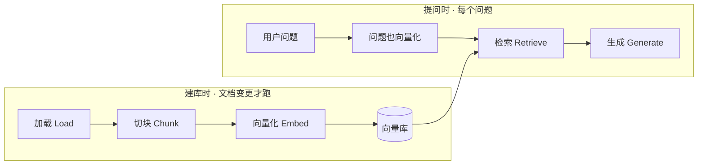

# **RAG 流水线**：Load → Chunk → Embed → Retrieve → Generate

> 对应模块：[模块 08 · RAG 基础 ⭐⭐⭐⭐⭐](./README.md) · 小节进度第 1 条
> 本条由 Coach 按 2026-09-11 本对话 `coach start` 详解首次沉淀。同日经追问与笔记核对、以及 step-1 跑通后的嵌入方言 / 换家重建 / 检索实现增量更新。同日增量更新：弃权（A5）相关知识——检索质量量化（四度量 + 判定）+ 四种弃权判定方式（Top-1 / 逐条过滤 / 平均分 / 最严）× 三组分数对照表 + 为什么选 Top-1 一票否决（判一次 / 给模型多上下文）+ 需求 7 补验收「A/B/C 三组分数 × 四种方式」。学习者只减不加。进度表仍 ⬜，勾 ✅ 只走 `coach complete`。

- **来源**：本对话（2026-09-11 `coach start` §6.2 详解；同日经 4 次追问 + 1 次笔记核对增量更新：四件套（变体 12）/ 维护期频率表（变体 13–14）/ 答不准三种修法（变体 15）/ RAG 根因与出处（变体 16–17）；同日笔记核对：纠错删旧口径 / `id` 职责 / 诊断与阈值，并补充问句前缀（prefix）/ 扫描版 PDF / 近似最近邻（ANN）；同日 step-1 跑通后再增量：聊天模型 vs 嵌入模型（变体 18）/ MiniMax 嵌入 HTTP 方言 vs 智谱·千问 OpenAI 兼容（变体 19）/ 提问只返回 1 条向量、本步 SQL 全表扫描 + 内存打分（变体 20）；同日再增量：智谱全 0 与编码格式（encoding_format）（变体 21）/ 货架已装未接入；对照模块 01 嵌入（Embedding）/ 幻觉（Hallucination）、模块 06 上下文（Context）vs 记忆（Memory）、模块 07 Agent 循环（Agent Loop）；嵌入文档打开 [MiniMax Embeddings](https://platform.minimaxi.com/document/embeddings)）
- **状态**：已沉淀（2026-09-11 首次沉淀；同日经多轮追问 + 笔记核对 + step-1 嵌入方言 / 全 0 解码增量更新）
- **Demo**：可运行（已落 step-1，未锁定）。合上文件必须看见原文 → 切块 → 命中列表 → 带材料的提示词（Prompt）→ 回答，才能讲清「能默画这一条」。落点 `apps/08-RAG基础/01-RAG-流水线-step-1/`。页面左右分栏：左边查看库（SQLite 四件套），右边提问。向量不能全是 0。

> 切块该切多长、重叠（overlap）补什么 → [第 2 条](./02-Chunking.md)。余弦相似度（Cosine Similarity）为什么只看方向 → [第 3 条](./03-余弦相似度.md)。检索增强生成（RAG）vs 微调（Fine-tuning）怎么选型 → [第 4 条](./04-RAG-vs-Fine-tuning.md)。本条只点它们在流水线里站哪，不整节讲完。

---

## 是什么

**检索增强生成（RAG，Retrieval-Augmented Generation）**：先从你自己的外部知识里找出相关段落，再让大模型基于这些段落说话。

它要补的是模块 01 已经见过的两件事：

1. **幻觉（Hallucination）**：模型在预测下一个 Token，不是在查数据库。训练截止日期之后的售后规则、你们公司内部手册，它没有。
2. **上下文窗口（Context Window）**：你也不可能把整座知识库塞进一次请求。所以要先找出「这题可能用得上的几段」，再塞进去。

2020 年那篇检索增强生成论文，核心也是「先检索再生成」；论文场景是维基百科 + 生成模型，不是公司手册。本条用售后助手讲同一条线。不背论文，能把线画出来、能说出每一步进出什么数据，就算达标。

---

## RAG 为什么存在（变体 16 · 根因层）

RAG 之所以存在的**根因**，不是「让长上下文更省」，是**模型根本没有你那些知识**。下面三个层次按因果摆：

| 层次 | 作用 | 重要级别 |
| ---- | ---- | -------- |
| **根因（为什么要有 RAG）** | 给模型喂它**训练时根本没见过的**知识 | ⭐⭐⭐⭐⭐ |
| 直接效果 | 精准定位到长文里的那几段 + 能点名出处 | ⭐⭐⭐⭐ |
| 优化效果 | 省 token / 加快响应 / 降本 | ⭐⭐⭐ |

**模型不知道的事情分两类**：

| 类型 | 例子 | 不接外部知识能答吗 |
| ---- | ---- | ------------------ |
| 公共知识但**训练截止之后** | 「2024 年欧冠冠军」「GPT-5 发布日期」 | ❌ 编 |
| **你公司自己的私有知识** | 「你们公司 7 天无理由政策」「某型号路由器保修 2 年」 | ❌ **从来没见过** |

第二类**更致命**：模型不是在「忘了」，是**训练时世界上根本没这种东西**。截止日期早一年还能靠「大概是这么回事」糊弄；公司内部规则连糊弄的素材都没有，**一定编**。

**所以 RAG 的根因问题只有一句话**：

> 模型没有这些知识 → 你必须**主动喂**它 → 但喂太多会撞窗口 → 所以先**精准挑**要喂的那几段 → 再喂进去。

这一步「精准挑」就是检索；「喂进去」就是生成。**整条流水线都是为了解决「喂它没见过的知识」这件事**，不是为了别的。

### RAG vs 长上下文（Long Context）

不是「RAG 是长上下文的优化版」，是「**没有长上下文也能做**」的另一种解法：

| 解法 | 怎么做的 | 代价 |
| ---- | -------- | ---- |
| 长上下文 | 把整篇塞进提示词 | 又贵、又吵、没出处；Lost in the Middle 让模型漏看中间 |
| RAG | 先检索再生成 | 多一次检索的工程，但**省 token + 准 + 有出处** |

很多企业知识库根本不存在第二种选择 —— 整本塞不下、模型也没见过。

### 能点名出处是 RAG 真正独有的优势（变体 17）

```text
用户问：杯子裂了怎么退？
模型答：根据《退货政策》破损一节，可补发或退货。  ← 来源被点名

vs 长上下文：
模型答：可补发或退货。                            ← 答对了但你不知道它看的是哪一段
```

**能点名出处 = 你能追责**。客服答错了你能查到「它看的是哪一段、哪一页」；政策过期了你能查到「是哪几行该删」。长上下文答对了你也说不清它看了什么 —— 这才是 RAG 相对长上下文的根本优势，不是「省 token」。

### 「省 token / 加快 / 精准」是副产品，不是目的

| 场景 | 不接 RAG | 接 RAG |
| ---- | -------- | ------ |
| 一次问答的 token 量 | 整本手册 ~50 万字 ≈ ~100 万 token | Top-K ≈ 3 条 × 200 字 ≈ ~2000 token |
| 单次成本 | 100 万 token × 单价 | 2000 token × 单价（外加一次嵌入调用） |
| 响应延迟 | 长上下文推理慢 | 短上下文推理快 + 检索毫秒级 |
| 能不能回答没训过的内容 | 不能（模型没见过） | 能（你喂了） |

注意最后一行的对比 —— 即使两边都「能答」，不接 RAG 那栏还是**不能**，因为它根本不知道这些内容。**「省 token」是建立在「你已经决定要用 RAG」之后的优化目标，不是你选 RAG 的理由。**

### 一句话

**RAG 的存在原因** = 模型没有你那些知识，你必须喂它。  
**RAG 的实现方式** = 先检索再生成 —— 这一步**顺便**带来精准、省 token、加快、便宜。  
**RAG 相对长上下文的优势** = 能点名出处（这是真正独有的）。

---

前端类比：这不是让客服大模型「凭记忆答退货」。这是：

1. 先有一份帮助中心（Markdown / PDF）
2. 预建成可搜的索引（像 `npm run build`，不是每次请求都重新编译）
3. 用户一问，先做一次搜索，拿到几条命中
4. 再把命中贴进提示词，让模型当「只许根据这几张卡片说话的客服」

和模块 06 的对照：检索出来的段落，是**这一次请求**塞进 `messages` 的上下文（Context），不是跨会话长期记忆（Memory，模块 10）。

### 核心对象是一条分类，不是一个点（讲完前已扫变体）

| # | 变体 | 本条要看见什么 |
| - | ---- | -------------- |
| 1 | 加载（Load）· Markdown | 文件变成带元数据（metadata）的原文 |
| 2 | 加载（Load）· PDF | 抽文本，页码 / 文件名跟着走 |
| 3 | 加载（Load）失败 | 空文件 / 坏文件 / 不支持的格式 / 扫描件空正文或乱码，页面说失败，不假装入库成功 |
| 4 | 切块（Chunk）作为流水线一步 | 长文变成多张小卡片，每张带着来源；大小取舍留给第 2 条 |
| 5 | 向量化（Embed）· 建库时 | 每张卡片变成一条向量，写入向量库（Vector Database） |
| 6 | 向量化（Embed）· 提问时 | 用户问题用**同一个**嵌入模型、同一套前缀（prefix）约定再算一次向量 |
| 7 | 检索（Retrieve） | 返回前 K 条（Top-K）+ 相似度分数 + 来源；库大时多半是近似最近邻（ANN） |
| 8 | 生成（Generate） | 把检索材料带出处塞进提示词，再让模型作答 |
| 9 | 建库时 vs 提问时 | 提问不再重新加载、切块整库 |
| 10 | 检索写死 vs 检索做成工具（Tool） | 闲聊不搜；问政策才搜 |
| 11 | 库里没有 | 低分 / 零命中 → 说不知道，不编 |
| 12 | 一行 = 4 字段（id / vector / text / metadata） | 库里每行结构相同但内容独立；「一本书」= `source` 值相同的那堆行，不是数据库一级实体 |
| 13 | 维护期四种动作（按频率分层） | 后 2 步在本条范围内不写库；前 3 步：首次上线全量，文档变按文件行级，切块策略 / 嵌入模型 / 向量库变了才全量 |
| 14 | 行级 vs 全量（按频率分） | 大多数运营动作 = 按 `source` 整份删旧 + insert 新几行；切块策略 / 嵌入模型变了才整库重切或重嵌入；换向量库常常是迁移旧向量，不必重算 |
| 15 | 答不准时三种修法 | 答不准 ≠ 要重跑整库：库脏 → 按文件行级删旧；切块策略或换嵌入模型 → 全量；提示词 / 提问写法 / 「分数看起来低」→ 多数不动库 |
| 16 | RAG 存在的根因 = 喂模型它训练时根本没见过的知识 | 模型**不是「忘了」**，是世界上就没这种东西（私有知识 / 训练截止之后）。省 token / 加快 / 精准都是副产品，不是根因 |
| 17 | 能点名出处（RAG 相对长上下文的独家优势） | 长上下文答对了你也说不清它看了哪段；RAG 检索命中自带 `source` + 章节 / 页码，可追责、可更新、能拒绝编造 |
| 18 | 聊天模型 vs 嵌入模型 | 同一家提供商通常两个 id：聊天写回答，嵌入把文字变成向量。`LLM_EMBEDDING_MODEL` 选的是后者，不是再选一个 M3 / GLM |
| 19 | 嵌入接口方言 | MiniMax 嵌入自己 HTTP（`texts` + `type=db/query`，返回 `vectors`）；智谱 / 千问走协议 A 的 `embeddings.create`（`input`，无 `type`）。聊天三家都可以走协议 A |
| 20 | 检索怎么匹配 | 提问时嵌入只返回 **1 条**问题向量。本步 SQL 是 `SELECT` 全表，在进程里算余弦、取前 K 条，不是 `WHERE vector = 问题` |
| 21 | 兼容 SDK 的默认编码 | OpenAI 兼容 SDK 不写编码格式（encoding_format）时默认按 base64 再解码。智谱仍返回小数数组，会被解成全 0 并写入。必须显式 `encoding_format: "float"`；解析后拒绝全 0 |

### 一条线画完：建库时三步，提问时三步

五个英文词排成一排，不等于每次用户提问都要从头加载（Load）。那样又慢又贵，也画错了。

```text
建库时（文档上传 / 更新时跑一次）
  文件 ──Load──► 原文 + 元数据
       ──Chunk─► 若干切块（每块带着来源）
       ──Embed─► 每块一条向量 ──写入──► 向量库

提问时（每个问题跑一次）
  用户问题 ──Embed──► 问题向量
           ──Retrieve──► 前 K 条切块 + 分数 + 来源
           ──Generate──► 带材料的提示词 ──► 模型作答
```



生活例子：你把《员工手册》复印、剪成卡片、按主题放到卡片盒里——这是建库。同事过来问「年假怎么休」，你按问题去盒里抽最像的几张，再按卡片上的原文回答——这是提问。同事每问一次，你不会把整本手册重新剪一遍。

---

## 为什么（Agent 开发要懂）

1. **模型不会「自动知道」你们公司的最新规则。** 不接外部知识，它只能靠训练记忆 + 编。售后政策改了昨天，它还在用两年前的印象。
2. **整库塞进上下文窗口会爆、会贵、会吵。** 模块 06 的 Token 预算（Token Budget）在这里变成：只把前 K 条相关切块塞进去。
3. **画错时间线会做成玩具。** 每次提问都重新加载 + 切块 + 向量化整库，用户等的是一次搜索，你跑的是一次全站重建。
4. **检索位置画错，闲聊会被知识库污染。** 本模块验收写明的常见坑：把检索写死在流程里，每次都搜。用户说「你好」，你检索出一堆退货段落，模型开始念政策。
5. **检索成功 ≠ 回答诚实。** 库里没有、或分数都很低，仍然可能编。流水线最后一公里必须能弃权。
6. **RAG 的根因不是「省 token / 加快 / 精准」，是喂模型它没见过的知识。**（详上一节「RAG 为什么存在」）前面三条「省 token / 加快 / 准」是这根因实现后**顺便**得到的副产品。混了根因和实现细节，会把它当成「长上下文优化版」，进而忽略了它真正独有的优势 —— **能点名出处**。

---

## 五个阶段：数据怎么走

下面用同一个业务串起来：你在做电商「售后助手」。知识库准备了两份东西：`refund.md`（7 天无理由、破损补发）和 `shipping.pdf`（运费、偏远地区）。

### ① 加载（Load）

**是什么**：把文件变成程序能用的原文 + 元数据。元数据至少要有：来源文件名、类型（md / pdf）、PDF 的页码或 Markdown 的章节标题。后面检索命中了，生成阶段才能写「根据《退货政策》第 3 节」。

**为什么**：没有来源，模型答对了你也不知道它看的是哪份文件；更新了 `refund.md` 你也不知道该删掉库里哪些旧切块。

**Markdown 怎么走**：读文件 → 得到字符串 → 挂上 `{ source: "refund.md", type: "markdown" }`。

**PDF 怎么走**：不能当纯文本 `readFile`。要抽文本。抽出来可能丢表格、页眉页脚会进正文，所以页码必须跟着走：`{ source: "shipping.pdf", type: "pdf", page: 2 }`。本条先认清「PDF 也是加载的一种，不是另一种流水线」。

**失败怎么走**：空文件、损坏 PDF、`.exe` 这种不支持的格式。正确行为是：**这一份入库失败，其它已入库的别被带倒**；页面红字写清哪份、为什么。禁止返回「已入库 0 条」却当成功。

还有一种更阴的失败：**扫描版 PDF / 纯图片页**。解析器可能报成功，抽出来却是空字符串或乱码。后面会当成「加载成功」去切块，库里留下垃圾卡片。这和「文件打不开」不是同一种失败——要看抽出的文本是否像人话，空正文或乱码应按失败处理，不要入库。

前端类比：`fetch('/docs/refund.md')` 拿到 `text`；PDF 像要先经过一个「抽文本中间件」。`404` / 解析失败要进错误态，不能当成空字符串继续切块。扫描件像接口 `200` 但 body 是空的——状态码看起来成功，内容不能用。

### ② 切块（Chunk）——本条只讲它在流水线里干什么

**是什么**：把一篇可能很长的原文，切成多段可独立检索的小卡片。每张卡片 = 一段文本 + 从加载传下来的元数据。

**为什么必须有这一步**：一整本手册变成**一个**向量，盒里就一张超级卡片，上面同时写着退货、运费、发票。「杯子裂了怎么退」和「偏远运费」会指向同一个点，什么都像、什么都不准。切开之后，检索才能只抽出「破损补发」那几张。

**数据怎么走**：

```text
refund.md 全文
  → 切块 1：「7 天无理由……」+ { source: "refund.md", section: "无理由退货" }
  → 切块 2：「运输破损可补发或退货……」+ { source: "refund.md", section: "破损" }
```

切多大、要不要重叠，第 2 条专门讲。本条过关句是：**必须切；切完来源不能丢。**

### ③ 向量化（Embed）

模块 01 已经学过：文本 → 向量；语义近的距离近。本条要多看清的是——**流水线里它会出现两次，而且必须是同一个嵌入模型**。

| 时机 | 输入 | 输出 | 存不存 |
| ---- | ---- | ---- | ------ |
| 建库时 | 每一张切块的文本 | 一条向量 | 和切块原文、元数据一起写入向量库 |
| 提问时 | 用户这一句问题 | 一条向量 | 通常不入库，只用完这次检索 |

**为什么必须同一模型**：不同嵌入模型的坐标轴不一样。用 A 模型给切块算坐标、用 B 模型给问题算坐标，再比远近，等于拿高德的经纬度和另一套投影去减，数字没有意义。step-1 实测：MiniMax 建的库，改 `LLM_PROVIDER` 成千问再提问会对不上；**重新建库**后才能命中。换的是嵌入坐标系，不是「聊天模型换了所以搜不到」。

**同一模型还不够**：有的嵌入模型要求文档加前缀（prefix）`passage:`、问题加 `query:`（名称以产品文档为准）。模型名相同但前缀乱配，分数同样没意义。MiniMax 的 `embo-01` 把这件事写成字段：建库 `type=db`（被检索的卡片），提问 `type=query`（拿来搜的那一句）。不是两个嵌入模型，是同一模型的使用场景开关。智谱 `embedding-3`、千问 `text-embedding-v3` **没有**这个 `type`：约定就是两边用同一个嵌入 id、同一种 `input` 请求。没有前缀要求的模型双方都不加，也算同一套约定。

**聊天模型和嵌入模型不是同一个产品**（变体 18）。页脚会同时出现「模型 MiniMax-M3」和「嵌入模型 embo-01」。顶层 `LLM_EMBEDDING_MODEL` 对等于聊天那边的 `LLM_MODEL`：都是选一个模型 id，但活不一样。把 `MiniMax-M3` / `glm-5.3` 填进嵌入槽会建库失败。不是每个聊天模型、也不是每家提供商都卖嵌入（本仓库 DeepSeek 官方默认空着）。

**嵌入接口也可能和聊天不是同一套协议**（变体 19）。step-1 里只有 MiniMax 嵌入自己 `POST {baseUrl}/embeddings`（字段 `texts` / `type`，成功看 `vectors` 和 `base_resp.status_code`）。智谱、千问走 `openai.embeddings.create`。文档：聊天看资源清单里的 OpenAI / Anthropic 兼容页；MiniMax 嵌入看[文档中心 Embeddings](https://platform.minimaxi.com/document/embeddings)。新版接口概览几乎只讲语言模型，嵌入还在旧页。

**接口形状兼容，不等于 SDK 默认编码能用**（变体 21）。`openai@4.85` 的 `embeddings.create` 若不写编码格式（encoding_format），会默认要 base64，再按字节解成浮点。智谱 `embedding-3` 不理这个字段，仍返回小数数组。SDK 把 2048 个小数当成 2048 个字节，除以 4 得到 **512 维全 0**。空数组会报错，全 0 却算成功，建库页面绿、检索分数全是 0。对照：同一句自己 `POST /embeddings` 是 2048 维正常小数。修法：显式 `encoding_format: "float"`；解析后发现全 0 就失败，禁止写入。千问默认就能解对，所以换千问再重建会「突然正常」——不是 RAG 原理变了，是解码没踩坑。查看库时向量开头应是带正负号的小数；维数看嵌入模型（智谱 `embedding-3` 常见 2048），不要写成全世界都是 1536。

切块（Chunk）是 **本地**把说明书裁成卡片；嵌入模型不会帮你拆文档，它只吃已经切好的字符串，返回数字。建库 1 万张卡片 → 大约 1 万条向量写入库。提问 1 句话 → 嵌入只返回 **1 条**向量，通常不入库。

每次提问多打一次嵌入接口是正常的（1 次嵌入 + 本地检索 + 1 次聊天）。贵的是聊天；嵌入又快又便宜。不会每次把整份说明书再 embed 一遍。

前端类比：建库像给每条 FAQ 算好并缓存 `searchKey`；提问像用同一套算法给搜索框算 `searchKey`，再按距离近去查。换算法等于缓存全废，要重建。前缀 / MiniMax 的 `type` 像搜索框规定必须带 `q=`，文档侧却写成 `doc=`，两边对不上。OpenAI 兼容更好接，不等于检索效果更好。

本仓库模块选型是 LanceDB。本步 Demo 先用已经装好的 SQLite 存四件套（id / vector / text / 来源字段），因为 LanceDB 还要另下本机二进制，外网装不上会挡入门。后来 `@lancedb/lancedb` 已经进了 `apps/package.json`，但 `vector-store.ts` **没有 import**，读写仍是 `better-sqlite3`。装上 ≠ 已经在检索。认的是「有一个专门存向量 + 原文 + 元数据的库」，不必先会某一家 API。本地库（SQLite / LanceDB）是货架；`create-embeddings.ts` 是去问嵌入模型怎么贴条码。点「查看库」只做 `SELECT`，不调模型。

### ④ 检索（Retrieve）

**是什么**：拿「问题向量」去向量库里找最近的前 K 条，每条带：切块原文、元数据、相似度分数。

**提问时嵌入返回几行**：用户一句话，嵌入模型返回 **1 条向量**（一串数字，维数看嵌入模型，不是全世界都是 1536）。不是返回 1 万行。1 万行是库里已经存好的卡片。

**本步 SQL 并不做「向量等于」**（变体 20）：

```sql
-- 建库：写入
DELETE FROM chunks;
INSERT INTO chunks (id, vector, text, source, section, chunkIndex) VALUES (...);

-- 检索：只是把行读出来
SELECT id, vector, text, source, section, chunkIndex FROM chunks;
```

没有 `WHERE vector = 问题那串数字`，也没有 `LIKE`。读出来之后在进程里对每一行算余弦相似度（Cosine Similarity），按分数排序，取前 K 条（step-1 的 K = 3）。1 万行时这个 Demo 会扫全表 1 万次打分。库大了生产多用近似最近邻（ANN），把打分推进向量引擎，不再 `SELECT *` 再在 JS 里比。

匹配的不是「两串数字逐位相同」，是「方向近不近」。客人说「杯子裂了」，库里写「运输破损」，字可以不同，方向近就能中。检索返回的是带分数的卡片列表，不是最终答案。

**数据怎么走**（用户问「昨天买的杯子裂了，怎么退？」）：

```text
问题 → 同一模型向量化
     → 在库里按远近排序
     → 前 3 条例如：
        0.86  refund.md / 破损  「运输破损可补发或退货」
        0.71  refund.md / 无理由「7 天无理由须包装完好」
        0.40  shipping.pdf / p.2「破损件运费由商家承担」
```

分数用来干什么：页面上能看见「为什么是这三条」；后面做「库里没有」时，也靠「最高分低于你们定的不可用线 / 一条都没有」来判断。具体数字等 Demo 跑出来再定，**禁止**把 `0.25` / `0.3` 当成全世界通用及格线——不同嵌入模型的分数量纲不一样。分数怎么算（余弦只看方向），第 3 条再展开。本条要能讲清：**检索返回的是带分数、带来源的切块列表，不是一句最终答案。**

默画时说「用问题向量去库里找最近的前 K 条」就够。分数怎么算（余弦只看方向），第 3 条再展开。本条要能讲清：**检索返回的是带分数、带来源的切块列表，不是一句最终答案；本步匹配发生在读出全表之后的打分，不是 SQL 等值查询。**

### ⑤ 生成（Generate）

**是什么**：把检索到的切块格式化后塞进提示词，再调聊天接口。真发网络请求的是这一跳（以及建库 / 提问时的嵌入接口）。外面如果包一层 `runRagOnce`，那是「调用函数」，里面才是「调用模型 / HTTP」。

提示词里至少要让模型看见三件事：

1. 角色：你是售后助手，**只根据下面材料回答**
2. 材料：每条带着来源（文件名、章节 / 页码、可选分数）
3. 用户问题

还要写明：材料不够就说不知道，不要编政策、不要编订单号。

**数据怎么走**：

```text
messages ≈
  system: 只根据材料作答；没有就说不知道；回答里点出来源
  user:   【材料1】refund.md / 破损：……
          【材料2】refund.md / 无理由：……
          【问题】昨天买的杯子裂了，怎么退？
     → 模型：根据《退货政策》「破损」一节，可补发或退货……
```

前端类比：检索区是 Network 里搜接口的 JSON；生成区是把 JSON 拼进提示词再打聊天接口。两段都要能在页面上看见，不能只留一个「成功」按钮。

---

## 流水线级三个变体

### 检索写死 vs 检索做成工具（Tool）

| | 写死每次都检索 | 检索做成工具 |
| - | -------------- | ------------ |
| 流程 | `问题 → 检索 → 生成`，没有「要不要搜」 | 进模块 07 那种 Agent 循环（Agent Loop）：模型先想，再决定调不调 `search_knowledge` |
| 「你好」 | 也会搜，容易搜来噪音 | 不调工具，直接寒暄 |
| 「杯子裂了怎么退」 | 搜 | 调工具，再基于 `tool_result` 答 |
| 可能连搜两次 | 通常只搜一次 | 先搜退货，发现还要运费，再调一次（多轮） |

本条画图时，检索不要画成「生成前面的死台阶」。在 Agent 里，它是做（Act）阶段的一个工具；看（Observe）是检索结果；模型可能再做，也可能停。

实现约束（模块动手落点已经写了）：检索封装成**本 Demo 自己的**工具 + 最小循环，不要 `import apps/07-手写Agent/`。条与条不互相引用。

生活例子：前台柜员不是每位客人一进门就翻《员工手册》。有人问路，口述即可；有人问「年假怎么休」，才去翻手册。

### 库里没有 → 拒绝编造

用户问「你们今晚食堂吃什么」。库里只有退货和运费。

```text
Retrieve → 0 条，或最高分低于你们定的不可用线
     → 提示词里材料为空 / 明确写「没有可用材料」
     → 模型应说：知识库里没有食堂菜单，我不能编
     → 不应编一份「今日菜谱」
```

这是模块 01 幻觉在本条的对症：你终于给了模型「先查再答」的回路，但查空了还得给它「可以说不知道」的回路。

### 加载失败 / 空库就提问

空库上提问：检索自然是 0 条，应走「库里没有」，不要假装有材料。  
坏文件：只这一份失败，已在库里的 `refund.md` 仍可问。  
这和「模型编造」是两种失败通道：一个是入库没成功，一个是生成不忠于材料。页面上要能分开。

---

## 检索质量与弃权（Abstain）

前面的「库里没有 → 拒绝编造」一句话讲完了结论。本节展开：检索质量怎么量化、弃权怎么判、库空和低分怎么分开、阈值为什么不能拍脑袋写。

### 是什么

**检索质量量化（Retrieval Quality Metrics）**：检索返回 Top-K ≠ 真命中。Top-K 永远会返回 N 条（哪怕分数 0.1 也算「近」）。光看「返回了 N 条」等于默认「返回即成功」——错。

要让检索从黑盒变白盒，**至少要暴露 4 个数 + 1 个判定**：

| 度量 | 含义 | 用途 |
| ---- | ---- | ---- |
| 命中数（hitCount） | Top-K 里实际返回了几条 | 库里是 0 条 → 不该装成「低分」 |
| 最高分（maxScore · Top-1） | Top-K 里分数最高的那条的余弦 | 衡量「靠不靠谱」 |
| 阈值（threshold） | 判定「算命中」的分数线 | 不同嵌入模型量纲不一样 |
| 是否弃权（abstained） | 命中数 = 0 或 最高分 < 阈值 → true | 给前端做橙 / 绿提示；给模型换提示词 |
| 原因（reason） | `no-materials` / `ok` | 排查时一眼能定位是「库里没」还是「问得远」 |

**弃权（Abstain）4 种实现方式**：按判定粒度分，以下用阈值 = 0.5、Top-K = 5、三组分数举例：

| 方式 | 判定逻辑 | A 组 0.86/0.71/0.55/0.40/0.30 | B 组 0.49/0.45/0.40/0.35/0.30 | C 组 0.30/0.20/0.15/0.10/0.05 |
| ---- | -------- | ----------------------------- | ----------------------------- | ------------------------------ |
| **Top-1 一票否决** | 第 1 名 ≥ 阈值 → 全留；第 1 名 < 阈值 → 全弃 | **留 5 条** | **弃权** | **弃权** |
| **逐条过滤** | 每条独立判 ≥ 阈值才留，剩 0 条才弃权 | **留 3 条**（0.86/0.71/0.55） | **弃权** | **弃权** |
| **Top-K 平均分** | 5 条平均分 ≥ 阈值才留 | **留 5 条** | **弃权** | **弃权** |
| **最差那条也要够**（最严） | 第 5 名（最差那条）≥ 阈值才留 | **弃权** | **弃权** | **弃权** |

**弃权的判定式**（当前 step-1 选的是 Top-1 一票否决）：

```text
abstained = (hitCount === 0) || (Top-1 最高分 < 阈值)
```

触发时三件事**同时做**：提示词材料区替换为「（无可用材料）」；system 强说「知识库里没有相关信息，我不能编」；**仍调聊天接口**——让模型把「说不知道」这句话生成出来。

### 为什么

1. **模块 01 幻觉的对症**。你终于给了模型「先查再答」的回路，但查空了还得给它「可以说不知道」的回路。两边都做齐，幻觉这条路才算真正接住。
2. **检索 ≠ 真命中**。不显式判定「分数够不够高」，等于把「返回即成功」当成默认——库里有 1 万条，检索返回 100 条分数都很低（0.05~0.1），看起来很「成功」，其实完全不相干。
3. **没有检索质量度量 = 答不准时修哪一块都判断不了**。下面「答准时三种修法」里 5 类症状，第一刀要靠命中数 + 最高分判断。
4. **为什么 step-1 选 Top-1 一票否决，不选其他**：
   - **vs 逐条过滤**：只判一次 `hits[0].score`，不循环判每条；0.40 那条虽然低于阈值，和 0.86 放一起模型仍能参考，逐条过滤会把它直接扔掉。
   - **vs 平均分**：只看第 1 名，不浪费一次加法；平均分在高相关组也可能被低分拉低误杀（如 A 组 0.30 拖后腿）。
   - **vs 最严**：最严的代价是 B 组 0.49 只差 0.01 全部被否——宽带来的是有时候会误杀「其实有参考价值」的低分组（如 A 组 0.40/0.30），取舍在于「让模型看多一点」还是「严格筛高相关」。
   - **实际选 Top-1 的理由**：代码最简单（取 `hits[0].score` 一行）+ 给模型多一点上下文没坏处 + 笔记口径「分数线等 Demo 再定」读成「整批判定」最自然。

### 两种失败通道必须分开

| 通道 | 触发条件 | 走哪 |
| ---- | -------- | ---- |
| **加载失败**（建库时） | 库是 0 行 / 文件坏 / 扫描件空正文 | 错误态（throw 409 等）；前端显示红字「哪份失败」 |
| **检索失败 / 弃权**（提问时） | 库**有**内容，但 Top-1 最高分 < 阈值 | 走「无可用材料」提示词；前端显示橙色「⚠ 触发弃权」 |

**不可混淆**：空库上提问检索自然是 0 条，但应该 throw「还没拆库」，**不要**装成「有材料但低分」走聊天接口；那会让用户以为「系统拒绝回答」而不是「系统根本没准备好」。

### 阈值不是通用及格线

笔记取舍表写过一句话：「分数线等 Demo 跑出来再定，禁止拍脑袋写死。」展开说就是：

- 不同嵌入模型分数量纲不一样（典型差异 0.3~0.7）。同一个无关问题，模型 A 可能 Top-1 是 0.2，模型 B 可能 0.45。
- **调整方法**：用 1 条无关问题打几次，看 Top-1 通常落在哪一带，把这条线挪到能区分「真命中 / 假命中」的位置。
- **不要写死「0.3 / 0.5 / 0.7」当世界标准**。Demo 用 0.5 是先用做演示；写到笔记里要说「这是当前模型的演示值，不是通用及格线」。

### 例子

#### 场景 A / B / C × 4 种方式对照

同一个问题、三组不同命中分数，4 种弃权方式结果不同：

| 方式 | 问"运费怎么收" → A 组 0.86/0.71/0.55/0.40/0.30 | 问"今晚食堂菜单" → B 组 0.49/0.45/0.40/0.35/0.30 | 问完全不沾边 → C 组 0.30/0.20/0.15/0.10/0.05 |
| --- | --- | --- | --- |
| **Top-1 一票否决** | 0.86 ≥ 0.5 → **留 5 条**（step-1 实际走这条） | 0.49 < 0.5 → **弃权** | 0.30 < 0.5 → **弃权** |
| **逐条过滤** | 留 **3 条**（0.86/0.71/0.55），0.40 和 0.30 被扔掉 | 全部 < 0.5 → **弃权** | 全部 < 0.5 → **弃权** |
| **平均分** | 0.564 ≥ 0.5 → **留 5 条** | 0.398 < 0.5 → **弃权** | 0.16 < 0.5 → **弃权** |
| **最差那条也要够** | 0.30 < 0.5 → **弃权**（最严） | **弃权** | **弃权** |

A 组里 Top-1 一票否决和逐条过滤的**差别**：前 3 条相关（0.86/0.71/0.55）双方都留，但 0.40 / 0.30 这两条逐条过滤扔了，Top-1 一票否决留了——所以「宽」带来的是让模型多看两条可能没用的上下文。

#### 实际走哪条（step-1）

点右边「演示库里没有答案」按钮 → 自动发问「今晚食堂菜单」→ 检索仍返回 3 条（库有几条就返回 Top-K，不会真空），但 Top-1 最高分 0.111 < 阈值 0.5 → UI 检索质量摘要卡显示「⚠ 触发弃权」+ 命中数 3 / 最高分 0.111 / 阈值 0.5 / 原因 `no-materials` → 提示词里材料区被替换成「（无可用材料）」，system 强说「知识库里没有相关信息，我不能编」→ 模型答：「知识库里没有相关信息，我不能编。建议您直接查看食堂现场公告或咨询食堂工作人员获取当晚菜单」，不编食堂菜单。

> 对照：自己不点那个按钮、自己输一句「运费怎么收」——Top-1 是 0.86，UI 显示「✓ 未触发弃权」，照常拼接 Top-K 材料。两条路径在同一个页面上分得开。

### 踩坑

1. **空库上提问走检索**。库是 0 行时应该 throw 409「还没拆库」，不要装成「低分弃权」走聊天接口。
2. **弃权时不调聊天**。弃权路径**仍然要调聊天接口**——模型要把「知识库没有相关信息，我不能编」这句话生成出来。少了这一步提示词是空，前端看不到弃权响应。
3. **Top-K 永远有 N 条**。库里有 1 万条，检索可能返回 100 条分数都很低（0.05~0.1）。不显式阈值 = 「前 100 条」看起来很「成功」，其实完全不相干。
4. **阈值写死当世界标准**。笔记里不要写「分数低于 0.5 就丢」——这是当前 demo 的演示值。换嵌入模型就要重测。
5. **不暴露检索质量**。UI 只展示「前 K 条卡片 + 答案」而不显示命中数 / 最高分 / 是否弃权，等于把检索质量藏进黑盒。答不准时修哪一块都判断不了。

---

## 数据怎么存 · 一行一行（变体 12）

**一本书建库后，在向量库里留下的是 N 行「四件套」记录，不是整本书的一个大向量。**

```text
向量库里的一行 = 4 个字段
┌────────────────────────────────────────────────────────────────┐
│ id          一串自动生成的编号，这一行的主键（Primary Key）        │
│             （给数据库认行用。运营删旧时按 metadata 筛，           │
│              库再删掉筛中的那些 id；你手里通常没有旧 id）          │
├────────────────────────────────────────────────────────────────┤
│ vector      这块文本对应的那个长向量（维数看嵌入模型）              │
│             ← 这一列就是「向量」                                │
├────────────────────────────────────────────────────────────────┤
│ text        这块对应的原文                                       │
│             ← 生成步要把这一段贴进提示词                         │
├────────────────────────────────────────────────────────────────┤
│ metadata    { source: "manual.md",                              │
│               section: "破损补发",                                │
│               chunk_index: 1 }                                   │
│             ← 来源 + 位置，删旧时按这里筛                        │
└────────────────────────────────────────────────────────────────┘
```

四件套各自负责：

| 字段 | 砍掉它会怎么坏 | 没了之后什么就再也做不了 |
| ---- | -------------- | ------------------------ |
| 编号（id） | 库无法唯一定位一行；覆盖时可能插出重复行 | 没法安全指向「就是这一行」 |
| 原文（text） | 模型答不出人话（它要拿这段话当依据照抄） | 生成步只能塞一堆「无法解读的坐标」进提示词 |
| 向量（vector） | 比不了远近（远近是向量之间的距离） | 整库形同虚设，前 K 条只能随机抽 |
| 来源（source） | 改了一本书你不知道删哪几行 | 第 2 章改了，库可能同时留着 v1.0 和 v1.1；没法做「按文档粒度删」 |
| 章节 / 页码（metadata 里的位置） | 答案没法点名出处；用户问「破损怎么退」，回答是「某段原文」但不知道是说明书哪一节 | 生成步写不出「根据《退货政策》破损一节」，只能写「根据某段文本」 |

**关键认知**：四件套是**落地格式**，跟加载 / 切块 / 向量化是不同维度的概念。前两件（原文 + 向量）= **检索能力**；后两件（来源 + 位置）= **维护能力 + 可信度**。

**每行独立，但通过元数据字段产生弱关联**：每行可以单独被检索、单独被删、单独被重建；一行坏了不影响其它行。「同一本书」「同一章」不是数据库外键，是「`source` / `section` 字段值相同的那堆行」的合称。**能按文件（或按章）更新，是因为先有标签。**

本条默认手术是 **按文件**：`delete where source = "manual.md"`，再把这一份新文件整份加载 → 切块 → 向量化 → insert。  
「能只改一章」说明行是独立的、带着章节标签；**不是**默认就按 `section` 删。按章节删是进阶：章节改名、一张卡片跨两章时，容易漏删。更危险的是：按章节删了几行，却把**整份文件**再切一遍再 insert——没改的章节会重复入库。

生活例子：把库想成图书馆的索引卡抽屉 —— 「编号」是每张卡片自己的流水号，「原文」是卡片上抄的原文，「向量」是卡片背面贴的「主题编号」，「来源」是「哪本书里抄来的」，「章节 / 页码」是「这本书第几章第几页抄的」。手册改成 v1.3 时，默认按**「来源 = 员工手册」**把这本的卡片全抽掉，再把新手册整本重抄进去。其它书一行不动。只撕「破损」那一章，是进阶动作，不是本条默认。

---

## 维护期频率表（变体 13 / 14）

**前 3 步（加载 → 切块 → 向量化）只在「文档变更」或「技术选型变更」时重跑，不是「上线一次就完了」，也不是「每个提问都跑」。**

### 后 2 步（检索 + 生成）在本条范围内不写库

每个提问跑一次检索 + 生成，它们是**只读**操作 —— 不向向量库写一行。所以「什么时候重建」只跟**前 3 步**有关。以后若做「用户纠错写回知识库」，那是另一条写入路径，不是本条的提问流水线。

### 前 3 步的触发条件（按频率从高到低排）

下面的周期只是方便建立数量级，**不是**生产规定。

| 大约多久一次 | 触发事件 | 重跑哪步 | 重跑范围 |
| ------------ | -------- | -------- | -------- |
| 每个问题 | 用户提问 | 后 2 步（检索 + 生成） | 库一行不动 |
| 文档一改就做 | 运营改了一份文档 | 加载 + 切块 + 向量化 **这一份** | 按 `source` 整份删旧，再写入这一份的新行 |
| 库大了再看 | 文档数量涨到很难搜 / 很慢 | ——（先看索引与机器，不先改内容） | 性能调优，通常不动原文 |
| 少见 | 切块策略改了（size / overlap） | 切块 + 向量化 **整库** | 全量重建（新切块必须重算向量） |
| 少见 | 嵌入模型换了 | 向量化 **整库** | 全量重嵌入（旧向量作废） |
| 少见 | 向量库换了 | 多为导出旧向量再导入新库 | 不必重切、也不必重算嵌入；只有连嵌入模型一起换，才全量重嵌入 |

### 日常大多数是「按文件先删后建」

```text
改了一份 / 删了一份 / 加了一份文档
  ↓
1. 按 source 整份删旧（前置操作，不是前 3 步之一）
  ↓
2. 加载这一份文件
  ↓
3. 切这一份文件
  ↓
4. 嵌入这一份文件
  ↓
5. insert 几行
```

**这一步的关键是第 1 步**：必须先按 `source` 把这一份的旧行删干净，再 insert 新的。否则库里会同时留着新旧版本，检索可能挑到过期的那条 —— 这是真实生产事故的常见原因：**只 insert 不 delete，看起来「检索对了」，但库里其实有脏数据**。

加一份新文档：第 1 步删不到任何旧行，直接 2～5。删一份文档：只做第 1 步，不要再 insert。

### 错误做法：只 insert 不 delete

```text
❌ 错的：
  读 v1.3 → 切块 → 向量化 → insert 到库里
  （完事，下班）

库里现在有什么？
  v1.2 的 6 张卡片（旧，没人动它）
  v1.3 的 6 张卡片（新插进来的）
  → 一共 12 张，新旧并存
```

用户问「保修期多久」：

```text
检索 → 前 3 条：
   0.88  manual.md / 保修  「保修期 1 年」   ← v1.2 的旧卡片！
   0.87  manual.md / 保修  「保修期 2 年」   ← v1.3 的新卡片
   0.62  manual.md / 退换  ...
→ 模型看到两份互相矛盾的材料，挑了分数最高的那条
→ 客服对用户说：保修 1 年
```

**判错的后果**：文档明明改对了，模型却在讲过期政策；日志里一切正常，没有任何报错 —— 极难排查。

**正确做法（本条默认）**：文档一改，就 **按文件整份删旧，再整份写入**：

```text
✅ 对的：
  delete where source = "manual.md"
  读整份 v1.3 → 切块 → 向量化 → insert
```

不要写成「按 `section = 保修` 删几行，再把整份 v1.3 切一遍 insert」——没改的章节会重复入库。按章节删是进阶，而且必须只 insert 那一章的新切块；章节改名或切块跨节时容易漏。

### 不会「提问时顺便更新一下库」

| | 建库 | 提问 |
| - | ---- | ---- |
| 耗时 | 几秒 ~ 几分钟 | 必须几百毫秒 ~ 几秒 |
| 嵌入调用次数 | 切块数量那么多次 | 1 次嵌入 + 1 次聊天 |
| 谁等着 | 运营，可以后台 | 用户盯着屏幕 |

把建库塞进提问路径，用户敲一句「你好」要等 30 秒 —— 这就是「画错时间线就做成玩具」。

---

## 答不准时三种修法（变体 15）

**「答不准」不等于「要重跑整库」。** 先看症状，再在三种修法里挑：按文件行级 / 全量 / 不动库。下面 5 类症状是常见入口，不是「一个症状永远只对应一个根因」。

| # | 症状 | 先怀疑 | 修法 | 范围 |
| - | ---- | ------ | ---- | ---- |
| 1 | 前 K 条和问题几乎无关 | 库里根本没有这类知识；或切块切得太碎 / 太整（第 2 条）；也可能是问法差太远 | 先打开切块原文看有没有这类知识。没有 → 弃权或补文档（行级）。确认是切块策略再调 size / overlap | 补文档 = 行级；改切块策略 = 全量 |
| 2 | K 条能对上主题，但答案引用过期 / 互相矛盾 | 只 insert 没 delete，新旧并存 | 按 `source` 先删后建 | **行级（按文件）** |
| 3 | K 条看上去对，模型没用到、张冠李戴 | 提示词不够硬（变体 8） | 改 system prompt：只根据材料、点名出处、没有就说不知道 | **不动库** |
| 4 | 分数「看起来都很低」 | **先不要认定嵌入模型坏了。** 不同模型的分数量纲不一样，好命中也可能只有 0.2～0.4 | 对照切块原文是否真相关、换一种问法再搜。不要一上来换嵌入模型 | 多数 **不动库**；只有换模型时才全量重嵌入 |
| 5 | 同义改写就搜不到 | 问句和库用词差太远 | 问句改写（query rewrite，模块 09） | **不动库** |

**经验**：常见的是症状 2 或 3——库脏（行级）或提示词不够硬（不动库）。换嵌入模型、改切块策略，多半是早期选型或确认策略真错了才做，**不是答不准的第一刀**。

---

## 易混点

| 容易混成一句话 | 差在哪 | 判错会怎样 |
| -------------- | ------ | ---------- |
| RAG = 把文档丢给模型 | RAG 是「先检索再生成」。整篇塞进去叫硬塞上下文，会撞窗口、也没有分数 | 手册一厚就 400 / 截断，还检索不准 |
| 五个阶段每次提问全跑 | 前三步是建库时；提问时是「问题向量化 + 检索 + 生成」 | 每个「你好」都重建索引，又慢又贵 |
| Embedding = Token | 模块 01：Token 是离散 ID，Embedding 是连续向量。本条用的是后者来比远近 | 用 Token 对不上语义，检索变关键词凑字 |
| 检索 = 最终答案 | 检索只返回切块列表；答案是生成步写的 | 页面只展示一段话，你画不出流水线 |
| 每次都检索 = 更负责 | 闲聊、改写、总结已检索过的内容，不该再搜 | 噪音进提示词，答非所问 |
| 检索到了 = 可以信 | 切块可能过时、切错、或根本不相关；模型仍可能无视材料自己编 | 客服把过期政策讲成现行政策 |
| RAG = 微调 | RAG 外挂可更新的知识；微调改的是模型脾气 / 格式。第 4 条才选型 | 政策每周一改你却去重训模型 |
| 上下文 = 记忆 | 检索段落是这轮 `messages`；跨会话记得「这用户上次退过货」是模块 10 | 把整段聊天当知识库存进去，又吵又脏 |
| 换嵌入模型还能沿用旧向量 | 坐标轴变了，旧库作废 | 分数乱跳，看起来「检索坏了」 |
| 数据怎么存 ≠ 数据怎么算 | 「存」= 一行 4 字段（id / vector / text / metadata）的物理结构；「算」= 加载 / 切块 / 向量化 / 检索 / 生成 的处理流程。两件事不同维度，混了就分不清「数据长什么样」和「数据被怎么操作」 | 不知道改文档时该改哪一行，也不知道「一次完整流程」和「库里一行」的边界 |
| 日常是行级维护，技术选型变了才全量重建 | 文档变更 = 按 `source` 整份删旧 + insert（行级）；切块策略 / 嵌入模型变了 = 整库重切或重嵌入（全量）。换向量库常常只是迁移旧向量。首次上线是全量，之后**不是**「全靠行级」 | 把「文档更新」做成「整库重建」（白烧钱还拖慢响应）；或把「换嵌入模型」当成「行级更新」（库实际没换，分数已废）；或以为换库必须重算全部向量 |
| 按章节删旧 = 默认正确手术 | 本条默认按文件整份删旧再整份写入。按 `section` 删是进阶；按章节删却整份再切再 insert，会重复入库 | 没改的章节出现两份；章节改名后旧行删不掉 |
| 分数看起来低 = 先换嵌入模型 | 分数量纲因模型而异；先看切块原文和问法。阈值不要拍脑袋写死 | 好命中被当成坏检索，整库重嵌入仍答不准 |
| 同一模型就可以乱配前缀 | 有的嵌入模型要求文档 / 问题加不同前缀（prefix）；双方约定必须一致 | 模型名相同，分数仍没意义 |
| MiniMax 聊天兼容 = 嵌入也走 `input` | 聊天可以走协议 A；嵌入要 `texts` + `type`，返回 `vectors`。用 `embeddings.create({ input })` 会缺字段，再去 `data.slice` 就炸 | 建库页面未分类 `slice` 错误 |
| `type=db/query` = 两个嵌入模型 | 同一个 `embo-01` 的使用场景开关：建库 db、提问 query | 两边都写成 db，接口成功但分数拧 |
| 智谱 / 千问没有 type = 没有约定 | 约定是同一个嵌入 id、同一种 `input` | 误以为可以建库用智谱、提问用千问 |
| OpenAI 兼容更好接 = 检索更好 | 只是 SDK 省事 | 为了「理想接口」换家却不重建库 |
| 本地向量库 = 嵌入模型 | SQLite / LanceDB 是货架；嵌入接口才把文字变成数字 | 以为装上 LanceDB 就不用打嵌入 |
| `package.json` 有 LanceDB = Demo 在用 LanceDB | 本步只 `import better-sqlite3`；包可以先装着 | 去 LanceDB 文档里找本步检索语句，找不到就以为没检索 |
| 建库成功 = 向量可用 | 全 0 也会写入；余弦分母是 0，分数全变成 0，Top-K 等于按插入顺序瞎拿 | 西藏运费等章节明明在手册里，却总排不上 |
| OpenAI 兼容 SDK 默认编码能用在智谱嵌入 | SDK 默认按 base64 解码；智谱返回小数数组会被解成全 0。必须 `encoding_format: "float"` | 查看库 vector 全是 0，维数变成 512 |
| 切块是嵌入模型在裁说明书 | 切块本地做；嵌入只吃切好的字符串 | 以为换嵌入模型会自动换切法 |
| 问题向量 = 库里某一行那串相同的数字 | 同一套坐标系下可比，几乎不会逐位相等 | 去写 `WHERE vector = $query` 永远 0 行 |
| 检索 SQL 会按相似度过滤 | 本步是 `SELECT` 全表 + 进程内打分 Top-K | 在 SQLite 里找不着「向量查询语句」就以为没检索 |
| RAG = 长上下文优化版 | RAG 存在的根因是喂模型它没见过的知识；省 token / 加快 / 准 是副产品，不是它独有的优势。它相对长上下文真正独有的优势是**能点名出处** | 把它当成「上下文窗口省着用」，就丢了追责 / 出处 / 更新这些能力 |

切块大小、余弦公式、微调选型，本条对照到「它不是本步」即可，不整节讲完。

---

## 例子

**加载**：运营把 `refund.md` 丢进后台。你看到原文长度、文件名；再丢 `shipping.pdf`，看到抽出的文本和页码。丢一个 0 字节文件，看到红字「空文件」，库里前两份还在。再丢一份扫描版 PDF：解析器说成功，抽出的正文是空的或乱码，这一份按失败处理，不入库。

**切块**：同一份 `refund.md` 按 `##` 拆成 N 张卡片（手册加厚后可以近百张），每张都能点开看原文 + `source`。你还没调「512 还是 1024」，但已经能指着卡片说：检索的对象是它，不是整文件。

**向量化**：建库日志出现「N 张卡片 → N 条向量，模型 = 某某嵌入模型，约定 = MiniMax 则 type=db / 智谱千问则双方 input + encoding_format=float」。提问时再出现一次「问题向量，同一模型、同一套约定」。页脚同时有聊天模型 id 和嵌入模型 id。把提供商从 MiniMax 换成千问却不重建，问不出来；重新建库后能命中。MiniMax 建库日志是 `调用HTTP` + `texts`；智谱 / 千问是 `调用模型 embeddings.create` + `input`。智谱若不写 `encoding_format: "float"`，查看库会看到 512 维全 0。

**查看库**：左边点「查看库」只 SELECT，不调模型。每行能看见编号（id）/ 向量（vector，维数看嵌入模型）/ 原文（text）/ 来源（source、section、chunkIndex）。磁盘上向量是 JSON 文本。开头应是带正负号的小数，不是一串 0。

**检索**：同一问打出前 3 条卡片和分数。你能指着最高分那张说：生成步将看到这段原文，不是我脑子里的政策。分数旁边写的是「本库这一次的远近」，不是全世界通用及格线。代码路径是全表读出 → 余弦打分 → 取前 3，不是 SQL 等值。

**生成**：回答里出现「根据 refund.md / 破损」。把材料区折起来对照：句句能对上卡片。再问食堂菜单，回答变成「不知道」，材料区是空的或低于你们定的不可用线被丢掉。

**工具 vs 写死**：输入「你好」，轨迹里没有 `search_knowledge`。输入「怎么退」，轨迹里有一次工具调用，`tool_result` 里是那几张卡片。

**按文件更新**：把 `refund.md` 从 v1.2 改成 v1.3 再入库。库里查不到 v1.2 的行；没有「保修」以外的章节被复制出第二份。

**答不准先分修法**：K 条互相矛盾 → 按文件先删后建，不整库重嵌入。K 条对但模型没用 → 改提示词，不动库。分数「看起来低」但点开原文相关 → 先不换模型。

**RAG 为什么存在**：用户问"你们公司 7 天无理由政策"。模型训练时世界上根本没这个东西，整本塞进去也答不出来 —— 因为它没见过。RAG 的存在是**喂它没见过的知识**；省 token / 加快 / 准 是副产品。真正的独家优势是**能点名出处**："根据《退货政策》破损一节" —— 长上下文答对了你也说不清它看了哪一段。

**弃权（Abstain · 库里没有 / 不相关）**：先建库（refund.md 拆成几张卡片），点右边「演示库里没有答案」按钮，自动发问「今晚食堂菜单」。检索仍返回 3 条卡片（库有几条就返回 Top-K，不会真空），但 Top-1 最高分远低于阈值（典型值 < 0.3）。UI 检索质量摘要卡显示「⚠ 触发弃权」+ 命中数 / 最高分 / 阈值；提示词里材料区被替换成「（无可用材料）」，system 强说「知识库里没有相关信息，我不能编」。模型答：「知识库里没有相关信息，我不能编」，而不是编一份食堂菜单。检索卡片列表仍展示，是为了让用户看见「为什么弃权」（确实不相干，不是模型偷懒）。这条对应需求 7「库里没有就说不知道」。

---

## 需求清单

验收准绳，不是一次搭完整应用的施工单。后面落 Demo 仍按知识一步步加。勾本条时再逐条对。场景都挂在「售后助手」上。

1. **Markdown 建库能看见三步中间产物**  
   场景：运营上传 `refund.md`。目标：加载 → 切块 → 向量化跑完，库里有带来源的切块。知识点：变体 1、4、5、9。验收：页面能分开看到原文、切块列表（含 `source`）、写入条数；提问时不再重新加载这份文件。

2. **PDF 建库走同一条流水线**  
   场景：再上传 `shipping.pdf`。目标：抽文本 + 页码元数据 + 切块 + 向量化。知识点：变体 2、4、5。验收：命中 PDF 切块时，能看到文件名和页码；不是另一套「PDF 专用流水线」。

3. **加载失败可分开看见**  
   场景：上传空文件、损坏 PDF，或扫描版 PDF（解析成功但正文为空 / 乱码）。目标：失败可见，已入库文档不受影响。知识点：变体 3。验收：状态指示变红、人话错误；扫描件空正文不当成入库成功；再问退货，仍能命中 `refund.md`。

4. **提问走完检索 + 生成，默画出后半段**  
   场景：问「杯子裂了怎么退」。目标：看见问题向量化、前 K 条、分数、带来源的回答。知识点：变体 6、7、8、9。验收：请求参数 / 五步流程 / 响应结果都在页上；检索区和最终回答能对上。

5. **提问不重建整库**  
   场景：库已建好，连续问两句。目标：第二问不再加载 / 切块整库。知识点：变体 9。验收：提问接口的流程展示里，建库三步不应再跑；耗时也应对得上「只检索 + 生成」。

6. **检索是工具，不是写死**  
   场景：「你好」vs「7 天无理由怎么退」。目标：Agent 自己决定调不调 `search_knowledge`。知识点：变体 10；模块 07 循环只对照、不 import。验收：闲聊轨迹无检索；问政策有工具调用，且 `tool_result` 是切块列表不是最终答案。

7. **库里没有就说不知道**  
   场景：问「今晚食堂菜单」或清空库再问退货。目标：零命中 / Top-1 < 阈值时弃权（当前 step-1 用 Top-1 一票否决）。知识点：变体 11、8、四种弃权判定方式（Top-1 / 逐条过滤 / 平均分 / 最严）。验收：回答不含编造的菜名 / 政策条款；页面能看到「无可用材料」或分数低于阈值；A/B/C 三组分数 × 四种方式能看出差异。

8. **注入提示词的材料带来源标注**  
   场景：需求 4 的同一次成功回答。目标：生成用的材料和页面来源一致。知识点：变体 8。验收：发给模型的材料区能看到 `source` / 章节或页码；回答能点名来源，和检索卡片对得上。

9. **文档更新后旧版不再被命中（按 source 整份删旧）**  
   场景：运营把 `refund.md` 从 v1.2 改成 v1.3，点了「重新入库」。目标：按文件整份删旧再整份写入。知识点：变体 12、四件套、变体 13。验收：库里查不到任何 `source = "refund.md"` 且文本属于 v1.2 的行；没有把未改章节复制出第二份；重问「7 天无理由怎么退」，回答是 v1.3 的内容，不混 v1.2。

10. **答不准时 Demo 给出修法提示**  
    场景：故意制造 5 类症状（库里没有这类知识或切块不相关 / 新旧并存 / 提示词不够硬 / 分数看起来低但原文相关 / 同义改写搜不到）。目标：页面提示改哪一种修法，而不是一律「重跑整库」。知识点：变体 15。验收：提示写清「行级 / 全量 / 不动库」；「分数看起来低」那条**不得**写成「先换嵌入模型」。

11. **改多份文档后连续提问，只重建被改的那几份**  
    场景：库已建好；运营依次改了 `manual.md` 的「保修」一节、`shipping.pdf` 的运费规则。目标：只有这两份的若干行被重新加载 / 切块 / 嵌入；其它文档一行不动。知识点：变体 13 / 14、维护期频率表。验收：连续两次「重新入库」后，重问未被改过的文档仍能秒级返回（说明没重建）；重问被改过的文档能拿到新内容。

12. **换嵌入模型（换提供商也算）必须重建库**  
    场景：MiniMax 建库后把 `LLM_PROVIDER` 改成千问 / 智谱再提问。目标：旧坐标对不上；重新建库后同一问能命中售后卡片。知识点：变体 6、18、19。验收：不重建时问不出来或乱序；重建后页脚嵌入模型 id 对上，检索卡片能对上 `refund.md`。

13. **查看库能看见四件套，提问嵌入只刷这一句**  
    场景：建库后点「查看库」；再提问看流程。目标：库里 N 行含完整向量；提问日志只有 1 条问题向量，SQL 不是等值匹配。知识点：变体 12、20。验收：页面列出 id / vector / text / source；提问 `stepsRan` 无 load / chunk。

14. **查看库能发现全 0，建库必须挡住**  
    场景：用智谱 `embedding-3` 建库后看左边每一行的向量。目标：不是 512 维全 0；维数与嵌入模型一致（常见 2048）。知识点：变体 21。验收：向量开头是小数；若旧代码漏了 `encoding_format: "float"`，应失败不准写入，而不是绿着入库。

---

## 取舍

| 做法 | 什么时候合理 | 代价 |
| ---- | ------------ | ---- |
| 写死「每次提问都检索」 | 页面只有「问知识库」这一种入口，没有闲聊 | 入口一变（寒暄、改写、总结），噪音立刻进来 |
| 检索做成工具 | 同一助手既闲聊又查手册 | 要自己写最小循环；模型可能该搜却不搜，或连搜两次 |
| 分数低于阈值就丢掉 | 宁可少答，也不把弱相关段落塞进去 | 阈值太狠会误杀真命中；太松等于没阈值 |
| 建库失败整批回滚 | 一次上传必须「全成或全不成」才好解释 | 一份坏 PDF 会挡住整包好文档 |
| 建库失败只丢掉坏文件 | 运营可以先问已经入库的那几份 | 库处于「部分成功」，页面必须写清哪份失败 |
| 行级重建（按 source 整份删旧 + insert） | 改了一份文档 / 删了一份文档 / 加了一份文档 | 行级快、精准、便宜；但**漏 delete 就会新旧并存**（必须先删后建） |
| 按章节删旧再写入 | 你能保证章节名稳定、且只 insert 那一章的新切块 | 章节改名或切块跨节会漏删；若整份再切再 insert 会重复 |
| 全量重建（整库 delete + 整库重切 / 重嵌入） | 切块策略改了 / 嵌入模型换了 | 一次性清掉旧切块或旧坐标轴；但慢、贵、用户等不了（必须放后台任务，不能放提问路径） |
| 换向量库时迁移旧向量 | 只换存储，不换嵌入模型、不改切块 | 不必重算嵌入；若连模型一起换，仍要全量重嵌入 |
| 嵌入走 OpenAI 兼容 SDK | 智谱 / 千问这类接口真兼容 `input` / `data[].embedding` | 接到 MiniMax 嵌入上会缺 `texts` |
| MiniMax 嵌入自己 HTTP | 官方嵌入不是协议 A 形状，且需要 `type=db/query` | 多写适配；接错字段直接失败 |
| 智谱 / 千问显式 `encoding_format: "float"` | SDK 默认 base64 会把智谱小数数组解成全 0 | 多传一个字段；忘了就静默坏库 |

本条推荐：检索做成工具；坏文件和扫描件空正文单独失败；低分可弃权但阈值等 Demo 再定；文档变更按文件行级（先删后建）；切块策略 / 嵌入模型变了才全量。不要在笔记里拍脑袋写死分数线，也不要一上来换嵌入模型。接口选 OpenAI 兼容更省事，但换家必须重建库；不要把「更好接」当成「更好检索」。

---

## 踩坑

1. **把五个词画成每次提问全跑一遍。** 建库三步只在文档变更时跑；提问只跑问题向量化 + 检索 + 生成。
2. **检索写死在主流程里。** 模块验收点名的坑：闲聊也会搜出一堆政策。
3. **切块丢了来源。** 后面生成无法点名出处，更新文档也不知道删哪些旧向量。
4. **建库和提问用了两套嵌入模型。** 分数看起来像坏了，其实是坐标轴不是同一张图。
5. **页面只露最终回答。** 合上文件画不出流水线——检索区和材料区必须能看见。
6. **库空了还让模型自由发挥。** 没有材料时必须把「可以说不知道」写进提示词，并在页面上能观察到弃权。
7. **跨小节 import 模块 07 的循环。** 本 Demo 自己写最小循环；条与条不互相引用。
8. **按章节删旧，却把整份文件再切再 insert。** 没改的章节会重复入库；本条默认按 `source` 整份删旧再整份写入。
9. **扫描版 PDF 报成功就入库。** 抽出的正文是空的或乱码，应按失败，不要切出垃圾卡片。
10. **看见分数「低」就换嵌入模型。** 先看切块原文和问法；分数量纲因模型而异。
11. **建库和提问模型名相同，前缀约定却不一致。** 有前缀要求的模型，双方必须同一套约定。MiniMax 则是 `db` / `query` 不能写反。
12. **MiniMax 嵌入走 `openai.embeddings.create({ input })`。** 对方要 `texts` + `type`，返回 `vectors`；去 `data.slice` 会变成未分类 `slice` 错误。
13. **换了 `LLM_PROVIDER` 却不重建库。** 聊天已经是新家，库里仍是旧嵌入坐标，提问对不上。
14. **把本地 SQLite / LanceDB 当成嵌入模型。** 货架不会把中文变成一串小数。`package.json` 有 `@lancedb/lancedb` 也不等于本步在用它。
15. **智谱嵌入被 SDK 解成全 0。** 不写 `encoding_format: "float"`，查看库 vector 全是 0，检索分数全是 0。空数组会报错，全 0 却算成功。

---

## 我追问过的

```text
写笔记前先筛追问（本轮新追问约 10 条；旧 10 行保留）

留 2 条：本节「我追问过的」本轮追加 2 行
删：
  「帮我 refund.md 写多一点」= 测试数据操作 → 不进本节
  「提问跟数据库左右结构 / 左边看库右边提问」= UI 排版 → 写入 Demo 子节进度
  typecheck 报错 / 把 typecheck 加进流程 = 陪跑协议 → 不进小节 MD
  「总结这一个 Demo 的所有知识」= 复习节奏 → 不进本节
  「看一下文档有没有需要补充」= 本轮写回动作 → 不进本节
```

| 问题 | 针对什么 | 回答 |
| ---- | -------- | ---- |
| 「加载 / 切块 / 向量化是不是上线做一次就完了」 | 把首次全量建库误当成「以后再也不跑前 3 步」 | 答在「维护期频率表」：首次上线是全量；日常按文件行级（先删后建）；切块策略 / 嵌入模型变了才全量重切或重嵌入。换向量库常常只迁移旧向量。不是「上线一次就完」，也不是每个提问都跑。 |
| 「一本书库里到底存了什么，为什么能只改一章」 | 把「一本书」当成库里的一级实体；误以为默认按章节撕卡片 | 答在「数据怎么存」：一行是四件套 `id` / `vector` / `text` / `metadata`。`id` 是主键，给库认行；运营按 `source` 筛。本条默认按文件整份删旧再整份写入。「能只改一章」是因为行独立且有标签，不是默认手术。 |
| 「答不准时改哪一块 / 什么场景下行级 vs 全量」 | 答不准就整库重跑；或看见分数低就换嵌入模型 | 答在「答不准时三种修法」：先选行级 / 全量 / 不动库。库脏按文件行级；切块策略或换嵌入模型才全量；提示词和问法不动库。分数看起来低 ≠ 先换模型。 |
| 「RAG 的作用不就是精准 + 加快 + 省 token 吗」 | 把 RAG 的**实现效果**当成它的**存在根因** | 答在「RAG 为什么存在」（变体 16 / 17）：根因 = 模型没有你那些知识（私有 + 截止之后）；不接 RAG 整本塞也答不出来，因为根本没见过。省 token / 加快 / 准 是根因实现后**顺便**得到的副产品，不是 RAG 独有的。RAG 相对长上下文真正独有的优势是**能点名出处**（出处 = 可追责 / 可更新 / 能拒绝编造）。 |
| 「create-embeddings 跟模型什么关系 / 哪一步用到 / 是不是本地装的库」 | 把适配文件当成新学习模块，或把 SQLite/LanceDB 当成嵌入 | 答在「向量化」：只用在 Embed 这一跳。建库给每张卡片算向量，提问给这一句算向量。本地库是货架，嵌入接口才贴条码。 |
| 「每次提问是不是都要多调一次嵌入」 | 以为入库后提问不再打嵌入，或以为每次重刷整本说明书 | 答在「向量化」：每次提问 1 次嵌入（只刷这一句）+ 本地检索 + 1 次聊天。说明书只在建库 / 更新时刷。 |
| 「LLM_EMBEDDING_MODEL 是不是跟 M3 / GLM 一样 / 每家都有吗」 | 把嵌入 id 当成再选一个聊天模型 | 答在「向量化」变体 18：同一家两个产品。槽位对等于 `LLM_MODEL`，活不同。DeepSeek 官方可以没有嵌入。 |
| 「MiniMax 为什么 HTTP；智谱千问是不是协议 A；type=db/query 是什么」 | 聊天兼容误当成嵌入也兼容；type 误当成两个模型或选数据库 | 答在「向量化」变体 19：只有 MiniMax 嵌入自己 HTTP（`texts`+`type`）。智谱 / 千问 `embeddings.create`。`type` 是同一 `embo-01` 的建库 / 提问开关。 |
| 「换成千问旧库问不出，重建就可以」 | 只换聊天、嵌入坐标系其实也换了 | 答在「向量化」+ 需求 12：换嵌入模型（换提供商也算）必须重建库。 |
| 「1 万行时嵌入返回几行、SQL 怎么匹配」 | 以为问题会变成 1 万行，或能 `WHERE vector =` | 答在「检索」变体 20：提问嵌入返回 1 条向量。本步 SQL 是全表 `SELECT`，进程内余弦打分取 Top-K。 |
| 「智谱建库后数据库里全是 0」 | 建库成功误当成向量可用；以为是西藏那章没入库 | 答在「向量化」变体 21：SDK 默认按 base64 解码，智谱返回的小数数组被解成全 0。必须 `encoding_format: "float"`；全 0 禁止写入。 |
| 「装了 @lancedb/lancedb 为什么 Demo 没用」 | 把 package.json 有依赖当成已经在检索 | 答在「向量化」：本步货架是 SQLite；包可以先装着，`vector-store.ts` 没 import 就不算在用。 |
| 「Top-1 < 阈值是什么意思」 | 不理解 Top-1 是排名最高的条；把"<"理解成"小于某个数"但不知道在比哪条 | 答在「检索质量与弃权 · 是什么」：Top-1 = Top-K 里排名第一的条（分数最高那条）；阈值 = 设的"够格线"（本 Demo 是 0.5）；Top-1 < 阈值 = 第一名分数比分数线还低 = 全批都不够格 → 弃权。 |
| 「弃权好像说法有很多」 | 把"弃权"当成一个固定机制，不知道有多种判定方式 | 答在「检索质量与弃权 · 是什么」：弃权是抽象概念，按判定粒度分 4 种——Top-1 一票否决（只判第 1 名）、逐条过滤（每条独立判 ≥ 阈值）、平均分（5 条均值判）、最严（第 5 名也要够）。当前 step-1 选的是 Top-1 一票否决。 |
| 「正常来讲弃权有哪几种方式；当前 step-1 选了哪种；为什么这么选」 | 需要完整的判定方式对比 + 选型理由 | 答在「检索质量与弃权 · 是什么 + 为什么」：4 种方式（Top-1 / 逐条过滤 / 平均分 / 最严）× 三组分数（A=0.86/B=0.49/C=0.30）对照表。选 Top-1 一票否决的理由：代码最简单（取 `hits[0].score` 一行）+ 给模型多一点上下文没坏处 + 笔记口径「分数线等 Demo 再定」读成整批判定最自然。 |

---

## Demo 判断

```text
Demo 判断
- 小节：**RAG 流水线**：Load → Chunk → Embed → Retrieve → Generate
- 结论：可运行
- step-1 起手：一份售后 Markdown，点「建库」看见一书变多行（加载 / 切块 / 向量化），再点「提问」看见前 K 条 + 带来源的回答
- 锁定时机：学习者主动决定
- 理由：对照「能默画这一条」——必须看见数据在五步里怎么变形，不能只剩一张示意图
- 落点：apps/08-RAG基础/01-RAG-流水线-step-{N}/ · yarn app:08-01-rag-pipeline-step-{N}
- N 动态：禁止预判；step-1 站稳后再双方决定是否加 PDF / 失败态 / 工具化 / 弃权
- 与 start 预告：一致
```

## Demo 子节进度

| 状态 | 子节 | 本子节教学点 |
| ---- | ---- | ------------ |
| 🔄 | step-1 | Markdown 按 ## 分段；PDF 按页分段（pdf-parse v2）；文件名成为 source；koa-body multipart 上传；扫描版 PDF（正文为空）报错不入库。弃权（Abstain）阈值 + 四方式（Top-1/逐条过滤/平均分/最严）× 三组分数对照表；`core-takeaway` 写根因 + 能点名出处 + 四件套 + 提问边界。**2026-09-11 增量**：弃权四方式 + 为什么选 Top-1；A5 弃权（按钮 + 检索质量摘要卡 + prompt 弃权改写）；A11 根因文案。**同日二次增量**：Markdown 文件上传入库（`POST /api/ingest-upload`）。**同日三次增量**：PDF 上传入库（`pdf-parse v2` + `PDFParse` + 按页分段 + 空正文报错） |

---

## §5.4 目标 ↔ 代码整合过关检查

跑过关检查日期：2026-09-11（step-1 持续打磨中；step-1 未锁定。状态只有已实现 / 未实现。2026-09-11 同日增量 A5/A11/弃权四方式/上传入库已实现）

### §5.4.A 目标 → 代码覆盖

「本条要能讲清」：能默画这一条，不要求背论文

| 目标点 | 状态 | 证据 |
|---|---|---|
| A1 页面能按序看见 Load → Chunk → Embed → Retrieve → Generate，每步有中间产物 | 已实现 | step-1 建库三步 + 提问三步；查看库打出四件套 |
| A2 能区分建库时三步与提问时检索+生成；连续提问不重建整库 | 已实现 | `/api/ask` 的 `rebuiltIndex: false`；`stepsRan` 无 load/chunk |
| A3 检索区可见前 K 条、分数、来源 | 已实现 | `searchChunks` Top-3 + 页上 score / source / section |
| A4 生成区可见带材料的提示词与最终回答，来源能对上卡片 | 已实现 | 输出区 prompt + answer |
| A5 库里没有 / 低分时回答弃权，不编造 | 已实现 | 「演示库里没有答案」按钮 → `runAsk` 算 `retrieval.abstained` → 提示词材料区替换为「（无可用材料）」 + system 强说不知道；UI 检索质量摘要卡显示命中数 / 最高分 / 阈值 / 是否弃权 |
| A6 检索是工具：闲聊不搜、问政策才搜 | 未实现 | 提问写死检索 |
| A7 加载覆盖 Markdown 与 PDF，失败态（空文件 / 损坏 / 扫描件空正文）与成功态能分开 | 已实现 | Markdown + PDF 两种格式（`ingest-upload.ts`）；PDF 用 `pdf-parse v2` 抽正文；空正文（扫描版 PDF）throw 400 不入库；非 .md/.pdf throw |
| A8 文档更新后旧版切块被精准删除（按 source 整份删旧，不重复写入未改章节） | 未实现 | 建库是整表 DELETE，不是按 source |
| A9 答不准时 Demo 给出修法提示（行级 / 全量 / 不动库；分数低不得写成先换模型） | 未实现 | 无修法提示 UI |
| A10 改多份文档后连续提问，只重建被改的那几份（行级 vs 全量） | 未实现 | 只有一份 md |
| A11 页面说明 RAG 根因（喂模型没见过的知识），不是「长上下文优化版」 | 已实现 | `#core-takeaway` 列出根因（喂没见过的知识）+ 真正独有优势（能点名出处）+ 四件套 + 提问边界 |
| A12 检索命中能点名出处（`source` + 章节 / 页码），回答能追责 | 已实现 | 卡片和提示词带 source / section（无 PDF 页码） |
| A13 换嵌入模型后必须重建库才能问对 | 已实现 | 同一套 embedTexts；换 LLM_PROVIDER 不重建会对不上（本轮实测） |
| A14 MiniMax 嵌入方言 vs 智谱/千问 OpenAI 兼容 | 已实现 | `lib/embed/create-embeddings.ts` |
| A15 智谱嵌入显式 float，全 0 不准写入 | 已实现 | `encoding_format: "float"` + `isAllZero` |

**A 段小结**：step-1 范围内（A1–A5 / A7 / A11–A15）已覆盖；A6 / A8 / A9 / A10 留后续 step 按双方确认推进。禁止问「接受缺口写进 MD」。

### §5.4.B 文档 → 代码对齐

| MD 讲点 | 代码里有没有 | 状态 |
|---|---|---|
| 五步数据怎么走（售后助手一条线） | ingest-pipeline + ingest-upload + ask-pipeline | 已实现（Markdown + PDF） |
| 建库时 vs 提问时 | `/api/ingest` 与 `/api/ask` 分开 | 已实现 |
| Markdown / PDF 两种加载 + 加载失败（含扫描件空正文） | `ingest-upload.ts`（Markdown + PDF；`pdf-parse v2` + `PDFParse` + 按页分段；空正文 throw 400 | 已实现 |
| 切块带着来源（本条不深讲大小） | 按 `##` 切，source/section 写入 | 已实现 |
| 建库 Embed 与提问 Embed 同一模型 + 同一套约定 | embedTexts db/query 或 input | 已实现 |
| MiniMax HTTP `texts`+`type`；智谱/千问 `embeddings.create` | create-embeddings.ts 按 provider 分流 | 已实现 |
| 智谱须 encoding_format=float；全 0 禁止写入 | create-embeddings.ts | 已实现 |
| 装了 LanceDB ≠ 本步在用 | vector-store.ts 仍 better-sqlite3 | 已实现（机制） |
| 前 K 条 + 分数 + 来源 | searchChunks 余弦 Top-3 | 已实现 |
| 提问 1 条向量；SQL 全表 SELECT + 内存打分 | ask 一个 texts；list/search 无 WHERE vector | 已实现 |
| 材料注入提示词并点名出处 | buildPrompt | 已实现 |
| 检索写死 vs 做成工具 | 写死每次检索 | 未实现 |
| 库里没有说不知道 | 「演示库里没有答案」按钮 + 阈值 `ABSTAIN_MAX_SCORE=0.5` + `AskResult.retrieval.abstained` + UI 检索质量摘要卡 + prompt 材料区替换 | 已实现 |
| 一行 = 4 字段（id / vector / text / metadata） | SQLite chunks + GET /api/store | 已实现 |
| 按 source 整份删旧 + insert 行级维护（不按章节删却整份再切） | 整表清空再写 | 未实现 |
| 维护期频率分层（行级 vs 全量；换库不必重算嵌入） | 无多文件更新 UI | 未实现 |
| 答不准三种修法（库脏 / 切块策略 / 提示词 / 分数看起来低先不换模型） | 无提示 UI | 未实现 |
| RAG 存在的根因 = 喂模型它没见过的知识（不是省 token） | `#core-takeaway` 列出根因 + 真正独有优势（能点名出处） | 已实现 |
| 能点名出处（RAG 相对长上下文的独家优势） | 卡片带来源 + core-takeaway 写明 | 已实现 |
| 换嵌入必须重建库 | 无自动检测；行为上必须重建 | 已实现（机制） |

**B 段小结**：step-1 已对齐默画 + 四件套 + 嵌入方言 + 检索打分 + 弃权 + 根因文案 + 上传入库（Markdown + PDF）。缺口仍是扫描件失败态（PDF 抽文本为空报错，暂不做乱码进一步判断）/ 工具化 / 按文件删旧 / 行级多份 / 答不准修法 UI。禁止问「接受缺口写进 MD」。

---

## 过关自检

合上文件能说出口：

- 能默画：建库加载 → 切块 → 向量化；提问时问题向量化 → 检索 → 生成。
- 能指出：检索返回的是带分数的切块，答案是生成步写的。库里一行是 `id` / `vector` / `text` / `metadata`。
- 能举出：闲聊不该检索；库里没有不该编。
- 能区分：这和微调、和长期记忆、和「把整篇文档硬塞进上下文」不是同一件事。
- 能说出：RAG 的根因是喂模型它没见过的知识，省 token / 加快 / 准 是副产品；RAG 相对长上下文真正的独家优势是能点名出处。
- 能说出：文档更新按文件整份先删后建；答不准先选行级 / 全量 / 不动库，分数看起来低不先换模型。
- 能补一句：扫描件空正文算加载失败；同一模型还要同一套前缀约定（MiniMax 则是 type=db/query）；库大了检索多半是近似最近邻（ANN）。
- 能说出：聊天模型和嵌入模型是两个 id；MiniMax 嵌入自己 HTTP，智谱/千问走 embeddings.create，智谱还要 `encoding_format: "float"`，否则库里全是 0。
- 能说出：提问嵌入返回 1 条向量；本步 SQL 是全表 SELECT，进程里打分取 Top-K；换嵌入必须重建库。
- 能说出：本步货架是 SQLite；`package.json` 有 LanceDB 不等于已经在用。
- 不要求：背论文、推公式、讲完切块取舍。

---

## 还没搞懂的

- 切块该切多长、重叠补边界 → [第 2 条 Chunking](./02-Chunking.md)
- 分数为什么用余弦、为什么不看向量长度 → [第 3 条 余弦相似度](./03-余弦相似度.md)（本条只讲：打分发生在读出全表之后，不讲公式）
- 什么时候该上微调而不是检索增强生成 → [第 4 条](./04-RAG-vs-Fine-tuning.md)
- 关键词检索、重排、问句改写 → 模块 09
- 跨会话「记得这个人上次退过货」→ 模块 10
