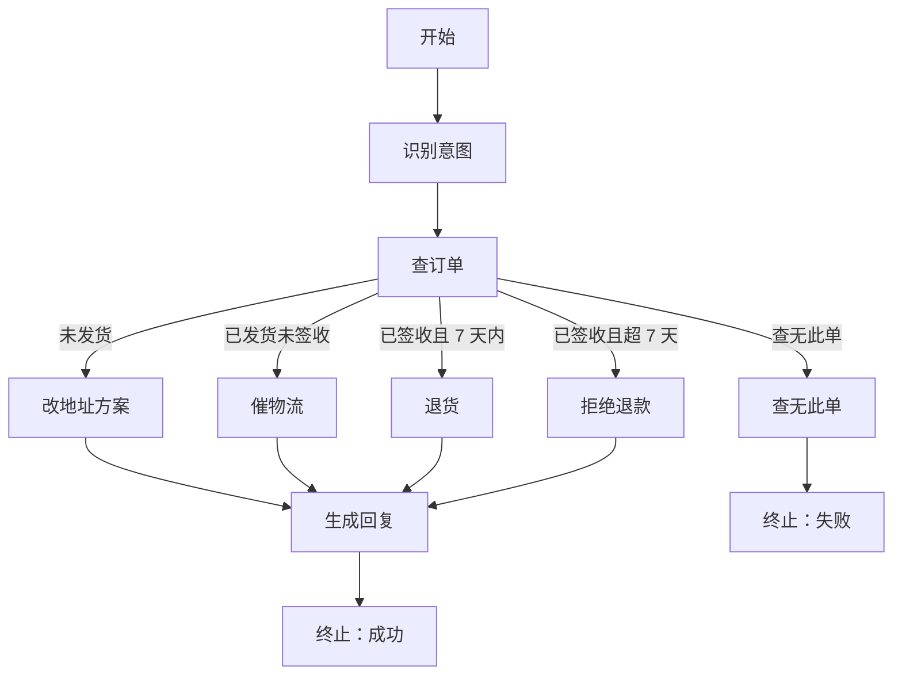

# **状态机**：节点、边、条件路由；Agent 步骤 = 状态转移

> 对应模块：[模块 11 · Agent State / Workflow ⭐⭐⭐⭐⭐](./README.md) · 小节进度第 1 条
> 本条由 Coach 按 2026-09-16 本对话 `coach start` 详解首次写入。同日增量：检查小节文档后补上「怎么画图」以及让图能诚实跑起来的几条规矩。学习者只减不加。进度表仍 ⬜，在进度表打钩只走 `coach complete`。

- **来源**：本对话 §6.2 详解（对照模块 07 Agent 循环 / ReAct、模块 05 工具选择；LangGraph 只当概念对照，未打开外部文档页）+ 2026-09-16 检查缺口后的补讲（画法 9 步 / 路由互斥且穷尽 / 非法转移 / 节点失败走边 / 并行字段合并 / 数据依赖决定串并）
- **状态**：已沉淀
- **Demo**：可运行（尚未写出）。关上文件后必须看见一次「走一步 → 当前节点变了 → 状态（State）全文变了」，才能讲清「能画一张自己任务的状态图」。只在笔记里放图，看不见转移。计划落点 `apps/11-Agent-State-Workflow/01-状态机-step-1/` · 入口 `yarn app:11-01-state-machine-step-1`（目录尚未建）。本小节手写节点、边、路由函数、走一步调度器；不要用 LangGraph / LangChain 代劳（框架是模块 13 的事）。

> 各节写什么、达标要求：见仓库根 [AGENTS.md §7.2](../../../AGENTS.md#72-写入小节文档--小节进度对齐)。

## 是什么

**有限状态机（Finite State Machine）** 是一套事先画好的规矩：系统在任意时刻只处在 **一个当前节点**，做完这一步之后，沿着 **边（Edge）** 走到下一个节点。走哪条边，由 **状态（State）** 里的字段决定——这就叫 **条件路由（Conditional Routing）**。每走一步：节点换了，State 里的字段也更新了。这一对变化合在一起，叫 **状态转移（State Transition）**。

接到 Agent 上的那句话：

> **Agent 的一步 = 一次状态转移。** 不是「又调了一次模型」那么含糊，而是：从节点 A 出发，跑完这个节点该做的事，写出新的 State，再按路由规则落到节点 B。

六个核心对象：

| 对象 | 人话 | 在代码里通常是 |
| -- | -- | -- |
| **状态（State）** | 这一趟任务目前知道的全部事实，用来决定「下一步去哪」和「这一步该用哪些数据」 | 一个 TypeScript 类型的对象，例如 `{ currentNode, orderId, orderStatus, retryCount, lastError, replyDraft }` |
| **节点（Node）** | 图上的一个站点，到了就干活 | 一个函数：读入 State，做事（查库 / 调模型 / 纯计算），返回新的 State |
| **边（Edge）** | 站点之间允许走的路 | 「从 A 可以去 B / C / D」这份名单 |
| **条件路由（Conditional Routing）** | 读 State 字段，从几条边里挑一条 | `if (state.orderStatus === "shipped") return "urgeShipping"` |
| **状态转移（State Transition）** | 跑完一个节点之后：当前节点变了 + State 字段变了 | `{ ...prev, currentNode: "urgeShipping", trackingNo: "SF123" }` |
| **图 / 工作流（Graph / Workflow）** | 上面这些节点和边画在一起的整张交通图 | 一份「有哪些节点、从谁能到谁、路由函数是谁」的配置，外加一个「走一步」的调度器 |
| **调度器（Scheduler / Runner）** | 真正执行「走一步」的那一层：跑当前节点 → 问路由 → **对边表验一次** → 写下新的 `currentNode` | 一个函数，例如 `step(state)`；终止节点没有出边就停 |

前端对照（[使用协议 §0.8](../../01-使用协议.md#08-前端--agent-对照表)）：Redux / Pinia / Zustand 的 **store** 就是 State；**action + reducer** 就是一次状态转移；路由守卫（没登录去登录页、是管理员去后台）就是条件路由。Agent 这边没有魔法，只是 store 里装的是「工单走到哪一站」，reducer 里可能真的去调模型和工具。

### 和模块 07 Agent 循环的差别

| | 模块 07 Agent 循环（Agent Loop） | 这一小节的工作流状态机 |
| -- | -- | -- |
| 图长什么样 | 基本就那几个阶段：想（Reason）→ 做（Act）→ 看（Observe），再转一圈 | 你按业务事先画出许多站点：查订单、催物流、改地址、拒绝退款…… |
| 下一步谁决定 | 模型这一圈返回了哪些 `tool_calls`，或返回了最终正文 | **路由函数读 State**，从你画好的边里挑；模型可以在某个节点内部被调用，但「去哪个节点」不是模型临时发明的 |
| 状态在哪 | 主要堆在 `messages` 里，外加 `round`、轨迹 | **一份显式的 State 对象**，`currentNode` 只是其中一个字段 |
| 你能向别人画出什么 | 能画出循环怎么转、何时停 | 能画出**这张业务自己的状态图** |

模块 07 的循环其实也是一台很瘦的状态机（节点少、边几乎写死成「再问模型」）。这一小节要学的是：任务一旦有分叉、回退、多个终点，就把图**画出来、写成类型、让路由函数可见**，不要继续把所有分叉藏进「模型爱调哪个工具」。

售后工单主图（贯穿本条）：



关上这张图以后，要能自己再画一遍，并且指着任意一条边说出：**走这条边是因为 State 里哪个字段等于什么。** 只会看懂这张现成图，不算「能画一张自己任务的状态图」——画法见下方「怎么从任务画出状态图」。

### 核心对象与变体

状态机不是一个单词，是下面这些图的形状和跑图的规矩。漏一种，就画不全或跑不真「自己任务的状态图」。检查点（Checkpoint）和等人点头（Human-in-the-loop）是本模块第 2、第 3 小节，不列入本条变体。

#### 变体 A · 线性串行（边没有条件）

永远 `开始 → A → B → C → 结束`。边是固定的，路由函数几乎是 `return 下一个名字`。线性仍然是状态机，差别只是边没有条件。

#### 变体 B · 条件路由（同一起点，多条边）

同一个节点连出多条边，路由读 State 字段决定走哪条。**图没变，State 变了，路径就变了。** 这是「能画状态图」的验收核心。

路由还要过两刀，否则图画着对、一跑就撒谎：

- **互斥**：两条边上的条件不能同时为真。`orderStatus === "delivered"` 和「已签收且超 7 天」如果写成两个独立 `if` 且顺序乱了，可能该拒绝却走进了退货。
- **穷尽**：每一种 State 都要有去处。漏了 `not_found`，路由返回 `undefined`，调度器不知道下一站。不允许「条件没写就当默认成功」。漏网必须画成显式的失败边或「未覆盖」边。

#### 变体 C · 循环回边（图上有环）

例如检索：命中了去生成；没命中且 `retryCount < 3` 则改写查询再回到检索；满 3 次走失败终止。环画在图上，次数写在 State 里，不要靠模型「再试试」却不记次数。这里的环是「再进同一个业务节点」，和模块 07「再问模型」不是同一张图。

#### 变体 D · 多个终止态

不是所有路都通向「成功」。至少要能画出成功、业务拒绝、查无此单等没有出边的终点。漏画终止态：图在「拒绝」之后还连去「生成回复」，会发出互相打架的两段话。

#### 变体 E · 显式 State 对象 vs 散落变量

所有节点的入参和出参都是同一个类型。路由函数只读这个对象。页面上能把这份对象全文摊开。散落的 `let orderId` / `let status` / `let retry` 对不上，当下就画不出 State 长什么样，后面也存不住。

State 里该装：当前节点、业务主键、路由要用的字段、重试次数、上一次错误、这一趟产出的草稿。不该装（本条先记住，下一节会卡住）：函数、数据库连接、正在跑的 Stream。

#### 变体 F · Agent 步骤 = 状态转移（必须能「走一步」）

一次转移的最小单位：

```text
旧 State（含 currentNode = lookup）
  → 跑 lookup 这个节点函数（查单，写入 orderStatus）
  → 路由函数读新字段，返回下一节点名 urgeShipping
  → 新 State（currentNode = urgeShipping，其它字段保留或更新）
```

点一次「走一步」，只发生上面这一跳。一个按钮从开始跑到结束，看见的是最终回复，看不见转移。静态 mermaid 只能当笔记；要确认「步骤 = 转移」，得看见走一步前后的两份 State。

调度器必须按这个顺序，不能让节点函数自己改 `currentNode` 跳过路由：

```text
若 currentNode 已是终止 → 停
state = 节点函数(state)          // 只改业务字段，不擅自改当前节点
next = 路由(currentNode, state)
若 next 不在当前节点的出边名单里 → 非法转移：写入 lastError，去失败终止
否则 state.currentNode = next
```

图画了 6 条边，运行时绝不允许出现第 7 条。这就是「有限」的可观察面。

#### 变体 G · 并行分叉再汇合

两个互不依赖的节点同时跑，都结束后进入汇合节点。调度器同时启动（类似 `Promise.all`），各自写回 State 的不同字段；两边都结束后才进入汇合节点。汇合前不要让算价先跑——那是边画错了。

并行节点**只声明自己改的字段**；调度器做字段合并（merge），互不覆盖。若每个节点都 return 整份 State，后写的那份会把先写完的字段盖成 `null`——图上画着并行，数据上变成「谁慢谁说了算」。两个节点写同一个字段，必须事先规定合并策略（例如错误优先），不允许靠执行快慢碰运气。

本条汇合默认 **全部到齐再往下**。「谁先到谁算」是另一种边，先能在图上标明，不必本条一次做完演示。

选型：B 要读 A 写出来的字段 → 只能画成 A→B，禁止画成并行。两站读写集合不相交 → 才可以画分叉。

这和模块 05/07「同一圈多个工具调用」不是一件事：后者是模型这一圈返回了 N 个 `tool_calls`；前者是你画图时就画了两条同时出发的边，并指定汇合点。

#### 变体 H · 节点失败是一条边，不是把图摔死

对照模块 07：工具失败要变成观察（Observe）塞回 `messages`，循环继续。这里同构：节点失败要**写成 State 字段 + 一条失败边**，而不是 `throw` 把调度器打成一次 HTTP 500。

`lastError` 不是摆设。查订单时订单服务 500 → 节点返回 `{ ...state, lastError: "order_service_down" }`，不抛异常 → 路由看到 `lastError` → 去 `failEnd`（或「稍后再试」节点）。客服问「卡在哪」时，当前节点和 State 全文都还在。

这和变体 C 的差别：C 是业务上「空结果再试」；这里是「这一站执行失败了，图还在」。

### 入口节点与初始 State

图画完先问两句：第一站是谁？开场那份对象哪些字段已经有值、哪些是 `null`？没有入口、没有初始 State，「走一步」无从点起。售后例子里入口是 `identify`，开场只有 `ticketId` 和用户原话，`orderStatus` 等着查订单节点去写。

干活节点用方块，纯决策（几乎不干活、只返回下一站名）可以用菱形。这不是新的图形状，是画法约定。

## 怎么从任务画出状态图

「本条要能讲清」是能画，不是只能看懂别人画好的图。按这个顺序走：

1. 用一句话写任务（例如：用户要退货，按订单状态处理）。
2. 列出站点，站点名用**动词**（查订单、催物流），不要用「处理一下」这种大口袋。
3. 对每个站点写清：**读 State 的哪些字段、写回哪些字段**。读不到的字段，这个站就不该存在。
4. 两站有数据依赖（B 必须用 A 写出来的字段）→ 画成先后，**禁止**画成并行。
5. 分叉画在边上，边上写条件；然后检查：条件是否互相排斥、是否把所有情况盖住。
6. 标出所有终止（成功 / 拒绝 / 查无此单……），终止没有出边。
7. 有环必须同时画退出（次数、成功命中）。不要把「等人点头」当成本条的退出条件，那是第 3 小节。
8. 标入口节点，并写出**初始 State**：哪些字段开场就有，哪些是 `null`。
9. 用一张表验收图：`从哪一站 | 到哪一站 | 条件读哪个字段`。表对不上 mermaid，就是图画假了。

生活：不是先画迷宫再玩，而是先列房间、再画门、再写「什么钥匙开哪扇门」。  
前端：不是先画一堆页面，而是先写路由表：`path + 守卫 → 下一个页面`。

用售后主图套一遍第 9 步的表（节选）：

| 从哪一站 | 到哪一站 | 条件读哪个字段 |
| -- | -- | -- |
| identify | lookup | 无条件（识别完就查） |
| lookup | changeAddr | `orderStatus === "unshipped"` |
| lookup | urgeShipping | `orderStatus === "shipped"` |
| lookup | refund | `orderStatus === "delivered"` 且未超 7 天 |
| lookup | reject | `orderStatus === "delivered"` 且超 7 天 |
| lookup | notFound / failEnd | `orderStatus === "not_found"` 或 `lastError` 有值 |
| draft | okEnd | 无条件 |

「已签收且超 7 天」和「已签收且 7 天内」必须互斥；`not_found` 必须有行，否则不穷尽。

## 为什么（Agent 开发要懂）

模块 07 能做出「会转圈的 Agent」。模块 11 要处理的是另一类任务：**步骤是业务规定的，不是模型即兴的。**

具体后果（按变体看会踩什么）：

1. **变体 B 分叉一旦变多，循环会变成一锅粥。** 售后同时有「改地址 / 催物流 / 退货 / 拒绝」，如果全靠模型自己挑工具，轨迹上只能看到「它又调了一次什么」。状态机把分叉写成边，出了错能说：卡在「查订单」这一站，`orderStatus` 是 `delivered`，所以走了「拒绝」。
2. **变体 E / F：调试、产品、运营要的是站点，不是思想过程。** 客服主管问「这张工单现在在哪」，答案必须是「催物流」，不能是「messages 里第 14 条是 tool_result」。走一步必须能看见 State 全文。
3. **变体 A 也要懂：后面两小节站在这张图上。** 杀进程再起来（下一节），要存的是这份 State，不是散落的局部变量。危险操作等人点头（再下一节），暂停的是某个节点。图没画清楚（哪怕只是一条直线），后面两节没有落脚点。
4. **变体 C 不记次数会空转。** 检索失败若只靠模型「再试试」，没有 `retryCount` 和回边退出，会变成模块 07 已经见过的死循环，只是这次发生在业务节点上。
5. **变体 D 漏画终止态会说错话。** 政策拒绝之后若还连去「同意退货」的生成节点，用户会收到两段互相打架的回复。
6. **变体 G 画成假并行会算错价。** 库存和优惠券还没都回来就进算价节点，金额是猜的。
7. **「有限」是特性不是缺陷。** 节点名单你列完了，Agent **不能**走到图上不存在的站。退款工单不允许突然跑去「给用户改密码」。模型仍然可以在「生成回复」节点里写文案，但去哪个节点由路由决定。

8. **路由不互斥或不穷尽，图会走错站或掉进洞。** 两个 `if` 都能命中时顺序说了算；漏了 `not_found` 时 `next` 是 `undefined`。
9. **节点 `throw` 等于把图摔死。** 没有当前节点、没有 State 全文，变体 H 消失。
10. **并行 return 整份 State，后写的覆盖先写的。** 优惠券被盖成 `null`，算价是猜的。
11. **有数据依赖却画成并行。** 改地址读取时 `orderId` 还是 `null`。
12. **只会看现成 mermaid、没有画法步骤。** 关上文件交不出自己任务的图。

判错会怎样：以为自己在做工作流，代码里其实还是一个大 `while` + 模型随便挑工具——分叉不可见、站点不可问、后面也存不住。或者图画得好看，运行时走了边表里没有的站、条件漏网、并行互相覆盖。

## 易混点

### 1. 「当前节点」≠「状态」（变体 E）

`currentNode: "urgeShipping"` 只是 State 里的一个字段。真正的状态还包括 `orderId`、`orderStatus`、`retryCount`、`lastError`。只存当前节点名字，路由函数读不到「已发货还是未发货」，边就画不出来。

前端：React Router 的 `location.pathname` 不是全部应用状态；购物车、登录用户也在。

### 2. Agent 循环 ≠ 工作流状态机

循环回答「圈怎么转、何时停」。状态机回答「业务允许经过哪些站、站与站怎么连」。循环可以嵌在某个节点里面（「生成回复」节点内部仍可以想→做→看）。**不要**把整张售后图塞回一个 while，假装那叫工作流。

判错：把模块 07 的轨迹图交作业，说「这就是我的状态图」——那只画了通用循环，没画你的任务。

### 3. 条件路由 ≠ 工具选择（Tool Choice）（变体 B）

工具选择是：**这一圈**调哪个函数。条件路由是：**这一步做完**去图上的哪个节点。可以同时存在：节点「查订单」内部用工具 `get_order`；查完之后路由看 `orderStatus` 决定去「催物流」还是「改地址」。

判错：以为给模型 `tool_choice: required` 就是条件路由。那只是逼它本轮必须调工具，图还是没画。

### 4. 边的条件 vs 把 if/else 塞进一个巨型节点（变体 A / B / D）

两种都能跑。差别是能不能画、能不能讲。把「查订单 + 四种处理 + 生成回复」写成一个 200 行函数，图上只剩一个方块——交不出「自己任务的状态图」。

正确切法：干活的节点尽量只做一件事；**分叉写成边**。决策也可以是一个几乎不干活的节点，只负责返回下一个节点名。线性三站也要拆开，不要三件事揉成一个节点，否则「走一步」看不见转移（变体 F）。

### 5. 图上的并行分叉 ≠ 同一圈多个工具调用（变体 G）

| | 同一圈多个 `tool_calls` | 图上的并行分叉 |
| -- | -- | -- |
| 谁拆出来的 | 模型这一圈返回了 N 个工具 | 你画图时就画了两条同时出发的边 |
| 汇合点 | 这一圈 Act 全部结束，回到想（Reason） | 你指定的汇合节点，例如「两边都回来才算价」 |
| 可见性 | 看这一圈的 `tool_calls` 数组 | 看图：库存查询 ∥ 优惠券查询 → 算价 |

可以同时用：某个节点内部 `Promise.all`；也可以在图上把两个节点画成并行。本条要能**在图上画出来**第二种。

### 6. 状态机 ≠ 下一节的检查点（Checkpoint）

State 是「现在这份对象」。检查点是「把这份对象存盘，进程死了还能读回来」。本条只要求：State 是一份能看清、能更新的对象。**不要把「写入磁盘 / 杀进程」塞进这一小节的验收。**

变体 C 的 `retryCount` 在本条是图上的计数；把它持久化是下一节的事。

### 7. 「有限」不是「模型不能说话」

有限限制的是**站点名单**，不是节点内部能不能调模型。生成回复节点当然可以调模型写中文；它写完之后，只能沿着你画的边走，不能自己发明「去给财务打款」这个站点。

### 8. 回边 ≠ 再开一轮 Agent 循环（变体 C）

图上回到「检索」节点，是业务站点再进一次。模块 07 再转一圈，是再问一次模型。两者都可能带次数上限，但画出来的图和 State 字段不同：一个是 `currentNode` 回到 `retrieve`，一个是 `round + 1` 再走想（Reason）。

### 9. 条件写了几条 ≠ 互斥且穷尽（变体 B）

边上写了「已发货 / 未发货」不等于把情况列完。漏掉的那种 State 必须有去处；两种条件同时为真时必须事先规定谁优先，不能靠 `if` 书写顺序碰运气。

判错：只测了已发货的 happy path，查无此单时路由返回空，调度器崩溃或默认去生成回复。

### 10. 非法转移 ≠ 条件路由走了另一条合法边（变体 F）

条件路由是边表里**已经画过**的几条里挑一条。非法转移是下一站**根本不在**当前节点的出边名单里（节点自己改 `currentNode`，或路由 return 了边表没有的名字）。前者是变体 B；后者是调度器必须拦住的破坏「有限」的行为。

生活：地铁不能从一号线车厢直接走进机场安检。  
前端：用户不能靠改 URL 从「填邮箱」跳到「已完成」还当注册成功。

### 11. 节点失败走边 ≠ 业务回边再试（变体 H vs C）

空结果再检索是变体 C（业务环）。订单服务 500 是变体 H（这一站执行失败）。不要用「再试三次检索」去吞掉「服务挂了」。也不要 `throw` 出图——对照模块 07：失败应该变成观察，而不是把循环摔死。

### 12. 图上串行 ≠ 模块 07 看起来串行（变体 A / G）

这里串行是因为 **B 要读 A 写出来的字段**，所以你画了 A→B。模块 07 里「看起来串行」常常是模型这一圈只调一个工具。两件事都叫串行，原因不同。画图时只问数据依赖，不问「这两件事好像都能同时做」。

### 13. State 里的业务字段 ≠ 节点内部的 `messages`

模块 07 的事实主要在 `messages` 里。工作流里：路由和业务事实进 State（`orderStatus`、`retryCount`）；某一站内部调模型用的对话，默认是这一站的局部材料。只有**后面的路由要用**（例如识别出来的 `intent`）才提升进 State。否则 State 又变成第二份聊天记录，图重新不可读。

## 例子

贯穿业务：**电商售后工单助手**。用户说「我的订单 ORD-8831 想退货」。助手必须按站点走，不能模型爱怎么答怎么答。

显式 State 草案（教学用，不是一次把整份应用写完）：

```ts
type TicketState = {
  currentNode:
    | "identify"
    | "lookup"
    | "changeAddr"
    | "urgeShipping"
    | "refund"
    | "reject"
    | "retrievePolicy"
    | "draft"
    | "checkStock"
    | "checkCoupon"
    | "price"
    | "okEnd"
    | "failEnd";
  ticketId: string;
  orderId: string | null;
  intent: "after_sale" | "unknown" | null;
  orderStatus: "unshipped" | "shipped" | "delivered" | "not_found" | null;
  deliveredAt: string | null;
  retryCount: number;
  lastError: string | null;
  replyDraft: string | null;
  stockOk: boolean | null;
  couponOff: number | null;
  endReason: "success" | "policy_reject" | "not_found" | "max_retry" | null;
};
```

### 例子 1 · 条件路由主路径（变体 B + D + E + F）

1. 开始：`currentNode = "identify"`，只有用户原话和 `ticketId`。
2. 识别意图节点写出 `intent: "after_sale"`，`orderId: "ORD-8831"`。路由：无条件去 `lookup`（这一跳像变体 A）。
3. 查订单节点写出 `orderStatus: "delivered"`，`deliveredAt: "2026-09-01"`（今天是 09-16，已超 7 天）。
4. 路由：超 7 天 → `reject`，不是 `refund`。
5. 拒绝节点写出 `replyDraft` 和 `endReason: "policy_reject"`。
6. 进入 `failEnd`。整张图停（变体 D：这是拒绝终止，不是成功终止）。

把第 3 步的 `deliveredAt` 改成昨天，同一张图会走 `refund`。**图没变，State 变了，路径就变了。**

- **生活**：体检分流：血压高去内科，正常去出口。同一栋楼，入口测完才发号。
- **前端**：结算页库存够去支付、不够去缺货页；登录后 `role === "admin"` 去 `/admin`，否则去 `/home`。

### 例子 2 · 线性三站 FAQ（变体 A + F）

内部知识库问答：改写问题 → 检索 → 生成答案。失败也不重试时就是一条直线。

- **数据怎么走**：State 带着问句进入「改写」，写出 `rewrittenQuery`；进入「检索」，写出 `hits`；进入「生成」，写出 `replyDraft`；到达成功终止。沿途 `currentNode` 一站换一站，没有分叉。点三次「走一步」才能走完，一次点完等于没看见转移。
- **生活**：地铁：进站闸机 → 上车 → 到站出闸。
- **前端**：注册向导：填邮箱 → 设密码 → 完成。进度条 1/3、2/3、3/3。

### 例子 3 · 政策检索回边（变体 C）

退货节点需要政策条文，先进入 `retrievePolicy`；空结果则 `retryCount + 1` 回到检索；满 3 次 `endReason: "max_retry"` 去 `failEnd`。

- **生活**：投篮：不进就再投，进了或满 3 次就停。
- **前端**：表单校验失败回到表单（带着错误文案），成功才提交；最多提示 3 次后禁用按钮。

### 例子 4 · 显式 State vs 散落变量（变体 E）

- **对的**：所有节点吃同一个 `TicketState`，页面把 JSON 全文摊开，能对照 TypeScript 类型。
- **错的**：`let orderId` 在文件顶，`let status` 在查订单函数里，`let retry` 在另一个闭包里。换人值班（下一节杀进程）之前，当下就已经对不齐。
- **生活**：医院用病历夹：过敏史、上次血压、正在用的药都在夹子里。护士只记在脑子里，换班就丢。
- **前端**：一个 Redux store，对比五个对不上的 `useState`。

### 例子 5 · 走一步才算一步（变体 F）

客服培训要看「这一站做了什么」。调度器提供「走一步」，每点一次只变一站，能看到转移前后的 State diff。

- **生活**：象棋走一步：棋盘（State）变了，该谁走（当前节点）也变了。不能说「我把整盘下完了，所以我会下棋」。
- **前端**：点一次 dispatch，开发者工具里多一条 action，store 前后 diff 可见。

### 例子 6 · 并行分叉再汇合（变体 G）

同意退货之后若改发优惠券换购：从「准备结算」画出 `checkStock` 和 `checkCoupon` 两条边，两边都写回 State（`stockOk`、`couponOff`）之后才进入 `price`。一侧失败则走向失败终止，不要用假数据凑。

- **生活**：做饭：烧水同时切菜，水开了且菜切了才下锅。
- **前端**：结算页同时请求「用户地址」和「购物车」，都回来才渲染。

售后主图和结算小图都算「自己任务的状态图」；验收时能任选一张画全即可，但两种形状都要认识。画之前先走「怎么从任务画出状态图」那 9 步，不要直接抄 mermaid。

### 例子 7 · 查无此单必须有边（变体 B 穷尽）

查订单写出 `orderStatus: "not_found"`。若路由表只有未发货 / 已发货 / 已签收，`next` 为空——图画着 4 条边，运行时掉进洞。正确：显式去 `notFound` 再进 `failEnd`，`endReason: "not_found"`。

把「超 7 天」和「已签收」写成两个都能命中的 `if` 且顺序反了，会该拒绝却走退货。这是互斥没写清。

### 例子 8 · 非法转移被拦住（变体 F）

查订单节点函数里直接 `return { ...state, currentNode: "price" }`，想跳过路由去算价。调度器对边表：`lookup` 的出边没有 `price` → 写入 `lastError: "illegal_transition"`，去 `failEnd`。**不要**把这份 return 当真下一站。

- **生活**：地铁不能从一号线车厢直接走进机场安检，即使你腿跑得快。
- **前端**：改 URL 从注册第 1 步跳到「已完成」，守卫拦下，不写库。

### 例子 9 · 订单服务失败走边，不把图摔死（变体 H）

查订单时下游 500。节点返回 `{ ...state, lastError: "order_service_down" }`，不 `throw`。路由看到 `lastError` → `failEnd`。页面仍能展示 `currentNode` 曾是 `lookup`、以及完整 State。对照：若 `throw`，一次请求 500，客服问「卡在哪」答不上。

- **生活**：快递柜密码错了，屏幕提示错误并停在「输入密码」，不会把整栋驿站断电。
- **前端**：拉订单失败展示错误状态，而不是整个页面白屏。

### 例子 10 · 并行只合并自己改的字段（变体 G）

`checkStock` 只写出 `{ stockOk: true }`，`checkCoupon` 只写出 `{ couponOff: 20 }`。调度器合并后 State 里两字段都在，再进 `price`。

反例：两站都 return 整份旧对象，`checkStock` 里 `couponOff: null`，后结束的那份把优惠券盖掉。算价读到 0。

反例：把「改地址」和「查订单」画成并行——改地址要读 `orderId`，此时还是 `null`。必须先查订单再改地址。

## 需求清单

验收准绳，不是一次做完演示的施工单。`coach complete` 时才按条对代码。Step 1 只做其中最浅的一跳（变体 A + E + F）。

1. **线性三站客服**（变体 A）
   - 业务场景：内部 FAQ，固定「改写问题 → 检索 → 生成」。
   - 目标：页面上能画出三个节点、两条固定边，走完到达成功终止。
   - 涉及知识点：节点、边、线性、状态转移。
   - 验收标准：点「走一步」三次，`currentNode` 依次经过三站；State 全文可见。

2. **按订单状态分流**（变体 B）
   - 业务场景：售后查单后，未发货 / 已发货 / 超 7 天 走出三条不同的路。
   - 目标：同一张图、不同 State，路径不同。
   - 涉及知识点：条件路由。
   - 验收标准：至少两组对照（例如已发货 vs 超 7 天），各自请求，页面能标出走了哪条边。条件互相排斥；再补一组「查无此单 / 未覆盖的状态」，必须走进事先画的失败边，不能 `next` 为空或默认去成功生成。

3. **检索空结果回边**（变体 C）
   - 业务场景：政策检索最多 3 次。
   - 目标：图上能看见回到同一节点的边；次数写在 State。
   - 涉及知识点：循环回边、State 里的计数。
   - 验收标准：能演示「第 1、2 次回来，第 3 次去失败终止」；`retryCount` 逐步 +1。

4. **多个终点**（变体 D）
   - 业务场景：成功回复 / 政策拒绝 / 查无此单。
   - 目标：图上至少两个没有出边的终止节点。
   - 涉及知识点：多终止态。
   - 验收标准：跑到拒绝时不再进入「同意退货」的生成节点；`endReason` 可见。

5. **State 是一份对象**（变体 E）
   - 业务场景：把工单字段集中在一个类型里，页面展示全文。
   - 目标：没有用散落变量支撑路由。
   - 涉及知识点：显式 State。
   - 验收标准：能对照 TypeScript 类型，在页面上看到同结构的 JSON；改 `orderStatus` 再走一步，路由结果变。

6. **走一步才算一步**（变体 F）
   - 业务场景：客服培训要看「这一站做了什么」。
   - 目标：调度器提供「走一步」，不是一键跑完全图。
   - 涉及知识点：状态转移 = Agent 步骤。
   - 验收标准：每点一次，只变一站；能看到转移前后的 State diff。节点函数不得自己改 `currentNode` 跳过路由；下一站不在出边名单里时按非法转移拦住，写入 `lastError` 去失败终止。

7. **并行分叉再汇合**（变体 G）
   - 业务场景：换购结算同时查库存和优惠券。
   - 目标：图上能画两条并行边和一个汇合节点。
   - 涉及知识点：并行分叉。
   - 验收标准：能观察到两站都完成后才进入算价；一侧失败则走向失败终止。并行节点只合并自己改的字段（不能整份 State 互相覆盖）。有数据依赖的两站不得画成并行。

8. **节点失败走失败边**（变体 H）
   - 业务场景：查订单时订单服务 500。
   - 目标：失败写成 State 字段并沿失败边走，调度器还在，当前节点和 State 全文仍能看见。
   - 涉及知识点：错误态是一条转移，不是把图摔死。
   - 验收标准：节点不 `throw` 成一次 HTTP 500；`lastError` 可见；路由走进 `failEnd`（或事先画的失败站）；对照模块 07「失败要变成观察」。

## 取舍

- **手写节点 / 边 / 路由，还是直接上 LangGraph：** 本条手写。框架把图藏进自己的 API，这一小节要先能自己画出并跑通「走一步」。模块 13 再对照框架省了什么、藏了什么。LangGraph 文档只当概念对照，本条演示不要引入该库。
- **一个大节点里写完所有 if，还是分叉画成边：** 选后者。前者能跑，但交不出「自己任务的状态图」，后面也无法按节点做检查点或暂停。
- **一键跑完全图，还是提供「走一步」：** 教学上必须有走一步。产品上可以另给「跑完」按钮，但不能用它代替转移可见。
- **本对话节奏：** 学习者要求先把笔记写进小节文档，演示等明确说写再写进 `apps/`。

## 踩坑

- **只存当前节点名字，不存路由要用的字段。** 结果边画了，运行时却只能走默认下一家。
- **把模块 07 的循环轨迹图当成业务状态图交出去。** 那张图证明你会转圈，不证明你会画售后工单。
- **用 `tool_choice` 冒充条件路由。** 图仍然不存在。
- **一个按钮跑完全程。** 看见最终回复，看不见「步骤 = 转移」。
- **巨型节点吞掉分叉。** 图上只剩一个方块，变体 B / D 全部消失。
- **回边不写次数。** 检索空结果会空转。
- **并行不等汇合。** 算价读到 `null` 当 0。
- **并行节点 return 整份 State。** 后写的把先写的字段盖成 `null`。
- **有数据依赖却画成并行。** 下游站读到还是 `null` 的主键。
- **路由不穷尽 / 不互斥。** `next` 为空，或两个 `if` 都能命中时走错站。
- **节点自己改 `currentNode`，调度器不验边。** 图变成装饰，出现非法转移。
- **节点 `throw` 出图。** 变体 H 消失，客服问「卡在哪」答不上。
- **把 `messages` 整段塞进 State。** 图又变成第二份聊天记录。
- **只会抄现成 mermaid，不走 9 步画法。** 关上文件交不出自己任务的图。
- **State 里塞函数 / 连接 / Stream。** 本条先别塞；下一节一序列化就会炸。这里提前记一笔，不当成本条演示范围。

## 契约记录

- 学习者原话「先沉淀文档」：本轮只写小节文档，不把可运行演示写进 `apps/`。Step 1 第一件事仍是：线性三节点 + 显式 State + 「走一步」按钮。
- 学习者选「1」：把检查出来的缺口补进本文件，仍不写演示。
- 本条变体不含检查点、不含等人点头，避免和下两节抢进度。画法 9 步、路由互斥穷尽、非法转移、节点失败走边、并行字段合并属于本条知识，不是下一节。

## Demo 子节进度

可运行。step 尚未创建，表暂无行（禁止预判未来步骤）。写出 step-1 时再追加第一行（🔄）。

| 状态 | 子节 | 入口 | 端口 | 本子节教学点 |
|------|------|------|------|--------------|
| （尚无行） | — | — | — | — |

## §5.4 目标 ↔ 代码整合打钩前检查

跑打钩前检查日期：2026-09-16（首次写入预列；同日增量补画法与跑图规矩后重列；代码尚未写出）

### §5.4.A 目标 → 代码覆盖

「本条要能讲清」：能画一张自己任务的状态图

| 目标点 | 状态 | 证据 |
|---|---|---|
| 页面能展示一张含节点和边的状态图，并标出当前节点 | 未实现 | 无 `apps/11-Agent-State-Workflow/01-状态机-step-*` |
| 能展示边表：从哪一站 / 到哪一站 / 条件读哪个字段（对应画法第 9 步） | 未实现 | — |
| 点「走一步」只发生一次状态转移，currentNode 与 State 字段一起更新 | 未实现 | 无调度器、无按钮 |
| 能看见显式 State 对象全文（与 TypeScript 类型同结构） | 未实现 | 无页面输出 |
| 同一张图、不同 State 字段，条件路由走出不同下一节点（至少两组对照、各自请求） | 未实现 | 无对照 |
| 未覆盖的状态（如查无此单）走进事先画的失败边，不能 `next` 为空 | 未实现 | — |
| 图上能看到回到同一节点的回边，retryCount 逐步增加并在上限进入终止 | 未实现 | — |
| 至少两个终止态，拒绝路径不再进入同意类节点 | 未实现 | — |
| 图上能画并行分叉与汇合，汇合前不算价；只合并各自改的字段 | 未实现 | — |
| 节点不得自己改 currentNode；出边名单外的下一站按非法转移拦住 | 未实现 | — |
| 节点失败写入 lastError 走失败边，不 throw 成一次 HTTP 500 | 未实现 | — |

**A 段小结**：不过。未实现 11 条。建议：Step 1 只补前 4 条里最浅的（图 + 边表 + 走一步 + State 全文）；其余等双方决定后续 step。

### §5.4.B 文档 → 代码对齐

| MD 讲点 | 代码里有没有 | 状态 |
|---|---|---|
| 例子 2 · 线性三站 FAQ + 走一步三次 | 无 | 未实现 |
| 例子 1 · 同一张图不同 `deliveredAt` 走出 reject / refund | 无 | 未实现 |
| 例子 3 · 政策检索回边，满 3 次失败终止 | 无 | 未实现 |
| 例子 1 第 6 步 · `endReason: "policy_reject"` 进入 failEnd，不再去同意退货 | 无 | 未实现 |
| 例子 4 · 页面摊开与 `TicketState` 同结构的 JSON | 无 | 未实现 |
| 例子 5 · 每点一次只变一站，可见 State diff | 无 | 未实现 |
| 例子 6 · checkStock ∥ checkCoupon 都完成后才 price | 无 | 未实现 |
| 例子 7 · 查无此单有失败边，不能 next 为空 | 无 | 未实现 |
| 例子 8 · 节点 return 了边表没有的 currentNode，调度器拦住 | 无 | 未实现 |
| 例子 9 · 订单服务失败写 lastError 走 failEnd，不 throw | 无 | 未实现 |
| 例子 10 · 并行只合并自己改的字段；有数据依赖不得画成并行 | 无 | 未实现 |
| 怎么从任务画出状态图 · 第 9 步边表 | 无 | 未实现 |
| 易混点 5 · 图上并行 ≠ 同一圈多个 tool_calls（页面能看见图上的分叉，而不是只展示 tool_calls 数组） | 无 | 未实现 |
| 易混点 9 · 条件互斥且穷尽 | 无 | 未实现 |
| 易混点 10 · 非法转移被拦住 | 无 | 未实现 |
| 易混点 11 · 失败走边 ≠ 业务回边 | 无 | 未实现 |
| 踩坑 · 一个按钮跑完全程会看不见转移（必须提供走一步） | 无 | 未实现 |

**B 段小结**：不过。代码尚未写出。写出 step-1 后只要求与 Step 1 对应的讲点改为已实现；其余保持未实现，直到后续 step 或拆成两条进度。

## 过关自检

- 拿一张空白纸，按「怎么从任务画出状态图」9 步画出你自己那个任务的节点和边；交出边表（从哪 | 到哪 | 条件读哪个字段）；任意一条带条件的边，能说出 State 的哪个字段在做决定。
- 能把「当前节点」和「State 整份对象」分开讲；能说出入口节点和初始 State 有哪些字段。
- 能讲清：模块 07 的循环为什么不够当这张业务图，以及模型调用可以出现在节点内部；`messages` 默认不进 State，除非后面的路由要用。
- 能举出线性、分支、回边、多终点、并行汇合各一个例子（生活或前端都行）。
- 能说明为什么「一个按钮跑完全程」看不到「步骤 = 转移」。
- 能讲清路由要互斥且穷尽；非法转移和条件路由不是一回事；节点失败走边，不把图摔死；并行只合并自己改的字段；有数据依赖必须画成先后。

## 我追问过的

本对话没有需要沉入的认知追问。学习者原话「先沉淀文档」「1」是操作意图，见「取舍 / 契约记录」。缺口补讲已并入教材正文，不编成追问。

## 变体对照表

| 变体 | 通俗例子 | 需求清单 | 可观察 | Step 对齐 |
| -- | -- | -- | -- | -- |
| A 线性串行 | 注册向导 | 需求 1 | 是 | Step 1 先做（一次走一步的直线） |
| B 条件路由（含互斥、穷尽） | 结算库存分流；查无此单必须有边 | 需求 2 | 是 | 后续 step，双方再定 |
| C 循环回边 | 表单校验重试 | 需求 3 | 是 | 后续 step |
| D 多终止态 | 支付成功/失败 | 需求 4 | 是 | 后续 step |
| E 显式 State | Redux store | 需求 5 | 是 | Step 1 就要能看见完整 State |
| F 走一步 = 转移（含验边、非法转移） | 象棋一步；改 URL 被守卫拦住 | 需求 6 | 是 | Step 1 就要「走一步」按钮；验边可留后续 |
| G 并行汇合（含字段合并、数据依赖） | 烧水同时切菜 | 需求 7 | 是 | 后续 step |
| H 节点失败走失败边 | 快递柜密码错仍停在输入屏 | 需求 8 | 是 | 后续 step |
| 画法 9 步（含入口 / 初始 State / 边表） | 先列房间再画门 | 过关自检 + 边表目标点 | 边表可观察 | Step 1 建议带上边表 |
| 暂停等人点头 | — | 不进本条 | — | 第 3 小节 |
| 存盘 / 杀进程恢复 | — | 不进本条 | — | 第 2 小节 |
