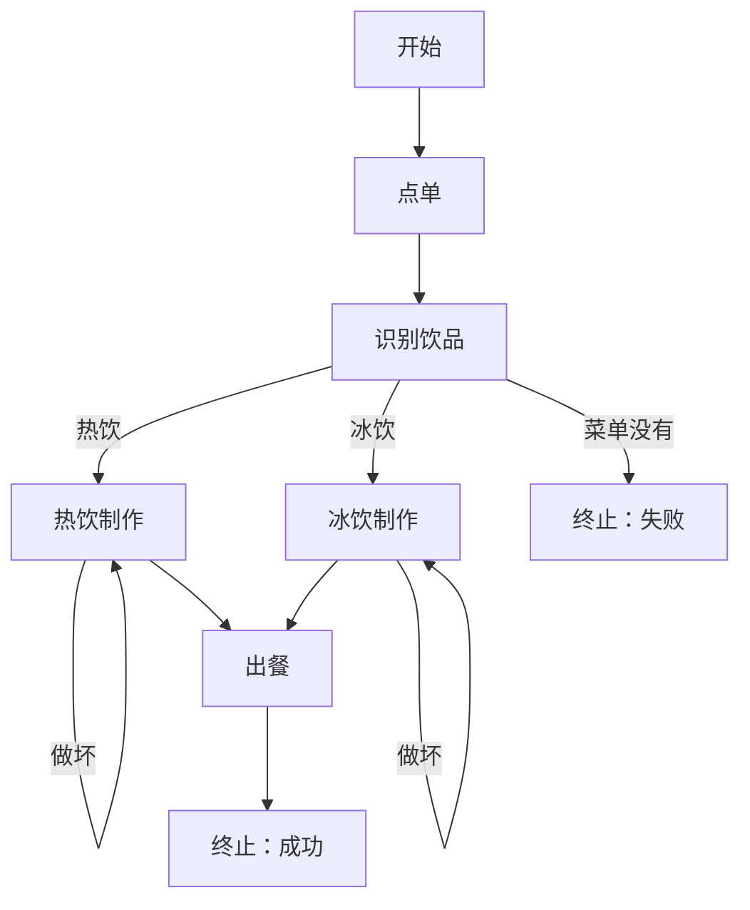

# **状态机**：节点、边、条件路由；Agent 步骤 = 状态转移

> 对应模块：[模块 11 · Agent State / Workflow ⭐⭐⭐⭐⭐](./README.md) · 小节进度第 1 条
> 本条由 Coach 按 2026-09-16 本对话 `coach start` 详解首次写入。同日增量：检查小节文档后补上「怎么画图」以及让图能诚实跑起来的几条规矩。学习者只减不加。进度表仍 ⬜，在进度表打钩只走 `coach complete`。
>
> **2026-09-18 增量**：补「多能力 Agent：多个子状态机怎么编排」（三种主流模式 + 子能力依赖管理 + 子图间状态共享 + 决策口诀）；补易混点 16/17/18；补例子 11/12；补踩坑四条。进度表仍 ✅（本次新增为概念增量，留待后续 step 演示）。

- **来源**：本对话 §6.2 详解（对照模块 07 Agent 循环 / ReAct、模块 05 工具选择；LangGraph 只当概念对照，未打开外部文档页）+ 2026-09-16 检查缺口后的补讲（画法 9 步 / 路由互斥且穷尽 / 非法转移 / 节点失败走边 / 并行字段合并 / 数据依赖决定串并）+ **2026-09-18 增量：多子图编排（三种主流模式 / 子能力依赖 / 子图间状态共享 / 决策口诀）**
- **状态**：已沉淀
- **Demo**：已写出 `apps/11-Agent-State-Workflow/01-状态机-step-1/`（端口 `50117`，七页一口：线性 FAQ / 七个对象 / 条件路由 / 循环回边 / 非法转移 / 节点失败 / 并行汇合）。原 step-2～step-4 文件夹已删，端口 `50118` / `50119` / `50120` 口不回收。本小节手写节点、边、路由函数、走一步调度器；不要用 LangGraph / LangChain 代劳（框架是模块 13 的事）。

> 各节写什么、达标要求：见仓库根 [AGENTS.md §7.2](../../../AGENTS.md#72-写入小节文档--小节进度对齐)。

## 是什么

**有限状态机（Finite State Machine）** 是一套事先画好的规矩：系统在任意时刻只处在 **一个当前节点**，做完这一步之后，沿着 **边（Edge）** 走到下一个节点。走哪条边，由 **状态（State）** 里的字段决定——这就叫 **条件路由（Conditional Routing）**。每走一步：节点换了，State 里的字段也更新了。这一对变化合在一起，叫 **状态转移（State Transition）**。

接到 Agent 上的那句话：

> **Agent 的一步 = 一次状态转移。** 不是「又调了一次模型」那么含糊，而是：从节点 A 出发，跑完这个节点该做的事，写出新的 State，再按路由规则落到节点 B。

六个核心对象：

| 对象 | 人话 | 在代码里通常是 |
| -- | -- | -- |
| **状态（State）** | 这一趟任务目前知道的全部事实，用来决定「下一步去哪」和「这一步该用哪些数据」 | **全图共享的一份对象**，所有节点共用；节点函数**不另存一份**，只读自己关心的字段、写回自己产出的字段（返回 `Partial<State>`，由调度器合并）。详见下文「State 全图一份 vs 节点不另存」 |
| **节点（Node）** | 图上的一个站点，到了就干活 | 一个函数：`NodeFn = (state: S) => Partial<S>`，**只声明自己改的字段**；函数体里可以有临时变量（函数返回就丢，不进 State）。不允许直接改 `state.x = ...`（破坏不可变更新，下一节 Checkpoint 存到脏数据）。详见下文「节点只声明改什么」 |
| **边（Edge）** | 站点之间允许走的路 | 「从 A 可以去 B / C / D」这份名单 |
| **条件路由（Conditional Routing）** | 读 State 字段，从几条边里挑一条 | `if (state.drinkType === "hot") return "brewHot"` |
| **状态转移（State Transition）** | 跑完一个节点之后：当前节点变了 + State 字段变了 | `{ ...prev, currentNode: "brewHot", brewOk: true }` |
| **图 / 工作流（Graph / Workflow）** | 上面这些节点和边画在一起的整张交通图 | 一份「有哪些节点、从谁能到谁、路由函数是谁」的配置，外加一个「走一步」的调度器 |
| **调度器（Scheduler / Runner）** | 真正执行「走一步」的那一层：跑当前节点 → 问路由 → **对边表验一次** → 写下新的 `currentNode` | **四样合一**：① 节点函数表 `Record<NodeName, NodeFn>` ② 路由表 `Record<NodeName, RouterFn>` ③ 边表 `Record<NodeName, NodeName[]>`（FSM 跟普通流程图的关键差别，专门给第 7 步验非法转移用） ④ 调度主循环 `step(state)`。详见下文「调度器四合一」 |

### State 全图一份 vs 节点不另存

State **全图只存一份**（在调度器 / store 里），所有节点共享；**节点函数不另存 State**，只「读一份进来 → 算 → 写一份（Partial）出去」，由调度器合并回去。两个原因：

1. **路由函数要读 State**（看 `accountStatus` 决定走哪条边）。节点里若各存一份，路由读哪份？读不到关键字段，边就走错。
2. **下一节 Checkpoint 要把 State 存盘**。节点里各存一份，存谁？加起来？加起来字段互相覆盖。

「节点里另存一份」等于上一版复习里讲的「散落变量」（`let drinkName` 在文件顶，`let drinkType` 在 `classifyDrink` 函数里，`let retryCount` 在闭包里），当下就对不齐，**人换班就丢**。

> **生活**：医院的病历夹只有一份——内科、外科、急诊都读同一份。护士在内科台记的「血压 140」也写回这一份；外科医生不再开一份病历夹。若各科各存一份，外科医生问「上次血压多少」答不上。
> **前端**：Redux store 一份，所有 reducer 吃 store、产出新版本，dispatcher 合并回去。**没有第二个 store。**

### 节点只声明改什么（Partial 返回）

节点函数**不能返回整份旧 State**——并发时后写的会把先写的字段盖成 `null`（变体 G 的反例）。**正确做法**：节点只返回 `Partial<State>`，调度器负责 merge。

```ts
type NodeFn<S> = (state: S) => Partial<S>;     // 只声明改什么

const verifyAccount: NodeFn<LoginState> = (state) => {
  if (isBanned(state.username)) return { accountStatus: "banned" };
  return { accountStatus: "exists" };
};

// 调度器主循环里合并
const patch = nodes[state.currentNode](state);
const afterNode = { ...state, ...patch };      // 调度器 merge
```

**节点函数体里可以有临时变量**（例如 `const exists = checkAccountInDb(...)`），但函数返回就销毁，**不进 State**。判错：节点直接 `state.currentNode = "issueToken"`（破坏不可变更新，下一节 Checkpoint 存到脏数据；React/Redux 那一套 diff 检测也全部失效）。

### 调度器四合一（节点函数表 + 路由表 + 边表 + 调度主循环）

调度器**不是单纯一个函数**，是**四样东西合一**：

| # | 东西 | 装什么 | 代码里长什么样 |
| -- | -- | -- | -- |
| ① | **节点函数表** | 每个节点名 → 对应的节点函数 | `const nodes: Record<NodeName, NodeFn> = { ... }` |
| ② | **路由表** | 每个节点名 → 路由函数（吃 State，返回下一节点名） | `const routers: Record<NodeName, RouterFn> = { ... }` |
| ③ | **边表** | 每个节点名 → 出边名单（**调度器用来验非法转移**） | `const edges: Record<NodeName, NodeName[]> = { ... }` |
| ④ | **调度主循环** | 跑当前节点 → 合并 → 问路由 → **对边表验一次** → 写新 `currentNode` | `function step(state)` |

**少 ③ 边表就跑不真 FSM**。普通流程图没边表，前端改 URL 就能跳站；FSM 调度器有边表，第 7 步验非法转移，**破坏「有限」的行为一律拦下**。

#### 调度器「走一步」的 9 步顺序

```text
1) 若 currentNode 已是终止节点 → 停
2) 拿到当前节点名对应的节点函数
3) 跑节点函数，拿到 Partial（节点只声明自己改的字段）
4) 合并：newState = { ...state, ...partial }   ← 调度器做 merge
5) 拿到当前节点对应的路由函数
6) 问路由：nextNode = router(currentNode, newState)
7) 验边：若 nextNode 不在 edges[currentNode] 里 → 非法转移 → 写 lastError，去 failEnd
8) 写新 currentNode：newState.currentNode = nextNode
9) 返回 newState
```

**第 7 步验边**是调度器**唯一**「节点函数 / 路由函数都没做」的事——它**自己**拿着边表验。**这就是「有限」的可观察面**：图画了 N 条边，运行时绝不允许出现第 N+1 条。

#### 调度器不做什么（边界）

| 不是调度器做的 | 谁做 |
| -- | -- |
| 业务计算（识别饮品、做萃取） | **节点函数** |
| 路由决策（读 State 选下一站） | **路由函数** |
| 持久化 State 到磁盘 | **Checkpoint 层（下一节）** |
| 调模型生成回复 | **节点函数**（生成回复节点内部） |
| 验当前用户有没有权限 | **业务前置层**（进图前就拦，不是调度器职责） |

调度器**只做那 9 步**；业务、调模型、权限、存盘，**都不是它的事**。调度器看起来抽象，是因为**它没有自己的业务字段，只装「怎么走一步」的流程**。

前端对照（[使用协议 §0.8](../../01-使用协议.md#08-前端--agent-对照表)）：Redux / Pinia / Zustand 的 **store** 就是 State；**action + reducer** 就是一次状态转移；路由守卫（没登录去登录页、是管理员去后台）就是条件路由。Agent 这边没有魔法，只是 store 里装的是「工单走到哪一站」，reducer 里可能真的去调模型和工具。

### 和模块 07 Agent 循环的差别

11 条对照，**核心是「决策权从模型移到代码」**——其他 10 条都是这一条的衍生：

| # | 维度 | 模块 07 Agent 循环 | 模块 11 工作流状态机 |
| -- | -- | -- | -- |
| **1** | **决策权放在哪** | 模型（prompt 里说「你看着办」） | 代码（路由表 / 边表 / 节点函数表） |
| **2** | **下一步谁决定** | 模型这一圈返回哪些 `tool_calls`，或返回最终正文 | **路由函数读 State**，从你画好的边里挑 |
| **3** | **图 / 边表** | 没有；轨迹只能看到「又调了一次什么」 | **有**——`Record<NodeName, NodeName[]>`，边画好就固定 |
| **4** | **条件路由写在哪** | 不写，**在 prompt 里说「请判断」** | **写在路由表里**——`Record<NodeName, RouterFn>`，每个节点对应一个函数 |
| **5** | **工具谁选** | 模型选（临时决定调哪个） | **代码选**——节点函数体内调具体工具 |
| **6** | **状态在哪** | 主要堆在 `messages` 里，外加 `round`、轨迹 | **一份显式的 State 对象**，`currentNode` 只是其中一个字段 |
| **7** | **能不能向别人画出来** | 能画出循环怎么转、何时停 | 能画出**这张业务自己的状态图** |
| **8** | **能不能验非法转移** | **不能**——prompt 没约束，模型爱调啥调啥 | **能**——调度器第 7 步对边表验，破坏「有限」一律拦 |
| **9** | **能不能并行汇合** | 模块 07 不区分并行；同一圈多个 `tool_calls` 跟并行分叉不是一件事 | **能**——图上画两条边、汇合节点、字段合并 |
| **10** | **业务和流程耦合吗** | **耦合**——业务逻辑散在 prompt 里，改业务要改 prompt | **解耦**——主循环写好不动，只改节点函数 / 路由函数 / 边表 |
| **11** | **调试 / 产品 / 运营能问什么** | 「messages 里第 14 条是 tool_result」 | 「**这一站是什么**」「**当前节点是谁**」「**State 全文**」 |

> **一句话**：模块 07 是「让实习生看着办」，模块 11 是「给工人发工单 + 工作台」。实习生爱怎么干怎么干（模块 07），出错只能看 prompt 反思；工人按工位干活（模块 11），出错能精确指出「是 32 号工位那一刀切歪了」。

### 模型在模块 11 里去哪里了？

**模型没消失，退到节点内部**——决策权从模型移到代码，但「需要生成文本」的节点仍然调模型：

| 关注点 | 模块 11 里调不调模型 |
| -- | -- |
| 整张图的下一站 | **不调模型**——路由函数读 State 决定 |
| 节点内部（例如「生成回复」节点） | **可以调模型**——节点函数体内调 LLM 生成文案 |
| 路由决策 | **不调模型**——`if (state.accountStatus === "exists")` |
| 工具选择 | **不调模型**——节点函数体内 `verifyCaptchaWithService(...)` 直接调 |

——**模型只在「需要生成文本」的节点内被调**。**「该走哪一站」「该调哪个工具」「State 该怎么更新」全是代码说了算**。

#### 用模块 07 vs 模块 11 演一遍「同一段登录流程」

**模块 07 怎么写（决策在 prompt 里）**：

```ts
const messages = [
  { role: "system", content: `
你是一个登录助手。请按以下流程判断下一步：
1. 如果用户没输入验证码，请问他要验证码。
2. 如果用户输入了验证码，请调 verify_captcha 工具校验。
3. 如果验证码对了，请调 verify_account 工具校验账号。
4. 如果账号存在且密码对，请调 issue_token 签发。
5. 如果账号被禁用，请回复失败。
6. 你自己看着办。
` },
];

// 模型看到这段 prompt，自己决定下一步调什么工具
const response = await chatCompletion(messages, tools);
// → response.tool_calls = [{ name: "ask_captcha", ... }]
```

**问题**：模型**可能跳过验证码**直接调 `verify_account`——**没有边表拦它**；模型**可能发明新工具** `send_email_to_admin`——**没限制**；改业务（4 位验证码 → 6 位）→ **改 prompt**，**改业务要改字符串**，不优雅。

**模块 11 怎么写（决策在代码里）**：

```ts
// 节点函数：业务逻辑写在这里
const verifyCaptcha: NodeFn = (state) => {
  if (state.captchaOk) return {};
  return { captchaRetryCount: state.captchaRetryCount + 1 };
};

// 路由函数：决策写在这里
const routers: Record<NodeName, RouterFn> = {
  verifyCaptcha: (state) => {
    if (state.captchaOk) return "issueToken";
    if (state.captchaRetryCount < 3) return "verifyCaptcha";
    return "failEnd";
  },
};

// 边表：图的结构
const edges: Record<NodeName, NodeName[]> = {
  verifyCaptcha: ["issueToken", "failEnd"],   // ← 就这两个，模型不能发明新工具
};
```

**好处**：模型**不能跳过验证**——节点函数没这一步，调度器也没这条边；模型**不能发明新工具**——节点函数体内调的工具列表是固定的；改业务（4 位 → 6 位）→ **改 `verifyCaptcha` 节点函数**，业务改动是代码改动。

### 决策权从模型移到代码——「为什么」节的根

「为什么」节列了 12 条具体后果（按变体看会踩什么），**全是「决策权从模型移到代码」这一个根上长出来的**：

| 「为什么」节后果 | 对应 11 条里的哪一条 |
| -- | -- |
| 1. 变体 B 分叉一旦变多，循环会变成一锅粥 | 第 2、3 条（决策权 + 边表） |
| 2. 调试、产品、运营要的是站点 | 第 11 条（调试） |
| 3. 变体 A 也要懂（后面两节站在这张图上） | 第 6 条（State 显式） |
| 4. 变体 C 不记次数会空转 | 第 1 条（决策权） |
| 5. 变体 D 漏画终止态会说错话 | 第 3 条（边表） |
| 6. 变体 G 画成假并行会算错价 | 第 9 条（并行汇合） |
| 7. 「有限」是特性不是缺陷 | 第 8 条（验非法转移） |
| 8. 路由不互斥或不穷尽 | 第 4 条（路由写在哪） |
| 9. 节点 `throw` 等于把图摔死 | 第 6 条（State） |
| 10. 并行 return 整份 State | 第 9 条（并行） |
| 11. 有数据依赖却画成并行 | 第 9 条（并行） |
| 12. 只会看现成 mermaid | 第 7 条（能不能画出来） |

——**FSM 最大的工程化优势**就是第 10 条「业务和流程解耦」：**主循环写好不动（调度器那 9 步永远不变），只改节点函数 / 路由函数 / 边表**。**改业务是改代码、改字符串不再是改 prompt**。
| 下一步谁决定 | 模型这一圈返回了哪些 `tool_calls`，或返回了最终正文 | **路由函数读 State**，从你画好的边里挑；模型可以在某个节点内部被调用，但「去哪个节点」不是模型临时发明的 |
| 状态在哪 | 主要堆在 `messages` 里，外加 `round`、轨迹 | **一份显式的 State 对象**，`currentNode` 只是其中一个字段 |
| 你能向别人画出什么 | 能画出循环怎么转、何时停 | 能画出**这张业务自己的状态图** |

模块 07 的循环其实也是一台很瘦的状态机（节点少、边几乎写死成「再问模型」）。这一小节要学的是：任务一旦有分叉、回退、多个终点，就把图**画出来、写成类型、让路由函数可见**，不要继续把所有分叉藏进「模型爱调哪个工具」。

咖啡店主图（贯穿本条）：



关上这张图以后，要能自己再画一遍，并且指着任意一条边说出：**走这条边是因为 State 里哪个字段等于什么。** 只会看懂这张现成图，不算「能画一张自己任务的状态图」——画法见下方「怎么从任务画出状态图」。

### 核心对象与变体

状态机不是一个单词，是下面这些图的形状和跑图的规矩。漏一种，就画不全或跑不真「自己任务的状态图」。检查点（Checkpoint）和等人点头（Human-in-the-loop）是本模块第 2、第 3 小节，不列入本条变体。

#### 变体 A · 线性串行（边没有条件）

永远 `开始 → A → B → C → 结束`。边是固定的，路由函数几乎是 `return 下一个名字`。线性仍然是状态机，差别只是边没有条件。

#### 变体 B · 条件路由（同一起点，多条边）

同一个节点连出多条边，路由读 State 字段决定走哪条。**图没变，State 变了，路径就变了。** 这是「能画状态图」的验收核心。

路由还要过两刀，否则图画着对、一跑就撒谎：

- **互斥**：两条边上的条件不能同时为真。`drinkType === "iced"` 和 `drinkName.includes("热")` 如果写成两个独立 `if` 且顺序乱了，可能热拿铁却走去了冰饮制作。
- **穷尽**：每一种 State 都要有去处。漏了 `not_found`，路由返回 `undefined`，调度器不知道下一站。不允许「条件没写就当默认成功」。漏网必须画成显式的失败边或「未覆盖」边。

#### 变体 C · 循环回边（图上有环）

例如检索：命中了去生成；没命中且 `retryCount < 3` 则改写查询再回到检索；满 3 次走失败终止。环画在图上，次数写在 State 里，不要靠模型「再试试」却不记次数。这里的环是「再进同一个业务节点」，和模块 07「再问模型」不是同一张图。

#### 变体 D · 多个终止态

不是所有路都通向「成功」。至少要能画出成功、菜单没有、制作失败等没有出边的终点。漏画终止态：图在「失败终止」之后还连去「出餐」，会发出互相打架的两段话。

#### 变体 E · 显式 State 对象 vs 散落变量

所有节点的入参和出参都是同一个类型。路由函数只读这个对象。页面上能把这份对象全文摊开。散落的 `let drinkName` / `let drinkType` / `let retryCount` 对不上，当下就画不出 State 长什么样，后面也存不住。

**State 全图只一份**（在调度器 / store 里），节点函数**不另存**——只读自己关心的字段、只返回 `Partial<State>`、由调度器合并。详见上文「State 全图一份 vs 节点不另存」与「节点只声明改什么（Partial 返回）」（易混 14）。

State 里该装：当前节点、业务主键、路由要用的字段、重试次数、上一次错误、这一趟产出的草稿。不该装（本条先记住，下一节会卡住）：函数、数据库连接、正在跑的 Stream。

**State 全图只存一份**（在调度器 / store 里），节点函数**不另存一份**——只读自己关心的字段、只返回 `Partial<State>`、调度器合并。详见上文「State 全图一份 vs 节点不另存」与「节点只声明改什么（Partial 返回）」。

#### 变体 F · Agent 步骤 = 状态转移（必须能「走一步」）

一次转移的最小单位：

```text
旧 State（含 currentNode = classifyDrink）
  → 跑 classifyDrink 这个节点函数（识别饮品，写入 drinkType / drinkName）
  → 路由函数读新字段，返回下一节点名 brewHot
  → 新 State（currentNode = brewHot，其它字段保留或更新）
```

点一次「走一步」，只发生上面这一跳。一个按钮从开始跑到结束，看见的是最终回复，看不见转移。静态 mermaid 只能当笔记；要确认「步骤 = 转移」，得看见走一步前后的两份 State。

调度器严格按 9 步顺序走（含第 7 步对边表验一次），详上文「调度器四合一」；节点函数只返回 `Partial<State>`，由调度器合并（详上文「节点只声明改什么」）；节点函数**不得直接改 `state.currentNode`** 跳过路由（破坏不可变更新，下一节 Checkpoint 存到脏数据）。

调度器必须按这个顺序，不能让节点函数自己改 `currentNode` 跳过路由：

```text
若 currentNode 已是终止 → 停
state = 节点函数(state)          // 只改业务字段，不擅自改当前节点
next = 路由(currentNode, state)
若 next 不在当前节点的出边名单里 → 非法转移：写入 lastError，去失败终止
否则 state.currentNode = next
```

图画了 6 条边，运行时绝不允许出现第 7 条。这就是「有限」的可观察面。

#### 变体 G · 并行分叉再汇合

两个互不依赖的节点同时跑，都结束后进入汇合节点。调度器同时启动（类似 `Promise.all`），各自写回 State 的不同字段；两边都结束后才进入汇合节点。汇合前不要让算价先跑——那是边画错了。

并行节点**只声明自己改的字段**（返回 `Partial<State>`，详上文「节点只声明改什么」）；调度器做字段合并（merge），互不覆盖。若每个节点都 return 整份 State，后写的那份会把先写完的字段盖成 `null`——图上画着并行，数据上变成「谁慢谁说了算」。两个节点写同一个字段，必须事先规定合并策略（例如错误优先），不允许靠执行快慢碰运气。

本条汇合默认 **全部到齐再往下**。「谁先到谁算」是另一种边，先能在图上标明，不必本条一次做完演示。

选型：B 要读 A 写出来的字段 → 只能画成 A→B，禁止画成并行。两站读写集合不相交 → 才可以画分叉。

这和模块 05/07「同一圈多个工具调用」不是一件事：后者是模型这一圈返回了 N 个 `tool_calls`；前者是你画图时就画了两条同时出发的边，并指定汇合点。

#### 变体 H · 节点失败是一条边，不是把图摔死

对照模块 07：工具失败要变成观察（Observe）塞回 `messages`，循环继续。这里同构：节点失败要**写成 State 字段 + 一条失败边**，而不是 `throw` 把调度器打成一次 HTTP 500。

`lastError` 不是摆设。热饮机故障时节点返回 `{ ...state, lastError: "machine_down" }`，不抛异常 → 路由看到 `lastError` → 去 `failEnd`（或「稍后再试」节点）。咖啡师问「卡在哪」时，当前节点和 State 全文都还在。

这和变体 C 的差别：C 是业务上「空结果再试」；这里是「这一站执行失败了，图还在」。

### 入口节点与初始 State

图画完先问两句：第一站是谁？开场那份对象哪些字段已经有值、哪些是 `null`？没有入口、没有初始 State，「走一步」无从点起。咖啡店例子里入口是 `takeOrder`，开场只有 `orderSlip`（用户原话），`drinkType` 等着 `classifyDrink` 节点去写。

干活节点用方块，纯决策（几乎不干活、只返回下一站名）可以用菱形。这不是新的图形状，是画法约定。

## 怎么从任务画出状态图

「本条要能讲清」是能画，不是只能看懂别人画好的图。按这个顺序走：

1. 用一句话写任务（例如：用户要一杯咖啡，按饮品类型处理）。
2. 列出站点，站点名用**动词**（识别饮品、热饮制作），不要用「处理一下」这种大口袋。
3. 对每个站点写清：**读 State 的哪些字段、写回哪些字段**。读不到的字段，这个站就不该存在。
4. 两站有数据依赖（B 必须用 A 写出来的字段）→ 画成先后，**禁止**画成并行。
5. 分叉画在边上，边上写条件；然后检查：条件是否互相排斥、是否把所有情况盖住。
6. 标出所有终止（成功 / 失败 / 菜单没有……），终止没有出边。
7. 有环必须同时画退出（次数、成功命中）。不要把「等人点头」当成本条的退出条件，那是第 3 小节。
8. 标入口节点，并写出**初始 State**：哪些字段开场就有，哪些是 `null`。
9. 用一张表验收图：`从哪一站 | 到哪一站 | 条件读哪个字段`。表对不上 mermaid，就是图画假了。

生活：不是先画迷宫再玩，而是先列房间、再画门、再写「什么钥匙开哪扇门」。  
前端：不是先画一堆页面，而是先写路由表：`path + 守卫 → 下一个页面`。

用咖啡店主图套一遍第 9 步的表（节选）：

| 从哪一站 | 到哪一站 | 条件读哪个字段 |
| -- | -- | -- |
| takeOrder | classifyDrink | 无条件（点完单就识别） |
| classifyDrink | brewHot | `drinkType === "hot"` |
| classifyDrink | brewIced | `drinkType === "iced"` |
| classifyDrink | failEnd | `drinkType === "unknown"` 或 `drinkName` 不在菜单 |
| brewHot | brewHot | `brewOk === false` 且 `retryCount < MAX_BREW_ATTEMPTS` |
| brewHot | failEnd | `brewOk === false` 且 `retryCount >= MAX_BREW_ATTEMPTS` |
| brewHot | serve | `brewOk === true` |
| brewIced | brewIced | 同上 |
| brewIced | failEnd | 同上 |
| serve | okEnd | 无条件 |

## 多能力 Agent：多个子状态机怎么编排

业务上常常不是一张图能画完。一个 Agent 可能有多个能力（写代码 + 测试 + 部署；查订单 + 退款 + 转人工），每个能力有自己的状态机。本节核心变体 A-H 都在讲**单图**怎么画；多能力 Agent 要问的是**多图怎么连**。

**关键问题**：谁选哪个能力？子能力之间有依赖时怎么办？

### 三种主流模式（外层是什么）

#### 模式 1 · 外层是 LLM（最自由）

```text
用户进来
  ↓
[外层 LLM] 读用户问什么 + 看 State
  ↓ 选哪个能力
  ├─→ 写代码子图
  ├─→ 测试子图
  └─→ 部署子图
       ↓ 跑完一个回到外层
       ↓ LLM 再看下一步
```

适用：子能力之间无强依赖，或依赖由 LLM 自己看着办。**风险**：LLM 可能跳过某个能力，或乱序。

#### 模式 2 · 外层是状态机（最严格）

```text
用户进来
  ↓
[外层状态机]
  ├─→ 节点「意图识别」（内部调 LLM）
  ├─→ 节点「写代码」（子图）
  ├─→ 节点「测试」（子图）
  ├─→ 节点「部署」（子图）
  └─→ 节点「完成」
```

适用：子能力之间有**强依赖**（写代码 → 测试 → 部署）。强约束写在状态机边上，LLM 跳不过去。

#### 模式 3 · 单 Agent 多工具（最简单）

```text
用户进来
  ↓
[一个大 Agent] 带全部工具（write_code, run_tests, deploy, ...）
  ↓ Agent 自己挑工具
  ↓
  ↓ 一次会话里调 write_code → run_tests → deploy
```

适用：业务路径真的画不出。**风险**：模型乱序 / 漏步骤；没有 HITL 暂停点。

### 子能力有依赖时怎么管（核心约束）

**强依赖（写代码 → 测试 → 部署）不能靠 LLM 在外层看着办** —— LLM 可能跳过 / 乱序。必须**画在状态机的边上**。

三种做法（推荐做法 1）：

| 做法 | 物理形态 | 优点 | 缺点 |
|---|---|---|---|
| **边表约束** | 状态机边表 `writeCode: ["runTests"]`、`runTests: ["deploy", "fixCode"]` | LLM 跳不过去 | 维护成本 |
| **State 字段做门禁** | `state.phase: "codeWritten" \| "testPassed" \| "deployed"`，路由函数读 phase | 灵活 | 仍要配边表才稳 |
| **工具内部自检** | 工具函数读 state，phase 不对就抛错 | 实现简单 | 错误处理弱，没拦下 |

### 子图之间的状态共享（容易漏的关键点）

每个子图有各自的 State。但跨子图的业务事实必须有一份**对外可见的总 State** 挂在外层：

| 要传的事实 | 在总 State 里叫什么 |
|---|---|
| 写代码产出的代码路径 / commit | `codeArtifact` |
| 测试结果（通过 / 失败 / 覆盖率） | `testResult` |
| 部署的目标环境 + 版本 | `deployTarget` |
| 当前进度 | `phase: "codeWritten" \| "testPassed" \| "deployed"` |

**为什么不传就乱**：子图各自闭着，看不到其他子图的产出；外层 LLM 也看不懂「现在到哪一步」；HITL 等待节点读不到上下文。**做法**：总 State 在最外层；每个子状态机从总 State 读自己要用的字段、写自己要写的字段（同样是 `Partial` 返回，调度器合并 —— 与单图内部规矩一样，只是放大到多个子图）。

### 决策口诀（生产选型）

| 业务特征 | 选什么 |
|---|---|
| 子能力**相互独立**（写诗 / 翻译 / 摘要） | 模式 1（外层 LLM）+ 子图简单 |
| 子能力**强依赖**（写代码 → 测试 → 部署） | 模式 2（外层状态机）+ 子图严格 |
| 子能力**部分独立 + 部分依赖** | 模式 1 为主 + 关键依赖画在状态机边上 |
| 业务路径**真的画不出**（开放式问答 / 长尾） | 模式 3（单 Agent 多工具），但要给危险工具加 HITL |

**对照单图 vs 多图**：单图回答「一张图怎么画、怎么走一步」（变体 A-H、调度器 9 步）；多图回答「多张图怎么连、外层怎么挑、依赖怎么管、状态怎么共享」（本节）。

## 为什么（Agent 开发要懂）

模块 07 能做出「会转圈的 Agent」。模块 11 要处理的是另一类任务：**步骤是业务规定的，不是模型即兴的。**

具体后果（按变体看会踩什么）：

1. **变体 B 分叉一旦变多，循环会变成一锅粥。** 咖啡店同时有「热饮 / 冰饮 / 菜单没有」，如果全靠模型自己挑工具，轨迹上只能看到「它又调了一次什么」。状态机把分叉写成边，出了错能说：卡在「识别饮品」这一站，`drinkType` 是 `unknown`，所以走了「失败终止」。
2. **变体 E / F：调试、产品、运营要的是站点，不是思想过程。** 咖啡店主管问「这杯单子现在在哪」，答案必须是「热饮制作」，不能是「messages 里第 14 条是 tool_result」。走一步必须能看见 State 全文。
3. **变体 A 也要懂：后面两小节站在这张图上。** 杀进程再起来（下一节），要存的是这份 State，不是散落的局部变量。危险操作等人点头（再下一节），暂停的是某个节点。图没画清楚（哪怕只是一条直线），后面两节没有落脚点。
4. **变体 C 不记次数会空转。** 检索失败若只靠模型「再试试」，没有 `retryCount` 和回边退出，会变成模块 07 已经见过的死循环，只是这次发生在业务节点上。
5. **变体 D 漏画终止态会说错话。** 菜单没有之后若还连去「热饮制作」的节点，咖啡师会收到两段互相打架的回复。
6. **变体 G 画成假并行会算错价。** 库存和优惠券还没都回来就进算价节点，金额是猜的。
7. **「有限」是特性不是缺陷。** 节点名单你列完了，Agent **不能**走到图上不存在的站。退款工单不允许突然跑去「给用户改密码」。模型仍然可以在「生成回复」节点里写文案，但去哪个节点由路由决定。

8. **路由不互斥或不穷尽，图会走错站或掉进洞。** 两个 `if` 都能命中时顺序说了算；漏了 `not_found` 时 `next` 是 `undefined`。
9. **节点 `throw` 等于把图摔死。** 没有当前节点、没有 State 全文，变体 H 消失。
10. **并行 return 整份 State，后写的覆盖先写的。** 优惠券被盖成 `null`，算价是猜的。
11. **有数据依赖却画成并行。** `assemble` 读取时 `brewOk` / `milkOk` 还是 `null`。
12. **只会看现成 mermaid、没有画法步骤。** 关上文件交不出自己任务的图。

判错会怎样：以为自己在做工作流，代码里其实还是一个大 `while` + 模型随便挑工具——分叉不可见、站点不可问、后面也存不住。或者图画得好看，运行时走了边表里没有的站、条件漏网、并行互相覆盖。

## 易混点

### 1. 「当前节点」≠「状态」（变体 E）

`currentNode: "brewHot"` 只是 State 里的一个字段。真正的状态还包括 `drinkName`、`drinkType`、`brewOk`、`retryCount`、`lastError`。只存当前节点名字，路由函数读不到「热饮还是冰饮」，边就画不出来。

前端：React Router 的 `location.pathname` 不是全部应用状态；购物车、登录用户也在。

### 2. Agent 循环 ≠ 工作流状态机

循环回答「圈怎么转、何时停」。状态机回答「业务允许经过哪些站、站与站怎么连」。循环可以嵌在某个节点里面（「出餐」节点内部仍可以想→做→看）。**不要**把整张咖啡店图塞回一个 while，假装那叫工作流。

判错：把模块 07 的轨迹图交作业，说「这就是我的状态图」——那只画了通用循环，没画你的任务。

### 3. 条件路由 ≠ 工具选择（Tool Choice）（变体 B）

工具选择是：**这一圈**调哪个函数。条件路由是：**这一步做完**去图上的哪个节点。可以同时存在：节点「识别饮品」内部用工具 `parse_drink_name`；识别完之后路由看 `drinkType` 决定去「热饮制作」还是「冰饮制作」。

判错：以为给模型 `tool_choice: required` 就是条件路由。那只是逼它本轮必须调工具，图还是没画。

### 4. 边的条件 vs 把 if/else 塞进一个巨型节点（变体 A / B / D）

两种都能跑。差别是能不能画、能不能讲。把「识别饮品 + 三种处理 + 出餐」写成一个 200 行函数，图上只剩一个方块——交不出「自己任务的状态图」。

正确切法：干活的节点尽量只做一件事；**分叉写成边**。决策也可以是一个几乎不干活的节点，只负责返回下一个节点名。线性三站也要拆开，不要三件事揉成一个节点，否则「走一步」看不见转移（变体 F）。

### 5. 图上的并行分叉 ≠ 同一圈多个工具调用（变体 G）

| | 同一圈多个 `tool_calls` | 图上的并行分叉 |
| -- | -- | -- |
| 谁拆出来的 | 模型这一圈返回了 N 个工具 | 你画图时就画了两条同时出发的边 |
| 汇合点 | 这一圈 Act 全部结束，回到想（Reason） | 你指定的汇合节点，例如「两边都回来才算价」 |
| 可见性 | 看这一圈的 `tool_calls` 数组 | 看图：库存查询 ∥ 优惠券查询 → 算价 |

可以同时用：某个节点内部 `Promise.all`；也可以在图上把两个节点画成并行。本条要能**在图上画出来**第二种。

### 6. 状态机 ≠ 下一节的检查点（Checkpoint）

State 是「现在这份对象」。检查点是「把这份对象存盘，进程死了还能读回来」。本条只要求：State 是一份能看清、能更新的对象。**不要把「写入磁盘 / 杀进程」塞进这一小节的验收。**

变体 C 的 `retryCount` 在本条是图上的计数；把它持久化是下一节的事。

### 7. 「有限」不是「模型不能说话」

有限限制的是**站点名单**，不是节点内部能不能调模型。生成回复节点当然可以调模型写中文；它写完之后，只能沿着你画的边走，不能自己发明「去给财务打款」这个站点。

### 8. 回边 ≠ 再开一轮 Agent 循环（变体 C）

图上回到「检索」节点，是业务站点再进一次。模块 07 再转一圈，是再问一次模型。两者都可能带次数上限，但画出来的图和 State 字段不同：一个是 `currentNode` 回到 `retrieve`，一个是 `round + 1` 再走想（Reason）。

### 9. 条件写了几条 ≠ 互斥且穷尽（变体 B）

边上写了「已发货 / 未发货」不等于把情况列完。漏掉的那种 State 必须有去处；两种条件同时为真时必须事先规定谁优先，不能靠 `if` 书写顺序碰运气。

判错：只测了热饮的 happy path，菜单没有时路由返回空，调度器崩溃或默认去出餐。

### 10. 非法转移 ≠ 条件路由走了另一条合法边（变体 F）

条件路由是边表里**已经画过**的几条里挑一条。非法转移是下一站**根本不在**当前节点的出边名单里（节点自己改 `currentNode`，或路由 return 了边表没有的名字）。前者是变体 B；后者是调度器必须拦住的破坏「有限」的行为。

生活：地铁不能从一号线车厢直接走进机场安检。  
前端：用户不能靠改 URL 从「填邮箱」跳到「已完成」还当注册成功。

### 14. State 全图只一份 ≠ 节点里另存一份（变体 E）

State 是全图共享的那份对象，**节点函数不另存**。节点只读自己关心的字段、只返回 `Partial<State>`、由调度器合并。节点里 `let xxx = state.xxx` 然后 `return state` 是把全局状态拆散——等于散落变量，路由读不到、Checkpoint 存不住。

判错：节点里 `let accountStatus = lookup(...)` → 路由读调度器那一份 State，**读不到这一份**，图上走错站；下一节存盘时**不知道存哪一份**。

### 15. 普通流程图 ≠ 状态机（缺边表就不是 FSM）

普通流程图**没有边表**——前端靠人按按钮跳转，后端靠路由表。前端可以靠改 URL 从 `/login` 直接跳 `/dashboard`，后端接口可以临时多返回一个字段。状态机**必须验边**：调度器第 7 步看到「下一站不在当前节点的出边名单里」→ 立刻拦住，写 `lastError`，去 `failEnd`。

判错：以为画了「流程图」就是状态机。**没验边 = 流程图，不是状态机。** 流程图是给人看的，状态机是给调度器跑的。少一张边表，FSM 就退化成普通流程图。

### 11. 节点失败走边 ≠ 业务回边再试（变体 H vs C）

空结果再检索是变体 C（业务环）。订单服务 500 是变体 H（这一站执行失败）。不要用「再试三次检索」去吞掉「服务挂了」。也不要 `throw` 出图——对照模块 07：失败应该变成观察，而不是把循环摔死。

### 12. 图上串行 ≠ 模块 07 看起来串行（变体 A / G）

这里串行是因为 **B 要读 A 写出来的字段**，所以你画了 A→B。模块 07 里「看起来串行」常常是模型这一圈只调一个工具。两件事都叫串行，原因不同。画图时只问数据依赖，不问「这两件事好像都能同时做」。

### 13. State 里的业务字段 ≠ 节点内部的 `messages`

模块 07 的事实主要在 `messages` 里。工作流里：路由和业务事实进 State（`drinkType`、`brewOk`、`retryCount`）；某一站内部调模型用的对话，默认是这一站的局部材料。只有**后面的路由要用**（例如识别出来的 `drinkType`）才提升进 State。否则 State 又变成第二份聊天记录，图重新不可读。

### 16. 单图 FSM ≠ 多子图编排（多能力 Agent）

本节变体 A-H 都讲**单张图**怎么画。多子图编排（本节新增）讲**多张图怎么连 + 外层怎么挑**。两者机制不同：单图关注「节点 / 边 / 状态转移」；多子图关注「外层路由 / 子图间状态共享 / 依赖关系怎么管」。

判错：以为画好了单图就能直接套到多能力 Agent 上 —— 结果子图之间互相读不到产出，外层不知道跑哪张图。

### 17. 子能力独立 ≠ 子能力不依赖

「写代码 / 测试 / 部署」各自是独立能力，但**写代码是测试的前置、测试是部署的前置**。独立是模块划分；依赖是执行顺序。混在一起会让 LLM 跳过中间步骤。

判错：以为「拆成三个子图」就解决了依赖问题 —— 结果外层 LLM 看心情跳过 `runTests` 直接 `deploy`。

### 18. 模式 1 灵活 ≠ 没有约束

外层 LLM 也要受总 State 的 `phase` 字段门禁：phase 不是 `testPassed` 时不能进 deploy 子图。**灵活 ≠ 自由**。

判错：以为「模式 1 灵活」就意味着「什么都不管」 —— 结果强依赖被破坏，部署时测试还没跑完。

## 例子

贯穿业务：**咖啡店点单助手**。用户说「我要一杯热拿铁」。助手必须按站点走，不能模型爱怎么答怎么答。

显式 State 草案（教学用，不是一次把整份应用写完；与 `apps/11-Agent-State-Workflow/01-状态机-step-1/lib/flow/cafe-graph.ts` 的 `cafeStateSchema` 同结构）：

```ts
type CafeState = {
  currentNode:
    | "takeOrder"
    | "classifyDrink"
    | "brewHot"
    | "brewIced"
    | "fork"
    | "brewShot"
    | "steamMilk"
    | "assemble"
    | "serve"
    | "okEnd"
    | "failEnd";
  orderSlip: string;            // 开场唯一有值的业务字段；userQuestion 同义
  drinkType: "hot" | "iced" | "unknown" | null;
  drinkName: string | null;     // 用来触发回边 / 节点失败两类对照
  brewOk: boolean | null;
  milkOk: boolean | null;
  retryCount: number;           // 制作回边计数；上限 MAX_BREW_ATTEMPTS = 3
  lastError: string | null;     // 节点失败 / 非法转移 / 路由不穷尽统一写这里
  replyDraft: string | null;
  endReason: "success" | "policy_reject" | "max_retry" | "illegal" | null;
};
```

### 例子 1 · 条件路由主路径（变体 B + D + E + F）

1. 开始：`currentNode = "takeOrder"`，只有 `orderSlip: "我要一杯热拿铁"`。
2. `classifyDrink` 节点写出 `drinkType: "hot"`、`drinkName: "热拿铁"`。路由：无条件去 `brewHot`（这一跳像变体 A）。
3. `brewHot` 节点写出 `brewOk: true`、`replyDraft: "热拿铁做好了"`。
4. 路由：`brewOk === true` → `serve`（不是 `failEnd`）。
5. `serve` 节点写出 `replyDraft` 和 `endReason: "success"`。
6. 进入 `okEnd`。整张图停（变体 D：这是成功终止，不是失败终止）。

把第 2 步 `drinkType` 改成 `"iced"`，同一张图会走 `brewIced`；把 `drinkName` 改成 `"抹茶"`，`classifyDrink` 写出 `drinkType: "unknown"`，路由走进 `failEnd`、`endReason: "policy_reject"`。**图没变，State 变了，路径就变了。**

- **生活**：体检分流：血压高去内科，正常去出口。同一栋楼，入口测完才发号。
- **前端**：结算页库存够去支付、不够去缺货页；登录后 `role === "admin"` 去 `/admin`，否则去 `/home`。

### 例子 2 · 线性三站 FAQ（变体 A + F）

内部知识库问答：改写问题 → 检索 → 生成答案。失败也不重试时就是一条直线。

- **数据怎么走**：State 带着问句进入「改写」，写出 `rewrittenQuery`；进入「检索」，写出 `hits`；进入「生成」，写出 `replyDraft`；到达成功终止。沿途 `currentNode` 一站换一站，没有分叉。点三次「走一步」才能走完，一次点完等于没看见转移。
- **生活**：地铁：进站闸机 → 上车 → 到站出闸。
- **前端**：注册向导：填邮箱 → 设密码 → 完成。进度条 1/3、2/3、3/3。

### 例子 3 · 制作回边（变体 C）

热饮制作站出来之前要校验萃取质量，萃取失败 `brewOk: false` → `retryCount + 1` 回到 `brewHot`；满 3 次 `endReason: "max_retry"` 去 `failEnd`。

- **生活**：投篮：不进就再投，进了或满 3 次就停。
- **前端**：表单校验失败回到表单（带着错误文案），成功才提交；最多提示 3 次后禁用按钮。

### 例子 4 · 显式 State vs 散落变量（变体 E）

- **对的**：所有节点吃同一个 `CafeState`，页面把 JSON 全文摊开，能对照 TypeScript 类型。
- **错的**：`let drinkName` 在文件顶，`let drinkType` 在 `classifyDrink` 函数里，`let retryCount` 在另一个闭包里。换人值班（下一节杀进程）之前，当下就已经对不齐。
- **生活**：医院用病历夹：过敏史、上次血压、正在用的药都在夹子里。护士只记在脑子里，换班就丢。
- **前端**：一个 Redux store，对比五个对不上的 `useState`。

### 例子 5 · 走一步才算一步（变体 F）

咖啡师培训要看「这一站做了什么」。调度器提供「走一步」，每点一次只变一站，能看到转移前后的 State diff。

- **生活**：象棋走一步：棋盘（State）变了，该谁走（当前节点）也变了。不能说「我把整盘下完了，所以我会下棋」。
- **前端**：点一次 dispatch，开发者工具里多一条 action，store 前后 diff 可见。

### 例子 6 · 并行分叉再汇合（变体 G）

热拿铁改用双杯并行制作：从 `fork` 画出 `brewShot` 和 `steamMilk` 两条边，两边都写回 State（`brewOk`、`milkOk`）之后才进入 `assemble`。一侧失败则走向失败终止，不要用假数据凑。

- **生活**：做饭：烧水同时切菜，水开了且菜切了才下锅。
- **前端**：结算页同时请求「用户地址」和「购物车」，都回来才渲染。

咖啡店主图和并行汇合小图都算「自己任务的状态图」；验收时能任选一张画全即可，但两种形状都要认识。画之前先走「怎么从任务画出状态图」那 9 步，不要直接抄 mermaid。

### 例子 7 · 菜单没有必须有边（变体 B 穷尽）

`classifyDrink` 写出 `drinkType: "unknown"`。若路由表只有 `"hot"` / `"iced"` 两种，`next` 为空——图画着 3 条边，运行时掉进洞。正确：显式去 `failEnd`，`endReason: "policy_reject"`（菜单里没有）。

把 `drinkType === "iced"` 和 `drinkName.includes("热")` 写成两个都能命中的 `if` 且顺序反了，会该冰饮却走热饮。这是互斥没写清。

### 例子 8 · 非法转移被拦住（变体 F）

`classifyDrink` 节点函数里直接 `return { ...state, currentNode: "serve" }`，想跳过路由去出餐。调度器对边表：`classifyDrink` 的出边没有 `serve` → 写入 `lastError: "illegal_transition"`，去 `failEnd`。**不要**把这份 return 当真下一站。

- **生活**：地铁不能从一号线车厢直接走进机场安检，即使你腿跑得快。
- **前端**：改 URL 从注册第 1 步跳到「已完成」，守卫拦下，不写库。

### 例子 9 · 订单服务失败走边，不把图摔死（变体 H）

`brewHot` 时热饮机故障。节点返回 `{ ...state, lastError: "machine_down" }`，不 `throw`。路由看到 `lastError` → `failEnd`。页面仍能展示 `currentNode` 曾是 `brewHot`、以及完整 State。对照：若 `throw`，一次请求 500，咖啡师问「卡在哪」答不上。

- **生活**：快递柜密码错了，屏幕提示错误并停在「输入密码」，不会把整栋驿站断电。
- **前端**：拉订单失败展示错误状态，而不是整个页面白屏。

### 例子 10 · 并行只合并自己改的字段（变体 G）

`brewShot` 只写出 `{ brewOk: true }`，`steamMilk` 只写出 `{ milkOk: true }`。调度器合并后 State 里两字段都在，再进 `assemble`。

反例：两站都 return 整份旧对象，`brewShot` 里 `milkOk: null`，后结束的那份把打奶结果盖掉。组装读到 `milkOk === null`，按失败处理。

反例：把「识别饮品」和「热饮制作」画成并行——热饮制作要读 `drinkType`，此时还是 `null`。必须先识别再制作。

### 例子 11 · 编程 Agent 多子图（写代码 → 测试 → 部署 强依赖）

**业务**：用户「写一个登录功能，跑测试，部署预发」。

**选型**：

- **三个子状态机**：`writeCode` / `runTests` / `deploy`
- **依赖关系**：writeCode 完成 → runTests 通过 → deploy（必须画在状态机边上，不能靠 LLM 自觉）
- **外层**：模式 2（外层状态机，强依赖必须约束）
- **跨子图 State**：`codeArtifact` / `testResult` / `deployTarget` / `phase`

**对照反例**：

- **纯 Loop**：模型跳过 `runTests` 直接 `deploy`，部署时测试还没跑
- **纯状态机外层分发**：意图识别和用户体验差，售前咨询走不通
- **单 Agent 多工具**：没 HITL 暂停点，部署那一下人没机会拦

### 例子 12 · 客服助手多子图（查询 + 退款 + 转人工 部分独立）

**业务**：用户「订单 8821 怎么还没到，可能要退款」。

**选型**：

- **三个子能力**：查订单（Loop 自由查）/ 退款（状态机 + HITL，危险一步）/ 转人工（状态机 + HITL，等人接）
- **依赖**：查订单完成才知道要不要走退款
- **外层**：模式 1（外层 LLM 路由，灵活性高）
- **跨子图 State**：`orderInfo` / `refundReason` / `phase`

**对照反例**：

- 纯 Loop：模型跳过查订单直接调退款 → 不知道订单在哪一步就退款
- 纯状态机外层分发：用户体验差，售前咨询走不通
- 单 Agent 多工具：危险工具（退款 / 转账）没 HITL 暂停点

## 需求清单

验收准绳，不是一次做完演示的施工单。`coach complete` 时才按条对代码。Step 1 只做其中最浅的一跳（变体 A + E + F）。

1. **线性三站客服**（变体 A）
   - 业务场景：内部 FAQ，固定「改写问题 → 检索 → 生成」。
   - 目标：页面上能画出三个节点、两条固定边，走完到达成功终止。
   - 涉及知识点：节点、边、线性、状态转移。
   - 验收标准：点「走一步」三次，`currentNode` 依次经过三站；State 全文可见。

2. **按订单状态分流**（变体 B）
   - 业务场景：咖啡店点单后，热饮 / 冰饮 / 菜单没有 走出三条不同的路。
   - 目标：同一张图、不同 State，路径不同。
   - 涉及知识点：条件路由。
   - 验收标准：至少两组对照（例如热拿铁 vs 冰美式），各自请求，页面能标出走了哪条边。条件互相排斥；再补一组「菜单没有 / 未覆盖的状态」，必须走进事先画的失败边，不能 `next` 为空或默认去出餐。

3. **检索空结果回边**（变体 C）
   - 业务场景：政策检索最多 3 次。
   - 目标：图上能看见回到同一节点的边；次数写在 State。
   - 涉及知识点：循环回边、State 里的计数。
   - 验收标准：能演示「第 1、2 次回来，第 3 次去失败终止」；`retryCount` 逐步 +1。

4. **多个终点**（变体 D）
   - 业务场景：成功出餐 / 菜单没有 / 制作失败满 3 次。
   - 目标：图上至少两个没有出边的终止节点。
   - 涉及知识点：多终止态。
   - 验收标准：跑到菜单没有时不再进入「热饮制作」节点；`endReason` 可见。

5. **State 是一份对象**（变体 E）
   - 业务场景：把工单字段集中在一个类型里，页面展示全文。
   - 目标：没有用散落变量支撑路由。
   - 涉及知识点：显式 State。
   - 验收标准：能对照 TypeScript 类型，在页面上看到同结构的 JSON；改 `drinkType` 再走一步，路由结果变。

6. **走一步才算一步**（变体 F）
   - 业务场景：客服培训要看「这一站做了什么」。
   - 目标：调度器提供「走一步」，不是一键跑完全图。
   - 涉及知识点：状态转移 = Agent 步骤。
   - 验收标准：每点一次，只变一站；能看到转移前后的 State diff。节点函数不得自己改 `currentNode` 跳过路由；下一站不在出边名单里时按非法转移拦住，写入 `lastError` 去失败终止。

7. **并行分叉再汇合**（变体 G）
   - 业务场景：换购结算同时查库存和优惠券。
   - 目标：图上能画两条并行边和一个汇合节点。
   - 涉及知识点：并行分叉。
   - 验收标准：能观察到两站都完成后才进入算价；一侧失败则走向失败终止。并行节点只合并自己改的字段（不能整份 State 互相覆盖）。有数据依赖的两站不得画成并行。

8. **节点失败走失败边**（变体 H）
   - 业务场景：热饮机故障。
   - 目标：失败写成 State 字段并沿失败边走，调度器还在，当前节点和 State 全文仍能看见。
   - 涉及知识点：错误态是一条转移，不是把图摔死。
   - 验收标准：节点不 `throw` 成一次 HTTP 500；`lastError` 可见；路由走进 `failEnd`（或事先画的失败站）；对照模块 07「失败要变成观察」。

## 取舍

- **手写节点 / 边 / 路由，还是直接上 LangGraph：** 本条手写。框架把图藏进自己的 API，这一小节要先能自己画出并跑通「走一步」。模块 13 再对照框架省了什么、藏了什么。LangGraph 文档只当概念对照，本条演示不要引入该库。
- **一个大节点里写完所有 if，还是分叉画成边：** 选后者。前者能跑，但交不出「自己任务的状态图」，后面也无法按节点做检查点或暂停。
- **一键跑完全图，还是提供「走一步」：** 教学上必须有走一步。产品上可以另给「跑完」按钮，但不能用它代替转移可见。
- **本对话节奏：** 笔记先写入；2026-09-17 按「左聊天 / 右处理台」写出 step-1。

## 踩坑

- **只存当前节点名字，不存路由要用的字段。** 结果边画了，运行时却只能走默认下一家。
- **把模块 07 的循环轨迹图当成业务状态图交出去。** 那张图证明你会转圈，不证明你会画咖啡店点单流程。
- **用 `tool_choice` 冒充条件路由。** 图仍然不存在。
- **一个按钮跑完全程。** 看见最终回复，看不见「步骤 = 转移」。
- **巨型节点吞掉分叉。** 图上只剩一个方块，变体 B / D 全部消失。
- **回边不写次数。** 检索空结果会空转。
- **并行不等汇合。** 算价读到 `null` 当 0。
- **并行节点 return 整份 State。** 后写的把先写的字段盖成 `null`。
- **有数据依赖却画成并行。** 下游站读到还是 `null` 的主键。
- **路由不穷尽 / 不互斥。** `next` 为空，或两个 `if` 都能命中时走错站。
- **节点自己改 `currentNode`，调度器不验边。** 图变成装饰，出现非法转移。
- **节点 `throw` 出图。** 变体 H 消失，客服问「卡在哪」答不上。
- **把 `messages` 整段塞进 State。** 图又变成第二份聊天记录。
- **只会抄现成 mermaid，不走 9 步画法。** 关上文件交不出自己任务的图。
- **State 里塞函数 / 连接 / Stream。** 本条先别塞；下一节一序列化就会炸。这里提前记一笔，不当成本条演示范围。

**多子图编排新增（2026-09-18 增量）：**

- **跨子能力不传 State**。子图互相读不到产出；外层 LLM 不知道「现在到哪一步」。
- **强依赖靠 LLM 自觉**。LLM 可能跳过 `runTests` 直接 `deploy`，部署时测试还没跑。
- **子图各自管自己的 State**。跨图读不到关键字段（`phase` / 订单 id / 测试结果），HITL 等待节点拿不到上下文。
- **外层 LLM 没 phase 门禁**。跳过测试直接部署，强依赖失效；要做门禁必须配边表（见「多能力 Agent：多个子状态机怎么编排」节）。

## 契约记录

- 学习者原话「先沉淀文档」：当时只写小节文档。2026-09-17 学习者说先做出来看：已写出 step-1（左聊天 / 右处理台 / 走一步）。
- 学习者选「1」：把检查出来的缺口补进本文件，当时仍不写演示。
- 学习者原话「按照推荐的来」：锁定 step-1 后写出 step-2，七个核心对象对着这份工单点开看，带真实字段和伪代码。
- 学习者原话「换成其他比较好理解的例子」：step-2 故事从内部 FAQ 换成咖啡店点单 → 制作 → 出餐，字段改成 drinkName / orderSlip / cupLabel / pickupCall。
- 学习者原话「按这个写」：写出 step-3 条件路由，热拿铁走热饮制作，冰美式走冰饮制作，两杯各自请求对照。
- 学习者原话选「先不锁，把未知饮品也塞进现在的 step-3」：在 step-3 补第三条边。菜单没有的「抹茶」写出 drinkType unknown，走进 failEnd，不再默认当成热饮。
- 学习者选「锁定 step-3，下一步只做循环回边」：锁定 step-3；写出 step-4，制作站空结果回到同一站，满 3 次走进失败终止。
- 学习者原话要求把 step-1～step-4 全部并进 step-1、用不同子页承接：2026-09-17 已合并。可运行入口只剩 `yarn app:11-01-state-machine-step-1`（端口 `50117`）；当时四页为线性 FAQ / 七个对象 / 条件路由 / 循环回边。原 50118～50120 口不回收。
- 学习者选「按照你的推荐来」：在 step-1 加 `/pages/illegal.html`。点单后故意跳到出餐，调度器验边拦住，写入 lastError，走进 failEnd；对照「演示后端 5xx」。
- 学习者再选「按照你的推荐来」：在 step-1 加 `/pages/node-fail.html`。热饮机坏了写 lastError 立刻走失败边（retryCount 不动）；对照做坏的热拿铁会回到本站。HTTP 仍是 200。
- 学习者说「锁定 step-1」：2026-09-17 把 Demo 子节进度 step-1 从 🔄 改成 ✅。进度表仍 ⬜。

## Demo 子节进度

可运行。七页并进 step-1；2026-09-17 学习者锁定。

| 状态 | 子节 | 入口 | 端口 | 本子节教学点 |
|------|------|------|------|--------------|
| ✅ | step-1 | `yarn app:11-01-state-machine-step-1` | 50117 | 七页一口。linear / objects / routing / loop / illegal / node-fail；`/pages/parallel.html` 并行汇合（浓缩 ∥ 打奶，own 合并 vs whole 盖掉）。原 step-2～4 已并入，口 50118～50120 不回收 |

## §5.4 目标 ↔ 代码整合打钩前检查

跑打钩前检查日期：2026-09-17（教练自跑 1→2→3；§5.4 独立 subagent 抽清单 + 逐项核对；首次预列 2026-09-16 那版已废弃）
业务故事说明：MD 原文多处用电商售后工单举例（`deliveredAt` / `reject` / `refund` / `TicketState`）；step-1 落地时改用咖啡店点单（`drinkType` / `brewHot` / `brewIced` / `CafeState`），**机制完全照搬，业务换壳**。2026-09-17 增量已把 MD 字面 5 处业务故事从售后换成咖啡店（贯穿业务 / mermaid 主图 / 例子 1 / 例子 3 / 例子 4 / 例子 6 / 边表 / 「为什么」11 条 / 易混点 1 / 易混点 2 / 易混点 3 / 易混点 13 / 例子 7 / 例子 10 / 需求清单 2 / 需求清单 5 / 踩坑 2 / 容易记错的对照表）。下表 B 段 5 条「业务换壳」项均已「机制 + 字面」双实现。

### §5.4.A 目标 → 代码覆盖

「本条要能讲清」：能画一张自己任务的状态图

| 目标点 | 状态 | 证据 |
|---|---|---|
| 页面能展示一张含节点和边的状态图，并标出当前节点 | 已实现 | `cafe-pipeline.js:51-57` 渲染 `graph.edges.map(...)`，高亮 `edge.from === current`；`cafe-page-config.js:8-75` 各页配置；`cafe-graph.ts:51-56` EDGES |
| 能展示边表：从哪一站 / 到哪一站 / 条件读哪个字段（对应画法第 9 步） | 已实现 | `cafe-pipeline.js:51-57` 表列 `<td>{edge.from}</td> <td>{edge.to}</td> <td>{edge.readsField \|\| edge.condition}</td>` |
| 点「走一步」只发生一次状态转移，currentNode 与 State 字段一起更新 | 已实现 | `cafe-app.js:79-128 onStep` 单步；`cafe-step-once.ts:128-222 stepOnce`（终止检查 → 跑节点 → 合并 → 路由 → 验边 → 写 currentNode）；HTTP 入口 `/api/cafe/step` `/api/faq/step` `/api/parallel/step` |
| 能看见显式 State 对象全文（与 TypeScript 类型同结构） | 已实现 | `object-view.ts:71-78 state 卡 data: state`（整份 CafeState）；`object-board.js` 渲染 data；`cafe-desk-pane.js` 显示当前整份 State |
| 同一张图、不同 State 字段，条件路由走出不同下一节点（至少两组对照、各自请求） | 已实现 | `cafe-page-config.js:16-27 routing`：chips=`["热拿铁","冰美式","抹茶"]`，`nextDraft` 切饮品；`cafe-graph.ts:87-89` 三条出边 |
| 未覆盖的状态（如菜单没有）走进事先画的失败边，不能 `next` 为空 | 已实现 | `cafe-graph.ts:89` `takeOrder → failEnd`（drinkType=unknown）；`cafe-graph.ts:117-131 classifyDrink` 含「抹茶」→ `drinkType: "unknown"`；`cafe-graph.ts:206-211` 路由穷尽 throw「点单后 drinkType 仍是空的，路由不穷尽」 |
| 图上能看到回到同一节点的回边，retryCount 逐步增加并在上限进入终止 | 已实现 | `cafe-graph.ts:92` `brewHot → brewHot`（回边）、`97` `brewIced → brewIced`；`cafe-graph.ts:12 MAX_BREW_ATTEMPTS = 3`；`loop.html` + `cafe-page-config.js:28-40 loop` chips=`["做坏的热拿铁","热拿铁"]` |
| 至少两个终止态，拒绝路径不再进入同意类节点 | 已实现 | `cafe-graph.ts:8 NODE_IDS = ["takeOrder","brewHot","brewIced","serve","okEnd","failEnd"]`；`cafe-step-once.ts:136-146` 终止站检查；`cafe-graph.ts:99 serve→okEnd` 无条件 |
| 图上能画并行分叉与汇合，汇合前不算价；只合并各自改的字段 | 已实现 | `parallel-graph.ts:51-56 EDGES`（fork→assemble/failEnd）；`parallel-step-once.ts:101-134 runParallelArms` 合并 `{ ...shot, ...milk }`；`parallel-graph.ts:96-108` own 只 return 自己字段、whole 故意带另一字段；`parallel.html` chips=`["热拿铁","合错的拿铁"]` |
| 节点不得自己改 currentNode；出边名单外的下一站按非法转移拦住 | 已实现 | `cafe-step-once.ts:160-164` `delete patch.currentNode` 丢掉节点擅自写的；`cafe-step-once.ts:180-187` `illegal = !isLegalEdge(from, routed.to)` 写 lastError 走进 failEnd；`routes/cafe-step.ts:14-17,41` 接 `forceIllegalNext` |
| 节点失败写入 lastError 走失败边，不 throw 成一次 HTTP 500 | 已实现 | `cafe-graph.ts:145-152 brewOnce` 处理 `drinkName.includes("热饮机坏")` 写 lastError 但 `retryCount: state.retryCount` 不动；`node-fail.html` + `cafe-page-config.js:50-58 nodeFail` chips=`["热饮机坏了","做坏的热拿铁"]` 对照；HTTP 仍 200（cafe-step.ts 不走 throw） |

**A 段小结**：过。已实现 11/11。独立 subagent 抽清单 + 逐项核对 32/32 全实现（A 11 + B 21）。

### §5.4.B 文档 → 代码对齐

| MD 讲点 | 代码里有没有 | 状态 |
|---|---|---|
| 例子 2 · 线性三站 FAQ + 走一步三次 | `linear.html:67-93 onSend` + `95-128 onStep`；`faq-graph.ts:37-69 STATIONS + EDGES` | 已实现 |
| 例子 1 · 同一张图不同 `drinkType` 走出 brewHot / brewIced | `cafe-page-config.js:16-27 routing` chips 三杯（热拿铁 / 冰美式 / 抹茶）+ `cafe-graph.ts:87-89` 出边按 drinkType 分；例子 1 第 3 步同图不同 drinkType 走不同路径 | 已实现 |
| 例子 3 · 制作回边，满 3 次失败终止 | `cafe-graph.ts:92` `brewHot → brewHot` 回边 + `cafe-graph.ts:12 MAX_BREW_ATTEMPTS = 3` + `loop.html` chips `["做坏的热拿铁","热拿铁"]` | 已实现 |
| 例子 1 第 6 步 · 菜单没有走 failEnd，不再去出餐 | `cafe-graph.ts:89` `takeOrder → failEnd`（drinkType=unknown）+ `cafe-graph.ts:117-131 classifyDrink` 菜单没有 → `drinkType: "unknown"`；例子 1 第 6 步同 | 已实现 |
| 例子 4 · 页面摊开与 `CafeState` 同结构的 JSON | `object-view.ts:71-78 state 卡 data: state`；`object-board.js` 渲染整份 JSON；与 `cafe-graph.ts:19-29 cafeStateSchema` 同结构 | 已实现 |
| 例子 5 · 每点一次只变一站，可见 State diff | `cafe-app.js:79-128` 累计 `walked.concat([transition.to])`；`history-list.js` 渲染 history；stepOnce 返回 `before / state / transition` | 已实现 |
| 例子 6 · brewShot ∥ steamMilk 都完成后才 assemble | `parallel-step-once.ts:101-134 runParallelArms` 同时跑 brewShot + steamMilk；`parallel-graph.ts:120-135 pickRoute` 两边都写回才 assemble；例子 6 同 | 已实现 |
| 例子 7 · 菜单没有走进失败边，不能 next 为空 | `cafe-graph.ts:89 takeOrder→failEnd` + `cafe-graph.ts:206-211` 路由穷尽 throw | 已实现 |
| 例子 8 · 节点 return 边表没有的 currentNode，调度器拦住 | `cafe-step-once.ts:160-164` 删 `patch.currentNode`；`cafe-step-once.ts:180-187` illegal 拦下；`illegal.html` chips=「热拿铁」+ `forceIllegalNext` | 已实现 |
| 例子 9 · 订单服务失败写 lastError 走 failEnd，不 throw | `cafe-graph.ts:145-152 brewOnce` 处理热饮机坏；`cafe-page-config.js:50-58 nodeFail` 对照 | 已实现 |
| 例子 10 · 并行只合并自己改的字段；有数据依赖不得画成并行 | `parallel-graph.ts:96-108 brewShot / steamMilk` own vs whole；`parallel.html` chips；`parallel-step-once.ts:111-117` 合并 `{ ...shot, ...milk }` | 已实现 |
| 怎么从任务画出状态图 · 第 9 步边表（from / to / 条件读哪个字段） | `cafe-pipeline.js:51-57` 表列 `edge.from / edge.to / edge.readsField` | 已实现 |
| 易混点 5 · 图上并行 ≠ 同一圈多个 tool_calls（页面能看见图上的分叉） | `cafe-pipeline.js` 渲染 EDGES（同步 `parallel.html` 走 `parallel-graph.ts:51-56`）；不是把多个 tool_calls 堆数组 | 已实现 |
| 易混点 9 · 条件互斥且穷尽 | `cafe-graph.ts:195-211` 三个独立 `if` 互斥；`cafe-graph.ts:206-211` 穷尽 throw | 已实现 |
| 易混点 10 · 非法转移被拦住 | `illegal.html` + `cafe-step-once.ts:160-164 + 180-187` | 已实现 |
| 易混点 11 · 失败走边 ≠ 业务回边 | `node-fail.html` chips=`["热饮机坏了","做坏的热拿铁"]`；`cafe-graph.ts:91,95,213-218` 节点失败走 failEnd；`92,96` 业务回边 | 已实现 |
| 踩坑 · 一个按钮跑完全程会看不见转移（必须提供走一步） | `cafe-app.js:79-128 onStep` 单步；`onSend` 仅进图不转移（`cafe-app.js:49-77`） | 已实现 |
| State 全图只一份 vs 节点另存一份（变体 E、易混 14） | `cafe-graph.ts:19-29 cafeStateSchema` 单份 Zod；`cafe-graph.ts:133-179` 节点函数返回 `Pick<CafeState, ...>`（非整份）；`object-view.ts` 整份 State | 已实现 |
| 节点不得自己改 currentNode（变体 F + 易混 15 + 踩坑） | `cafe-step-once.ts:163-164 delete patch.currentNode` | 已实现 |
| 调度器第 7 步对边表验一次（变体 F + 易混 15） | `cafe-step-once.ts:180 illegal = !isLegalEdge(from, routed.to)` | 已实现 |
| 调度器 9 步顺序 | `cafe-step-once.ts:136-146`（终止检查）→ `:152-176`（跑节点 + 合并）→ `:177-179`（问路由）→ `:180-187`（验边）→ `:184-188`（写 currentNode） | 已实现 |

**B 段小结**：过。已实现 21/21。其中原 5 条「业务换壳」项（例子 1 / 例子 3 / 例子 1 第 6 步 / 例子 4 / 例子 6）MD 字面已于 2026-09-17 增量更新时从电商售后换成咖啡店，与代码字面一致；§5.4 跑日期从「2026-09-16 预列」更新为「2026-09-17 教练自跑 + 独立 subagent + 业务换壳补完」。

#### §5.4.B 增量新增（2026-09-18 增量）

本节 2026-09-18 增量新增了「多能力 Agent：多个子状态机怎么编排」节（三种主流模式 + 子能力依赖管理 + 子图间状态共享 + 决策口诀）、易混点 16/17/18、例子 11/12、踩坑四条。本节原始打钩前检查 1→2→3→4 状态不变（11/11 + 21/21 已实现）；新增概念为**前瞻性增量**：

| 新增 MD 讲点 | 当前 step-1 状态 | 留待 |
|---|---|---|
| 三种多子图模式（外层 LLM / 外层状态机 / 单 Agent 多工具） | 未实现 · 概念性新增 | 后续 step-2+ 演示（建议：增加一张图证明模式 2「外层状态机分发」） |
| 子能力依赖管理（边表 / State 字段 / 工具内部自检） | 未实现 · 概念性新增 | 后续 step 演示（建议：step-2 演示强依赖约束不让 LLM 跳过） |
| 子图间状态共享（总 State 在外层） | 未实现 · 概念性新增 | 后续 step 演示（建议：step-2 演示两个子图通过总 State 传递 codeArtifact） |
| 易混点 16/17/18 | 未实现 · 概念性新增 | 后续 step 演示或在「过关自检」加入对照题 |
| 例子 11（编程 Agent 多子图）+ 例子 12（客服助手多子图） | 未实现 · 概念性新增 | 后续 step 演示（建议：step-2 用编程 Agent 故事作为业务外壳） |
| 踩坑四条（跨子能力不传 State / 强依赖靠 LLM / 子图各自管 State / 外层 LLM 没 phase 门禁） | 未实现 · 概念性新增 | 后续 step 演示时配验证 |

**说明**：上述新增为「**概念性新增**」，不打钩前检查 4 的现有 ✅；新增内容由后续 step 演示（建议 step-2）覆盖后再补打钩前检查。

## 过关自检

- 拿一张空白纸，按「怎么从任务画出状态图」9 步画出你自己那个任务的节点和边；交出边表（从哪 | 到哪 | 条件读哪个字段）；任意一条带条件的边，能说出 State 的哪个字段在做决定。
- 能把「当前节点」和「State 整份对象」分开讲；能说出入口节点和初始 State 有哪些字段。
- 能讲清：模块 07 的循环为什么不够当这张业务图，以及模型调用可以出现在节点内部；`messages` 默认不进 State，除非后面的路由要用。
- 能举出线性、分支、回边、多终点、并行汇合各一个例子（生活或前端都行）。
- 能说明为什么「一个按钮跑完全程」看不到「步骤 = 转移」。
- 能讲清路由要互斥且穷尽；非法转移和条件路由不是一回事；节点失败走边，不把图摔死；并行只合并自己改的字段；有数据依赖必须画成先后。
- **能说出三种多子图编排模式（外层 LLM / 外层状态机 / 单 Agent 多工具）各自的适用场景**。
- **强依赖（写代码 → 测试 → 部署）为什么不能靠 LLM 在外层看着办**；要画在什么位置。
- **子图间为什么要有一份总 State**；每个子图与总 State 的关系。

## 我追问过的

| 问题 | 针对什么 | 回答 |
|------|---------|------|
| 学习者原话「我沉淀的文档里，不是还有很多写的是『未实现』吗？检查是怎么通过的？」 | 收口动作漏做：step-1 落地后没回头改 §5.4.A/B 旧预列表，导致「文档自报『不过 / 未实现 N 条』」与「子 agent 跑出 32/32 已实现 + 进度表已 ✅」三方对不上 | 协议动作有两件必须做：① [agents/07-notes.md §5.4.B 增量更新规则](../agents/07-notes.md) —— MD 改写 / 新增 / 删除后必须重跑 §5.4.B（文档改了，对齐可能破），本次是落地 step-1 后忘了回头改这张表；② 业务换壳（MD 原文用电商售后 `deliveredAt` / `reject` / `TicketState`，demo 用咖啡店 `drinkType` / `brewHot` / `CafeState`）—— 机制完全照搬，5 条「未实现」项其实是「字面未对应」，不是机制缺口。**续**：2026-09-17 增量已把 17 处 MD 字面（贯穿业务 / mermaid 主图 / 例子 1 / 例子 3 / 例子 4 / 例子 6 / 边表 / 「为什么」11 / 易混点 1 / 易混点 2 / 易混点 3 / 易混点 13 / 例子 7 / 例子 10 / 需求清单 2 / 需求清单 5 / 踩坑 2）从售后换成咖啡店；§5.4.B 那 5 行 + B 段小结 + §5.4 文首「业务故事说明」同步刷新为「机制 + 字面双实现」。进度表 ✅ 不动 |

学习者原话「先沉淀文档」「1」是操作意图，见「取舍 / 契约记录」。缺口补讲已并入教材正文，不编成追问。

**2026-09-18 增量追问三条：**

| 问题 | 针对什么 | 回答 |
|------|---------|------|
| 学习者原话「之前说的有一个模块是手写 Agent，调用工具时是使用模型的工具，去判断该调用什么工具。但是我上一节讲的状态机，和这个很明显不一样。大模型调用工具，是由大模型决定并判断调用什么工具；但上一节的状态机，每一步都是固定好的，不是交给大模型去判断的。这两个方式有什么区别吗？」 | 混淆：模块 07 让模型决定调什么工具 vs 模块 11 让代码决定走哪个节点 —— 同样「决定下一步」，机制完全不同 | 见上文「和模块 07 Agent 循环的差别」（11 条对照）+ 决策权从模型移到代码那一节。**核心**：模块 07 = 「让实习生看着办」（prompt 里说「你看着办」）；模块 11 = 「给工人发工单 + 工作台」（路由表 / 边表 / 节点函数表）。一句话总结：**「下一步去哪」由模型说了算 → 模块 07；「下一步去哪」由代码说了算 → 模块 11**。模型在模块 11 里没消失，**退到节点内部**：「该走哪一站」「该调哪个工具」全是代码说了算，模型只在「需要生成文本」的节点内被调 |
| 学习者原话「那如果在生产使用中，这两者会选择哪一种使用？还是说混合使用？什么场景下该使用哪一种？」 | 选型：实际项目里怎么决定是用 Loop 还是状态机，或者两者混合 | 见上文「**为什么**」节 + 多子图结构（本节新增）的「决策口诀」。**答**：不是非此即彼。**业务能画流程图（钱 / 数据 / 合规 / 步骤强约束）→ 状态机**；**业务画不出流程图（开放式 / 长尾 / 客户问什么不知道）→ LLM-driven Loop**；**绝大多数真实业务是混合**（大图是状态机，节点内部调 LLM）。**对照口诀**：「下一步去哪」必须由代码说了算 → 状态机；「下一步去哪」可以由模型看着办 → Loop。HITL 在两种范式下都要加刹车，但刹车放的位置不一样（模块 07 包在工具调用边界；模块 11 是图上一个等待节点） |
| 学习者原话「外层循环是先交给模型判断它要走哪一个具体的状态机吗？写代码 / 测试 / 部署三个功能，外层是不是先识别一遍，再交给对应的状态机？」 | 多能力 Agent 的多子图编排：多个子状态机怎么连、外层怎么挑、依赖怎么管 | 见上文「**多能力 Agent：多个子状态机怎么编排**」节（本次新增）。**答**：外层不一定是 LLM，**三种主流模式**：① 外层是 LLM（最自由，子能力无强依赖时用）；② 外层是状态机（最严格，子能力有强依赖时用，例如写代码 → 测试 → 部署）；③ 单 Agent 多工具（最简单，业务路径画不出时用）。**关键约束**：强依赖（写代码 → 测试 → 部署）**不能靠 LLM 在外层看着办** —— LLM 可能跳过 / 乱序，必须画在状态机边上。**子图间状态共享**：跨子图的业务事实（codeArtifact / testResult / phase）必须有一份**对外可见的总 State**挂在外层，每个子图从总 State 读自己要用的、写自己要写的（Partial 返回 + 调度器合并 —— 与单图内部规矩一样，只是放大到多个子图） |

## 变体对照表

| 变体 | 通俗例子 | 需求清单 | 可观察 | Step 对齐 |
| -- | -- | -- | -- | -- |
| A 线性串行 | 注册向导 | 需求 1 | 是 | Step 1 先做（一次走一步的直线） |
| B 条件路由（含互斥、穷尽） | 结算库存分流；菜单没有必须有边 | 需求 2 | 是 | Step 1：热/冰对照 + 菜单没有走进失败边 |
| C 循环回边 | 表单校验重试 | 需求 3 | 是 | Step 4：做坏三次回到制作站，满 3 次失败终止 |
| D 多终止态 | 支付成功/失败 | 需求 4 | 是 | 后续 step |
| E 显式 State | Redux store | 需求 5 | 是 | Step 1 就要能看见完整 State |
| F 走一步 = 转移（含验边、非法转移） | 象棋一步；改 URL 被守卫拦住 | 需求 6 | 是 | Step 1 五页：走一步 + `/pages/illegal.html` 验边拦住 |
| G 并行汇合（含字段合并、数据依赖） | 烧水同时切菜 | 需求 7 | 是 | Step 1 `/pages/parallel.html`：own 合并 vs whole 盖掉 |
| H 节点失败走失败边 | 快递柜密码错仍停在输入屏 | 需求 8 | 是 | Step 1 `/pages/node-fail.html`：写 lastError 立刻 failEnd，对照回边 |
| 画法 9 步（含入口 / 初始 State / 边表） | 先列房间再画门 | 过关自检 + 边表目标点 | 边表可观察 | Step 1 建议带上边表 |
| 暂停等人点头 | — | 不进本条 | — | 第 3 小节 |
| 存盘 / 杀进程恢复 | — | 不进本条 | — | 第 2 小节 |
