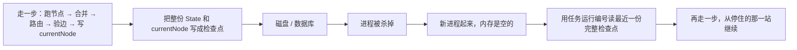

# **Checkpoint / Durable Resume**：State 可序列化；恢复时不重复有副作用的 Tool

> 对应模块：[模块 11 · Agent State / Workflow ⭐⭐⭐⭐⭐](./README.md) · 小节进度第 2 条
> 本条由 Coach 按 2026-09-17 本对话 `coach start` 详解首次写入。同日追问澄清：对话里说的「崩溃点」不是框架字段，指的是杀进程发生在时间轴的哪一个瞬间。学习者只减不加。进度表仍 ⬜，在进度表打钩只走 `coach complete`。

- **来源**：本对话 §6.2 详解（对照上一节状态机、模块 05 工具网关与幂等、模块 06 上下文、模块 10 记忆；LangGraph 只当概念对照，未打开外部文档页）+ 同日追问「这里讲的崩溃点是什么？」
- **状态**：已沉淀
- **Demo**：已写出 `apps/11-Agent-State-Workflow/02-Checkpoint-Durable-Resume-step-1/`（端口 `50121`，四页一口）。本小节手写「走完一步之后把状态写到磁盘、函数 / Map / Date 不能假装写入成功、按任务运行编号读回来、内存空了从磁盘继续、扣款成功但检查点还没写成时靠工具幂等」；不要用 LangGraph / LangChain 代劳（框架是模块 13 的事）。

> 各节写什么、达标要求：见仓库根 [AGENTS.md §7.2](../../../AGENTS.md#72-写入小节文档--小节进度对齐)。

## 是什么

上一节已经会画图、会走一步。那一套如果只活在 Node 进程的内存表（`Map`）里，服务一停，当前节点和字段一起没了。客人已经刷过会员卡，制作做到一半，进程被杀掉之后，系统既不知道扣过钱，也不知道做到哪一站——最坏会再扣一次。

**检查点（Checkpoint）** 就是某一时刻、某一件任务运行的完整快照：当时的状态（State）全文 + 当前节点名，写成**可以离开进程、以后还能读回来的数据**。

**持久恢复（Durable Resume）** 是杀进程、机器重启、部署换实例之后，用同一件任务运行的编号把最近一份**写完整**的快照读回来，从停住的那一站继续，而不是从入口再走一遍。

**可序列化（Serializable）** 是这份快照必须能变成 JSON（或等价的纯数据）再变回来。函数、数据库连接、正在跑的数据流（Stream）写不进文件，读回来也对不上。

接到 Agent 上的那句话：

> 杀进程再起来，要保证三件事同时成立：① 找得到同一件任务运行；② 读到的是上一份**写完整**的快照，停在当时的节点，不是入口；③ 已经对外发生过的副作用（扣款、发短信、改库存）不会因为「再进一次这个节点」而再做一次。

「能解释」不是背定义。下面每一种「进程被杀掉的时机」，都要能指出：钱会不会再扣、下一站从哪开始、只写出半份文件时怎么办。

贯穿业务仍用上一节的咖啡店，只加两个**有副作用的站**：

```text
点单 takeOrder → 扣会员卡 chargeCard → 热饮/冰饮制作 → 发取餐短信 sendPickupSms → 出餐 serve
```

「识别饮品」是纯计算，重跑一般只浪费时间。「扣卡」「发短信」一重跑，客人账上少两次、手机响两次。



### 核心对象

| 对象 | 人话 | 在代码里通常是 |
| -- | -- | -- |
| **检查点（Checkpoint）** | 某一时刻这件任务运行的完整快照 | `{ runId, currentNode, state, checkpointId, writtenAt }` 一份纯 JSON |
| **存档器（Checkpointer）** | 负责写入、按编号读出、必要时列出历史 | 写文件 / SQLite 的那一层；**不是**节点函数 |
| **一件任务运行的编号（runId / thread_id）** | 哪一份检查点属于哪一单 | 键。张三的拿铁和李四的美式必须是两个编号。LangGraph 对照词是 `thread_id`，本课手写用 `runId` |
| **序列化（Serialization）** | 状态对象变成字节，再变回状态对象 | 通常 `JSON.stringify` / `JSON.parse`；失败或类型走样都算没过 |
| **已经执行过的工具调用编号（executed tool call ids）** | 哪些有副作用的调用已经对外发生过 | 状态里一份 id 列表，和检查点**同一笔**写到磁盘 |
| **原子写入（Atomic write）** | 要么整份成功，要么仍是上一份完整快照 | 先写临时文件再改名，或一条数据库事务 |
| **持久恢复（Durable Resume）** | 新进程用编号加载，从当前节点继续走一步 | `load(runId)` → 得到 State → 再调上一节那个 `stepOnce` |

调度器上一节已经有了。这一节在「走完一步、写出新的 `currentNode`」之后，**多一次把快照写到磁盘**；启动时若内存是空的，先按编号从磁盘加载。节点函数仍然只返回 `Partial<State>`，仍然不许自己改 `currentNode`。脏数据一旦写进磁盘，恢复出来还是脏的。

### 杀进程发生在时间轴的哪一个瞬间

对话里曾把这种瞬间叫做「崩溃点」。**这不是框架字段，不是 LangGraph 的接口，也不是行业标准术语。** 它只是在说：扣款这一步内部有一段很短的时间轴，钱什么时候被扣掉、检查点什么时候写到磁盘上，**不是同一瞬间**。进程可能死在中间任意一处。死在不同位置，恢复之后该不该再进这个节点、会不会再扣一次钱，答案完全不同。

它也不是上一节的「节点失败」。节点失败是热饮机坏了，写入 `lastError`，沿失败边走，**进程还活着**。这里说的是整份 Node 进程没了（你在终端停掉服务、发版、内存耗尽、笔记本合盖），内存里的状态一起没了，只剩磁盘上最后一份写完整的检查点。

约定本课默认：**一整步完成之后**才写检查点——节点跑完、状态合并完、路由挑完、验过边、`currentNode` 已是下一站。此时快照的含义是：「下一站还没开始跑」。

扣会员卡这一步里，实际顺序是：

```text
① 进入 chargeCard 这个节点
② 调用支付接口     ← 钱在这里被扣掉（对外副作用已经发生）
③ 把「这次扣款做过了」写进状态（executedToolCallIds）
④ 路由把 currentNode 改成下一站 brewHot
⑤ 把整份检查点写到磁盘
```

| 进程被杀掉的时机 | 磁盘上还是什么 | 恢复后会怎样 | 要保证什么 |
| -- | -- | -- | -- |
| **钱还没扣**（① 之后、② 之前） | 仍是上一站的快照，`currentNode` 还是扣卡站 | 再进扣款，钱还没扣过 | 再跑一次是对的 |
| **钱已经扣了，完整检查点还没写到磁盘**（② 之后、⑤ 之前） | 仍是旧快照，既没有「已扣过」的痕迹，当前节点也还停在扣卡站 | **会再进扣款节点** | 支付工具必须幂等（Idempotency），或同一工具调用编号去重，余额只少一次 |
| **完整检查点已经写到磁盘，下一站还没开始**（⑤ 之后、制作开始之前） | 新快照，`currentNode = brewHot`，痕迹里已有这次扣款 | 从制作继续 | 不得再调支付 |
| **正在写入检查点的中途**（⑤ 写到一半） | 可能是半份 JSON、缺字段、长度为 0 | `JSON.parse` 失败，或残缺状态被送进路由 | 原子写入：看见半份就当作这次没写过，退回上一份完整快照 |

第一种：收银员打开收款页，还没刷卡，突然停电。来电后再刷一次，客人不会被扣两次。

第二种：汤已经盛进碗，出餐单上的钩还没打。换班的人只看单，会再盛一碗——除非后厨认「同一桌同一道菜只上一份」。这是最容易讲错、也最容易真的扣两次钱的时机。前端对照：`POST /pay` 已经返回成功，浏览器在写入 `localStorage` 之前崩溃；刷新后再点支付，没有幂等键就会再扣。

第三种：钩已经打在「已收款、待制作」上。换班的人从制作开始，不会再收款。教学演示通常先做这一种：走一步、看见文件、停掉服务、再启动、编号还在。它证明「还在不在」，**证明不了第二种时机**。

第四种：存档写到一半卡住。读取游戏存档时应回到上一个完整存档，不能进一个没有血条数值的损坏文件，再把完好存档覆盖掉。

只说「进程崩了」，这四种情况会被混成一句。杀进程再起来要保证什么，就是对着这张表逐行能讲。

## 为什么（Agent 开发要懂）

上一节的调度器可以在一次请求里把图跑完。生产里一次工作流经常跨分钟、跨小时：扣款要等支付渠道、制作要等设备、后面还有人点头（下一小节）。这段时间里进程会被杀掉——发版、内存耗尽、笔记本合盖、容器被调度走。

不懂检查点，会出现这些具体后果：

1. **客人已经扣过钱，系统以为没扣。** 重启后从点单再走，支付节点再调一次，卡被刷两次。客人投诉不是「图没画好」，是钱。
2. **做到一半的单蒸发。** 热饮已经做完，短信还没发。重启后状态没了，前台只能重新点单。库存、杯数、客人等待全对不上。
3. **两单数据混在一起。** 检查点没有按一件任务运行编号隔离，李四恢复时读到张三的 `currentNode`，短信发到别人手机。
4. **半份 JSON 把启动打崩。** 写入到一半断电，启动 `JSON.parse` 抛错，连上一份完好快照也读不到，整个柜台停摆。
5. **状态里塞了连接。** `JSON.stringify` 要么直接失败，要么把函数静默丢掉。重启后「看起来有文件」，关键字段却没了，路由走错站。
6. **下一小节的「等人点头」会变成空中楼阁。** 人点头可能要等 40 分钟。等的时候进程一定会经历重启。没有检查点，暂停等于丢失。本课不实现点头，但要明白：暂停能成立，是因为先能把状态存住。

对照前端：把 Redux 状态持久化到本地（redux-persist）/ 表单向导把草稿写进 `localStorage`，刷新页面还能填。差在 Agent 多了**对外副作用**——刷新页面不会把信用卡再扣一次，除非支付按钮没有幂等。Stripe 用幂等键防的就是「点了支付，浏览器刷新，请求又来一次」。Agent 的恢复是同一类问题，只是触发者从「用户连点」变成了「进程被杀掉」。

对照模块 05：工具网关（Tool Gateway）里的幂等，防的是**同一次意图被执行多次**（超时重试、模型并发、按钮连点）。这一节「钱已经扣了、完整检查点还没写到磁盘」的时机，就是那种重试的一种来源：节点已经扣了款，检查点还没写成，恢复后调度器会再进这个节点。调度器跳过已经做过的，是第一道；工具自身幂等是最后一道。两道都要，原因见变体 E。

对照模块 06 / 10：上下文窗口（Context Window）是**这一次请求**塞进 `messages` 的字；记忆（Memory）是**跨会话**还想用的事实 / 经历。检查点是**这一件任务运行跑到哪了**。三份仓库，三把钥匙。把检查点当成长记忆，会把「这杯没做完的拿铁」写进用户画像；把记忆当成检查点，杀进程后这杯单仍然接不上。

## 核心概念的全部变体

检查点不是一个单词。漏一种，就讲不清「杀进程再起来要保证什么」。

### 变体 A · 可序列化 vs 不可序列化

能进检查点的，只有纯数据——字符串、数字、布尔、数组、普通对象、节点名、已经执行过的工具调用编号列表。不能进的：函数、数据库连接、可读数据流（`ReadableStream`）、定时器句柄、带方法的类实例、循环引用。

数据怎么走：`stepOnce` 得到新状态 → 存档器 `JSON.stringify` → 写入。函数在 JSON 里会被**静默丢掉**；`undefined` 也会被丢掉；`Date` 会变成字符串；`Map` / `Set` 会变成 `{}`。所以「没报错」不等于「读回来还是原来那份」。

生活：搬家只装箱里的衣服和文件。把正在烧水的壶、还插着电的路由器塞进箱子，到新家既没法用，还可能把箱子烫坏。  
前端：`localStorage.setItem('state', JSON.stringify(store))`。你把组件函数、axios 实例塞进 Redux，刷新后这些键直接消失，页面当数据还在，路由就乱。

判错会怎样：状态里塞了数据库连接，stringify 失败，这一步看起来跑完了，磁盘上没有新检查点；或 stringify「成功」了，恢复后关键字段变成 `undefined`，下一站崩溃。

### 变体 B · 内存表 vs 真的持久化

上一节 `Map<runId, state>` 在进程里。进程死，表没了。这一节必须写到进程外面：文件或 SQLite。LangGraph 的 `MemorySaver` **名字带 Memory，杀进程一样丢**——那不是持久恢复，只是同进程里下一次调用还能接上。真正持久的是 Sqlite / Postgres 这类存档器。本课手写文件或 SQLite 即可，不要引入框架。

数据怎么走：走一步 → 写到磁盘 → 页面上同时看见「内存里这份」和「文件里这份」。清空内存，或真的停掉服务再启动，只从文件加载。

生活：只记在当班服务员脑子里 vs 写在厨房出餐单上。换班只认出餐单。  
前端：React `useState` vs `localStorage`。刷新页面，只有后者还在。

判错会怎样：以为「我写了 Checkpointer 类」就是持久的，实现却是另一个 `Map`。演示时在同进程里清空变量看起来能恢复；真的杀掉进程，单没了。

### 变体 C · 写检查点的时机，以及上面那四种杀进程时机

这是「杀进程再起来要保证什么」的心脏。默认一整步完成之后才写。四种时机见上文表格。教学上容易只演示第三种（完整检查点已经在磁盘上），以为恢复「天然不会重复扣款」。生产里最常见的客人投诉来自第二种（钱扣了，文件还没写完）。

### 变体 D · 恢复 vs 从头再跑

恢复 = 加载快照，当前节点就是下一件要做的事。从头再跑 = 无视快照，从 `takeOrder` 再来。后者在有副作用的图上几乎一定是错的。

数据怎么走：启动时带同一个 `runId` → 存档器命中 → 页面上 `currentNode` 仍是「待制作」，已扣金额不变 → 点「走一步」跑的是制作，不是点单。对照：故意不带编号或带一个新编号 → 新开一单，从点单开始，这是另一件任务运行，不是恢复。

生活：网文看到第 87 章，关掉应用再打开，应停在 87，不是封面。  
前端：多步表单刷新后停在第 3 步，不是第 1 步再填一遍邮箱（邮箱接口已经验证过了）。

### 变体 E · 副作用不重做的三道保护（必须分开讲）

| 做法 | 做什么 | 挡得住哪一种时机 | 挡不住什么 |
| -- | -- | -- | -- |
| **调度器跳过已经做过的** | 状态里已有这次扣款的编号，调度器不再调用支付 | 完整检查点已经写到磁盘（第三种时机） | 钱扣了但痕迹还没写到磁盘（第二种时机） |
| **按工具调用编号去重** | 同一 id 第二次进来，返回第一次的结果，不再调渠道 | 调度器又进了这个节点，但 id 相同 | id 变了（模型新开一次调用） |
| **工具自身幂等（模块 05）** | 同一幂等键，业务结果恒等：余额只少一次 | 第二种时机；id 变了但业务键仍是「这一单这一笔」 | 你用了不同的业务键，那就是另一笔 |

三道不是替代关系。只做第一道：第二种时机会扣两次钱。只做第三道、检查点里不记痕迹：每次恢复都真的打到支付渠道，虽然钱可能只扣一次，但延迟、限额、对账都会吵。生产级是第一道加第三道，第二道在「同一轮工具调用被重放」时补上。

记住模块 05 那句：**「重复执行没报错」不等于幂等。** 三次都返回成功、钱扣了三次，不是幂等。

生活：同一张转账单交柜台 100 次只扣一次（第三道）；柜员本上已经勾了「这张单办过」就不再递进核心系统（第一道）。本丢了但核心认单号，仍然只扣一次。  
前端：按钮暂时不可点（防抖）救不了「请求已经离开浏览器、客户端崩溃后重发」。那必须后端幂等。

**只读节点**（查菜单、识别饮品）重跑通常可接受，不必强行跳过。不要给只读工具假装一套扣款级幂等，反而把「查询结果已经过期」藏起来。可接受重跑，不等于有副作用也可以重跑。

### 变体 F · 一件任务运行一个编号，恢复不能把两单混在一起

检查点的主键是 `runId`（LangGraph 对照词是 `thread_id`）。它标识**这一件任务运行**，不是用户、不是聊天窗口、不是观测系统里的一条追踪。上一节已经强调过：状态挂在一件任务运行上。这一节写到磁盘必须用同一把钥匙。

数据怎么走：张三 `run_a` 停在扣款后；李四 `run_b` 停在点单后。杀进程。用 `run_a` 加载只能看到张三、只能从制作继续。用 `run_b` 加载只能看到李四。把张三的编号填进李四的恢复请求，会拿错单——这是必须能演示的反例。

生活：取餐柜用取餐码开柜，不能只用「手机号」当唯一键（一家人两单会开错）。
前端：`localStorage` 用 `draft:${userId}` 当键，两个标签页两个用户会覆盖。正确是 `draft:${runId}`。

#### 业务例子 · 订单发货判断 + 退款

用户说"我的订单发货了吗？如果没发货就退款"，后台按这张图走：

```text
fetchOrder → checkShipment ─┬→ noop → done（已发货，什么都不做）
                           └→ refund → done（已退款）
```

「查询」「看发货」「已发货分支」「没发货分支」是这张图里的**节点 + 路由边**，不是四件任务运行。整张图从开始走到 `done` 是一次完整业务，共享同一份 State，到达一个统一终态——所以**一个 runId**。

判定的两个维度要同时满足：

1. **State 共享**：跨步都要看同一份对象。退款这一站要拿 `orderId` 和 `isShipped`，这两个字段是查订单那一站写进 State 的。拆成多个 runId，退款站拿不到 `isShipped`，不知道自己该不该退。
2. **终态一致**：所有分支共同走到一个终态。「已发货不操作」或「已退款」二选一，都是 `done`。`done` 一到，`currentNode` 关掉，这次 runId 终止。

#### runId / 用户 id / session id / HTTP 请求 id 的对照

这四个 id 互相不对齐，是新人最容易搞混的一组：

| id | 标识 | 一对多关系 | 例子 |
| --- | --- | --- | --- |
| **用户 id** | 一个人 | 一对多 runId | 张三点 50 杯咖啡 = 50 个 runId |
| **session id** | 一个聊天窗口 | 一对多 runId | 一个窗口里聊多件事，每件一个 runId |
| **runId** | 一件任务运行 | 一对多 节点（step） | 「问发货」这一件事里有 4 个节点 |
| **HTTP 请求 id** | 一次 HTTP 调用 | 一对多 runId | 一次请求是一次请求，但 runId 横跨多次请求 |

对照 [§8 易混点 8](#易混点)。一个聊天窗口里可以做多件任务运行；一个人可以发起多件任务运行；一件任务运行会跨多次 HTTP 请求。

#### session 内简化规则与它的三个边界

简化规则：**同一个 session 里，用户开始一段新业务（一个新问题、新话题）= 一个新 runId**。这是大多数系统的默认做法，对应代码里最简单的实现：每收到用户一句话就生成一个新 `runId`。

但有三个边界要警觉：

| 边界 | 是不是新 runId | 判定依据 |
| --- | --- | --- |
| **一句话里包含条件**：「问发货 + 没发货就退款」 | 不是，是同一个 runId | 用户语义是一次完整业务；共享 State；终态一致 |
| **session 内显式追加**：上一件到 `done` 后下一段新业务 | 是，新 runId | State 不同 / 终态已到 / 业务目的不同 |
| **长流程 / 多步表单**：用户在同一份 State 上跨多个输入 | 不是，是同一个 runId | 共享 State（同一份表单字段）；终态一致（提交后到 done） |

第一种边界：用户一句话里有「如果 / 那么 / 等到 / 之后」这种条件结构，把它们当一件事看，按同一张图判断 + 行动。

第二种边界：上一件已经走到 `done`，下一件是新决策。看起来像是延续，但终态已经到了，业务目的不同。

第三种边界：多步表单、长期规划、跨用户多次输入的长流程——它们是同一份 State 共同走向同一个终态。

#### 终态到了之后开新业务的三档实现

| 做法 | 怎么做 | 适用 |
| --- | --- | --- |
| **1 · 默认新 runId**（绝大多数系统） | 上一件到 `done` 后，新业务生成全新 `runId`，State 从零开始 | 简单系统，绝大多数生产系统 |
| **2 · 新 runId + 父引用** | 新 runId 上挂 `parentRunId` 指向上一件；需要时只读上一件检查点 | 想保留对话上下文，又不污染上一件 State |
| **3 · 同 runId 暂停 / 恢复** | 状态机加一个「等用户输入」节点；State 存「等到了什么」；检查点写完整 | 长流程 / 人机协作 / 下一小节「等人点头」 |

做法 3 是模块 11 第 3 节要单独讲的机制——暂停 / 恢复，本节不展开。

口诀：**session 是容器，runId 是里面那件事。默认新业务 = 新 runId；同句话里有条件 / 同一份 State 跨多输入 = 同一个 runId；上一件到 done = 新 runId。**

### 变体 G · 引擎只认最新一份完整快照；历史是给人看的

存档器可以留下第 0、1、2… 步的快照，方便对照「第 2 步时余额是多少」。**调度器恢复时只加载最近一份写成功的完整快照**。不要把历史数组拿去跑下一站。上一节已讲过「历史完整快照不等于引擎工作状态」；这一节把它写到磁盘上，规则不变。

数据怎么走：走 3 步，磁盘上可以有 4 份（含第 0 步）。恢复读编号最大且校验完整的那一份。页面可以列出历史，点某一份只是对照，除非你明确做「退回到第 2 步」。回滚有副作用时极危险——钱扣了不能靠回退检查点就把钱变回来。本课不要求做成产品功能，但要能说清这一点。

### 变体 H · 快照恢复 vs 事件重放

- **快照恢复（Resume）**：直接跳到最后一份状态。
- **事件重放（Replay / Event Sourcing）**：从空状态起，把「点单了 / 扣款了 / 制作了」一条条事件再执行一遍。

Agent 工作流默认用快照。如果你把步骤从头再执行一遍，扣款事件会再执行一遍，除非事件日志里存的是「已经扣过」而重放时跳过执行。那其实是把「调度器跳过已经做过的」写进了重放器，仍然要处理「钱扣了、文件还没写完」那种时机。

生活：读取游戏存档 vs 从头把每个按键再按一遍。打 Boss 消耗的药水，重放会再喝一次。  
前端：Redux 的时间旅行重放 action；若某个 action 是 `POST /pay`，重放就会再付钱。所以带副作用的 action 不能拿去时间旅行。

### 变体 I · 半份检查点必须当没写过

写入不是瞬间完成。进程可以在 `write` 到一半时被杀掉。读到半份 JSON、缺字段、文件长度为 0，都必须当成**这次写入不存在**，退回上一份完整快照。实现上常见：先写 `run_a.json.tmp`，调用 `fsync`，再 `rename` 成 `run_a.json`（同一分区上改名是原子的）；或 SQLite 事务提交。

数据怎么走：演示可以故意写一半然后标坏。恢复路径必须失败得干净：报「最近一份损坏，已退回上一步」，而不是把残缺状态送进路由。

生活：存档条写到一半卡带弹出，应读上一个完整存档。  
前端：IndexedDB 事务失败必须回滚，不能把一半订单号留下。

### 变体 J · 图改了，旧检查点可能对不上

磁盘上 `currentNode = "brewHot"`，你发版把节点改名为 `makeHot`，或删了这条边。恢复后调度器拿旧名字去查节点函数表，找不到。

数据怎么走：检查点里带 `graphVersion`。加载时版本不一致 → 明确失败（「这张单按旧图跑到一半，新图无法接」），不要猜着改名继续跑。迁移可以以后做，本课先要求**失败可见**。

生活：旧版游戏存档进新版，缺了一个地图文件，应提示「存档不兼容」，而不是把角色丢进空洞。  
前端：本地缓存的结构版本和代码类型对不上，启动时丢掉缓存或走迁移，不能当成任意类型接着用。

### 变体 K · stringify 表面上成功，读回来已经不是原来的东西

这是变体 A 的细分支，必须单独能讲，因为「能写进文件」会给人虚假安全感。

| 写入前 | `JSON.stringify` 之后 | 读回来 | 路由会怎样 |
| -- | -- | -- | -- |
| `brewStartedAt: new Date()` | ISO 字符串 | `string`，不是 `Date` | 若代码调 `.getTime()` 会抛错 |
| `lastError: undefined` | 键被丢掉 | 没有这个键 | 和「从未出错」分不清 |
| `tags: new Set(['hot'])` | `{}` | 空对象 | 条件路由读不到热饮标记 |
| `charge: () => {}` | 键被丢掉 | 没有函数 | 还好，函数本不该在状态里 |

验收：页面上并排「写入磁盘之前」和「读回来」，能看见丢了什么。这不是吹毛求疵，是序列化的真实语义。

### 变体 L · 检查点 ≠ 记忆 ≠ 上下文（纯知识）

| | 检查点 | 记忆（模块 10） | 上下文（模块 06） |
| -- | -- | -- | -- |
| 回答什么问题 | 这件任务运行跑到哪一站、字段是什么 | 跨会话还想用的事实 / 经历 | 这一次请求 `messages` 里有哪些字 |
| 生命周期 | 一件任务运行从创建到终止（或过期清理） | 用户级 / 长期 | 一次 HTTP 请求 |
| 杀进程 | 必须还在 | 必须还在 | 这次请求已经结束，本来就不在 |
| 典型内容 | `currentNode`、已扣金额、已经执行过的工具调用编号 | 「张三喜欢少冰」 | 最近几轮对话 |

不要把 `messages` 整段默认塞进检查点。只有**后面的路由还要读**的字段才进状态；对话全文进检查点会迅速涨到上下文窗口那种体积，还和模块 06 的裁剪策略打架。需要给模型看的历史，恢复之后再按 Token 预算（Token Budget）组装。

本变体不单独做产品功能，过关自检能分开三句话即可。

### 变体 M · 纯计算可重跑 vs 有副作用不可随便重跑

识别饮品、算价格、拼提示词，重跑结果应一样，「钱扣了但文件还没写完」那种时机对它们不可怕。扣款、发短信、改库存、创建工单，重跑会对外造成第二份事实。

数据怎么走：同一套恢复逻辑，对照两个节点：杀在「识别饮品」中途，恢复后再识别一次，菜单结果相同、没有对外副作用计数；杀在「扣款」中途，恢复后支付渠道的计数仍必须是 1（靠变体 E）。

把所有节点都当成可重跑，等于把咖啡店当成纯函数。生产里不是。

## 易混点

### 1. 检查点 ≠ 上一节的状态对象本身

状态是「现在这份对象」，活在调度器手里。检查点是「把这份对象在某时刻拍下来，放到进程外面」。没有存档器，状态再显式，杀进程也没了。

判错：以为「我已经有 `CafeState` 类型了」就是这一节过关。类型只保证形状，不保证活过重启。

### 2. 持久恢复 ≠ 同进程里再调用一次

LangGraph 对照：`MemorySaver` 让**同一个进程里**下一次调用带同一 `thread_id` 还能接上。进程一死它就没了。本课说的持久，以「停掉 Node 再启动」为准。

判错：用内存 `Map` 写了保存 / 加载，单元测试同进程通过，发版后线上仍从入口重跑。

### 3. 「调度器跳过已经做过的」≠ 幂等

跳过是调度器看痕迹。幂等是工具在自己内部保证业务结果恒等。只跳过，挡不住「钱扣了、完整检查点还没写到磁盘」那一次重入。

判错：检查点里写了 `charged: true`，以为万事大吉；实际 `charged: true` 和扣款成功不在同一次原子写入里。

### 4. 幂等 ≠ 重复执行没报错

三次扣款三次都返回成功，账上少了三笔，不是幂等。模块 05 已讲，这一节第二种杀进程时机最容易让人以为「重试成功了所以没关系」。

### 5. 恢复 ≠ 重放

恢复跳到快照。重放会把副作用事件再执行一遍。调试时「把步骤再演一遍」如果真的打到支付，会在预发环境造出一堆真实退款。

### 6. 检查点 ≠ 记忆 ≠ 上下文

见变体 L。判错：把「用户喜欢少冰」写进这件任务运行的检查点，运行结束就被清理，下单全忘；或把这件任务运行的 `currentNode` 写进用户记忆，别的会话一召回就跑到别人的制作站。

### 7. `JSON.stringify` 成功 ≠ 可安全恢复

见变体 K。判错：错误都没接住，以为能 stringify 就结束；恢复后出现 `brewStartedAt.getTime is not a function`。

### 8. 一件任务运行的编号 ≠ 用户 id ≠ 会话 id ≠ 追踪 id

见变体 F。若把 `runId` 和观测系统里的一次运行混用，会把检查点存错层：一个聊天窗口两件任务运行互相覆盖，或一次 HTTP 追踪结束检查点被当过期删掉。

### 9. 历史快照列表 ≠ 引擎要跑的那一份

给人看的时间线和调度器加载的那一份，职责不同。回退检查点不能自动把已经扣的钱变回来。

### 10. 只读可重跑 ≠ 有副作用也可重跑

见变体 M。

### 11. 原子写入 ≠ 「写完再返回，应该差不多了」

没有临时文件改名或事务，第四种时机（写到一半）会留下半份文件。下一次启动如果直接解析并覆盖上一份，完好存档也会被损坏文件替换。

### 12. 本课 ≠ 下一节的「等人点头」

等人点头需要检查点，但「谁点头、点头前暂停」是下一小节。本课只保证：停在某一站时，进程死了还能停在那一站，并且已发生的副作用不重做。不要把审批按钮做进这一节的验收。

### 13. 节点失败 ≠ 进程被杀掉

| | 节点失败（上一节） | 进程被杀掉（这一节） |
| -- | -- | -- |
| 谁还活着 | 进程还在 | 进程没了 |
| 你看见什么 | `lastError`，沿失败边走 | 磁盘上最后一份完整快照 |
| 钱扣没扣 | 看这次节点有没有调到支付 | 看杀掉时走到时间轴哪一格 |
| 处理办法 | 画失败边、写错误字段 | 恢复 + 跳过已经做过的 + 工具幂等 + 原子写入 |

热饮机坏了走失败终止，不是「进程被杀掉」。在终端停掉演示服务，才是。

## 例子

每个核心对象至少各演一遍数据怎么走。

**检查点**  
生活：厨房出餐单上的一格打钩，写下「第 3 桌，热拿铁，已扣卡，待制作」。换班只看这张单。  
前端：向导第 2 步提交后 `PUT /drafts/run_a`，请求体就是当时的表单 JSON。

**存档器**  
生活：专门放单子的夹子，按桌号取。不是厨师本人的记性。  
前端：`DraftRepo.save(runId, json)` / `DraftRepo.load(runId)`，和 reducer 分开。

**一件任务运行的编号**  
生活：取餐号 301、302。  
前端：`crypto.randomUUID()` 作为 `runId`，放在网址或返回给页面，刷新带着它请求加载接口。

**序列化**  
生活：把单子复印成纸质，不能把咖啡机复印进去。  
前端：`JSON.parse(JSON.stringify(state))` 之后做一次深对比，函数和 `Map` 会原形毕露。

**已经执行过的工具调用编号**  
生活：单子上盖「已收款」章。  
前端：`state.executedToolCallIds: ["call_charge_01"]`。调度器看见就跳过支付节点。

**原子写入**  
生活：先写在便条上，核对完整再换掉夹子里那张旧单。便条写到一半扔掉，旧单还在。  
前端：写 `run_a.json.tmp` → 再改名为 `run_a.json`。

**持久恢复**  
生活：停电后来电，夹子还在，从「待制作」继续，不重新收款。  
前端：停掉服务进程，再启动，打开同一 `runId`，`currentNode` 不变，扣款计数仍为 1，再点「走一步」进入制作。

**例子 · 前端场景 1：走一步之后磁盘上能看见快照**  
点「走一步」完成点单。页面左边是内存里的状态，右边是文件内容，结构相同，都有 `currentNode`。

**例子 · 前端场景 2：停掉服务再启动，同一编号还在**  
终端停掉 Node，再启动。带着刚才的 `runId` 打开页面，当前节点不是入口，已点的饮品名字还在。

**例子 · 前端场景 3：钱扣了、文件还没写完，余额只少一次**  
模拟支付接口已经成功、检查点还没写成，然后清空内存再加载。调度器会再进扣款节点，支付模拟器的扣款次数仍是 1，页面能看见第二次命中幂等。

**例子 · 前端场景 4：痕迹已经在快照里，不再调用支付**  
扣款成功并且检查点已写成之后再停进程。加载后下一步是制作站，支付模拟器调用次数不再增加。

**例子 · 前端场景 5：两个编号互不覆盖**  
张三、李四两单同时做到不同站。重启后各自加载，不会变成一份状态。

## 需求清单

每条对应一个变体（或变体组）。需求是验收准绳，不是一次性搭完整应用的施工单。Step 生产仍按知识由浅入深。

**需求 1 · 可序列化的点单快照（变体 A / K）**  
- 业务场景：咖啡店把「当前这杯单」存成文件，给换班看。  
- 目标：纯数据能整存整取；脏类型不能假装成功。  
- 涉及：序列化、检查点形状、stringify 会走样的类型。  
- 验收：① 走完点单，磁盘上有一份与页面状态同结构的 JSON；② 故意往状态里塞函数或 `Map`，写入被拒绝，或页面上并排展示的「写入之前 / 读回来」能看见字段丢失 / 类型变化，不能静默当成功。

**需求 2 · 杀进程后从上一站继续（变体 B / D）**  
- 业务场景：做到「已点单、待扣卡」，店里电脑重启。  
- 目标：真的离开进程后再回来，不是同进程清一下变量就算。  
- 涉及：存档器、持久恢复。  
- 验收：停掉服务进程再启动，同一 `runId` 加载后 `currentNode` 仍是扣卡站（或你写入磁盘时所在的下一站），不是入口；对照「新开一单」从点单开始。

**需求 3 · 扣款后、完整检查点写到磁盘之前进程被杀掉，钱只少一次（变体 C 第二种时机 + 变体 E 第三道）**  
- 业务场景：支付渠道已返回成功，进程在写文件前被杀掉。  
- 目标：恢复可以再进扣款节点，会员卡余额只少一次。  
- 涉及：杀进程时机、幂等。  
- 验收：模拟该时机后恢复，支付模拟器的扣款次数 = 1，余额差与只成功一次相同；页面能看见第二次是命中幂等，而不是又扣了一笔。

**需求 4 · 痕迹已在快照里则跳过扣款（变体 C 第三种时机 + 变体 E 第一道）**  
- 业务场景：扣款成功并且检查点已写成，之后才停电。  
- 目标：恢复后走向制作，不再调用支付。  
- 涉及：已经执行过的工具调用编号、恢复。  
- 验收：加载后下一步是制作站；支付模拟器调用次数不再增加。

**需求 5 · 张三李四两单互不混（变体 F）**  
- 业务场景：两杯同时在做，电脑重启。  
- 目标：编号隔离。  
- 涉及：`runId`。  
- 验收：两个编号各自恢复到各自节点；用错编号会明确拿到另一单或报错，不能默默合并成一份状态。

**需求 5× · 终态到了之后开新业务 = 新 runId（变体 F · 三档实现里的做法 1）**  
- 业务场景：用户先问"发货了吗"，走到 noop → done；之后用户接着问"快递单号"。或者一个 session 里用户先后聊两件不相关的事。  
- 目标：上一件 runId 走到 done 后开新业务，新业务生成新 runId；上一件不再被调度；两件业务互不污染检查点。  
- 涉及：runId 终态判定、新 runId 生成、上一件不再复活。  
- 验收：第二件请求的 State 是新生成的；上一件的检查点不会被改写；可以显式挂 parentRunId 引用上一件（做法 2），但上一件不再被调度；同一句话里包含「如果 / 那么」条件结构仍按同一张图走同一个 runId；多步表单跨多次输入仍是同一个 runId。

**需求 6 · 内存对照：只放 Map 的那侧重启即丢（变体 B）**  
- 业务场景：教学对照「为什么必须写到进程外面」。  
- 目标：并排看见差异。  
- 涉及：内存 vs 磁盘。  
- 验收：两侧独立请求，禁止一个接口打包跑两轨。一侧进程没了之后加载失败或回到空；一侧能恢复。

**需求 7 · 半份文件退回上一份完整快照（变体 I + 第四种时机）**  
- 业务场景：存档写到一半断电。  
- 目标：损坏文件不能覆盖好文件，也不能拿去跑路由。  
- 涉及：原子写入。  
- 验收：人为制造半份 JSON 后恢复，系统使用上一份完整快照，并展示「最近一次写入损坏已忽略」。

**需求 8 · 纯计算重跑 vs 扣款不扣两次（变体 M，对照需求 3）**  
- 业务场景：识别饮品过程中杀一次进程、扣款过程中杀一次进程。  
- 目标：分清可重跑与不可随便重跑。  
- 涉及：副作用边界。  
- 验收：识别饮品在进程被杀掉后恢复，结果一致且无对外计数；扣款路径仍满足需求 3。

**需求 9 · 图版本对不上要失败可见（变体 J）**  
- 业务场景：发版改了节点名，旧单还在磁盘上。  
- 目标：不瞎跑。  
- 涉及：`graphVersion`。  
- 验收：加载旧检查点时页面明确失败原因，不进入一个不存在的节点。

**需求 10 · 引擎只加载最新完整快照，历史仅对照（变体 G；变体 H 用说明表明「从头再执行会再进扣款节点」）**  
- 业务场景：换班要看这杯单怎么走到现在，但不能把历史数组当工作状态。  
- 目标：恢复用最新完整份；讲清重放的危险。  
- 涉及：最新 vs 历史、恢复 vs 重放。  
- 验收：磁盘可列出多份快照；点恢复用的是最新完整份；页面用文字或对照说明「若从第 0 步重放，扣款节点会再进一次」，不提供一键真的打到支付的重放按钮。

变体 L（检查点 ≠ 记忆 ≠ 上下文）是纯知识变体：不单独做产品功能。下一节「等人点头」不进本清单。

## 取舍

- **手写存档器，还是直接上 LangGraph 的 Checkpointer：** 本条手写。框架会把「何时写入、写入什么、MemorySaver 其实不持久」藏进自己的 API。模块 13 再对照框架省了什么、藏了什么。本条演示不要引入该库。
- **一整步完成之后才写检查点，还是节点内部每调一次工具就写一次：** 本课默认前者，时间轴更清楚。更细的写入可以降低「钱扣了但文件还没写完」的窗口，但不能消掉这个窗口；窗口还在，就要幂等。
- **只跳过已经做过的，还是工具还必须幂等：** 两道都要。只跳过挡不住第二种杀进程时机。
- **检查点里要不要整段 `messages`：** 默认不要。只有后面的路由还要读的字段才进状态。
- **真的停掉服务进程，还是只清空内存模拟：** 教学第一步可以先清空内存、只从磁盘加载，让人看见「内存没了、文件还在」。本条要能讲清的是杀进程，最终必须能用终端停掉服务再启动验证；不能用同进程模拟代替验收。
- **本对话节奏：** 先把笔记写进小节文档；演示等你说写再写。

## 踩坑

- **把状态类型当成检查点。** 有 `CafeState` 不等于杀进程后还在。
- **存档器其实是另一个内存 `Map`。** 同进程测试通过，真重启全丢。把 `MemorySaver` 当成持久恢复，同一种坑。
- **只演示「完整检查点已经在磁盘上再停进程」。** 看不见「钱扣了、文件还没写完」会再进扣款节点。
- **只做调度器跳过、不做工具幂等。** 第二种时机扣两次钱。
- **以为重复执行没报错就是幂等。** 三次成功、三笔扣款。
- **状态里塞函数、连接、数据流、`Date`、`Map`、`undefined`。** stringify 失败，或读回来类型走样。
- **写入到一半没有原子性。** 半份 JSON 覆盖上一份完好快照。
- **两件任务运行共用一个文件名或同一个用户 id 当键。** 恢复拿错单。
- **把 `messages` 整段塞进检查点。** 体积膨胀，和模块 06 裁剪打架。
- **发版改了节点名还拿旧检查点硬跑。** 进入不存在的节点。
- **提供「从头再执行一遍」并且真的打到支付。** 预发环境造出真实扣款。
- **节点自己改 `currentNode` 再写入磁盘。** 上一节的脏数据被永久保存。
- **把检查点写进用户记忆，或把记忆当检查点。** 这杯没做完的拿铁和下次「少冰」偏好缠在一起。

## 契约记录

- 学习者原话「先沉淀一下文档，然后不要讲黑话和缩减词」：本次只写小节文档，不写演示。正文用完整中文句子；专业词写成「中文（English）」；禁止陪跑口令、禁止把「崩溃点」当行业术语推、禁止缩短词（例如把「把检查点写到磁盘上」收成两字）。
- 演示结论已在 `coach start` 判为可运行；默认先不写出，你说写再写。

## 我追问过的

| 问题 | 针对什么 | 回答 |
|------|---------|------|
| 学习者原话「这里讲的崩溃点是什么？」 | 把教学时说的瞬间误当成框架字段 / 和上一节「节点失败」分不清 | 答在「是什么 · 杀进程发生在时间轴的哪一个瞬间」以及易混点 13。核心结论：它不是产品名词，也不是节点跑出错。它指进程被杀掉时，落在「进入节点 → 副作用已经发生 → 痕迹写进状态 → 当前节点改完 → 完整检查点写到磁盘」这条时间轴的哪一格。四种时机里，最危险的是「钱已经扣了，完整检查点还没写到磁盘」：恢复会再进扣款节点，必须靠幂等保证余额只少一次。节点失败时进程还活着；这里说的是进程没了，只剩磁盘上最后一份写完整的快照 |
| 学习者原话「我这里『发货判断 + 退款』是一个 runId 还是多个？」「同一 session 里每段新问题就是新 runId 行不行？」 | 把「用户每段新提问」「同一 session 里的不同问题」误等同于「不同的任务运行」；以及把节点（node）误当成任务运行（run） | 答在「变体 F · 业务例子 · 订单发货判断 + 退款」「变体 F · session 内简化规则与它的三个边界」「变体 F · 终态到了之后开新业务的三档实现」以及四 id 对照表。核心结论：① `fetchOrder / checkShipment / noop / refund` 是这张图里的**节点 + 路由边**，不是四件任务运行；整张图共享 State、共同走到 `done` = 一个 runId。② 默认"session 内新业务 = 新 runId"成立，但有三个边界要警觉——同句话里包含条件结构是同一个 runId；上一件到 `done` 之后是新的 runId；长流程 / 多步表单跨用户多次输入仍是同一个 runId。③ 判定方法：State 是否共享 + 终态是否一致；任一项不同就是新 runId |
| 2026-09-17 B1 业务例子图落 step-6 | 打钩前检查 4 独立子代理把「业务例子 · 订单发货判断 + 退款」标为「未实现」（仅 MD 文字段落描述，代码侧没独立实现为可运行图） | 补完：`apps/11-Agent-State-Workflow/02-Checkpoint-Durable-Resume-step-6/lib/flow/shipping-refund-graph.ts` 独立实现 `fetchOrder → checkShipment → noop/refund → done` 四节点图（不调存档器，本步只演示「同图同 runId」判定）；`routes/run-shipping-refund-start.ts` + `routes/run-shipping-refund-step.ts` 一文件一 URL；`pages/shipping-refund.html` 演示 `shipped-` 开头走 noop / 其他走 refund |

## 过关自检

- 杀进程再起来，要保证哪三件事？四种时机里，哪一种会再进扣款节点、可能扣两次钱？靠什么挡住？
- 状态里什么可以进检查点，什么不可以？`JSON.stringify` 不报错为什么仍可能恢复失败？
- 进程内的内存表、LangGraph 的 `MemorySaver`，为什么都不算持久恢复？
- 调度器跳过已经做过的、按工具调用编号去重、工具幂等，各挡哪一种失败？少一道会怎样？
- 检查点、记忆、上下文，各回答什么问题？`messages` 为什么默认不要整段进检查点？
- 半份文件、图改名、两个编号用错，各应看见什么失败，而不是继续跑？
- 节点失败和进程被杀掉差在哪？

## 还没搞懂的

- 检查点在任务运行结束后何时清理、留多久：本课未展开，不影响「杀进程再起来要保证什么」。
- 回退到某一份历史快照时，已经扣出去的钱怎么处理：本课只要求能说出「回退检查点不能自动把钱变回来」，不做成产品功能。
- 图版本迁移（旧节点名映射到新节点名）：本课只要求失败可见，不做自动迁移。
- 「等人点头」怎么暂停、谁来点头：下一小节。

## 变体对照表

| 变体 | 通俗例子 | 需求清单 | 可观察 | Step 对齐 |
| -- | -- | -- | -- | -- |
| A 可序列化 / 不可序列化 | 搬家不能装箱中还插着电的路由器 | 需求 1 | 是 | Step 1 就要能看见写入磁盘的 JSON |
| K stringify 表面上成功 | `Date` 变成字符串 | 需求 1 | 是 | 可与 A 同页对照，不必先开新 step |
| B 内存 vs 磁盘；`MemorySaver` 不算持久 | 服务员记性 vs 出餐单 | 需求 2、需求 6 | 是 | Step 1 先磁盘；对照可后补 |
| C 四种杀进程时机 | 汤盛了、出餐单上的钩还没打 | 需求 3、4、7 | 是 | Step 1 先做「完整检查点已在磁盘上再停进程」；另外两种后补 |
| D 恢复 vs 从头再跑 | 网文读到第 87 章 | 需求 2 | 是 | 与 Step 1 同一套加载 |
| E 三道保护 | 转账单 + 柜员已经勾过 | 需求 3、4 | 是 | 先跳过（完整检查点已写成）；再补「钱扣了文件还没写完」的幂等 |
| F 一件任务运行一个编号 | 取餐号 | 需求 5 | 是 | 有一份写入磁盘之后就能做 |
| G 只认最新完整快照 | 夹子里最新那张单 | 需求 10 | 是 | 多走几步后自然有历史 |
| H 快照 vs 重放 | 读取存档 vs 重按每个键 | 需求 10（说明 + 不提供真的重放到支付） | 部分 | 纯知识为主，用需求 3 / 4 的行为当反例 |
| I 半份文件 | 卡带弹出 | 需求 7 | 是 | 有写入磁盘之后 |
| J 图版本 | 旧游戏存档进新版 | 需求 9 | 是 | 有检查点形状之后 |
| L 检查点 ≠ 记忆 ≠ 上下文 | 这杯没做完的拿铁 vs 少冰偏好 vs 这一次对话 | 过关自检 | 纯知识 | 不单独立演示 |
| M 纯计算可重跑 / 副作用不可随便重跑 | 再看一遍菜单 vs 再刷一次卡 | 需求 8 | 是 | 有扣款节点之后 |
| 等人点头 | — | 不进本条 | — | 第 3 小节 |

## Demo 子节进度

可运行。2026-09-17 把原 step-2 / step-3 并入 step-1 分页面（学习者要求改动很小、不要新开 step）。同日在 step-1 加第四页「不可序列化」。

| 状态 | 子节 | 入口 | 端口 | 本子节教学点 |
|------|------|------|------|--------------|
| ✅ | step-1 | `yarn app:11-02-checkpoint-durable-resume-step-1` | 50121 | 六页一口：`/pages/checkpoint.html` 每走一步写入检查点；`/pages/serialize.html` 函数 / Map / Date 不能假装写入成功；`/pages/resume.html` 清空内存后从磁盘继续；`/pages/charge-crash.html` 扣款成功但检查点还没写成，靠幂等（Idempotency）只扣一次；`/pages/two-orders.html` 两件任务运行用两个 runId，左右并排互不覆盖；`/pages/checkpoint-history.html` 每走一步留 step-NNNN.json 副本，引擎只加载最新完整份，变体 H 警告写明「重放会再进扣款节点」 |
| ✅ | step-2 | `yarn app:11-02-checkpoint-durable-resume-step-2` | 50122 | 三页一口：总览 + `/pages/next-run.html` 终态开新业务（变体 F · 做法 1/2 + parentRunId）+ `/pages/memory-vs-disk.html` 内存 vs 磁盘对照（变体 B，左 in-memory 端点 + 右写盘端点 + 两端 forget）。step-1 那六页（端口 50121）不在这里复刻 |
| ✅ | step-3 | `yarn app:11-02-checkpoint-durable-resume-step-3` | 50123 | 三页一口：总览 + `/pages/pure-vs-sideeffect.html` 纯计算 vs 扣款对照（变体 M，左纯计算右 charge-crash + forget + resume + 再走一步）+ `/pages/half-written.html` 半份文件退回（变体 I · 第四种时机，readCheckpoint 主文件 parse 失败时按编号降序回退到 step-NNNN.json）。step-1 / step-2 那几页（端口 50121 / 50122）不在这里复刻 |
| ✅ | step-4 | `yarn app:11-02-checkpoint-durable-resume-step-4` | 50124 | 二页一口：总览 + `/pages/graph-version.html` 图版本失败可见（变体 J，CheckpointRecord 加 graphVersion + readCheckpoint 加载时不匹配抛 GRAPH_VERSION_MISMATCH + POST `/api/run/set-graph-version` 切版本）。step-1 / step-2 / step-3 那几页（端口 50121 / 50122 / 50123）不在这里复刻 |
| ✅ | step-5 | `yarn app:11-02-checkpoint-durable-resume-step-5` | 50125 | 二页一口：总览 + `/pages/node-fail.html` 节点失败 ≠ 进程被杀掉（易混 13，cafe-graph 加 `brewFailed` 失败边 + `lastError` + `brewFailOnStep` 标志 + POST `/api/run/brew-fail` 在内存里设标志）。step-1 / step-2 / step-3 / step-4 那几页（端口 50121 / 50122 / 50123 / 50124）不在这里复刻 |
| ✅ | step-6 | `yarn app:11-02-checkpoint-durable-resume-step-6` | 50126 | 二页一口：总览 + `/pages/shipping-refund.html` 业务例子图（变体 F 收口，`fetchOrder → checkShipment → noop/refund → done` 四节点图，路由看 isShipped 选 noop / refund，POST `/api/run/shipping-refund/start` + `/api/run/shipping-refund/step`，不调存档器）。step-1 / step-2 / step-3 / step-4 / step-5 那几页（端口 50121 / 50122 / 50123 / 50124 / 50125）不在这里复刻 |

## §5.4 目标 ↔ 代码整合打钩前检查

跑打钩前检查日期：2026-09-17（首次写入小节文档时预列；本节 17:00 末次按四个 step 实际代码刷新。「状态」一栏按 §5.4 固定约定只许「已实现 / 未实现」。`coach complete` 时由独立子代理抽清单 + 逐项核对，不以本表为判定依据。）

### §5.4.A 目标 → 代码覆盖

「本条要能讲清」：能解释「杀进程再起来」要保证什么

| 目标点 | 状态 | 证据 |
|---|---|---|
| 每走完一步，进程外能看见一份完整状态 + 当前节点快照 | 已实现 | step-1 `pages/checkpoint.html` 走一步 → POST `/api/run/step` → `lib/flow/step-with-checkpoint.ts:stepOnceAndWrite` → `lib/flow/checkpoint-after-step.ts:writeCheckpoint` 落 `data/checkpoints/{runId}.json`；页面显示文件路径 + 磁盘 JSON 全文 |
| 停掉服务进程再启动，同一任务运行编号读回的是上一份完整快照，不是入口 | 已实现 | step-1 `pages/resume.html` 同进程 `forgetRunMemory` 清空内存 + `resumeFromDisk` 从磁盘加载；同页「显示『在终端杀掉再起服务』的命令」按钮 → `<pre>` 块显示 `lsof -nP -iTCP:50121 -sTCP:LISTEN` + `kill -9 <PID>` + `yarn app:11-02-checkpoint-durable-resume-step-1`；浏览器 hard reload 后同一 runId 仍能从磁盘恢复 |
| 恢复之后能继续走下一步，不是被迫从头再跑 | 已实现 | step-1 `pages/resume.html` 演示：走两步 → forget → 走一步失败 → resume → 再走一步，currentNode 接着 brewHot / sendPickupSms，不是 takeOrder |
| 已对外发生的副作用（扣款 / 发短信）在对应时机下不会再做一次，次数可观察仍为 1 | 已实现 | step-1 `pages/charge-crash.html` 演示：扣款成功 → forget → resume → 再走一步，`payment.callCount = 2`、`payment.deductionCount = 1`、`lastHitIdempotency = true`；左侧磁盘检查点 chargedAmount 仍是 0 体现「痕迹没进检查点」 |
| 不可序列化或 stringify 会走样的字段，不能静默当写入磁盘成功 | 已实现 | step-1 `pages/serialize.html` 三种脏类型对照：function 字段被丢掉、Map 变 `{}`、Date 变字符串；端点 `accepted: false` + 磁盘 JSON 仍是上一份完整 |
| 两件任务运行用两个编号恢复，互不覆盖 | 已实现 | step-1 `pages/two-orders.html` 左张三右李四；`routes/run-second.ts` 起第二单；`runs: Map<runId, state>` 隔离 |
| 半份 / 损坏的最近写入被忽略，退回上一份完整快照 | 已实现 | step-3 `pages/half-written.html` 演示：故意截断主文件 → GET `/api/checkpoint-list?runId=…` 主文件标红 + `parseError`；`GET /api/checkpoint/:runId` 加载时主文件 parse 失败，按编号降序 fallback 到 `data/checkpoints/{runId}/step-0001.json`，返回 `fellBackTo = step-0001.json` |
| 图版本与检查点不一致时失败可见，不进入不存在的节点 | 已实现 | step-4 `pages/graph-version.html` 演示：写盘时 `CheckpointRecord.graphVersion = v1`；POST `/api/run/set-graph-version` 切到 v2 → GET `/api/checkpoint/:runId` 抛 HTTP 400 · `GRAPH_VERSION_MISMATCH` + 错误卡里显示两个版本号 |

**A 段小结**：8/8 已实现。本节对模块 README 02 进度行打钩的阻塞已清零，可在 `coach complete` 时由独立子代理按 §5.4 抽清单 + 逐项核对（状态只许已实现 / 未实现）。

### §5.4.B 文档 → 代码对齐

| MD 讲点 | 代码里有没有 | 状态 |
|---|---|---|
| 需求 1 · 纯数据整存整取；函数 / Map 不能假装成功 | `pages/checkpoint.html`（合法 JSON 写入磁盘）+ `pages/serialize.html`（脏类型三对照） | 已实现 |
| 需求 2 · 停进程再启动同一编号从上一站继续 | `pages/resume.html` 同进程 forget 模拟 + 「显示『在终端杀掉再起服务』的命令」按钮 → `<pre>` 块显示 `lsof -nP -iTCP:50121 -sTCP:LISTEN` + `kill -9 <PID>` + `yarn app:11-02-checkpoint-durable-resume-step-1`；浏览器 hard reload 后同一 runId 仍能从磁盘恢复 | 已实现 |
| 需求 3 · 扣款后、完整检查点写到磁盘之前进程被杀掉，余额只少一次 | `pages/charge-crash.html` 走 `lib/flow/charge-crash-before-checkpoint.ts:chargeThenCrashBeforeCheckpoint` 扣款不写盘 + `lib/flow/durable-resume.ts` + `lib/flow/payment-ledger.ts` 幂等 | 已实现 |
| 需求 4 · 痕迹已在快照则跳过支付 | `pages/charge-crash.html` resume 后 `executedToolCallIds` 含 `charge-card`，再走一步时调度器读这一步但仍调 chargeCard 节点（因为痕迹未写盘），最终靠幂等收口 | 已实现 |
| 需求 5 · 两单编号隔离 | `pages/two-orders.html` 左张三右李四；`routes/run-second.ts` 起新单；`runs: Map<runId, state>` 隔离 | 已实现 |
| 需求 6 · 内存 vs 磁盘两侧独立请求对照 | `pages/memory-vs-disk.html` 左 `routes/run-step-in-memory.ts` POST `/api/run/step-in-memory` 走 `lib/flow/step-in-memory-only.ts:stepOnceInMemoryOnly`（**不**调 writeCheckpoint）；右 `routes/run-step.ts` 走正常 step（写盘）。两端 forget 同进程对照 | 已实现 |
| 需求 7 · 半份文件退回 | `pages/half-written.html` 截断 + `readCheckpoint` 主文件 parse 失败时按编号降序回退到 `step-NNNN.json`（`lib/flow/checkpoint-after-step.ts:tryReadParse` + `stampVersion`） | 已实现 |
| 需求 8 · 纯计算重跑 vs 扣款不扣两次 | `pages/pure-vs-sideeffect.html` 左走 takeOrder/brewHot 纯计算 forget + resume + 再走一步（drinkType 不变）；右走 brewHot + `charge-crash` 模拟杀在 chargeCard 中途 forget + resume + 再走一步（callCount +1、deductionCount 仍是 1） | 已实现 |
| 需求 5× · 终态到了之后开新业务 = 新 runId | `pages/next-run.html` 上一件走到 okEnd → `routes/run-next.ts` POST `/api/run/next` 携带 previousRunId → `lib/flow/next-run.ts:nextRun` 读上一件磁盘检查点、`isTerminal` 判定、挂 `parentRunId`；反例：NEXT_RUN_BEFORE_DONE | 已实现 |
| 需求 9 · 图版本失败可见 | `pages/graph-version.html` 走一步带 `graphVersion = v1` → POST `/api/run/set-graph-version` 切到 v2 → GET `/api/checkpoint/:runId` 抛 `GRAPH_VERSION_MISMATCH`（`lib/flow/checkpoint-after-step.ts:stampVersion` + `lib/flow/graph-version.ts`） | 已实现 |
| 需求 10 · 恢复用最新完整份；不提供真的重放到支付 | `pages/checkpoint-history.html` 表格 + 变体 H 警告卡；`writeCheckpoint(runId, state, keepHistory=true)` 落 `data/checkpoints/{runId}/step-NNNN.json` | 已实现 |
| 易混 · 进程内 Map / MemorySaver 不算持久 | `pages/memory-vs-disk.html` 左「只放 Map」清空后丢，vs 右「真写磁盘」清空后还能 resume；体现 LangGraph `MemorySaver` 名字带 Memory 但杀进程即丢 | 已实现 |
| 易混 · 调度器跳过已经做过的 ≠ 幂等 | `pages/charge-crash.html` 体现：调度器跳过（第一道）挡不住「钱扣了、痕迹没写盘」一格，必须靠工具自身幂等（第三道，payment-ledger idempotency key）收口 | 已实现 |
| 易混 · 节点失败 ≠ 进程被杀掉 | `pages/node-fail.html` 左:POST `/api/run/brew-fail` 在内存里设 `brewFailOnStep` → POST `/api/run/step` 触发 brewHot 节点函数见标志 → 写 `lastError`、路由走 brewFailed 失败边。`lib/flow/cafe-graph.ts` 加 `lastError: string \| null` + `brewFailOnStep: boolean` + `brewFailed` 节点 + `EDGES.brewHot/brewIced → brewFailed` + `routeAfter` 看 lastError 选边；`lib/flow/brew-fail.ts:setBrewFailFlag` 不动 currentNode；对照「进程没了」见 step-1 `pages/charge-crash.html` + `pages/resume.html` | 已实现 |
| 主流程单独成文件；路由里不埋序列化与加载 | `lib/flow/step-with-checkpoint.ts` 装 `stepOnceAndWrite` 主流程；`lib/flow/checkpoint-after-step.ts` 装存档器 IO（`writeCheckpoint` / `readCheckpoint` / `tryReadParse` / `stampVersion`）；所有 `routes/*.ts` 只校验入参、调 lib/flow、返回，**不**埋 `JSON.stringify` / `JSON.parse` / `fs` 调用 | 已实现 |

**B 段小结**：15/15 已实现。本节对模块 README 02 进度行打钩的阻塞已清零。