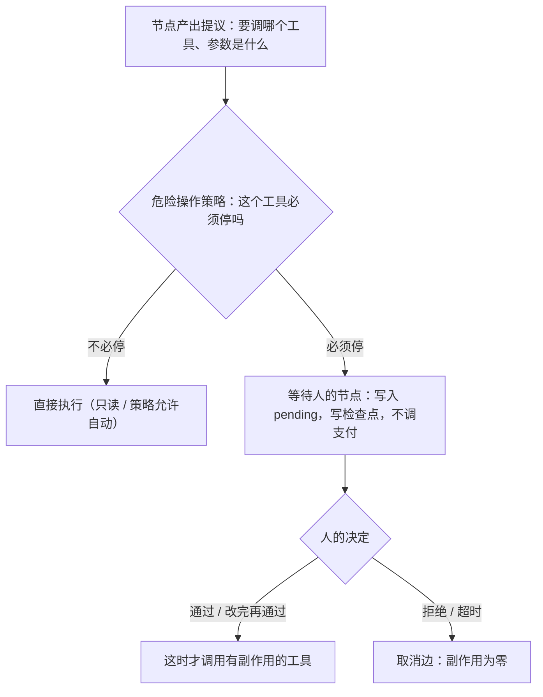

# **Human-in-the-loop**：哪些操作必须人点头才能继续

> 对应模块：[模块 11 · Agent State / Workflow ⭐⭐⭐⭐⭐](./README.md) · 小节进度第 3 条
> 本条由 Coach 按 2026-09-18 本对话 `coach start` 详解首次写入。学习者只减不加。进度表仍 ⬜，在进度表打钩只走 `coach complete`。

- **来源**：本对话 §6.2 详解（对照上一节检查点（Checkpoint）/ 持久恢复（Durable Resume）、第一节状态机、模块 05 工具网关（Tool Gateway）与幂等（Idempotency）、模块 07 Agent 循环、模块 10 记忆（Memory）；Anthropic 人机回圈指南、LangGraph 的 `interrupt_before` 只当概念对照，未打开外部文档页）
- **状态**：已沉淀
- **Demo**：可运行（尚未写出）。说写再写进 `apps/11-Agent-State-Workflow/03-Human-in-the-loop-step-1/`。本小节手写「危险工具执行前停住、等人决定、通过才调用、拒绝则副作用为零」；不要用 LangGraph / LangChain 代劳（框架是模块 13 的事）。

> 各节写什么、达标要求：见仓库根 [AGENTS.md §7.2](../../../AGENTS.md#72-沉淀--小节进度对齐)。

## 是什么

上一节已经能把状态写到磁盘、杀掉进程再接上，并且有副作用的工具不能因为恢复而再做一次。这一节把「等人」接上：有些边，调度器**不许自己走完**，必须停住，等人承担这个决定。

**人机回圈（Human-in-the-loop）** 不是「界面上弹个确认」，也不是「模型再问用户一句」。它是工作流里的一条硬规矩：

> 跑到某一步时，**有副作用的那一下还没有发生**。系统把「模型（或策略）提议要做的事」摊开给人看。人没点头之前，调度器停在等待节点，检查点里记下这笔待审批。人点头之后才真正执行；人拒绝则这条边作废，副作用为零。

接到 Agent 上的那句话：

> **请求已经提出 ≠ 已经执行。** 转账、删数据这类操作，允许模型（或代码）*提议*，不允许它*擅自完成*。

六个要认的对象：

| 对象 | 人话 | 在代码里通常是 |
| -- | -- | -- |
| **人机回圈（Human-in-the-loop）** | 危险一步必须停，等人决定后才继续 | 图上的等待节点 + 恢复时读人的决定 |
| **待审批的操作（pending approval）** | 已经写清楚「要调哪个工具、参数是什么」，但还没调 | `state.pending = { tool, args, status: "waiting" }` |
| **等待人的节点（wait-for-human）** | 当前节点就是「停在这里」，不是「正在转账」 | `currentNode = "waitForHuman"`；调度器走进来**不调支付** |
| **人的决定（human decision）** | 通过 / 拒绝 / 改完参数再通过 | `{ action: "approve" \| "reject" \| "edit", args? }` |
| **危险操作策略（policy）** | 哪些工具、在什么条件下必须停 | 写死的名单或阈值，例如 `transfer` 一律停，`getBalance` 不停 |
| **超时默认（timeout default）** | 人一直不来，系统按安全方向收场 | 通常是**默认拒绝**，不是默认通过 |

和上一节怎么接：等待可能是 40 分钟。等的时候进程会被杀掉。能等人，是因为检查点（Checkpoint）里已经有 `currentNode` 和 `pending`。没有上一节，这一节的「暂停」等于把单子扔进内存，人点头时单已经没了。

和第一节状态机怎么接：`waitForHuman` 就是一个普通节点。出边事先画好：通过 → 执行危险工具；拒绝 → 取消；超时 → 与拒绝同一条安全边。调度器「走一步」仍是：跑节点 → 合并 → 路由 → 验边 → 写 `currentNode`。差别只在于：走进等待节点时，节点函数**不调用**支付 / 删除。

贯穿例子仍可接到上一节的咖啡店（扣会员卡前停一下），本条要能讲清的硬例子是 **转账** 和 **删数据**——执行的那一毫秒之后，状态机自己回不去。

```text
提议 transfer({ to, amount })
        │
        ▼
  策略：transfer 必须停 ──不调支付──→ waitForHuman（写入 pending，写检查点）
                                        ├ 人通过 → 真正调支付 → 下一站
                                        ├ 人拒绝 → cancel（钱没动）
                                        └ 人改金额再通过 → 用改过的参数调支付
```



生活：银行柜员可以*填好*转账单，但盖章、扣款必须主管签字。单子已经写完，钱还在账户上。  
前端：支付页已经算好金额，`POST /pay` 还没发出。确认页不是装饰，是「请求还在浏览器里」。

### 必须停还是不必停（本条要能讲清的核心）

判定只问一件事：**这一下对外发生之后，人后不后悔都很难把世界变回去，而且代价由人或公司承担。**

| 必须停 | 为什么 | 生活 | 前端 |
| -- | -- | -- | -- |
| **转账 / 扣款 / 退款到外部账户** | 钱离开系统，追回靠渠道和对方配合 | 柜员填单后必须主管签字 | 支付确认页 |
| **删数据 / 注销账号 / 丢生产库** | 行删了不一定有完整备份可点回 | 撕合同、砸保险柜 | GitHub 删仓库要输入仓库名 |
| **给真实用户发通知 / 群发邮件 / 公开内容** | 话已经说出去，撤回是另一场公关 | 新闻上了街头，收回来叫更正 | 「确认发送」；定时发布前的预览 |
| **改生产配置 / 开关影响到全站用户** | 配置一生效，所有请求都走新逻辑 | 总电闸，不是卧室的灯 | 功能开关（Feature Flag）的生产环境发布 |

| 不必停（至少不必「转账级」地停） | 为什么 | 注意 |
| -- | -- | -- |
| **只读查询**（查余额、查库存、搜文档） | 没有对外承诺，重跑最多浪费时间和配额 | 查询结果可以过期，但不会把钱转走 |
| **内部草稿**（生成邮件正文、生成退款方案、写 SQL 但不执行） | 还停留在系统内部 | **下一步如果是「真的发送 / 真的执行 SQL」就必须停** |
| **可逆且低代价**（给自己账号加一张待办、写一条调试日志） | 做错了删掉即可 | 「低代价」是产品判断；给全公司发待办就不是低代价 |

记住两句，用来过关：

1. **转账、删数据：必须停。** 不是因为它们「看起来严肃」，是因为执行的那一毫秒之后，状态机自己回不去。
2. **「模型已经很有把握」不能当通行证。** 把握是生成质量，不是授权。授权在人（或写死的策略）手里。

灰色地带按**不可逆 × 影响面**往必须停靠：小额自动、大额暂停（变体 D）；内部员工工具可以松，对客工具必须紧。拿不准时，这一步先停——停错了只是多点一次；不停错了是钱和数据。

### Happy path：数据怎么走

假设用户说：「把我账户里的 5000 元转给张三。」

```text
1. 某个节点让模型（或规则）提出：transfer({ to: "张三", amount: 5000 })
2. 调度器查危险操作策略：transfer 必须停
3. 不调用支付接口
4. 写入 State：
     pending = { tool: "transfer", args: { to, amount }, status: "waiting" }
     currentNode = "waitForHuman"
5. 写检查点（上一节那一套：原子写入、按 runId）
6. 页面展示：将向张三转 5000 元；账本上余额不变
7. 人点「通过」
8. 写入决定 approve，currentNode 走到「真的执行转账」
9. 这时才调支付；账本变化；把这次工具调用编号记进已执行列表
10. 再写检查点，进入下一站
```

人若点「拒绝」：第 7 步之后走取消边，`pending.status = "rejected"`，支付函数一次都不进。  
人若把 5000 改成 500 再通过：执行时用的是**改过的参数**，不是模型当初那份。

生活：主管把单子上的金额划掉改成 500，再盖章。厨房按盖章后的数字做，不按服务员最初的口播。  
前端：确认页允许改地址，提交时 `POST` 的是输入框里的值，不是上一步接口返回的旧地址。

## 为什么（Agent 开发要懂）

Agent 和普通后台任务的差别：下一步往往是模型临时编出来的。模型可以很流畅地写出 `transfer({ to: "张三", amount: 50000 })`。流畅不等于这件事可以被执行。

不懂这一节，会出现这些具体后果：

1. **钱已经出去了，人是事后看到的。** 页面上有「已转账 5 万」的日志，审批流是摆设。客人找的不是「图没画好」，是钱。
2. **删数据同样不可逆。** 生产库删表、把用户账号写成注销，回滚脚本不一定救得回来。
3. **模型提问被当成审批。** 模型问「要转多少」，用户说了数字，系统当作已经批准——用户只是在提供信息，没有看到「将向谁转多少」这份摊开的操作。
4. **只靠页面上的 `window.confirm`。** 人点了确定，请求发出去；接着页面刷新、进程重启，检查点里没有「待审批」，恢复后可能再执行一次，或审批记录对不上。
5. **等人时进程被杀掉，单丢了。** 上一节已经证明：暂停能成立，先要能把状态存住。
6. **超时默认通过。** 凌晨没人值班，系统把「没人反对」当成「同意」，大额转账自己走了。
7. **每一步都问人。** Agent 退化成表单向导，失去「能自己跑完只读段」的价值；人会被问到麻木，真正危险的那一下反而点得太快。

对照前端：GitHub 可以自动跑检查（CI），但合并（merge）进主分支通常要人点。自动跑的是可逆、可重来的检查；人点的是「这段代码从此成为事实」。Agent 里，查余额、起草邮件可以自动；把钱转走、把邮件发给一万个用户，必须人点。

对照模块 05 工具网关（Tool Gateway）：网关可以因为「没权限 / 超额」**自动拒绝**——那是策略替你决定了「不行」。人机回圈是策略说「我不敢替你决定，把决定权交给人」。两层经常叠在一起：没权限的直接拒；有权限但危险的，停下来给人看。

对照模块 07：Agent 循环可以自己决定「下一步调哪个工具」。人机回圈是在循环**外面**加的刹车。没有刹车，循环越能干，越能在一秒钟里把钱转完。

对照模块 10：记忆里可以记下「这个用户上次拒绝过向陌生账户转账」。那是事后经验，**不能**代替这一次的暂停。每一次转账仍要停。

对照上一节：检查点解决「进程死了单还在」；人机回圈解决「单在，但人没点头就不能往下做」。只有检查点、没有等待节点，恢复后调度器会把转账跑完。

## 核心概念的全部变体

人机回圈不是一个单词。漏一种，就讲不清「哪些操作必须人点头才能继续」。

### 变体 A · 必须停 vs 不必停

上面「必须停还是不必停」就是这一变体。数据怎么走的对照：同一张图里，`getBalance` 节点跑完直接路由到下一站；`transfer` 节点**只负责把提议写进 `pending`**，下一站固定是 `waitForHuman`。页面上能同时看见：查询已经返回数字；转账尚未发生。

业务：客服助手可以自动查订单，但「没发货就退款到银行卡」必须停。查是只读；退款是钱。

生活：问柜员「卡里还有多少」自己报数字；说「转 2 万给新收款人」必须主管签字。  
前端：`GET /balance` 直接返回；`POST /transfer` 必须先经过确认页。

判错会怎样：把「查完余额」也做成审批，人点 20 次才能看到一个数字，最后对真正的转账已经麻木。

### 变体 B · 停在执行前（提议已在，副作用为零）

暂停点只有一个合法位置：**支付 / 删除 / 发送 的函数还没被调用。**

不合法的两种「假暂停」：

1. 先转账，再弹「请确认刚才那笔」。那是通知，不是人机回圈。
2. 只在日志里写 `would_transfer`，但代码路径上已经 `await pay()`。日志骗人。

数据怎么走：等待节点的节点函数里，**没有**对支付客户端的调用。执行节点才有。路由在「尚未批准」时不可能把 `currentNode` 写成执行节点。

生活：合同先签字再生效，不是先履约再补签字。  
前端：禁用态的提交按钮；按钮还是 `disabled` 的时候，网络面板里不该出现 `POST /pay`。

判错会怎样：演示里点「通过」前后，假账本余额已经少了——说明暂停是界面，不是调度器。

### 变体 C · 人的三种回法：通过 / 拒绝 / 改完再通过

只做「确定 / 取消」不够。生产里最常见的是：模型金额写错、收款人差一个字，人改完再批，而不是整单作废让模型再编一次。

| 决定 | 下一站 | 副作用 | 下次检查点里该有什么 |
| -- | -- | -- | -- |
| **通过（approve）** | 执行节点，参数用 pending 里那份 | 这时才发生 | 已执行编号；pending 清掉或标 approved |
| **拒绝（reject）** | 取消 / 告诉模型换方案 | **零** | pending 标 rejected；账本不变 |
| **改完再通过（edit then approve）** | 执行节点，参数用**人改过的** | 按新参数发生 | pending.args 是新值；执行日志与新值一致 |

数据怎么走（改参数）：页面提交一份 `{ amount: 500 }` → 服务端只改 `pending.args`，**仍不调支付** → 人再点通过 → 执行节点读的是 500。禁止「一改金额就当批准」。

生活：主管改数字和盖章是两下。改了没盖章，出纳不能付款。  
前端：地址表单的「保存草稿」和「确认下单」是两个按钮。

判错会怎样：改参数的接口顺手把 `status` 写成 approved，钱按新数字走了，人还以为自己只是在改草稿。

### 变体 D · 谁决定要停：写死策略 / 阈值 / 不能靠模型自觉

| 做法 | 适用 | 危险 |
| -- | -- | -- |
| **写死名单** | `transfer` / `deleteUser` / `dropTable` / `sendBroadcast` 一律停 | 名单漏了新工具，新工具会裸奔 |
| **阈值** | 转账 ≤ 20 元自动走，> 20 元停 | 阈值被拆成多笔小额就能绕过；要有「同一单累计」而不是只看单笔 |
| **模型自己决定要不要问人** | 最多当提示 | 模型为了「把任务做完」会跳过询问。**不能当唯一关卡** |
| **另一个模型打风险分** | 辅助排序、提醒人先看哪一单 | 打分模型也有幻觉和偏差，同理不能当唯一关卡 |

本课默认：**危险工具写死必须停**；金额阈值是加码，不是替代名单。模型可以说「建议你审批」，但调度器不读这句话来决定停不停。

数据怎么走：策略函数 `mustPause(toolName, args)` 是普通 TypeScript，不调模型。`toolName === "transfer"` 就返回 true。

生活：金库大门的钥匙制度写在墙上，不是当天值班经理「感觉这人面善」就不开锁。  
前端：路由守卫（Route Guard）看角色表，不看用户在自我介绍里写「我是管理员」。

判错会怎样：System Prompt 写了「转账前必须问用户」，模型某次直接调了 `transfer`。提示词不是运行时关卡。

### 变体 E · 等人期间靠检查点活着（人就在页面 vs 人离开再回来）

两种等人，机制相同，体验不同：

1. **人就在这个页面上**：点完「发起转账」，同一页出现通过 / 拒绝。进程最好也别假设一直活着——刷新页面必须还能看到同一笔待审批。
2. **人离开了**：通知发到即时消息，40 分钟后打开另一台电脑点通过。这期间发版、容器重启都可能发生。

两种都必须：一件任务运行的编号（`runId`）+ 磁盘上的检查点 + `pending`。上一节的「内存表当存档」在这里会直接丢单。

数据怎么走：进入等待节点后立刻写检查点 → 可以杀掉进程 → 用同一个 `runId` 加载 → 页面仍显示「待向张三转 5000」，账本未变 → 再点通过，才执行。

生活：请假单在主管抽屉里过夜，第二天主管仍能批同一张，不是让你重新填一份从而变成两张单。  
前端：把草稿写进 `localStorage`；关标签后打开仍是同一份。差在 Agent 多了「批准后会对外花钱」，所以检查点还要带上「还没执行」的事实。

判错会怎样：演示只在同一次页面会话里点通过，从没刷新、从没停服务。那只能证明按钮，证明不了人机回圈能跨进程。

### 变体 F · 点头之后怎么执行，且不和上一节的幂等打架

人点头，只授权**这一次 pending**。执行时仍要走上一节三道保护：调度器认工具调用编号、同一 id 不重放、工具自身幂等。

| 时机 | 该怎样 |
| -- | -- |
| 人通过，支付成功 | 记已执行；进入下一站；不得因刷新再付 |
| 人通过，支付接口失败 | 这是**节点失败**（第一节状态机的失败边），不是「人拒绝」。人已经同意，钱没扣成。可以重试或走失败边，**不要**把 pending 改成 rejected |
| 人拒绝 | 支付函数零次调用 |
| 人通过后检查点没写成、进程死了 | 恢复后可能再进执行节点 → 靠幂等，钱只少一次（上一节变体 E） |
| 还在等待，从来没通过 | 恢复后仍等待，**不得**把「重启」当成通过 |

生活：主管盖章后银行渠道宕机，不是把申请当成驳回；渠道好了再付同一张单。  
前端：用户点了「确认支付」，接口返回 500；按钮可以重试，重试必须带同一幂等键，不能再弹一次「你是否同意」把同意状态弄丢——除非产品明确要求重新授权。

判错会怎样：把支付失败显示成「已拒绝」，客服以为人驳回了，其实人同意了但渠道挂了。

### 变体 G · 超时：默认拒绝，不是默认通过

人一直不点。系统不能把单子挂到天荒地老（支付渠道会过期、库存会变、攻击者可以碰运气等你值班疏忽）。

安全默认：**超时 = 拒绝。** 「没人反对」不是同意。少数内部低风险工具才可以「超时自动执行」，那必须写在策略里，并且不适用于转账和删数据。

数据怎么走：检查点带 `waitingStartedAt`；加载或定时扫到超时 → 把 pending 标 `timeout_rejected` → 走取消边 → 可以通知人「这单已作废，要做请重新提」。

生活：地铁闸机二维码 60 秒失效，过期不是让你免费进站。  
前端：登录链接过期后要重新发，不会过期自动把你登进管理员。

判错会怎样：为了「流程好跑完」，超时走了执行节点。这等于把审批关卡的钥匙交给了时钟。

### 变体 H · 只在危险边停，不是每一步都问人

人机回圈的覆盖面是**图上的少数边**，不是把调度器改成「每走一步先弹窗」。

同一张客服退款图：

```text
fetchOrder → checkShipment → （已发货）告诉用户，结束
                          → （未发货）waitForHuman → 人通过才 refund
```

查询、判断发货，自动走。只有退款停。

生活：进店点单、做咖啡都不用经理签字；只有刷大额会员卡才叫经理。  
前端：表单每一项输入都自动保存草稿；只有「删除账号」才二次确认。

判错会怎样：每步都问，人会学会无脑点「是」。真正的删数据弹出来时，反射已经是「是」。

### 变体 I · 复核「将要发出去的内容」，仍然停在不可逆之前

有一种看起来像「执行之后再看」：模型先写出邮件正文，人改完字句，再发送。

这**不是**「先发送再审批」。它是两个节点：`draftEmail`（只写 State 里的正文，无副作用）→ `waitForHuman` → `sendEmail`（副作用）。人批的是「可以按这份正文发出去」。

真正的「执行后复核」只适合可逆动作（生成一张内部工单，人看完可以关掉）。转账没有可靠的「先转再问要不要」。

生活：新闻稿先内审再上街头，不是先印一万份再内审。  
前端：内容管理系统（CMS）的「预览」和「发布」是两个按钮；预览不生成对外可访问的正式地址。

判错会怎样：把「已经发给用户的邮件」拿来给人点头，人点拒绝也收不回去。

## 易混点

| # | 容易混成一句 | 差在哪 | 判错会怎样 |
| -- | -- | -- | -- |
| 1 | **人机回圈 vs 模型向用户提问** | 提问是缺信息（热饮还是冰饮）；审批是信息已经够了，副作用马上要发生，必须有人承担责任 | 用户随口说了个数字，系统当成批准，按这个数字转账 |
| 2 | **人机回圈 vs 页面上的 `confirm()`** | `confirm` 绑在这一次页面会话；工作流暂停绑在 `runId` + 检查点 | 刷新后待审批消失，或恢复后当已经同意 |
| 3 | **人机回圈 vs 工具网关自动拒绝** | 自动拒绝是策略已经决定「不行」；人机回圈是策略决定「我不敢替你拍板」 | 没权限的操作拿去烦人；有权限的危险操作却自动过了 |
| 4 | **人机回圈 vs 只记审计日志** | 日志是事后可追责；暂停是事前拦住 | 对账能查出是谁转的，钱已经没了 |
| 5 | **人机回圈 vs 检查点 / 持久恢复** | 检查点解决「进程死了单还在」；人机回圈解决「单在，但人没点头就不能往下做」 | 以为写了检查点就等于有审批；恢复后调度器继续把转账跑完 |
| 6 | **人通过 vs 执行成功** | 通过是授权；渠道还可能失败 | 把支付失败显示成「已拒绝」，客服以为人驳回了，其实人同意了但渠道挂了 |
| 7 | **改参数 vs 批准** | 改的是草稿；批准是另一下 | 改金额的请求顺带执行 |
| 8 | **System Prompt 里的「必须询问」vs 运行时策略** | 提示词是软的；`mustPause()` 是硬的 | 模型某次「为了帮用户」跳过询问 |
| 9 | **内部草稿 vs 已经对外发生** | 邮件正文写在 State 里还没有副作用；点发送才有 | 把「已经生成正文」当成「已经发给用户」 |
| 10 | **超时默认通过 vs 超时默认拒绝** | 「没人反对」不是同意 | 凌晨大额转账自己走了 |

## 例子

每个核心对象至少一条能演一遍的生活 / 前端例子；下面按对象列，避免一条类比打发整节。

**人机回圈**  
生活：银行 APP 给新收款人转 2 万，下一步是短信验证码。验证码没过，银行核心看不到这笔扣款。  
前端：GitHub 可以自动跑检查，合并进主分支要人点。

**待审批的操作**  
生活：柜员填好的转账单躺在主管桌上，金额、收款人已经写上，章还没盖。  
前端：确认页上的 `{ to, amount }`，网络面板里还没有 `POST /pay`。

**等待人的节点**  
生活：单子状态是「待主管签字」，不是「处理中 / 已扣款」。  
前端：`currentNode === "waitForHuman"`，走一步按钮对执行节点是禁用的，只有通过 / 拒绝可点。

**人的决定**  
生活：主管盖章 / 打回 / 改数字再盖章。  
前端：三个按钮：通过、拒绝、先改金额再通过。改金额的请求不触发支付。

**危险操作策略**  
生活：金库钥匙制度写在墙上，不看值班经理当天心情。  
前端：`mustPause("transfer") === true`，`mustPause("getBalance") === false`，函数里不调模型。

**超时默认**  
生活：地铁乘车码 60 秒失效，过期不是免费进站。  
前端：待审批超过时限，状态变成作废，账本不变。

**例子 · 前端场景 1：转账在点头前余额不变**  
点「发起转账」。页面摊开「将向张三转 5000 元」。假账本余额与发起前相同。点「通过」后余额才减少，并能看见一次支付调用。

**例子 · 前端场景 2：只读查询不停**  
同一页点「查余额」，一次点击就返回数字，没有通过 / 拒绝。对照场景 1，停不停由工具名决定。

**例子 · 前端场景 3：拒绝后副作用为零**  
摊开后点「拒绝」。账本不变；支付模拟器调用次数仍为 0；当前节点走到取消，而不是执行。

**例子 · 前端场景 4：改参数不等于批准**  
把 5000 改成 500，提交后 pending 里是 500，余额仍不变。再点通过，扣的是 500。

**例子 · 前端场景 5：等人时杀掉进程，单还在、钱没动**  
进入待审批后停掉服务再启动，同一 `runId` 仍显示「待向张三转 5000」，余额未变。再点通过，只扣一次。

**例子 · 业务串线：客服退款助手**  
用户：「订单 8821 如果还没发货就退款。」自动：拉订单、看物流。已发货：直接回复「已经在路上，不能原路退」，不停。未发货：摊开「将退 299 元到尾号 1234 的卡」，等人。通过才调退款；拒绝则回复「已取消退款，未操作资金」。超时则作废并告诉用户「请重新提交」。杀掉服务再打开，8821 仍停在同一张摊开的单上。

## 需求清单

每条对应一个变体（或变体组）。需求是验收准绳，不是一次性搭完整应用的施工单。Step 生产仍按知识由浅入深。

**需求 1 · 转账 / 删数据在点头前必须停（变体 A / B）**  
- 业务场景：后台要把一笔钱转到外部账户，或删除一条用户数据。  
- 目标：执行前余额 / 行数据不变。  
- 涉及：必须停的判定、停在执行前。  
- 验收：发起之后、人点头之前，假账本或记录仍在；执行节点函数没进；页面能看见摊开的收款人 / 金额或将删除的那一行。

**需求 2 · 只读查询不停（变体 A / H）**  
- 业务场景：同一助手先查余额再决定要不要转。  
- 目标：查余额自动完成。  
- 涉及：必须停 vs 不必停、只在危险边停。  
- 验收：查询一次点完就有数字，中间没有通过 / 拒绝。

**需求 3 · 人可以拒绝，拒绝后副作用为零（变体 C）**  
- 业务场景：摊开后发现收款人不是本人。  
- 目标：单作废。  
- 涉及：人的三种回法里的拒绝。  
- 验收：点拒绝后账本不变；支付 / 删除函数调用次数为 0；当前节点走向取消，不是执行。

**需求 4 · 人可以改参数再通过（变体 C）**  
- 业务场景：模型写成 5000，人改成 500。  
- 目标：按 500 执行。  
- 涉及：改完再通过；改参数 ≠ 批准。  
- 验收：改参数之后、点通过之前仍未扣款；通过后扣的是 500，不是 5000。

**需求 5 · 停不停由写死策略决定（变体 D）**  
- 业务场景：转账工具即使模型没提「请审批」也必须停。  
- 目标：策略函数说了算，不读模型的口头保证。  
- 涉及：写死名单；提示词不是运行时关卡。  
- 验收：名单里的工具 100% 进等待节点；只读工具 0% 进；策略函数不调模型。

**需求 6 · 等人期间杀掉进程，单还在、钱没动（变体 E + 上一节检查点）**  
- 业务场景：待审批挂着时发版。  
- 目标：用同一个任务运行编号恢复。  
- 涉及：检查点、pending、恢复后仍等待。  
- 验收：停服务再开，页面仍是同一笔待审批；通过之后才扣一次；重启不得被当成通过。

**需求 7 · 超时默认拒绝（变体 G）**  
- 业务场景：待审批超过时限无人处理。  
- 目标：按拒绝收场。  
- 涉及：超时默认。  
- 验收：超时后状态是作废 / 拒绝，账本不变；不会自动走进执行节点。

**需求 8 · 人通过后渠道失败，不能显示成人拒绝（变体 F）**  
- 业务场景：批准了，支付接口失败。  
- 目标：走失败边或可重试，pending 不是 rejected。  
- 涉及：人通过 ≠ 执行成功。  
- 验收：页面能区分「人驳回」和「人已同意但执行失败」。

变体 I（复核将要发出去的内容）可观察时并进需求 1 的「摊开」：人看见的是将要发生的操作全文，而不是已经发生后的通知。易混点 1～10 是纯知识变体：过关自检覆盖，不单独立产品功能。

## 取舍

- **手写等待节点，还是直接上 LangGraph 的 interrupt：** 本条手写。框架会把「停在哪、恢复时把人的决定塞回哪」藏进自己的 API。模块 13 再对照框架省了什么、藏了什么。本条演示不要引入该库。
- **危险工具一律停，还是按金额阈值：** 本课默认写死名单（转账 / 删除一律停）。阈值是加码，要防拆成多笔小额绕过。不要用阈值替代名单。
- **超时默认拒绝，还是默认通过：** 转账和删数据必须默认拒绝。「没人反对」不是同意。
- **三种回法是否 Step 1 就做齐：** 不。Step 1 只证明「停住了、通过才发生」。拒绝、改参数、杀进程再批、超时，由浅入深后加。
- **人就在页面上点，还是做成异步工单：** 机制相同，都靠检查点。教学先做同一页的通过按钮，再补「停掉服务再点通过」。
- **本对话节奏：** 先把笔记写进小节文档；演示等你说写再写。

## 踩坑

- **先执行再弹确认。** 那是通知，钱已经没了。
- **只靠 System Prompt 写「必须先问用户」。** 模型为了把任务做完会跳过。
- **把模型向用户提问当成审批。** 用户提供信息 ≠ 用户承担责任。
- **只用 `window.confirm`，检查点里没有 pending。** 刷新或重启后单丢了，或恢复后当已经同意。
- **改参数的接口顺手批准。** 人以为在改草稿，钱已经按新数字走了。
- **超时默认通过。** 把审批关卡的钥匙交给时钟。
- **每一步都问人。** 人点到麻木，危险那一下失去意义。
- **以为写了检查点就等于有人机回圈。** 恢复后调度器会把转账跑完。
- **把支付失败显示成人拒绝。** 客服按驳回处理，其实人已经同意。
- **重启当成通过。** 进程活过来不应改变 pending 的 waiting。
- **只在同一次页面会话里点通过，从没停过服务。** 证明不了等人能跨进程。
- **日志里写了 would_transfer，代码里已经 await pay()。** 日志骗人。

## 契约记录

- 学习者原话「先沉淀文档」：本次只写小节文档，不写演示。正文用完整中文句子；专业词写成「中文（English）」；禁止陪跑口令（包括把「闸门」当工作用词）；禁止缩短词。
- 演示结论已在 `coach start` 判为可运行；默认先不写出，你说写再写。
- 本对话未打开 Anthropic 人机回圈指南的外部页面；「我的链接」保持空，来源写在本文件文首。

## 过关自检

- 举两个必须停的：转账、删数据；再说一个不必停的：查余额。能说出不可逆、谁承担代价。
- 画这条数据路：提议 → 写入 pending → 写检查点 → 人决定 → 才执行或取消。
- 说出三种人的回法，以及「改参数」不等于「批准」。
- 说出为什么 System Prompt 拦不住模型，必须写死策略。
- 说出暂停和检查点各管什么；没有检查点，人点头时会怎样。
- 说出超时为什么默认拒绝。
- 能把「模型提问」「页面 confirm」「网关自动拒」「只记日志」四个都跟这一节划开。
- 人通过之后支付接口失败，应该显示成拒绝还是执行失败？

## 还没搞懂的

- 多人会签、按角色升级（普通转账一人批、超大额要财务）：本课未展开，不影响「转账 / 删数据必须停」。
- 待审批如何推到即时消息、谁来值班：产品通知问题，机制仍是检查点 + 等待节点。
- LangGraph 的 `interrupt_before` / `interrupt_after` 具体 API：模块 13 对照框架时再打开，本课只要求能说出「停在执行前」。
- 人改参数后要不要再让模型看一眼：本课默认执行节点用改过的参数，不强制再问模型。

## 变体对照表

| 变体 | 通俗例子 | 需求清单 | 可观察 | Step 对齐 |
| -- | -- | -- | -- | -- |
| A 必须停 vs 不必停 | 转 2 万要签字；问余额不用 | 需求 1、2 | 是 | Step 1 先做转账停住；只读对照可后补 |
| B 停在执行前 | 合同先签字再生效 | 需求 1 | 是 | Step 1 就要能看见点头前账本不变 |
| C 通过 / 拒绝 / 改完再通过 | 主管改数字和盖章是两下 | 需求 3、4 | 是 | Step 1 先通过；拒绝与改参数后补 |
| D 写死策略，不靠模型自觉 | 金库钥匙写在墙上 | 需求 5 | 是 | 有 mustPause 就能做 |
| E 等人靠检查点 | 请假单过夜仍是同一张 | 需求 6 | 是 | 有 pending 写入检查点之后 |
| F 通过 ≠ 执行成功；拒绝副作用为零 | 盖章后渠道宕机不是驳回 | 需求 3、8 | 是 | 拒绝可先做；渠道失败后补 |
| G 超时默认拒绝 | 乘车码过期不是免费进站 | 需求 7 | 是 | 有等待时间戳之后 |
| H 只在危险边停 | 做咖啡不用经理签字 | 需求 2 | 是 | 与只读对照同一套 |
| I 复核内容仍停在发送前 | 新闻稿先内审再上街头 | 并进需求 1 的摊开 | 部分 | 摊开参数即可见；独立「改正文再发」后补 |
| 易混 1～10 | 提问 ≠ 审批；confirm ≠ 工作流暂停 | 过关自检 | 纯知识 | 不单独立演示 |

## Demo 判断

```text
Demo 判断
- 小节：Human-in-the-loop：哪些操作必须人点头才能继续
- 结论：可运行
- Step 1 第一件事：一次转账（或一次删除）在执行前停住；页面能看见待审批内容和「尚未发生」；点「通过」后账本才变
- 锁定时机：学习者主动决定
- 理由：关上文件后必须看见危险操作在点头前没有发生。只举例子、只画图，分不清「真停」和「先做后弹窗」
- 落点：apps/11-Agent-State-Workflow/03-Human-in-the-loop-step-1/ · yarn app:11-03-human-in-the-loop-step-1（尚未建）
- N 动态：禁止预判；Step 1 只证明停住了。拒绝、改参数、杀进程再批、超时由双方决定下一步再加
- 与 start 预告：一致
```

尚未创建 step-1，因此没有「Demo 子节进度」表（有文件夹再加行，禁止把未来步骤先占成 🔄）。

## §5.4 目标 ↔ 代码整合打钩前检查

跑打钩前检查日期：2026-09-18（首次写入小节文档时预列。演示尚未写出，状态全部为未实现。`coach complete` 时由独立子代理抽清单 + 逐项核对，不以本表为判定依据。）

### §5.4.A 目标 → 代码覆盖

「本条要能讲清」：能举出必须暂停的例子（转账、删数据）

| 目标点 | 状态 | 证据 |
|---|---|---|
| 转账或删数据在人点头前副作用为零，并能在页面上摊开将要发生的操作 | 未实现 | 演示尚未写出 |
| 人点头之后副作用才发生，次数可观察 | 未实现 | 演示尚未写出 |
| 只读查询不必经过通过 / 拒绝 | 未实现 | 演示尚未写出 |

**A 段小结**：0/3 已实现。等你说写演示后再补代码证据。

### §5.4.B 文档 → 代码对齐

| MD 讲点 | 代码里有没有 | 状态 |
|---|---|---|
| 需求 1 · 转账 / 删数据点头前必须停 | 演示尚未写出 | 未实现 |
| 需求 2 · 只读查询不停 | 演示尚未写出 | 未实现 |
| 需求 3 · 拒绝后副作用为零 | 演示尚未写出 | 未实现 |
| 需求 4 · 改参数再通过 | 演示尚未写出 | 未实现 |
| 需求 5 · 写死策略决定停不停 | 演示尚未写出 | 未实现 |
| 需求 6 · 等人期间杀进程单还在 | 演示尚未写出 | 未实现 |
| 需求 7 · 超时默认拒绝 | 演示尚未写出 | 未实现 |
| 需求 8 · 通过后渠道失败 ≠ 人拒绝 | 演示尚未写出 | 未实现 |
| 主流程单独成文件；路由里不埋等待 / 执行 | 演示尚未写出 | 未实现 |

**B 段小结**：0/9 已实现。缺口只许补代码或拆成两条进度，不准在进度表打钩。
