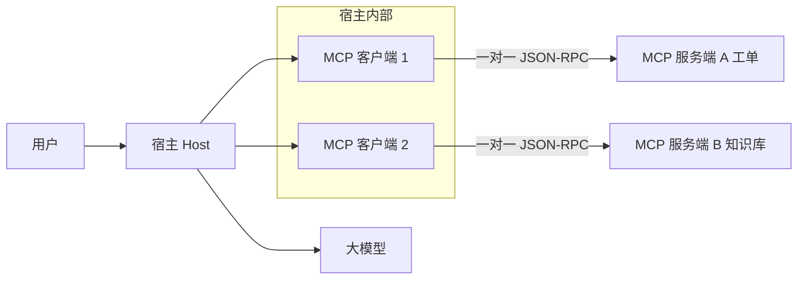

# **MCP 架构**：Client / Server；Tool、Resource、Prompt 三种原语

> 对应模块：[模块 12 · MCP ⭐⭐⭐⭐⭐](./README.md) · 小节进度第 1 条
> 这一小节由 Coach 按 2026-09-18 本对话 `coach start` 详解首次写入。学习者只减不加。进度表仍 ⬜，在进度表打钩只走 `coach complete`。传输层（本机标准输入输出 vs 远程 HTTP）和 Skills 对照分别是本模块第 2、第 3 条，本文件只写和「谁连谁 / 三种原语」有关的边界，不把后面两小节当新课写完。

- **来源**：本对话 `coach start` 详解（对照模块 05 工具调用（Function Calling / Tool Calling）、模块 11 人机回圈；官方架构 [modelcontextprotocol.io · Architecture](https://modelcontextprotocol.io/docs/learn/architecture) 与服务端三种原语控制权表）
- **状态**：已沉淀
- **Demo**：step-1 ✅ step-2 ✅ step-3 ✅（详见下文 `## Demo 子节进度`）

> 各节写什么、达标要求：见仓库根 [AGENTS.md §7.2](../../../AGENTS.md#72-沉淀--小节进度对齐)。

## 是什么

**模型上下文协议（MCP / Model Context Protocol）** 是一份专门给 AI 应用用的「怎么连外部能力」的协议。它不管你用哪家大模型，也不管 Agent 循环怎么写；它只规定：**宿主怎么发现、拿到、调用**外部给来的上下文。

人话：给 AI 应用的 USB 接口。U 盘厂家不用管电脑是哪一家，电脑也不用为每一个 U 盘单独写一套驱动。工具提供方和 Agent 开发者可以是不同的人、不同的公司。

协议底下走 **JSON-RPC 2.0**（带 `id` 的请求 / 带同一 `id` 的响应）。日志里看到 `tools/list`、`tools/call`，就是这一层。握手字段、能力声明的具体形状会随规范版本变；**这一小节不要求背版本号**，要先搞清楚的是：先发现对方有什么能力，再按原语调用。

它有两层。这一小节先把这两层分清楚；管子怎么走、怎么鉴权是下一小节的课：

| 层 | 管什么 | 人话 |
| -- | ------ | ---- |
| **数据层（Data Layer）** | 消息长什么样、有哪些原语、怎么发现能力 | 「说什么」：工具 / 资源 / 提示词模板 |
| **传输层（Transport Layer）** | 这些 JSON 从哪根管子过去、怎么鉴权 | 「走哪条路」：本机进程，或远程 HTTP |

MCP **不规定**宿主如何调大模型。服务端只提供上下文和动作；怎么塞进 `messages`、怎么跑 Agent 循环，仍是宿主自己的事。

### 谁连谁：三个角色，不是两个

很多人说「Cursor 是 MCP 客户端」。更准确：**Cursor 是宿主（Host）**。它在内部为**每一个** MCP 服务端各建一个 **MCP 客户端（MCP Client）**。客户端才是那根一对一的连接。

| 角色 | 是谁 | 干什么 |
| ---- | ---- | ------ |
| **宿主（Host）** | Cursor、Claude Desktop、VS Code、你以后自己写的值班台 | 管界面、管大模型、管「连了哪些服务端」、把各服务端的能力汇总给模型 |
| **客户端（Client）** | 宿主里的一个连接对象，**一个客户端只连一个服务端** | 发 JSON-RPC、做发现、把结果交回宿主 |
| **服务端（Server）** | 文件系统、GitHub、Sentry、你自己写的工单服务 | 对外提供工具 / 资源 / 提示词模板 |

规则：

- 一个宿主可以连很多服务端；每连一个服务端，就多一个客户端。
- **客户端和服务端是一对一专线**，不是一个客户端同时聊三家店。
- 远程服务端（下一小节的 HTTP 形态）可以同时服务很多个客户端——那是「一家店接很多通电话」，每一根连接仍然是一个客户端对一个服务端。
- **大模型不直接连 MCP 服务端。** 模型只跟宿主说话（模块 05 的 `tool_call`）。宿主按工具名把调用交给对应客户端，客户端再发给服务端。
- **用户也不直接连服务端。** 你在 Cursor 里装的是配置；管子在宿主内部。

```text
用户
  │  说话 / 点菜单 / 看界面
  ▼
┌─────────────────────────────────────────────┐
│  宿主 Host（Cursor / 你的值班台）            │
│  · 调大模型                                  │
│  · 汇总所有工具，塞进这一轮 messages         │
│                                             │
│   MCP Client 1          MCP Client 2        │
└───────┬───────────────────────┬─────────────┘
        │ 一对一                │ 一对一
        ▼                       ▼
  MCP Server A            MCP Server B
  （工单后厨）             （知识库后厨）
```



### 三种原语：各干什么，谁说了算

官方按 **谁有权决定用不用** 分成三档。这是这一小节最容易混、也最值得先记住的表：

| 原语 | 谁决定用 | 发现 | 真正用起来 | 典型用途 |
| ---- | -------- | ---- | ---------- | -------- |
| **工具（Tool）** | **模型**（Model-controlled） | `tools/list` | `tools/call` | 有动作：建工单、查库存、写文件、调 HTTP |
| **资源（Resource）** | **应用 / 宿主**（Application-controlled） | `resources/list` | `resources/read`（用 URI 去读） | 给上下文：政策文档、数据库表结构、当前工单详情 |
| **提示词模板（Prompt 原语）** | **用户**（User-controlled） | `prompts/list` | `prompts/get`（可带参数，服务端填好再返回） | 可复用话术 / 斜杠命令 / 菜单项 |

三种原语都是：**先 list 知道有什么，再按类型去 call / read / get**。清单可以随权限、环境变。服务端还可以通知「列表变了」，客户端再拉一次 list。第一步演示只要能看见三份 list；列表会变以后再加深。

MCP 还有服务端反过来问宿主的能力，例如 **征求用户输入（Elicitation）**：缺手机号时让宿主弹输入框。方向仍是「服务端请求、宿主找用户」，不是服务端直连用户。这一小节知道「不只有客户端 → 服务端」即可，不展开实现。旧文章里的 **采样（Sampling）**（服务端让宿主帮它调模型）在较新的协议版本里已标过时；新实现应让需要模型的那一方自己调模型 API。

## 为什么（Agent 开发要懂）

模块 05 的工具调用没有消失：模型开口说「我要调哪个工具、参数是什么」，宿主的代码去执行，再把结果塞回对话。MCP **不是**另一种工具调用写法。

MCP 多解决的是：**工具从哪来、谁维护、怎么换宿主还能用**。

| 没 MCP 时 | 有 MCP 时 | 不懂会怎样 |
| --------- | --------- | ---------- |
| 每个 Agent 自己在代码里写死 `tools` 数组 | 工具提供方起一个 MCP 服务端，按标准暴露 | 换 Cursor / 自建值班台，工具要重写一遍 |
| 知识库文档、退款话术、下单接口混在同一坨 `tools` 里 | 三种原语分清：做事 / 给数据 / 给模板，谁决定用也不一样 | 模型乱调只读文档，或该人点的菜单变成模型碰运气 |
| 工具函数写在 Agent 进程里 | 工具函数写在服务端进程里，宿主只做发现和路由 | 画架构时以为接了 MCP 就可以不写 Agent 循环 |

判错的典型后果：去 OpenAI 文档里找 `mcp/` 字段，跟 `tool_call` 对字段名——对不上，也学不到解耦。模块 README 的常见坑就是这句话：把 MCP 当成「一种新的工具调用写法」。它的价值在于**解耦和复用**。

拓扑判错的后果：把三台服务端画成连在同一个客户端上，排障时不知道该断哪根连接。

## 易混点

**1. 宿主 ≠ 客户端**  
说「Cursor 是 MCP Client」时，漏掉了「一个宿主里有很多个一对一客户端」。图会画错，日志会对错进程。

**2. MCP ≠ 新的工具调用协议**  
MCP 解决「工具从哪来」；工具调用解决「模型和宿主怎么握手」。宿主拿到 MCP 工具之后，仍然走模块 05：塞进请求的 `tools` → 模型返回 `tool_call` → 宿主执行（此时执行 = 交给对应 MCP 客户端发 `tools/call`）→ `tool_result` 塞回 messages。

**3. 工具 / 资源 / 提示词模板 不是三种「差不多的 list」**  
差在控制权。做成同一个按钮「全部当工具给模型」：资源会乱调、模板会失灵、副作用边界会糊。

**4. 提示词模板（Prompt 原语）≠ 模块 03 的 System / User 提示词**  
模块 03 说的是这一轮 `messages` 里的角色。MCP 的 Prompt 原语说的是：服务端打包好的一套模板，由**用户挑选**后才变成那些 messages。

**5. 资源 ≠ RAG 流水线**  
资源只是「服务端用 URI 把一份数据递出来」。宿主可以拿它去喂检索增强生成（RAG），也可以整份塞进上下文。资源不是检索算法。这一小节不换成 RAG 课。

**6. 服务端不负责「怎么用大模型」**  
MCP 不规定宿主如何调 LLM。采样（Sampling）已过时，不要当现行必会。

**7. 和后面两小节的边界**  
本机标准输入输出 vs 远程 HTTP、按用户鉴权：下一小节。这里只需要知道管子可以是本机进程，也可以是远程 HTTP。  
Skills / `AGENTS.md`：下下小节。Skills 是把领域行为打成说明打包进宿主；MCP 是连外部工具和数据。不要这节混成一个词。

**8. 和「直接在代码里写 tools 数组」**  
自己写死也可以工作。MCP 的收益出现在：工具要给多个宿主用、工具由别的团队维护、要在 Cursor 和自建值班台之间复用同一份服务端。单个演示里写死 tools 并不「错」，只是没有解耦。

## 例子

贯穿场景：电商客服值班台要办退款。工单系统一组能力，政策知识库一组能力，话术一组能力。

### 例子 1 · 宿主 / 客户端 / 服务端（拓扑）

生活：点菜 App 是宿主。跟「工单后厨」的专线电话是客户端 1，跟「知识库后厨」的专线电话是客户端 2。你（用户）只跟 App 说话，不直接进后厨。后厨大脑（大模型）也不自己拨后厨的电话，是 App 转的。

前端：值班台页面是宿主。配置里写了两台 MCP 服务端，运行时就有两个客户端对象。工单相关的 `tools/call` 只打到服务端 A；政策 `resources/read` 只打到服务端 B。

数据怎么走：宿主启动 → 为每台服务端建一个客户端 → 能力发现 → 各拉 list → 宿主汇总。没有「一个客户端连两台服务端」。

### 例子 2 · 工具（模型决定动手）

生活：你跟点菜 App 说「来份番茄炒蛋」。App 已经有本店能做的菜列表。后厨大脑决定做哪一道。App 打电话（`tools/call`），后厨真的下锅。

前端：用户说「给订单 A-1001 开一张退款工单」。宿主已从工单服务端的 `tools/list` 拿到 `create_ticket`，把它转成发给大模型的 `tools` 项。模型选出该工具并填 `orderId`。宿主不自己写死 `fetch('/api/tickets')`，而是让对应客户端发 `tools/call`。服务端内部才去打工单 HTTP API。

和模块 05 的差：模块 05 的工具函数写在 Agent 进程里；MCP 的工具函数写在服务端进程里。模型侧协议没变。

判错：把「读政策文档」也做成工具。模型可能每次都去「调用」它，又贵又不可控。

### 例子 3 · 资源（应用决定塞上下文）

生活：服务员把「今日菜单和过敏原说明」放到桌上——这不是你点的菜，是店里决定你下单前必须看见的信息。菜单 = 资源；「去做这道菜」= 工具。

前端：打开工单 A-1001 时，宿主（不是模型）先 `resources/read` 读 `policy://return-2026` 或 `ticket://A-1001`，把正文放进这一轮系统提示词或上下文。模型已经「看见」材料，不必再调一个 `get_policy` 工具——除非你就是想让模型自己决定要不要拉。默认：资源归应用拉，工具归模型选。

判错：从不把稳定政策当资源挂上，每次靠模型碰运气检索。引用对不齐。

### 例子 4 · 提示词模板（用户点菜单）

生活：奶茶店墙上的「套餐 A / 套餐 B」。你点套餐 B，店员按配方做。套餐由门店（服务端）维护，换一家 App（宿主）墙上还是同一套套餐。

前端：客服点「插入退款话术」，宿主 `prompts/get`，参数 `{ orderId: "A-1001", reason: "七天无理由" }`。服务端返回带 Few-shot 的消息数组。宿主放进当前对话再发给模型。模型是「按模板写回复」，不是自己发明客服口径。

判错：把话术做成工具，让模型调用 `get_refund_script`。该用时不用、不该用时乱用。

### 例子 5 · 同一轮退款，三种原语一起出现（对照）

用户：「订单 A-1001 要退款，按最新政策回。」

| 走哪条 | 谁发起 | 协议方法 | 若走错会怎样 |
| ------ | ------ | -------- | ------------ |
| 宿主先读 `policy://return-2026` | 应用 | `resources/read` | 政策稳定、可引用；不占一次模型选工具 |
| 用户点「退款话术」 | 用户 | `prompts/get` | 口径统一；模型少自由发挥 |
| 模型再调 `create_ticket` | 模型 | `tools/call` | 真的留下工单；有副作用，该过确认 |

三步可以出现在同一轮对话里，但**发起人不同**。这就是「三种原语各干什么」。

### 例子 6 · 解耦：换宿主不必重写工具

生活：同一家中央厨房，既能给自己的点菜 App 供餐，也能给第三方外卖 App 供餐。菜品定义在厨房，不在 App 源码里。

前端：工单服务端只维护 `create_ticket` 的描述和实现。自建值班台用发现来填工具表；以后接进 Cursor，还是同一份服务端，不必把函数再抄一份进 Cursor 插件。

## 变体对照（需求清单的索引）

| 变体 | 对应例子 | 需求 |
| ---- | -------- | ---- |
| 拓扑：1 宿主 · N 客户端 · N 服务端，客户端一对一 | 例子 1 | 需求 1 |
| 工具：模型控制，list 再 call | 例子 2 | 需求 2 |
| 资源：应用控制，list 再 read | 例子 3 | 需求 3 |
| 提示词模板：用户控制，list 再 get | 例子 4 | 需求 4 |
| 三原语对照 / 走错 | 例子 5 | 需求 5 |
| 解耦复用：工具在服务端，宿主只发现 | 例子 6 | 需求 6 |
| 传输层只有「存在本机 / 远程两种管子」 | 是什么 · 两层表 | 纯知识，不单列演示 |
| 服务端反向问用户（征求用户输入） | 是什么末段 | 纯知识 |

## 需求清单

验收准绳，不是 step 生产的驱动器。step 仍按知识动态推进；`coach complete` 在进度表打钩时才按需求逐条对。场景串成同一个电商客服值班台。

**需求 1 · 谁连谁看得见**  
- 业务场景：值班台要同时用「工单」和「知识库」两台 MCP 服务端。  
- 目标：打开页面能指出宿主、两根客户端、两台服务端，谁和谁是一对一。  
- 涉及本节哪些知识点：宿主 / 客户端 / 服务端拓扑。  
- 验收标准：图上或返回里能看出客户端 1 只打到服务端 A、客户端 2 只打到服务端 B；没有「一个客户端连两台服务端」。

**需求 2 · 工具由模型用**  
- 业务场景：用户说「给 A-1001 建退款工单」。  
- 目标：工单服务端暴露 `create_ticket`，经发现后出现在给模型的工具表里，调用走 `tools/call`。  
- 涉及本节哪些知识点：工具原语、发现后再调用、和模块 05 的衔接。  
- 验收标准：能看到 `tools/list` 里有该工具；一次调用后服务端真的留下工单（或明确的模拟工单对象），不是只打印了文案。

**需求 3 · 资源由应用塞**  
- 业务场景：打开工单页时，值班台自动带上「现行退货政策」。  
- 目标：政策以资源 URI 暴露，由宿主 `resources/read`，不经过模型选工具。  
- 涉及本节哪些知识点：资源原语、应用控制。  
- 验收标准：能看到 `resources/list` 与一次 `resources/read`；政策正文出现在「准备发给模型的上下文」里，且这次没有 `tools/call`。

**需求 4 · 提示词模板由用户点**  
- 业务场景：客服点菜单「退款话术」。  
- 目标：`prompts/list` 能列出该模板；`prompts/get` 带参数返回填好的消息。  
- 涉及本节哪些知识点：提示词模板原语、用户控制。  
- 验收标准：点菜单才取模板；模型没有自己 `tool_call` 出这份话术。

**需求 5 · 三种原语对照，不能混**  
- 业务场景：同一轮「退款」里，政策 / 话术 / 建单同时存在。  
- 目标：页面上三列对照：谁发起、哪条方法、有没有副作用。  
- 涉及本节哪些知识点：控制权表、易混点 3。  
- 验收标准：把「读政策」做成工具、或把「建工单」做成资源，能在对照里看出走错。

**需求 6 · 解耦：换宿主不必重写工具**  
- 业务场景：同一工单服务端，既给自建值班台用，以后也要给 Cursor 用。  
- 目标：工具定义只在服务端；宿主只做发现和路由。  
- 涉及本节哪些知识点：MCP 相对「代码里写死 tools」多解决了什么。  
- 验收标准：能讲清「工具提供方 ≠ 值班台作者」；清单来自服务端的 list，不是宿主源码里写死的唯一一份。

## 取舍

| 做法 | 什么时候用 | 代价 |
| ---- | ---------- | ---- |
| 在 Agent 进程里写死 `tools` 数组 | 单个演示、工具不会给别人用、你就是唯一维护者 | 换宿主要重写；三种「给模型的东西」容易混成工具 |
| 用 MCP 服务端暴露能力 | 工具 / 文档 / 话术要给多个宿主用，或由别的团队维护 | 多一层发现和路由；要搞清谁连谁 |
| 把「读文档」做成工具 | 你就是想让模型自己决定要不要拉、何时拉 | 贵、不可控、和资源原语抢职责 |
| 把稳定政策做成资源，由宿主塞 | 每场对话几乎都需要同一份材料 | 宿主要写「何时 read」的产品逻辑 |
| 把话术做成提示词模板，给人点 | 口径必须统一、不该由模型发明 | 多一步人机；模型少自由发挥 |

这一小节默认教学取向：值班台这种产品，政策走资源、话术走模板、建单走工具。不是「永远不能把读文档做成工具」，是先认控制权再选。

危险工具仍建议人点头（模块 11 人机回圈、模块 05 工具网关）。MCP 规范也写了：有副作用的调用，宿主应该让人能拒绝。实现放到后面的演示加深，不在这一小节一次做完。

## 踩坑

- **把 MCP 当成新的 `tool_call` 字段。** 模型侧还是模块 05。MCP 是宿主怎么从外部标准服务端把工具 / 资源 / 模板装进来。
- **一个客户端画成连很多服务端。** 协议是一对一专线。多服务端 = 宿主里多个客户端。
- **三种 list 做成同一个「能力列表」给模型。** 只有工具是模型控制；资源是应用控制；模板是用户控制。
- **在这一小节把传输层和鉴权讲完、把 Skills 讲完。** 那是后面两条进度。这里只点边界。
- **拿旧博客里的采样（Sampling）当现行能力。** 较新规范已标过时。

## Demo 子节进度

| 状态 | 子节 | 本子节教学点 |
| ---- | ---- | ------------ |
| ✅ | step-1 | 总览：初始化（initialize）+ 工具发现（tools/list）。子页：调用工具（tools/call · 真去做一杯拿铁）、资源原语（resources/list + read）、提示词模板（prompts/list + get）。三原语各自独立走一遍。 |
| ✅ | step-2 | 三原语对照（同一轮退款 · 政策/话术/建单）。三栏独立请求 + 前端 Promise.all 并行触发 + 服务端不打包跑。 |
| ✅ | step-3 | 拓扑（1 宿主 · 2 客户端 · 2 服务端一对一专线）+ 解耦（切换宿主接入，工具定义只在服务端）。ticket=tools / kb=resources+prompts；切换 hostId 验证响应只来自服务端 catalog。 |

## 过关自检

关上文件后还能讲出来（对应进度表「本条要能讲清」）：

1. **谁连谁**：用户 ↔ 宿主；宿主内部每个服务端一个客户端；客户端与服务端一对一；大模型只跟宿主做工具调用，不直连服务端。
2. **三种原语**：工具 = 模型决定的动作（`tools/list` → `tools/call`）；资源 = 应用决定塞进上下文的数据（`resources/list` → `resources/read`）；提示词模板 = 用户点选的可复用话术（`prompts/list` → `prompts/get`）。
3. **MCP 相对直接写工具**：多的是标准发现和解耦，不是另一套 `tool_call` 字段。

加问（能答则这一小节够用，不要求背规范版本）：

- 同一轮退款里，政策、话术、建单分别该走哪条原语？谁发起？
- 为什么说「Cursor 是宿主」比「Cursor 是 MCP 客户端」更准？

## 还没搞懂的

- JSON-RPC 握手的具体字段（`initialize` 还是 `server/discover`、是否每条请求带 `_meta`）随规范版本在变。这一小节只要求「先发现再调用」。要对着某一版规范写生产客户端时，以当时的官方规范页为准，不要背这一份笔记里的字段快照。
- 列表变更通知、分页游标、资源订阅：知道存在，这一小节的演示不要求。
- 征求用户输入（Elicitation）的完整回合：这一小节只点方向，未实现。
- 把自写服务端接进 Cursor / Claude Code：属于模块验收，跨后面小节，这一小节不假装已经做完。
