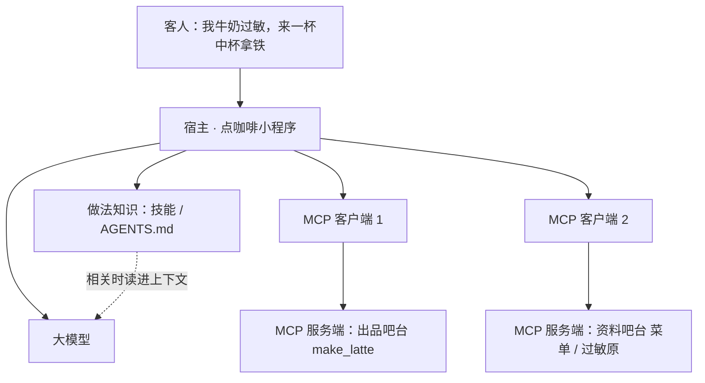

# **Skills vs MCP**：MCP 是连工具的协议；Skills / AGENTS.md 是打包领域行为

> 对应模块：[模块 12 · MCP ⭐⭐⭐⭐⭐](./README.md) · 小节进度第 3 条
> 这一小节由 Coach 按 2026-09-19 本对话 `coach start` 详解首次写入。贯穿场景按学习者要求与第 1、第 2 小节演示对齐为**点咖啡小程序 / 吧台**（工具 `make_latte`、资源 `cafe://today-menu` / `cafe://allergy-info`、提示词模板 `customer_service_greeting` / `refund_response`），不用值班台退款当主例子。学习者只减不加。进度表仍 ⬜，在进度表打钩只走 `coach complete`。模块 16 才会专门讲 Coding Agent 里怎么用规则文件约束写代码；本文件只划界，不把那一小节当新课写完。

- **来源**：本对话 `coach start` 详解（对照本模块第 1 条三种原语、第 2 条传输与鉴权、模块 05 工具调用（Function Calling / Tool Calling）；官方对照 [Extending Claude's capabilities with skills and MCP](https://claude.com/blog/extending-claude-capabilities-with-skills-mcp-servers) · [Agent Skills](https://www.anthropic.com/engineering/equipping-agents-for-the-real-world-with-agent-skills)）+ 本对话要求把例子改成点咖啡
- **状态**：已沉淀
- **Demo**：可运行 · 已写出 `apps/12-MCP/03-Skills-vs-MCP-step-1/`（见 [## Demo 子节进度](#demo-子节进度)；step-1 仍是工作区，尚未锁定）

> 各节写什么、达标要求：见仓库根 [AGENTS.md §7.2](../../../AGENTS.md#72-沉淀--小节进度对齐)。

## 是什么

**一句话划界**：模型上下文协议（MCP / Model Context Protocol）给人的是「能访问什么」；技能（Skills / Agent Skills）和仓库规则文件（`AGENTS.md` / `SKILL.md`）给人的是「拿到手之后按你们店的规矩怎么做」。

官方原话更短：你在解释 **怎么做一件事**，那是技能；你需要模型 **去访问一样东西**，那是 MCP。两者不互相替换。最强的工作流两边都要。

上一节已经会画：宿主（Host）里面为每一台 MCP 服务端各建一个客户端；管子可以是本机标准输入输出（stdio），也可以是带鉴权的远程可流式 HTTP（Streamable HTTP）。那一节解决的是 **吧台从哪根管子来、怎么按用户验身份**。这一节补的是另一层：接上了 `make_latte`，模型仍可能不看过敏原、不看今日菜单，直接做一杯奶咖给过敏客人。

| 层 | 装什么 | 人话（点咖啡） | 典型载体 |
| -- | ------ | -------------- | -------- |
| **连接能力（tool connectivity）** | 工具（Tool）、资源（Resource）、提示词模板（Prompt 原语） | 吧台真的有机子、有今日菜单、有客人点选的话术套餐 | MCP 服务端（上一节 `demo-cafe-mcp-stdio` / HTTP 吧台） |
| **做法知识（procedural knowledge）** | 步骤、标准、边界、什么叫做完 | 这家店的出杯流程：先看菜单和过敏原，再决定做不做拿铁 | 技能包、`AGENTS.md`、`SKILL.md` |

MCP **不是**一种新的工具调用写法——第 1 条已经划过。技能也 **不是**一种新的 MCP。技能不规定 JSON-RPC 2.0，不规定 `tools/list`，也不替你做 OAuth。它就是把「怎么做」打成一份可发现、可复用、常常按需加载的说明书。

### 技能（Skills / Agent Skills）是什么

Anthropic 把 **Agent Skills** 做成一种可跨产品用的打包方式：一个文件夹，里面至少有一份 `SKILL.md`，还可以带参考资料、模板、可选脚本。宿主先只看见「有哪些技能、各干什么」的短目录；真做到相关任务时，再把这份说明书读进上下文。

人话：不是给点咖啡小程序再插一根 USB，是给它一本 **新店员入职手册**，而且不是每天把全店手册塞进书包。今天有人点拿铁，才打开「怎么出一杯拿铁」那一册。

技能里常见的东西：

- **指令**：先读今日菜单、客人提到过敏就先读过敏原说明、拿铁含奶则改推荐美式
- **标准**：回复必须带杯型和大约分钟数；不准编造菜单上没有的饮品
- **模板 / 资产**：推荐语骨架、过敏提醒格式
- **可选脚本**：本地算价、转杯型枚举（这是「手册附带的小计算器」，不是 MCP 那种对外协议）

### `AGENTS.md` 是什么（和 `SKILL.md` 同一层，加载时机不同）

本仓库根上的 `AGENTS.md` 不是 MCP 服务端。它没有 `tools/list`。它做的事情是约束 Agent **怎么当教练**（默认学习模式、当前小节锁定、不要讲黑话）。Cursor、Claude Code、Codex 都认这种「项目里放一份规则文件」的做法。Claude Code 还用 `CLAUDE.md` 当入口，再指到同一份 `AGENTS.md`。

换到点咖啡小程序：仓库规则文件写的是 **每次打开都生效的底线**，例如「不准假装已经做好了」「不准编造杯型」。`SKILL.md` 写的是 **某一类任务的打法**，例如「过敏客人怎么点」。

`SKILL.md` 和 `AGENTS.md` **不是两种协议**，是同一层做法知识的两种打包形态：

| 形态 | 什么时候进上下文 | 点咖啡里适合写什么 |
| ---- | ---------------- | ------------------ |
| **`AGENTS.md`（以及同类的仓库规则文件）** | 打开这个项目，规则就在 | 这个小程序一直要遵守的底线：不准编造饮品、密钥不进 git |
| **`SKILL.md`（技能包）** | 任务相关才加载 | 出杯、过敏改推、写本周销量周报 |

官方对比表里还有一列对 MCP 很重要：**MCP 一旦连上，工具定义通常提前占着上下文；技能按需加载，用来省 Token。** 仓库规则文件更接近「提前占着」；技能包更接近「用到再打开」。

### 它们怎么叠（不是二选一）

官方硬件店比喻换成咖啡店：

- MCP = 吧台上的机子和菜单夹（`make_latte`、`cafe://today-menu`、`cafe://allergy-info` 都在，小程序够得着）
- 技能 = 店长教的出杯规矩（先问过敏、再对菜单、最后才做）
- 只有机子：模型会猜，猜错就给牛奶过敏的客人做了拿铁
- 只有规矩：模型能背流程，但机子没插上——做不出真咖啡
- 两边都有：按你们店的规矩，去用真吧台

组合关系也是官方写明的，不是教学自造分类：

- **一个技能可以编排多台 MCP 服务端**（先读知识库吧台的过敏原资源，再调出品吧台的 `make_latte`）
- **一台 MCP 服务端可以被很多个技能用**（同一套 `make_latte`：出杯技能用它，下午茶套餐技能也用它）

```text
客人：「我牛奶过敏，来一杯中杯拿铁」
        │
        ▼
┌─────────────────────────────────────────┐
│ 宿主（点咖啡小程序）                      │
│                                         │
│  做法知识（按需或常驻）                    │
│  · 技能：提到过敏先读过敏原；拿铁含奶则改推美式 │
│  · AGENTS.md：不准假装已经做好了          │
│                                         │
│  连接能力                                 │
│  · MCP 客户端 ──出品吧台（make_latte）     │
│  · MCP 客户端 ──资料吧台（今日菜单 / 过敏原）│
└─────────────────────────────────────────┘
```



## 为什么（Agent 开发要懂）

上一节解决「吧台从哪根管子来、远程怎么鉴权」。这一节解决的是：**接上了 `make_latte`，模型仍可能按通用咖啡店习惯乱做。**

| 只懂 MCP、不懂技能 | 点咖啡里会怎样 |
| -- | -- |
| 小程序接了 `make_latte`，还没写出杯技能 | 客人说「我牛奶过敏，来一杯拿铁」，模型直接 `tools/call`，奶咖就出去了 |
| 工具描述里塞进整本店规 | 每个工具定义又臭又长，连上就占 Token；换一份「下午茶套餐」技能还要改吧台服务端 |
| 把手册写进这一轮的系统提示词（System Prompt） | 换一个对话窗口要重贴；菜单改价要找所有粘贴点；客人只问「今天有摩卡吗」也要背着出杯全文 |

| 只懂技能、不懂 MCP | 点咖啡里会怎样 |
| -- | -- |
| `SKILL.md` 写「请调用 make_latte」 | 没有真连接，模型只能空口说「我去给您做」 |
| 把「看今日菜单」写成一段话，不提供资源 | 模型开始编造「今日特供燕麦拿铁」（菜单上没有） |

| 两层拆开 | 得到什么 |
| -- | -- |
| MCP 服务端只写「怎么正确调用这个吧台」 | 出品团队可以是另一组人；店规换了不用改 `make_latte` 的入参 |
| 技能只写「你们店的出杯和验收」 | 同一套吧台，出杯技能和套餐技能都能用 |
| 仓库规则文件写「这个小程序的底线」 | 换一轮对话，仍不准假装做好了 |

不懂这一节，最常见的产品后果不是「少写一个文件」，而是两件更贵的事：

1. **把说明书全塞进系统提示词**——上下文窗口（Context Window）被店规占满，真正的 `tools/call` 返回值（「拿铁做好了：中杯，约 3 分钟」）被挤掉。
2. **把做法知识做成假工具**——吧台出现一个叫 `apply_latte_policy` 的工具，里面其实只返回一段「本店出杯须知……」。模型以为自己「调用了店规」，其实没有做任何有副作用的出杯，也没有按用户身份鉴权。排障时你会在 MCP 日志里找不到真正的 `make_latte`。

## 易混点

**1. 技能 ≠ 一种 MCP，MCP ≠ 一种技能**  
混成一个词之后，你会去 MCP 规范里找 `SKILL.md` 字段，或去技能目录里找 OAuth。两边都找不到。它们叠在一起用，不互相实现对方。

**2. 技能 ≠ 再写一套工具调用**  
模型决定调哪个工具，仍然是模块 05 那一圈：`tools` → `tool_call` → 执行 → `tool_result`。技能只影响「模型看见哪些出杯规矩、按什么顺序选工具」。真做一杯那一跳，该走 MCP 的 `tools/call("make_latte")`，还是走本进程函数，是连接层的事。

**3. `AGENTS.md` ≠ MCP 服务端**  
本仓库的 `AGENTS.md` 再厚，也不会让 Cursor 多出 `make_latte` 这个工具。它只改变 Agent **怎么当教练**。要点一杯真拿铁，还得第 1、第 2 条那种吧台服务端。

**4. MCP 提示词模板 ≠ 技能 ≠ 系统提示词**  
上一节三种原语里，提示词模板（Prompt 原语）是 **用户挑选** 的：`prompts/list` → 客人点「客服开场白」→ `prompts/get("customer_service_greeting")` → 服务端填参返回一套 messages。技能是任务相关时由宿主发现并加载的做法知识。系统提示词是这一轮请求里的角色设定。三个入口、三种控制权，不要做成同一个「提示词」按钮。

**5. 工具描述里的用法提示 ≠ 技能**  
MCP 可以写「`cupSize` 只能是小杯 / 中杯 / 大杯」。不要把「牛奶过敏必须改推美式」写进工具描述——那是店规，会随运营变，不该绑死在吧台提供方。官方底线：MCP 侧只写「怎么正确调用这个服务器」；技能侧才写「你们店的流程」。两边指令打架时（服务端说返回纯文本，技能说排成 Markdown 菜单），模型只能猜。

**6. 技能里的可选脚本 ≠ MCP 工具**  
技能文件夹可以带一个本地算价脚本，在沙箱里跑。这不是「又发明了一种 MCP」。没有发现协议、没有按用户远程鉴权、通常也不能给另一个宿主当标准接口复用。需要跨宿主、按用户隔离的出杯能力，仍走 MCP。

**7. 资源（Resource）≠ 技能**  
上一节的资源是服务端用 URI 递出来的 **事实数据**（`cafe://today-menu` 的价格、`cafe://allergy-info` 的「拿铁含牛奶」）。技能是 **怎么用这些事实**（客人提到过敏，先读过敏原，再决定调不调 `make_latte`）。

**8. 不要提前把模块 16 学完**  
Coding Agent 怎么用规则文件约束「改哪几个文件、用 patch 不要整文件重写」，是模块 16 的课。这一节只要能划界：规则文件是做法知识，不是工具协议。

## 例子

贯穿两句客人的话，和上一节演示同一家店：

- 「来一杯中杯拿铁。」
- 「我牛奶过敏，来一杯拿铁。」

吧台上已经有的连接（第 1、第 2 条演示里的真名字）：

- 工具：`make_latte`（参数 `cupSize`：小杯 / 中杯 / 大杯）
- 资源：`cafe://today-menu`（或 stdio 步的 `menu://today`）、`cafe://allergy-info`
- 提示词模板：`customer_service_greeting`、`refund_response`（后者只当「用户点选的套餐」对照，不当这一节主流程）

### 例子 1 · 只有 MCP，没有技能（变体 1）

生活：吧台机子全开着，没人教店员先问过敏。客人说「我牛奶过敏，来一杯拿铁」，新店员直接做了。

前端：点咖啡小程序的工具列表是满的，没有「出杯手册」卡片。点「处理这句点单」，模型走最短路径：`tools/call("make_latte", { cupSize: "中杯" })`。

数据怎么走：宿主已把 `make_latte` 的工具定义提前放进上下文 → 模型按通用习惯猜 → 真的出杯。菜单和过敏原资源即使已注册，没人规定必须先读。

判错后果：过敏客人喝到奶；MCP 日志看起来「成功做了一杯」，业务上翻车。

### 例子 2 · 只有技能，没有 MCP（变体 2）

生活：口袋里有完整出杯步骤，店里没有咖啡机。

前端：页面上能打开 `SKILL.md`（先读过敏原、拿铁含奶则改推美式），工具列表是空的。输出区只有「拟采取的步骤」，没有 `tools/call` 返回值。

数据怎么走：技能文本进上下文 → 模型能背「先读 `cafe://allergy-info`」→ 没有客户端，计划停在纸上。再问「做好了没有」，模型可能编造「拿铁做好了：中杯，约 3 分钟」。

判错后果：演示上看起来「很懂店规」，客人杯子是空的；还可能违反 `AGENTS.md` 里「不准假装已经做好了」。

### 例子 3 · 两边都有（变体 3）

生活：店员按手册，去机子上真做、或真的改推美式。

前端：左边是 MCP 工具 / 资源清单和一次真实（或固定剧本写明的）调用顺序；右边是技能里被用到的那几条；中间能对上「先读过敏原，再决定做不做拿铁」。

数据怎么走：

1. 客人说「我牛奶过敏，来一杯中杯拿铁」。
2. 宿主发现「出杯技能」相关，把说明书读进这一轮上下文（按需，不是把周报技能全文也塞进去）。
3. `AGENTS.md` 里的底线如果常驻，也在：不准假装已经做好了。
4. 模型按说明书决定：先让宿主读 `cafe://allergy-info`（资源是应用控制，上一节已讲：可以由宿主按技能要求去 `resources/read`）。
5. 正文写着「拿铁、摩卡：含牛奶」。技能规定：不能做拿铁，改推荐美式；在客人确认前不要调 `make_latte`。
6. 若客人改口「那来美式」，再 `tools/call`。服务端按 **当前用户** 出杯（上一节的按用户鉴权仍在连接层）。
7. 技能规定回复格式：先结论（含奶，已改推）、再杯型、不编造菜单外饮品。

### 例子 4 · 错把说明书塞进系统提示词（变体 4）

生活：每天上班把出杯、过敏、周报、退款四本手册复印进书包，客人只问「今天有摩卡吗」也背着走。

前端：`#messages` 预览里，系统提示词比客人那句话长十倍；技能目录其实一行都没按需拆。

数据怎么走：宿主每一轮都把四册全文塞进系统提示词 → 客人只问菜单 → 手册占了几千 Token，`cafe://today-menu` 的正文可能被截断 → 换一个对话窗口，手册没了，除非宿主再贴一次。

技能要解决的，正是这件事：**做法知识按需加载，并且跟仓库一起版本管理。** 系统提示词仍有用：它管「你是点咖啡小程序助手」这一轮角色。它不该变成全店制度库。

### 例子 5 · 错把做法知识做成假 MCP 工具（变体 5）

生活：把「怎么出一杯拿铁」印在咖啡机侧面，还做成一个按钮叫「调用本说明书」。飞利浦不该维护你家门店的过敏流程。

前端：工具列表里出现 `apply_latte_policy`，没有副作用，只返回长文本。正确做法：过敏事实当资源读；出杯顺序写在技能里。

数据怎么走：模型调了假工具 → 以为「店规已经执行」→ 接着凭感觉调或不通 `make_latte`。日志看起来调过工具，业务上没按过敏流程走。官方也承认 MCP 里可以带一点工具用法提示；底线是只写「`cupSize` 怎么填」，不写「你们店谁能喝奶」。

### 例子 6 · 错把工具能力只写成技能文件（变体 6）

生活：手册上画了「按下咖啡机按钮」四步，但没给你电源，还把店长密码印在手册上。

前端：`SKILL.md` 正文里出现「请 POST `https://cafe.example.com/latte`，Token 放环境变量」，工具列表仍是空的。

数据怎么走：没有 MCP 客户端，没有上一节的按用户鉴权。模型若被允许自己发明 HTTP 请求，密钥会乱飞（完整安全课在模块 20）；若不被允许发请求，就只能空口说。技能可以 **提到** 要用哪台 MCP，但不能代替那根已经鉴权的连接。

### 例子 7 · 三种「提示词」入口不混（变体 7）

| | MCP 提示词模板 | 技能 | 这一轮系统提示词 |
| -- | -- | -- | -- |
| 谁决定用 | 用户（点菜单 / 斜杠命令） | 任务相关时加载 | 宿主每一轮都带，或产品写死 |
| 住在哪 | MCP 服务端（上一节的 `customer_service_greeting` / `refund_response`） | 技能包 / 仓库文件 | 这一次请求的 `messages` |
| 点咖啡里的例子 | 客人点「客服开场白」，服务端填好称呼再返回 | 「过敏客人怎么出杯」全流程 | 「你是点咖啡小程序助手」 |

生活：菜单上的「套餐 A」（你点了厨房才按配方做）≠ 后厨墙上的「高峰期出杯纪律」≠ 经理今天开会前随口说的「今天主推摩卡」。

前端：三个入口——斜杠命令、技能目录、系统提示词预览——不要做成同一个按钮。

### 例子 8 · `AGENTS.md` 常驻 vs `SKILL.md` 按需（变体 8）

- **常驻**：不准假装已经做好了、不准编造杯型。问「今天有摩卡吗」这条也在。
- **按需**：周报技能（本周出了多少中杯拿铁、怎么排版）只有客人说「写本周销量周报」才加载全文。

生活：店门口贴「禁止空口说做好了」（常驻）；「怎么写周报」锁在办公室，写周报才拿（按需）。

前端：页面上「常驻规则」一块始终可见；「本次加载的技能」一块只有点了出杯或周报才出现全文。问菜单时，周报全文不应出现在「本次加载」里。

### 例子 9 · 一个技能编排多台 MCP；一台 MCP 被多个技能用（变体 9）

编排多台：出杯技能规定先向资料吧台 `resources/read("cafe://allergy-info")`，再向出品吧台 `tools/call("make_latte")`。技能不提供这两根连接，它只规定顺序、缺哪一类数据算没做完、回复长什么样。

一台多用：同一份 `make_latte`，「普通出杯」技能规定先看过敏；「下午茶套餐」技能规定先读今日菜单做推荐，再决定做拿铁还是摩卡。改杯型枚举只要改服务端；改「什么叫做完」只要改对应技能。

前端：同一张工具清单，上面可以切换「本次加载：出杯技能 / 套餐技能」，步骤卡不一样，`tools/call` 的名字可能重叠。

### 例子 10 · 10 个技能短目录 + 三种装载模式（变体 10）

生活：吧台上摆着 10 本手册（点咖啡 / 周报 / 退款 / 补货 / 排班 / 客诉 / 菜单 / 库存 / 培训 / 营销），每本手册的封面是「短目录」（一行标题 + 一句话讲干什么 + 几个触发词），手册正文另外装订。店门口挂「不准编造饮品」的硬性底线。店员每次上班只把 10 张封面塞进围裙袋（**短目录常驻**），客人要什么才把那本手册从柜子里抽出来（**全文按需加载**）。

前端：单 sub-page 顶部的 PageNav 把这一页定位到 step-3；下方四组 utterance 切换按钮 + 三个模式按钮（full / catalog-only / on-demand）各打各的 URL；三栏并排对照 system prompt 体积、加载的技能列表、触发词命中来源（哪本手册是哪个触发词击中的）。

数据怎么走（按同一句「我牛奶过敏，来一杯拿铁」对照）：

1. 客人说「我牛奶过敏，来一杯拿铁」。
2. 宿主扫 10 项短目录（name + description + triggers），不动全文。
3. 三种模式：

| mode | 加载全文 | system prompt 字符数（实测） |
| ---- | -------- | ---------------- |
| full | 10 项全部 | 896（10 项正文 + 10 项元数据） |
| catalog-only | 0 项 | 475（只 10 项元数据） |
| on-demand | 命中项数 | 过敏句 578（点咖啡）· 菜单句 627（点咖啡 + 菜单）· 投诉句 500（客诉）|

4. on-demand 模式下，matchedTriggerMap 把哪本手册被哪个触发词击中单独列出：点咖啡 ← 触发词「过敏 / 拿铁」，菜单 ← 触发词「今天有 / 摩卡」，客诉 ← 触发词「投诉」——给模型一个可解释的命中来源，不是黑盒判定。

5. 同 store 模式下，system prompt 字符数随 utterance 命中多少项而变；切换 utterance（过敏 / 菜单 / 投诉）能让 chars 与 fullSkillsLoaded 跟着变——这是「按需」的实时可观察对照。

短目录 vs 全文按需的核心不是「省事」，是「不挤掉真正的工具返回值」。10 项全文拼进 system prompt（full 模式 896 字符）的情况下，模型能用的工具描述会被店规挤掉；catalog-only 模式下模型没正文只能看见名字，跨技能做事时力不从心；on-demand 是推荐做法——短目录给模型全景视图，全文按需给模型当前任务细节。

## 需求清单

每条对应一个变体（或变体组）。验收准绳，不是一次搭完整应用的施工单。写出演示时按知识动态推进。

**需求 1 · 只有 MCP**  
- 业务场景：点咖啡小程序已接出品吧台，还没写出杯技能。客人：「我牛奶过敏，来一杯拿铁。」  
- 目标：看见「有工具、会猜流程」。  
- 涉及：变体 1。  
- 验收：同一句话能调到 `make_latte`，但不保证先读 `cafe://allergy-info`；页面标明缺做法知识。

**需求 2 · 只有技能**  
- 业务场景：出杯手册写全了，没接 MCP。  
- 目标：看见「会背手册、做不出真咖啡」。  
- 涉及：变体 2。  
- 验收：同一句话能列出「先读过敏原、含奶则改推」；工具列表为空，没有真实 `tools/call` 返回值；若输出里出现「拿铁做好了」，要能标成「没有工具时的编造风险」。

**需求 3 · 两边都有**  
- 业务场景：手册 + 已鉴权的吧台连接。  
- 目标：看见「按店规用真吧台」。  
- 涉及：变体 3、变体 9（一技能用一到多台连接）。  
- 验收：同一句话走「先读过敏原，再决定做不做拿铁」；能对上技能条文和一次真实（或固定剧本写明的）`resources/read` →（改推或）`tools/call` 顺序。

**需求 4 · 说明书不该每轮塞进系统提示词**  
- 业务场景：手册有出杯、过敏、周报三册，客人只问「今天有摩卡吗」。  
- 目标：看见「常驻塞满」和「按需加载」的差别。  
- 涉及：变体 4、变体 8。  
- 验收：对照两侧（或两组独立请求）：一侧系统提示词带三册全文，一侧只加载相关技能短目录 + 必要全文；能指出哪一侧在问菜单时更肥。

**需求 5 · 做法知识不该做成假工具**  
- 业务场景：有人提了 `apply_latte_policy` 这种只返回长文本的工具。  
- 目标：能把它判进错误的桶，并指出该写进哪里。  
- 涉及：变体 5。  
- 验收：分类题里选「应写进技能 / 或当资源读过敏事实」，不能当成有副作用的 MCP 工具；说明里能写清「MCP 只写怎么调吧台」。

**需求 6 · 工具能力不该只写在技能文件里**  
- 业务场景：技能里出现「请自己 POST 咖啡店 HTTP + Token」。  
- 目标：能判这是连接层的事。  
- 涉及：变体 6。  
- 验收：分类题判为「应做 MCP（加鉴权）」；技能里不该出现密钥。

**需求 7 · 三种「提示词」入口不混**  
- 业务场景：产品经理想做「客服开场白」和「过敏出杯」。  
- 目标：能选对入口。  
- 涉及：变体 7。  
- 验收：用户点选的开场白 → MCP 提示词模板 `customer_service_greeting`；过敏出杯全流程 → 技能；「你是点咖啡小程序助手」→ 系统提示词。三个选项能分开点，结果卡上写的层不一样。

**需求 8 · 常驻规则 vs 按需技能**  
- 业务场景：「不准假装已经做好了」vs「本周销量周报怎么写」。  
- 目标：能选对加载时机。  
- 涉及：变体 8。  
- 验收：底线进常驻 `AGENTS.md` 卡；周报进按需 `SKILL.md` 卡。问「来一杯中杯拿铁」时，周报全文不应出现在「本次加载」里。

**需求 9 · 10 个技能目录下的「短目录常驻 + 全文按需加载」三模式对照**  
- 业务场景：Agent 装 10 个技能（点咖啡 / 周报 / 退款 / 补货 / 排班 / 客诉 / 菜单 / 库存 / 培训 / 营销），不同客人问不同事。  
- 目标：选对装载模式（全加载 / 仅短目录 / 命中加载）。  
- 涉及：变体 10。  
- 验收：同一句 utterance 下，full 模式 `systemPromptChars` 最大（10 项正文 + 10 项元数据，~900）；catalog-only 模式最小（仅元数据，~475）；on-demand 模式随命中项数变化（过敏句 ~578 / 菜单句 ~627 / 投诉句 ~500）。三个模式通过三条独立 POST（`/api/skills/mode-full` · `/api/skills/mode-catalog` · `/api/skills/mode-on-demand`）打到 `lib/flow/skill-catalog.ts` 同一核心，对照 `fullSkillsLoaded` / `matchedSkills` / `matchedTriggerMap` 三字段。

## 变体对照（讲完前自查）

| # | 变体 | 例子 | 需求 | 可观察？ |
| -- | ---- | ---- | ---- | -------- |
| 1 | 只有 MCP | 例子 1 | 需求 1 | 是 |
| 2 | 只有技能 | 例子 2 | 需求 2 | 是 |
| 3 | 两边都有 | 例子 3 | 需求 3 | 是 |
| 4 | 说明书塞进系统提示词 | 例子 4 | 需求 4 | 是 |
| 5 | 做法知识做成假工具 | 例子 5 | 需求 5 | 是（分类 + 反例卡） |
| 6 | 工具只写在技能里 | 例子 6 | 需求 6 | 是（分类） |
| 7 | MCP 提示词模板 ≠ 技能 ≠ 系统提示词 | 例子 7 | 需求 7 | 是（三个入口） |
| 8 | `AGENTS.md` 常驻 vs `SKILL.md` 按需 | 例子 8 | 需求 8 | 是 |
| 9 | 一技能对多 MCP / 一 MCP 对多技能 | 例子 9 | 需求 3 带一笔 | 可先在需求 3 用「切换技能、同一 `make_latte`」看；真连两台服务端可留到下一步双方再定 |
| 10 | 10 个技能目录下的「短目录常驻 + 全文按需加载」三模式 | 例子 10 | 需求 9 | 是（三栏对照 + matchedTriggerMap） |

## 我追问过的

本对话没有需要沉入本节的知识向追问。

## 取舍

- **贯穿场景用点咖啡，不用值班台。** 第 1、第 2 小节演示已经是点咖啡小程序 / 吧台。这一节继续用同一家店，关上文件后能和第 2 条的 `make_latte`、`cafe://allergy-info` 对上号。退款话术只留在「MCP 提示词模板」对照里，因为上一节演示里确实有 `refund_response`，不当主流程。
- **MCP 工具描述写接口用法，技能写店规。** 两边都写「过敏必须改推」时，模型只能猜听谁的。
- **系统提示词只留角色和短底线；长流程进技能。** 省 Token，也方便跟仓库一起改版本。
- **step-3 选了「10 个技能目录」做演示，不偷懒 4 个。** step-1 / step-2 已经把 4 个技能的场景走完；step-3 要看见「客人只问菜单」也在 10 项里能命中的同时，对照 full / catalog-only / on-demand 三种模式的 chars 差异。如果只做 4 个，short-catalog 没法体现「10 项常驻但不命中时 vs 命中一项」的对照价值。
- **触发词匹配（关键词命中）做 demo，模型自主判定留到主流程之外。** 本步不调大模型，触发词匹配 = `pickSkillsForUtterance`；模型自主判定是宿主内部动作（Claude Code / Claude Desktop 等各产品内部实现），按 AGENTS.md §3 「未学的后面条目」划界留到下一段自学材料里查。

## 踩坑

- 把 Skills 当成一种 MCP，或把 MCP 当成一种 Skills。去规范里找对方的字段，找不到就以为自己学错了。
- 把上一节的提示词模板（Prompt 原语）改名叫 Skills，以为这节不用学。控制权、住处、加载时机都不一样。
- 只接 `make_latte` 就当生产就绪。过敏、菜单、杯型枚举这些店规不在工具里，模型会按通用习惯猜。
- 只写 `SKILL.md` 不接吧台。手册再完整也出不了真咖啡，还容易编造「已经做好了」。
- 把整本店规塞进系统提示词。问菜单也背着出杯全文，上下文被挤掉。
- 把 Skills 当成「按需匹配 = 触发词机械匹配」就关掉模型。模型自主判定才是主流宿主做法；触发词匹配是兜底简化版。要做复杂场景仍要模型判定。
- 把 10 个技能全加载当默认。full 模式 896 字符只是 demo 演示的「最坏情况」做对照；生产推荐是 on-demand（短目录 + 命中那一份）。
- 短目录关掉当「完全按需」。短目录消失后模型没有全景视图，不能跨技能做事（同一句要出杯 + 周报时只能猜）。
- 把 `matchedTriggerMap` 当装饰。它是「命中来源可解释」的最小实现，不写就只能看 `fullSkillsLoaded` 一个 ID 列表，看不出为什么会命中这一项。
- 做假工具 `apply_latte_policy` 只返回长文本。日志有调用，业务没按流程走。
- 在技能文件里写 HTTP 地址和 Token，绕开上一节的按用户鉴权。
- 以为写了本仓库的 `AGENTS.md` 就等于连上了吧台。规则文件不提供 `tools/list`。

## 契约记录

- 贯穿例子必须用点咖啡（学习者 2026-09-19 明确要求，对齐第 1、第 2 小节演示），不要写回值班台退款主线。
- Demo 结论：可运行。默认讲完先不写出；学习者说写再写 `apps/12-MCP/03-Skills-vs-MCP-step-1/`。
- 模块 16 的 `AGENTS.md / Skills` 是 Coding Agent 约束，本文件不提前讲完。

## Demo 判断

```text
Demo 判断
- 小节：Skills vs MCP：MCP 是连工具的协议；Skills / AGENTS.md 是打包领域行为
- 结论：可运行
- Step 1 第一件事：同一句「我牛奶过敏，来一杯拿铁」，三个按钮分别走「只有 MCP / 只有技能 / 两边都有」，输出区对照会不会先读过敏原、有没有真的 make_latte 返回值。另加一组分类题（做法知识 vs 连接能力；三种提示词入口）。第一步用固定剧本即可，不必真调大模型。
- 锁定时机：学习者主动决定
- 理由：关上文件后要能讲清划界，必须看见同一句话在三种装配下结果不同；只听定义，容易又混成「Skills 是一种 MCP」。场景与上一节吧台演示同一家店。
- 代码写到：apps/12-MCP/03-Skills-vs-MCP-step-1/ · yarn app:12-03-skills-vs-mcp-step-1
- N 动态：step-1 是工作区；禁止预判后面还有几步
- 与 start 预告：一致；仅把贯穿例子从值班台改成点咖啡
```

## Demo 子节进度

| 状态 | 子节 | 入口 | 端口 | 本子节教学点 |
|------|------|------|------|--------------|
| ✅ | step-1 三装配对照 + system prompt 装载 | `yarn app:12-03-skills-vs-mcp-step-1` | `50136` | 三页 PageNav：`/` 三装配对照；`/pages/system-prompt-full.html` system prompt 塞四册全文；`/pages/on-demand.html` 按需加载。同一句「我牛奶过敏，来一杯拿铁」分五种装配（mcp-only / skill-only / both / system-prompt-full / on-demand），独立 POST。切 utterance 到「今天有摩卡吗」/「本周销量周报怎么写」对照 system prompt 体积与本次加载的技能。固定剧本，不调大模型。 |
| ✅ | step-2 分类题 + 三种提示词入口 | `yarn app:12-03-skills-vs-mcp-step-2` | `50137` | 两 sub-page（独立端口 50137）：① 分类题：`/pages/classify.html` 跑两题（`apply_latte_policy` 应判进哪 + 技能里塞 HTTP + Token 应判进哪），POST `/api/classify/:scenarioId` 返回判定 + 解释；② 三种提示词入口：`/pages/prompt-source.html` 三按钮各打 POST `/api/prompt-source/{mcp-prompt,skill,system-prompt}`，独立请求，三栏对照「谁决定用 / 住在哪 / 在点咖啡里是什么」。固定剧本，不调大模型。三装配 + system prompt 装载见 step-1。 |
| ✅ | step-3 短目录 vs 全文按需加载 | `yarn app:12-03-skills-vs-mcp-step-3` | `50138` | 单 sub-page：10 个技能（点咖啡 / 周报 / 退款 / 补货 / 排班 / 客诉 / 菜单 / 库存 / 培训 / 营销）+ 三种装载模式（`full` 全加载 / `catalog-only` 仅短目录 / `on-demand` 短目录 + 命中加载），三按钮各打 POST `/api/skills/mode-{full,catalog,on-demand}`，独立请求，三栏对照 `systemPromptChars` / `fullSkillsLoaded` / `matchedTriggerMap`。固定剧本，不调大模型。 |

锁定时机由学习者决定。禁止预占未建步骤。

## §5.4 目标 ↔ 代码整合打钩前检查

跑打钩前检查日期：2026-09-19（step-1 已写出，尚未锁定。教练预填证据；`coach complete` 时仍由独立检查一次做完。）

### §5.4.A 目标 → 代码覆盖

「本条要能讲清」：能一句话划界，不混成一个东西

| 目标点 | 状态 | 证据 |
|---|---|---|
| A1 页面能用一句话说清：MCP 管连接能力，技能 / `AGENTS.md` 管做法知识 | 已实现 | step-1 + step-2 五页 `#core-takeaway` + `#page-intro` |
| A2 同一句「我牛奶过敏，来一杯拿铁」能分别看到「只有 MCP / 只有技能 / 两边都有 / 系统提示词塞满 / 按需加载」五种结果 | 已实现 | step-1 五个独立 POST；`lib/flow/run-assembly.ts`（端口 50136） |
| A3 能把一条能力判进正确的桶，不把出杯说明书当成工具协议 | 已实现 | step-2 `lib/flow/classify.ts` + sub-page「分类题」题 1 + 题 2；四选项 + 解释 + reasoning |

**A 段小结**：过。

### §5.4.B 文档 → 代码对齐

| MD 讲点 | 代码里有没有 | 状态 |
|---|---|---|
| 需求 1 · 只有 MCP 会直接 `make_latte` | `runAssembly("mcp-only")` → `calledMakeLatte: true` | 已实现 |
| 需求 2 · 只有技能没有 `tools/call` | `runAssembly("skill-only")` → 空 `toolCalls` + `fabricatedDone` | 已实现 |
| 需求 3 · 两边都有：先读过敏原再决定出杯 | `runAssembly("both")` → `readAllergy` 后不调 `make_latte` | 已实现 |
| 需求 4 · 手册塞进系统提示词 vs 按需加载 | `runAssembly("system-prompt-full" \| "on-demand", utt)` 两条独立 POST；输出 `systemPromptChars` / `loadedSkills` / `systemPromptText`；`/pages/system-prompt-full.html` + `/pages/on-demand.html` 切 utterance 对照 | 已实现 |
| 需求 5 · 假政策工具 `apply_latte_policy` 应判错 | `runClassify("apply_latte_policy", optionId)` 返回 `isCorrect` + `reasoning`；错选项也返 `selectedExplanation`；sub-page「分类题」题 1 | 已实现 |
| 需求 6 · 技能里写 HTTP + Token 应判错 | 同上 sub-page 题 2（`skill_http_token`） | 已实现 |
| 需求 7 · 三种提示词入口分开（含 `customer_service_greeting`） | 三条独立 POST `/api/prompt-source/{mcp-prompt,skill,system-prompt}`；sub-page「三种提示词入口」三栏对照 | 已实现 |
| 需求 8 · 常驻「不准假装做好了」vs 按需周报技能 | `runAssembly` 加 `AGENTS_MD_RULE` 常驻 + `SKILL_CATALOG` 短目录 + `pickSkillsForUtterance` 按命中加载；`observed.weeklyReportInPrompt` / `loadedSkills` 在 sub-page 可见 | 已实现 |
| 需求 9 · 10 个技能目录下「短目录常驻 + 全文按需」三模式对照 | 三条独立 POST `/api/skills/{mode-full,mode-catalog,mode-on-demand}` → `lib/flow/skill-catalog.ts` `loadSkillsForMode()` 返回 `systemPromptChars` / `fullSkillsLoaded` / `matchedSkills` / `matchedTriggerMap`；单 sub-page 三栏对照 + 四个 utterance 切换 | 已实现 |

**B 段小结**：全过。step-1（端口 50136）+ step-2（端口 50137）+ step-3（端口 50138）联合覆盖需求 1～9：step-1 承担需求 1～4 + 8（五装配 + system prompt 装载）；step-2 承担需求 5 / 6（分类题）+ 需求 7（三种提示词入口）；step-3 承担需求 9（10 个技能短目录 + 三装载模式对照）。

## 过关自检

关上文件后还能讲出来（对应进度表「本条要能讲清」）：

1. **能一句话划界**：MCP 管能访问什么（吧台机子、菜单、过敏原资料）；技能 / `AGENTS.md` 管按店规怎么做（先看过敏再决定做不做拿铁）。
2. 能举「只有机子 / 只有手册 / 两边都有」在「我牛奶过敏，来一杯拿铁」这句上各会怎样。
3. 能把「牛奶过敏必须改推美式」和「按登录用户做出品」分进两个桶（前者技能，后者 MCP + 上一节鉴权）。
4. 能分开：`customer_service_greeting`（用户点选的 MCP 提示词模板）、出杯技能、系统提示词、仓库规则文件。
5. 不会去 MCP 规范里找 `SKILL.md`，也不会以为写了 `AGENTS.md` 就等于接上了 `make_latte`。
6. **10 个技能目录下的「短目录常驻 + 全文按需加载」三模式能讲清**：full 模式 = 10 项正文全加载（~896 字符）；catalog-only 模式 = 只加载 10 项元数据（~475 字符）；on-demand 模式 = 短目录 + 命中那一份（过敏句 ~578 / 菜单句 ~627 / 投诉句 ~500）。切 utterance 看 chars 怎么动 = 看「按需」是动态可观察的，不是静态开关。短目录常驻（让模型有全景视图可以跨技能做事）+ 全文按需（不挤掉真正的工具返回值）是按需加载的两层核心。

## 还没搞懂的

- 技能包如何在非 Claude 的宿主里被发现和按需加载，各产品实现细节不同。这一小节只要求能划界，不要求背某一家的加载 API。
- MCP 社区在讨论「由服务端附带技能」的扩展。未稳定，不当现行必会。
- Coding Agent 里 `AGENTS.md` / `SKILL.md` 怎么约束改代码：模块 16。
