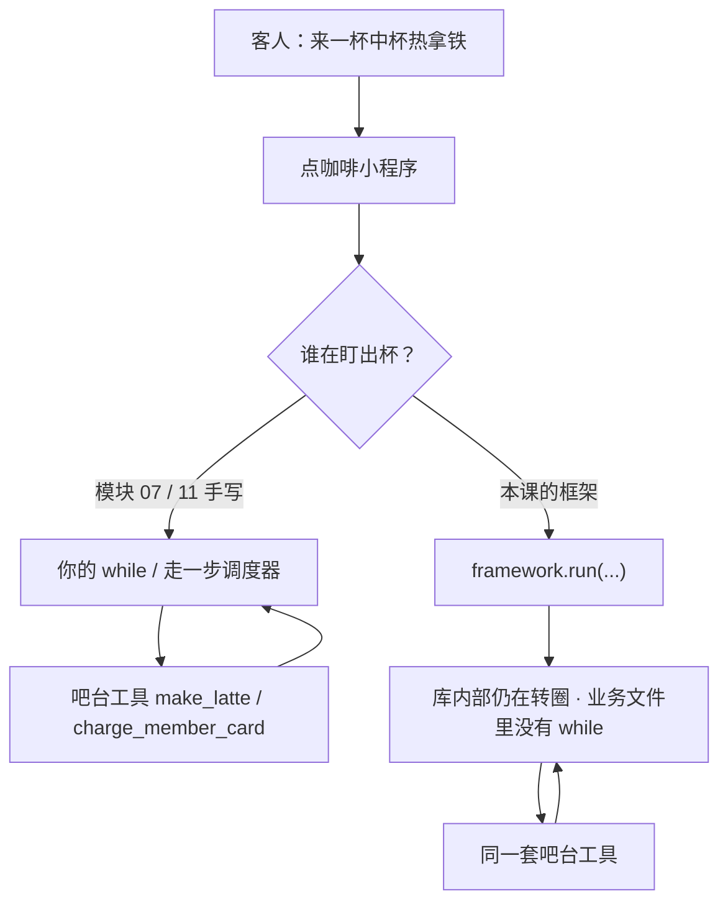

# **框架解决什么**：对照自己手写的 Loop / State，看它省了什么、藏了什么

> 对应模块：[模块 13 · Agent Framework ⭐⭐⭐⭐](./README.md) · 小节进度第 1 条
> 这一小节由 Coach 按 2026-09-19 本对话 `coach start` 详解首次写入。贯穿场景按学习者要求与模块 11（咖啡店状态机 / 会员卡检查点）和模块 12（点咖啡小程序 / 吧台 `make_latte`）对齐为**点咖啡小程序 / 吧台**，不用待办、查物流、值班台退款当主例子。学习者只减不加。进度表仍 ⬜，在进度表打钩只走 `coach complete`。State Graph、Agents as Tools / Handoff、Dify 是进度表第 2、3、4 条，本文件只点到「框架以后还会多出这些面」，不把后面小节当新课写完。

- **来源**：本对话 `coach start` 详解（对照模块 07 手写循环、模块 11 手写状态机与检查点、模块 02 流式、模块 05 工具协议；未打开外部框架文档页）+ 本对话要求把例子改成点咖啡
- **状态**：已沉淀
- **Demo**：可运行 · 已写出 `apps/13-Agent-Framework/01-框架解决什么-step-1/`（端口 `50139`；见 [## Demo 子节进度](#demo-子节进度)）

> 各节写什么、达标要求：见仓库根 [AGENTS.md §7.2](../../../AGENTS.md#72-写入小节文档--小节进度对齐)。

## 是什么

**Agent 框架（Agent Framework）** 是一层别人写好的库：把你已经手写过的「问模型 → 调工具 → 把结果塞回消息 → 再问模型」、以及「走一步、写检查点、给人点头」这些样板，收成更短的 API。你改写的是**声明**（吧台有哪些工具、有哪些站点、停在什么条件），框架去**跑**那一层循环和调度。

三个词必须拆开。进度表标题写「省了 / 藏了」，验收写「省了 / 多了」——三个都要能讲：

| 词 | 人话（点咖啡） | 判错会怎样 |
| -- | -- | -- |
| **省了** | 你不必再亲手写的那一段样板。店长不用自己盯每一锅，菜单还是你定 | 以为「用了框架 = 不会写 Agent」，其实出杯循环还在，只是不在你的仓库里 |
| **藏了** | 框架仍在做、但默认不出现在你的业务文件里。托管后厨有自己的「糊了再做一份」规矩，菜单上没写 | 出事时你不知道它在第几圈、有没有把失败出杯喂回模型、扣会员卡超时有没有再打一次 |
| **多了** | 框架带来的新概念、约定、升级成本和调试负担。换了托管公司，出餐编号规则全换 | 把「多出来的词」当成新原理；或者反过来，以为框架零成本 |

前端对照：这很像从「自己 `addEventListener` + `innerHTML`」换成 React。页面还是那个点咖啡小程序，协调更新的那一层换人了。React 省了你操作文档对象模型（DOM）的样板，藏了调和（Reconciliation），多了 Hooks、依赖数组这些约定。Agent 框架对循环做的是同一类事。

本课对照的「自己的代码」就是你已经写过的：

- 模块 07：`while` 里 Reason → Act → Observe；最大轮次、超时、用户取消、工具失败后继续
- 模块 11：节点 / 边 / 路由 / 调度器走一步；检查点写盘再恢复；必须人点头才能继续（咖啡店主图：点单 → 识别饮品 → 热饮 / 冰饮制作 → 出餐；扣会员卡是有副作用的站）

本模块后面会碰到的产品，先对上号、**本课不把后三小节讲完**：

| 产品 | 它主要替你扛哪一段（点咖啡） | 本课怎么用它 |
| -- | -- | -- |
| **Vercel AI SDK** | 小程序聊天边生成边显示（`useChat`）、服务端一次 `streamText` / `generateText` 里把「查菜单 → 做出品」的工具循环跑完 | 对照「模块 02 的 SSE + 模块 07 的 while」 |
| **LangGraph.js** | 把出杯工作流收成图，检查点、恢复、扣卡前暂停等人，都挂在图上 | 对照「模块 11 的调度器 + 检查点」。图怎么画，下一小节才展开 |
| **Mastra / OpenAI Agents SDK** | 另一套「声明 Agent + 吧台工具就跑」 | 模块验收里的体验档，本课只知道它们也是同一类东西 |
| **Dify 一类编排产品** | 可视化拖「点单 / 出品 / 出餐」节点，循环和状态几乎全藏进产品里 | 第 4 小节才体验，不当主线 |

```text
你（模块 07 / 11）已经写过的
  while / 走一步调度器 / 拼 tool_result / SSE 拆帧 / 检查点写盘 / 取消信号
        │
        ▼
框架把它收成更短的调用
  streamText({ tools, stopWhen })     ← 点咖啡小程序这一次对话
  graph.compile().invoke(state)      ← 同一张出杯图的一次运行
        │
        ▼
库内部仍然在转圈
  你的业务文件里往往看不见 while
  吧台的 make_latte 仍会被真正调用
```



学框架的目的是**加速交付**，不是重新学一遍「什么是 Agent」。路线里写得很清楚：第一遍完全手写，第二遍才用框架。原理在模块 07、11 已经写过了。

## 为什么（Agent 开发要懂）

点咖啡小程序已经能从零写出循环。接下来会面对三件真会发生的事：

1. **交付速度。** 聊天页要边生成边显示「正在做热拿铁」、工具状态要看得见、杀进程后会员卡不能重扣——这些样板你都写过。再开第十家联营店时，团队会问：为什么不复用一轮经过考验的出杯运行时。框架就是把「第十家」从几周压到几天。
2. **出事时你还能不能讲清数据怎么走。** 框架把 `while` 收进 `node_modules` 之后，日志里可能只剩「调用了 `streamText`」。若你讲不清库里仍在转圈，就无法回答：它停在第几圈、`make_latte` 失败有没有喂回模型、客人点取消有没有打断下一轮调用。模块 07 你专门写过轨迹；框架若默认不把轨迹交出来，你等于把值班能力交出去了。
3. **选型要能答辩。** 模块验收问「这个项目为什么选这个框架」。答不上来的两种失败一样糟：一种是「别人都用所以用」；一种是「我会手写所以拒绝所有框架」，把本该加速的出杯系统又写成一份私有运行时。

判错的具体后果（都发生在同一家店）：

- 以为框架「没有循环」→ 账单照烧，只是烧在你看不见的 `maxSteps` 默认值上：客人说「先看今日菜单再做拿铁」，默认只跑一步，菜单看了、咖啡没做，你还以为 Agent 在跑。
- 以为框架「自动安全」→ `charge_member_card` 被库默默重试，客人账上少两次（模块 11 检查点那一课的同一类事故）。
- 以为多出来的图、Provider、Reducer 是新原理 → 把下一小节的词提前当黑盒背，手写版的出杯循环反而忘了。

## 核心对象

### ① 手写循环（Agent Loop）

就是模块 07 那份：你自己的 `while`，每一圈问模型，有工具就执行并把结果追加进 `messages`，没有工具就把助手正文当最终答案，再叠上停止条件。

**生活**：你是值班店长，反复「看单 → 叫吧台 → 看出杯没有 → 再决定下一步」，直到可以出餐或客人取消。  
**前端**：不是一次 `onClick` 里 `await fetch` 结束，而是 saga / 轮询协调器。  
**数据怎么走**：客人「来一杯中杯热拿铁」→ 第 1 圈读 `cafe://today-menu` 确认有拿铁 → 第 2 圈 `make_latte` → 第 3 圈出正文「中杯热拿铁好了，大约 3 分钟」→ 停。这些圈数、轨迹、取消信号，都在你的文件里。

### ② 手写状态与调度（State / Scheduler / Checkpoint）

就是模块 11 那份：全图一份状态，节点只返回改动过的字段，调度器「跑节点 → 合并 → 问路由 → 对边表验一次 → 写下当前节点」；走完一步把快照写成可以离开进程的数据。

**生活**：吧台只有一份出杯单（病历夹同一类东西），点单、热饮机、出餐都写回这一份；交接班时单子还在，不是人口述。  
**前端**：Redux 一份 store，reducer 只返回补丁，dispatcher 合并。  
**数据怎么走**：扣会员卡成功 → 写检查点 → 进程被杀 → 起来后从「扣卡之后」继续做热拿铁，并且扣卡工具必须幂等，避免再扣一次。

### ③ 框架（Framework）

别人把 ① 和 ② 的**运行时**做成库。你提供工具定义、提示词、可选的图或停止条件；库去调模型、拼协议字段、推流、在崩溃后读检查点。

**生活**：你不再自己当店长盯每一锅，而是请了一家「后厨托管公司」。菜单还是你定，火候和出餐顺序按他们的操作手册。  
**前端**：React、TanStack Query、Next.js 这一类——页面还是你的点咖啡小程序，调度不在你手里。  
**数据怎么走**：你的路由校验入参后调用 `framework.run(...)`，返回值是流或最终状态；圈数发生在库内部。`make_latte` 仍是你注册的函数，谁在反复调用它变了。

### ④ 「省了」

样板从你的仓库消失，改成一行配置或一个 Hook。省掉的是**字数和重复实现**，不是那件物理事实。出杯循环仍在发生。

**生活**：以前每天手写三份交接表，现在系统自动生成；交接这件事还在发生。  
**前端**：`useQuery` 省了你写 loading / error / 缓存，请求仍会发出去。

### ⑤ 「藏了」

物理事实还在发生，但默认不出现在你的 `lib/flow/` 里。你要看见它，得去框架的文档、回调、日志或源码。

**生活**：托管后厨有自己的「咖啡机超时就再做一份」规矩，菜单上没写。  
**前端**：React 严格模式下开发环境会把效果跑两遍——你没写第二次，它藏在运行时里。

### ⑥ 「多了」

为了换那一层运行时，你要接受新词汇、新文件布局、版本契约，以及「框架不支持的做法你得绕」。

**生活**：托管公司要求用他们的出餐编号，换公司编号全废。  
**前端**：上了 Next.js 就多了路由约定、缓存约定、服务端组件约定。

## 变体：框架到底解决哪一类问题

核心概念不是「框架」这一个词，而是它替你扛的**几类样板**，以及它收走控制权之后的**几类代价**。下面每种各有点咖啡例子。漏一种，关上文件后就列不齐「省了 / 多了」。

### 变体 A · 循环样板被省掉

手写：`while` + 解析 `tool_calls` + 执行 + 把 `tool_result` 追加进 `messages` + 判断停止。  
框架：`streamText({ tools, stopWhen: stepCountIs(5) })` 或 `agent.generate({ maxTurns: 8 })` 一类调用。循环还在，文件里看不见。

**例子 1 · 同一句「来一杯中杯热拿铁」**  
手写版你能在轨迹里数出两圈：先读今日菜单，再 `make_latte`。框架版小程序上往往只看到「正在调用工具」和最终「拿铁好了」——圈是库转的。

**数据怎么走（框架路径）**：路由把客人口述交给框架 → 库内部第 1 次调模型 → 模型要读菜单 → 库执行你注册的函数 → 库把结果写成协议要求的角色（role）再调模型 → 模型要 `make_latte` → 库再执行 → 模型出正文 → 流回小程序。你的代码没有 `while`。

### 变体 B · 流式接到前端被省掉

手写：模块 02 你拆过 `text/event-stream` 帧，自己拼 chunk，自己维护消息数组。  
框架：Vercel AI SDK 的 `useChat`（对话列表 Hook）接一个约定好的接口，`messages` 自己涨。

**例子 2 · 小程序聊天里「正在做热拿铁…」一个字一个字出来**  
以前你要处理半句「正在做」先到、标题闪一下；框架把「消息数组 + 流式增量」收成 Hook。闪的问题还在（那是模块 22 的渲染问题），但拆帧、把「调用了 `make_latte`」插进列表这些样板少了。

**数据怎么走**：浏览器 `useChat` → 请求打到你的 `/api/chat` → 服务端 `streamText` 按 SDK 的协议往回写 → Hook 把增量合并进 `messages`。你看不见自己写的 `EventSource` 解析器。

### 变体 C · 工具协议编排被省掉

手写：模块 05 的字段你闭着眼都能画：模型 → `tool_call` → 执行 → `tool_result` → 模型。并行还是串行、失败是抛异常还是塞回消息，都是你的 if。  
框架：你用它的 `tool({ parameters, execute })` 注册；并行、重试、把结果喂回模型，走它的默认策略。

**例子 3 · 「热美式和冰拿铁各一杯」**  
两杯能否同一圈并行去做，模块 07 你对照过 `Promise.all` 的 max vs sum。框架若默认并行，你没写 `Promise.all` 也会两台咖啡机一起响；若默认串行，你以为「省了」其实客人多等一轮。

**数据怎么走**：模型一次返回两个 `tool_calls`（`make_latte` 热美式、`make_latte` 冰拿铁）→ 库按默认策略执行 → 两次 `tool_result` 塞回 → 再问模型要不要出餐文案。你的业务文件里可能没有 `Promise.all`。

### 变体 D · 状态调度和检查点被省掉

手写：模块 11 的四样合一（节点表、路由表、边表、走一步）+ 写盘 + 按运行编号恢复 + 副作用工具幂等。  
框架：LangGraph 一类用「编译好的图 + 检查点存储器（Checkpointer）」代替你的调度器和写盘函数。

**例子 4 · 会员卡已扣、热饮机做到一半杀进程**  
手写版你知道快照写在哪、读回来从「扣卡之后」继续做拿铁。框架版 `MemorySaver` / 数据库检查点替你写，恢复 API 是 `invoke` 带同一个出餐编号（线程编号）。你省了序列化样板；你也藏掉了「写盘发生在走一步的哪一个瞬间」——而那正是会不会重复扣款的关键。

本变体只讲到「调度和快照被收走」。**图上有哪些节点、边怎么画**，下一小节 State Graph 再对照手写 if/else。出杯主图仍是模块 11 那张：点单 → 识别饮品 → 热饮 / 冰饮 → 出餐。

### 变体 E · 藏起来的默认策略

框架几乎总会带一套你没写在业务里的默认：最大步数、工具失败是否重试、是否截断历史、是否在开发模式把同一段跑两遍。

**例子 5 · 扣会员卡超时，框架默默再打一次**  
支付接口超时，框架按自己的重试次数再打一次。手写版模块 05 / 11 你要求幂等键；框架若重试但不把幂等键传下去，就会双扣。  
**例子 5b · 默认最大步数是 1**  
文档写了 `maxSteps` 默认 1，你以为在跑「看菜单再出杯」的 Agent，实际是「带工具的一次问答」——只读了 `cafe://today-menu` 就停，拿铁没做。模块 07 验收明确反对过这种假循环。

**数据怎么走**：客人点「用会员卡买热拿铁」→ 框架内部 `attempt=2` → 你的 `charge_member_card` 又执行了一次 → 账上两行扣款。小程序只显示「成功」。

### 变体 F · 多出来的概念和约定

为了换运行时，你要学一套框架词：图、节点、边、状态 Reducer、Provider、`maxSteps` / `stopWhen`、线程编号。这些**不是新的 Agent 原理**，是这套库的接口形状。

**例子 6 · 新店员接手点咖啡小程序**  
仓库里没有 `loop.ts`，只有 `agent.ts` 和 `graph.ts`。不会框架词的人，无法从文件名找回「想 → 做 → 看」，也指不出「正在做拿铁」发生在库的第几圈。  
**前端对照**：Redux Toolkit 多了 `createSlice`，原理仍是「一份 state + 纯函数更新」。

### 变体 G · 锁定与升级

框架的 API 一年可以破一次。你的业务绑在 `useChat` 的消息形状、或 LangGraph 的状态注解上，升级就是改全仓库。

**例子 7 · 大版本把「多步出杯」参数名改掉**  
SDK 把「多步工具循环」的参数从 `maxSteps` 改成 `stopWhen`，文档旧示例全失效。线上默认变回只跑一步：客人说「先看菜单再做拿铁」，又变成只看菜单。  
**生活**：托管后厨换了出餐系统，你的取餐号全部作废。

### 变体 H · 抽象不合适，框架变成负担

框架假设了一种控制流。你的任务若更简单或更怪，抽象会挡路。

**例子 8 · 「店在哪 / 几点关门」不该上出杯图**  
FAQ 一问一答、不调 `make_latte`。硬套一张点单 → 出品 → 出餐的图，等于用 Redux 管一个开关。  
**例子 8b · 框架挡你改循环**  
你要「咖啡机失败后不要喂回模型，直接告诉客人改排队或换美式」——手写是 `break`；框架若强制 `tool_result` 必须回模型，你得关掉它的循环、自己写回模块 07 那套。这就是验收说的「至少踩过一次框架的坑，并能说清抽象在什么场景下不合适」。

### 变体 I · 框架解决不了的

过敏改推、角色能调哪些工具、这一单该不该退款——框架不会替你做产品判断。模块 05 的工具网关、模块 12 的技能（先读 `cafe://allergy-info` 再决定做不做拿铁）、模块 11 的人点头，都还在你这边。

**例子 9 · 模型要调 `refund_order` 或给牛奶过敏的客人 `make_latte`**  
框架很高兴地编排调用。该不该退、以谁的身份退、过敏能不能出奶咖，仍是网关、技能和人点头的事。模块 11 的 Human-in-the-loop 没因为换库而消失，只是暂停点改由框架提供一个「中断（interrupt）」API。

**数据怎么走**：模型返回 `make_latte({ drink: "latte" })` → 网关看到会话里写了牛奶过敏 → 拒绝执行 → 拒绝原因回到小程序。框架循环可以已经开始，真正出杯仍可以被拦住。

## 易混点

1. **省了 ≠ 没发生**  
   差：样板从你的文件消失，出杯循环仍在库里转。  
   判错：认为「用了 `useChat` 就不是 Agent」，或认为「没有 `while` 就不会烧 Token、不会再调 `make_latte`」。

2. **藏了 ≠ 安全了**  
   差：看不见重试、截断、并行，不表示这些被关掉了。  
   判错：`charge_member_card`、发取餐短信被默默重试，模块 11 的幂等课等于白学。

3. **多了 ≠ 新原理**  
   差：图、Hook、Provider 是接口；Reason / Act / Observe 和状态转移才是原理。  
   判错：把下一小节的 State Graph 当成「和手写循环完全不同的另一种智能」。

4. **框架 ≠ 手写的替代原理课**  
   差：路线 2.6.2 说的「框架驱动学习」：会五个框架、不会写 Agent。  
   判错：跳过 07 / 11 直接抄模板；库一换人就不会做出杯循环。

5. **Vercel AI SDK ≠ LangGraph**  
   差：前者偏「把点咖啡对话和工具循环接到 React」；后者偏「把有状态出杯工作流收成图 + 检查点」。都可以跑 Agent，主战场不同。  
   判错：用 LangGraph 只为了做聊天输入框，或用 `useChat` 去扛「扣卡后杀进程再恢复」。

6. **框架的一个 Agent ≠ 模块 14 的多 Agent**  
   差：一个框架对象内部仍是一条出杯循环；把另一个 Agent 当工具、或把控制权交出去，是后面两小节的事。  
   判错：本课就开始讲交接（Handoff）。这里只需要知道：框架以后会多出这类 API，本课验收不要求实现。

7. **`maxSteps` / 最大轮次默认值 ≠ 你在模块 07 设过的停止条件**  
   差：你手写时最大轮次是一等公民；框架默认可能是 1，也可能是很大。  
   判错：上线后要么假循环（只读菜单、不做拿铁），要么账单失控。

8. **检查点存储器 ≠ 模块 10 的长期记忆**  
   差：检查点是「这一杯做到哪」；长期记忆是「这位客人牛奶过敏，跨会话还该不该记得」。框架两者都可能提供，名字还经常都叫 memory。  
   判错：把过敏偏好写进检查点当长期记忆，或指望检查点在新会话里当客人档案用。

9. **可视化编排产品 ≠ 本课的代码框架**  
   差：Dify 一类把循环和状态藏进界面；本课的 SDK 仍是代码。第 4 小节再体验。  
   判错：以为拖完「点单 / 出品」节点就理解了调度器。

10. **省了循环样板 ≠ 省了模块 12 的技能 / MCP**  
    差：框架编排「何时调 `make_latte`」；过敏店规仍是技能，吧台连接仍是 MCP。  
    判错：上了框架就拆掉 `cafe://allergy-info`，模型又给过敏客人做奶咖。

11. **SDK 拼接规则：OpenAI 拼 `/chat/completions`，Anthropic 拼 `/messages`（不带 `/v1`）**  
    差：OpenAI SDK 在 doGenerate 里拼 `${baseURL}/chat/completions`；Anthropic SDK 的 `AnthropicMessagesLanguageModel.buildRequestUrl` fallback 是 `${baseURL}/messages`（**不带 /v1**，因为 SDK 默认 baseURL `https://api.anthropic.com/v1` 已带 /v1）。  
    判错：以为 SDK 会自动拼 `/v1/messages`，把 .env 的 `https://api.minimaxi.com/anthropic`（不带 /v1）直接喂给 `createAnthropic`，最终路径拼成 `/anthropic/messages`，网关 404。

12. **.env baseURL 形态差异：OpenAI 已带 /v1，Anthropic 是兼容层前缀不带 /v1**  
    差：OpenAI 协议下 .env 配 `https://api.minimaxi.com/v1`、`dashscope.aliyuncs.com/compatible-mode/v1` 等都**已带 /v1**（模仿 OpenAI 官方 `https://api.openai.com/v1` 的约定俗成）。Anthropic 协议下 .env 配 `https://api.minimaxi.com/anthropic` 是「Anthropic 兼容层前缀」，**不带 /v1**——`/v1` 必须由代码手动补。  
    判错：在 .env 里给 Anthropic 也加上 /v1，或者在代码里给 OpenAI 也补 /v1——破坏 .env 字段契约 / 让 SDK 拼出 `/v1/chat/completions/v1/...` 这种错位路径。

## 例子

每个核心对象、每个变体都用同一家点咖啡小程序演一遍。需求清单见下一节。

### 例子总表 · 省了 / 藏了 / 多了（对着你自己的代码）

验收最低标准是 **省了 3 条、多了 3 条**。藏了的单独一列，避免和「省了」混成一句。

**省了（你不必再抄一份）：**

1. **循环骨架** — 模块 07 的 `while` + 解析工具调用 + 把结果塞回 `messages`。框架一次 `streamText` / `graph.invoke` 就转圈；客人那句「来一杯中杯热拿铁」仍会真正打到 `make_latte`。
2. **流式接到 React** — 模块 02 的 SSE 拆帧、自己维护消息数组。`useChat` 一类 Hook 把「列表 + 增量 + 正在做拿铁」收走。
3. **走一步调度器 + 检查点写盘** — 模块 11 四样合一和序列化快照。LangGraph 的编译图 + 检查点存储器替代这份样板；扣卡后杀进程仍要能恢复。
4. （常一起被省）轨迹收集、取消信号接到模型调用、两杯并行的 `Promise.all` 样板——框架有自己的实现。

**藏了（仍在发生，业务文件默认看不见）：**

1. **真正的圈数和停止原因** — 你手写时 `stoppedReason` 是枚举；框架可能只给你「拿铁好了」四个字。
2. **工具失败后走哪条路** — `make_latte` 失败是塞回模型改推美式，还是抛错中断，还是内部重试。默认值在文档里，不在你的 `if`。
3. **写检查点的瞬间** — 发生在 `charge_member_card` 执行前还是后，决定会不会重复扣款。手写版你把顺序写在调度器里；框架顺序要对照它的生命周期，而不是猜。

**多了（换运行时的账单）：**

1. **新接口词汇和文件约定** — 图、Reducer、Provider、`stopWhen`、出餐编号。原理没变，阅读成本变了。
2. **调试进入 `node_modules`** — 出错栈不再停在你的 `loop.ts`。没有回调 / 轨迹时，你只能猜拿铁做到第几圈。
3. **版本锁定** — 大版本改默认步数或消息形状，行为变了但业务代码没改：菜单看了、咖啡没做。
4. （常一起多出来）选型答辩义务：为什么选这个而不是继续手写、而不是另一个 SDK；以及「FAQ 不该上出杯图时要把控制权拿回来」。

关上文件后用自己的话过一遍，至少能这样说：

> 省了循环样板、流式 UI 样板、检查点样板。  
> 多了框架词、更难的调试、升级绑定。  
> 另外要记得：省掉的那些，库里还在做，这叫藏了。同一家点咖啡小程序，吧台工具没换。

## 需求清单

每条对应一个变体。验收准绳，不是一次搭完整应用的施工单。写出演示时按知识动态推进。

**需求 1 · 同一句出杯：手写循环 vs 框架循环**  
- 业务场景：客人：「来一杯中杯热拿铁。」  
- 目标：页面上能指出「手写版轨迹有第几圈；框架版业务代码里没有 `while`」。  
- 涉及：变体 A。  
- 验收：两侧都能出到同一杯（或固定剧本写明的 `make_latte` 返回值）；框架侧代码搜不到你自己写的 `while`，但日志或回调能证明库内部调了工具。

**需求 2 · 小程序边生成边出现「正在做热拿铁」**  
- 业务场景：同一句客人输入，聊天列表要流式更新。  
- 目标：框架侧用对话 Hook 更新列表，不再手写拆帧。  
- 涉及：变体 B。  
- 验收：页面能看到流式增量；请求参数 / 调用流程 / 响应结果三块都在。

**需求 3 · 热美式和冰拿铁各一杯，同一圈能否并行**  
- 业务场景：客人：「热美式和冰拿铁各来一杯。」  
- 目标：对照框架默认是并行还是串行。  
- 涉及：变体 C。  
- 验收：能说出耗时口径（并行近似 max、串行近似 sum），且不是一个接口打包跑两条轨迹。

**需求 4 · 会员卡已扣、热饮做到一半杀进程**  
- 业务场景：`charge_member_card` 成功，`brewHot` 未完，进程被杀。  
- 目标：说明框架检查点替你省了写盘样板，以及你必须仍能指出「从哪一站恢复、会不会再扣」。  
- 涉及：变体 D。  
- 验收：能对照模块 11 的三件保证（找得到出餐编号、读到写完整的快照、副作用不因重进节点再做一次）。

**需求 5 · 扣卡超时后有没有被默默重试**  
- 业务场景：`charge_member_card` 超时。  
- 目标：把框架默认重试变成可观察。  
- 涉及：变体 E。  
- 验收：页面或日志能看到尝试次数；若大于 1，必须同时看到幂等键或明确的「会双扣」警告。

**需求 6 · 新店员能根据文件名找回出杯循环**  
- 业务场景：仓库只有框架入口。  
- 目标：文档或页面用白话标出「库内部仍是想 → 做 → 看」。  
- 涉及：变体 F。  
- 验收：关上文件只看页面，能讲清框架词对应你手写的哪一段（循环 / 流式 / 检查点）。

**需求 7 · 把默认最大步数改错之后行为可见**  
- 业务场景：客人要「先看今日菜单再做拿铁」。默认只跑一步 vs 允许多圈。  
- 目标：假循环和真循环并排可观察。  
- 涉及：变体 G。  
- 验收：同问句、两种步数设置、两个独立请求；步数为 1 时只读了菜单、`make_latte` 没发生。

**需求 8 · 「店在哪」不该上出杯图**  
- 业务场景：客人不点单，只问营业时间。  
- 目标：演示「用框架 Agent 跑这件事」比直接一次模型调用更重，并写清不合适的理由。  
- 涉及：变体 H。  
- 验收：能列出至少 1 个「抽象成为负担」的可观察点（多余的工具轮、更长的轨迹、更难的调试）；不应出现 `make_latte`。

**需求 9 · 过敏出杯 / 退款必须过网关，框架不能直接执行**  
- 业务场景：客人「我牛奶过敏，来一杯拿铁」，或模型要调 `refund_order`。  
- 目标：框架会编排调用，真正执行仍走你的鉴权 / 技能 / 人点头。  
- 涉及：变体 I。  
- 验收：未授权或过敏拦截时，框架循环可以开始，工具执行被拒绝，拒绝原因回到页面，而不是库内部吞掉。

## 变体对照（讲完前自查）

| # | 变体 | 点咖啡例子 | 需求 | 可观察？ |
| -- | ---- | ---------- | ---- | -------- |
| A | 循环样板 | 同一句热拿铁，手写数圈 vs 框架看不见 `while` | 需求 1 | 是 |
| B | 流式前端 | 小程序边生成边出现「正在做热拿铁」 | 需求 2 | 是 |
| C | 工具编排 / 并行 | 热美式 + 冰拿铁同一圈 | 需求 3 | 是 |
| D | 调度 + 检查点 | 扣卡后杀进程 | 需求 4 | 是；图的画法留给下一小节 |
| E | 默认策略 | 扣卡超时默默重试；`maxSteps=1` 只看菜单 | 需求 5、需求 7 各看一角 | 是 |
| F | 多出来的约定 | 新店员找不到 `loop.ts` | 需求 6 | 是（页面教学文案） |
| G | 锁定 / 默认步数 | 大版本改步数；假循环 | 需求 7 | 是 |
| H | 抽象不合适 | 「店在哪」硬套出杯图 | 需求 8 | 是 |
| I | 框架解决不了 | 过敏仍拦 `make_latte`；退款要网关 | 需求 9 | 是 |

没有把 State Graph 的节点 / 边 API、Agents as Tools / Handoff、Dify 当成本课变体展开——那些是进度表第 2、3、4 条。

## 同一 streamText 出口下两协议差异（step-2 揭示）

step-2 在同一份 `streamText` 出口下，把 OpenAI 协议和 Anthropic 协议两条路完整走通。**浏览器侧 0 差异**，**后端差异 ≈ 6 行 model.ts + 1 段 reasoning.ts 入参**——剩下的差异全部由 AI SDK 翻译层扛走。

### 协议层差异

| 维度 | OpenAI 协议 | Anthropic 协议 |
|---|---|---|
| 路径后缀 | `/chat/completions` | `/v1/messages` |
| Headers | `Authorization: Bearer <KEY>` | `x-api-key: <KEY>` + `anthropic-version: 2023-06-01` |
| 文本字段位置 | `choices[0].message.content` | `content[type=text]` |
| 思考字段位置 | **各网关不统一**（minimax 用 `<think>…</think>` 文本；zhipu / qwen / deepseek 用 `reasoning_content` 字段） | **各网关统一**（`content[type=thinking]`） |
| `max_tokens` 必填 | 不强制 | **强制必填**，且必须 > budgetTokens |
| 原生 thinking 触发 | 模型默认发（如果发的话） | **必须显式**给 `providerOptions.anthropic.thinking = { type:"enabled", budgetTokens }` |

### 两协议拼装对照（学习者直接背）

| 协议 | SDK 拼 | 喂 SDK 之前 baseURL 要有什么 |
|---|---|---|
| OpenAI | `${baseURL}/chat/completions` | 已带 /v1（.env 写 `.../v1`） |
| **Anthropic** | **`${baseURL}/messages`（不带 /v1）** | **必须**手动补 /v1，SDK 不自己加 |

**口语版**：
- OpenAI：`.env` 给 `.../v1`，SDK 拼 `/chat/completions` → `/v1/chat/completions`
- Anthropic：`.env` 给 `.../anthropic`（代码手动补 /v1），SDK 拼 `/messages` → `/anthropic/v1/messages`

「`/v1`」这段**不能**指望 SDK 自动加——OpenAI 那边靠 `.env` 自带，本文件给 Anthropic 这边手动补。

### 后端代码三处差异

集中在 `lib/cafe/model.ts` 和 `lib/flow/reasoning.ts` 两个文件：

**`lib/cafe/model.ts`（provider 装配）**

| 行 | OpenAI | Anthropic |
|---|---|---|
| 包 | `@ai-sdk/openai` | `@ai-sdk/anthropic` |
| provider 构造 | `createOpenAI({ apiKey, baseURL: baseUrlA, name })` | `createAnthropic({ apiKey, baseURL: baseUrlB + "/v1" })` |
| baseURL 来源 | `.env` 给的（已带 /v1） | `.env` 给的兼容层前缀（不带 /v1） + 代码一行无条件补 |
| 中间件 | `wrapLanguageModel(model, middleware: extractReasoningMiddleware({ tagName: "think" }))` | 无中间件（SDK 内部把 `content[type=thinking]` 翻成 reasoning 段） |
| 模型 id | `modelA` | `modelB` |

**`lib/flow/reasoning.ts`（streamText 入参）**

| 入参 | OpenAI | Anthropic |
|---|---|---|
| `providerOptions.anthropic.thinking` | 不传 | **必须传** `{ type: "enabled", budgetTokens: llm.maxTokensB }` |
| `maxTokens` | 不传 | **必须传** `llm.maxTokensB + 1024`（> budgetTokens） |
| 其余（model / prompt / abortSignal / onFinish / onError） | 完全一样 | 完全一样 |

### 浏览器侧 0 差异

两条协议**完全共用**同一份前端代码：

- 同一个 SSE 拆帧函数 `consumeUIMessageStream`
- 同一个事件处理：只挑 `reasoning-delta` / `text-delta` 累加
- 同一个 UI 组件（reasoning 段 / text 段两个 `<details>` 卡片）

唯一跟协议相关的代码就是顶部那个 `protocol-select` 下拉框切换 `apiUrl`——其他全是协议无关。

这是 AI SDK 的 `pipeUIMessageStreamToResponse` 抽象价值：把不同 provider 的流都翻译成同一份 SSE 格式（`reasoning-delta` / `text-delta` / `finish-step` 等），浏览器只看这一份。

### 整个流程图

```
浏览器（同一份代码）
  ↓ POST /api/reasoning-openai  或  POST /api/reasoning-anthropic
route 文件（两个独立 route，但内容几乎一样）
  ↓ pipeReasoning(query, provider, protocol, ctx.res, abortSignal)
lib/flow/reasoning.ts
  ├─ OpenAI：streamText(model, prompt, abortSignal, onFinish, onError)
  └─ Anthropic：streamText(model, prompt, abortSignal, providerOptions.anthropic.thinking, maxTokens, onFinish, onError)
  ↓ streamText → toUIMessageStream
lib/cafe/model.ts（createModel）
  ├─ OpenAI：createOpenAI(baseUrlA) → wrapLanguageModel + extractReasoningMiddleware
  └─ Anthropic：createAnthropic(baseUrlB + "/v1") → 原生 SDK（自动拆 thinking blocks）
  ↓ 4 家网关 × 2 协议 = 8 个真实 API URL
```

### 对应到这一节的教学点

- **需求 1（上一节）· 同一句 query 手写 vs 框架**：手写能数圈，框架侧业务代码里没有你写的 while
- **需求 2（上一节）· 框架侧流式 UI**：上一节已讲
- **本节新揭示（step-2）**：**两协议在 framework 内走同一 streamText 出口**——「省了」不只是「不用写 while」，还包括「同一份 streamText 入口能跨协议复用」；「多了」不只是「多了框架词」，还包括「Anthropic 协议下必须显式给 thinking + maxTokens 这两个原本可以不管的参数」

### 8 个真实 API URL（实测 200）

`scripts/probe-all-providers.js` 验证：

```
OpenAI 协议
  https://api.minimaxi.com/v1/chat/completions
  https://open.bigmodel.cn/api/paas/v4/chat/completions
  https://api.deepseek.com/chat/completions
  https://dashscope.aliyuncs.com/compatible-mode/v1/chat/completions

Anthropic 协议
  https://api.minimaxi.com/anthropic/v1/messages
  https://open.bigmodel.cn/api/anthropic/v1/messages
  https://api.deepseek.com/anthropic/v1/messages
  https://dashscope.aliyuncs.com/apps/anthropic/v1/messages
```

## 我追问过的

| 问题 | 针对什么（认知上下文） | 回答 |
|------|----------|------|
| 学习者原话：「你为什么还要拼到 /v1 呀？不是说 SDK 后面它自动会拼 /v1/messages 那个的吗」 | SDK 拼装行为的误解：以为 SDK 会自动给 baseURL 补 /v1 | 答在本节「同一 streamText 出口下两协议差异」段下的「两协议拼装对照」表。**核心结论**：SDK 拼的是 `${baseURL}/messages`，**不带 /v1**；`/v1` 必须由 baseURL 提供。官方 Anthropic API 不需要这一步，因为 SDK 默认 baseURL `https://api.anthropic.com/v1` 已带 /v1。我们的 .env baseURL 是兼容层前缀不带 /v1，所以由代码手动补（`baseURLWithV1 = \`${llm.baseUrlB}/v1\``）。 |

> step-2 之外的本对话追问：操作类（修 bug / 改 if 判断 / 确认 .env 形态 / 等）不进本节，已挪到「踩坑」或「契约记录」。

## 取舍

- **贯穿场景用点咖啡小程序 / 吧台，不用待办、查物流、值班台。** 模块 11 已经是咖啡店主图（点单 / 热饮 / 冰饮 / 出餐 / 扣会员卡），模块 12 已经是 `make_latte`、`cafe://today-menu`、`cafe://allergy-info`。这一节继续用同一家店，关上文件后能和前面的工具名、检查点事故对上号。
- **本课讲运行时换人，不讲图画法、不讲多 Agent 交接、不讲可视化编排。** 那三块各有自己的进度表行。本课点到「框架会把调度收走 / 以后会多出交接 API / Dify 把循环藏进界面」即可。
- **对照 Vercel AI SDK 和 LangGraph 的分工，不要选边当唯一答案。** 点咖啡聊天页更自然对 `useChat`；扣卡后恢复更自然对图 + 检查点。选型答辩是「这个面选谁」，不是「全仓库只能有一个品牌」。
- **step-1 只演示「同一句出杯，手写 vs 框架」**，不要一次重写整个模块 07。流式 Hook、默认步数、检查点对照留给双方确认懂了再加。

## 踩坑

- 以为框架没有循环，所以不会烧 Token、不会重复调用 `make_latte`。
- 以为看不见重试就是没有重试，`charge_member_card` 被打两次。
- 把框架词（图、Provider、`stopWhen`）当成新原理，手写的 Reason → Act → Observe 反而忘了。
- 用 `useChat` 去扛审批扣款的杀进程恢复；用 LangGraph 只为了做一个输入框。
- 框架默认 `maxSteps=1`，客人要「先看菜单再出杯」，结果只看了菜单。
- 上了框架就拆掉模块 12 的过敏技能和网关，模型又给牛奶过敏的客人做拿铁。
- 把检查点当长期记忆：把「这位客人过敏」写进出餐快照，新会话找不回来，或反过来把一杯做到哪当成用户档案。
- FAQ「店在哪」硬套出杯图，轨迹里出现不该出现的 `make_latte`。
- 出错只看最终「拿铁好了」，没有圈数和停止原因，值班时讲不清卡在哪。
- `@ai-sdk/anthropic@2.0.102` 的 `createAnthropic` 不接 `options.buildRequestUrl`，运行时**静默忽略**——以为能用其实没用。代码看起来「拼 /v1 了」，实际 SDK 走 fallback `${baseURL}/messages` 直接拼没 /v1 的路径，调试时只看代码会漏掉。
- 把 .env 的 `XXX_ANTHROPIC_BASE_URL`（不带 /v1 的兼容层前缀）直接喂给 `createAnthropic`，SDK 默认拼 `${baseURL}/messages`，最终路径是 `/anthropic/messages`——**少 /v1 网关 404**。修法：给 baseURL 手动补 `/v1`（`baseURLWithV1 = \`${llm.baseUrlB}/v1\``）。

## 契约记录

- 贯穿例子必须用点咖啡（学习者 2026-09-19 明确要求，对齐模块 11 咖啡店主图 + 模块 12 点咖啡小程序 / 吧台），不要写回待办、查物流、值班台退款主线。
- Demo 结论：可运行。step-1 已写出：首页手写 while，子页 `/pages/framework.html` 走 Vercel AI SDK；端口 `50139`。尚未锁定。
- Demo 结论：可运行。step-2 已写出：子页 `/pages/reasoning-extract.html` 走「OpenAI 协议 vs Anthropic 协议」对照（provider × protocol 两个独立请求，4 家 × 2 协议 = 8 个真实 URL 实测 200）；端口 `50140`，yarn `app:13-01-framework-solves-what-step-2`。尚未锁定。
- 进度表第 2、3、4 条（State Graph、Agents as Tools vs Handoff、Dify）不在本文件讲完。

## Demo 判断

```text
Demo 判断
- 小节：框架解决什么：对照自己手写的 Loop / State，看它省了什么、藏了什么
- 结论：可运行
- Step 1 第一件事：同一句「来一杯中杯热拿铁。」首页走手写 while；子页走 Vercel AI SDK 的 generateText + make_latte。两个独立请求，不要一个接口打包跑两侧。
- 锁定时机：学习者主动决定
- 理由：关上文件后要能诚实列出「省了 / 多了」，必须看见一次对照：手写侧能数圈，框架侧业务代码里没有你写的 while，但吧台工具确实被调了。「藏了」单靠口述容易飘。场景与模块 11 / 12 同一家店。
- 代码写到：apps/13-Agent-Framework/01-框架解决什么-step-1/ · yarn app:13-01-framework-solves-what-step-1 · 端口 50139
- N 动态：step-1 是工作区；禁止预判后面还有几步。LangGraph 对照检查点更自然的位置是下一小节，若要在本课先看见「检查点被省掉」，再说。
- 与 start 预告：一致；仅把贯穿例子从待办 / 查单改成点咖啡
```

## Demo 子节进度

step-1 已建，尚未锁定。表行只写已建 step；禁止预判未来。

| 状态 | 子节 | 入口 | 端口 | 本子节教学点 |
|------|------|------|------|--------------|
| 🔄 | step-1 | `yarn app:13-01-framework-solves-what-step-1` | `50139` | 同一句「来一杯中杯热拿铁。」：首页手写 while 能数圈、能看见 make_latte；子页 `/pages/framework.html` 走 Vercel AI SDK 的 generateText（业务文件没有 while）。另有试验子页 `/pages/use-chat.html`：导入映射 + type=module 试用官方 useChat，走 `POST /api/framework-chat`。 |
| 🔄 | step-2 | `yarn app:13-01-framework-solves-what-step-2` | `50140` | 同一句 query 拆 reasoning 的两条路：子页 `/pages/reasoning-extract.html` 走协议下拉（provider × protocol 两个独立请求）。OpenAI 协议走 `@ai-sdk/openai` + `extractReasoningMiddleware({ tagName: "think" })`（拆 `<think>…</think>` 文本），Anthropic 协议走 `@ai-sdk/anthropic`（拆原生 thinking content blocks；需 `providerOptions.anthropic.thinking` + `maxTokens`）。浏览器侧两份代码完全一样。 |

## 过关自检

关上文件后还能讲出来（对应进度表「本条要能讲清」）：

1. 能用自己的话给同事讲：框架是运行时，不是新的 Agent 原理。同一家点咖啡小程序，换的是谁在盯出杯，不是吧台机子换了。
2. 能列出至少 3 条「省了」（循环样板、流式 UI、检查点 / 调度器）。
3. 能列出至少 3 条「多了」（框架词、调试进库、版本锁定）。
4. 能多讲一句「藏了」：圈数、扣卡重试、写盘瞬间仍在发生。
5. 能区分 Vercel AI SDK（对话 + 工具循环接到小程序）和 LangGraph（有状态出杯工作流 + 检查点）；不把第 2、3、4 小节提前讲完。
6. 能举一个「不该用框架 / 框架默认会害人」的场景（店在哪硬套图；扣卡被默默重试；`maxSteps=1` 只看菜单不做拿铁）。
7. 能说明上了框架之后，模块 12 的过敏技能和网关仍要拦 `make_latte`。

## 还没搞懂的

- LangGraph 里节点 / 边 / 条件路由怎么对照手写 if/else：下一小节 State Graph。
- 把另一个出杯 Agent 当工具，和把控制权交给另一位店长：进度表第 3 条；实现放到模块 14。
- Dify 一类产品替你藏了哪些循环 / 状态：第 4 小节体验。
- 各框架当前大版本的具体参数名（`maxSteps` / `stopWhen` 等）以写出演示时打开的官方文档为准；本课未打开外部文档页，不背某一天的默认数字。
